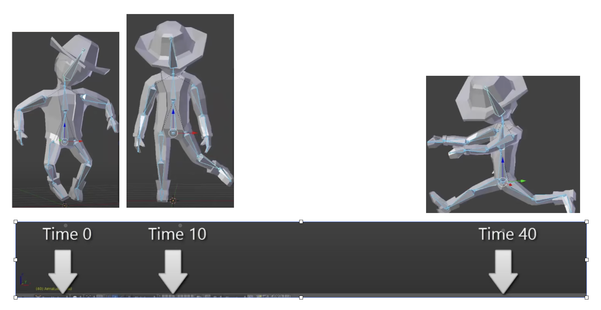

.. _3d-model:

3D Modeling
===========

.. contents::
   :local:
   :depth: 4

.. _three-d-model:

By creating 3D models with triangles or quads on a surface, the model is formed
using a polygon mesh [#polygon]_. This mesh consists of all the vertices shown in
the first image as :numref:`modeling1`.

.. _modeling1: 
.. figure:: ../Fig/3d-model/modeling1.png
  :align: center
  :scale: 80 %

  Creating 3D model and texturing

After applying smooth shading [#polygon]_, the vertices and edge lines are
covered with color (or the edges are visually removed — **edges never actually 
have black outlines**). As a result, the model appears much smoother 
[#shading]_.

Furthermore, after texturing (texture mapping), the model looks even more
realistic [#texturemapping]_.

.. _animation:

Animation
---------

★ Animation Layers: High → Low

This breakdown organizes animation systems from the **highest gameplay
logic** down to the **lowest GPU skinning**, and clearly marks which
parts are controlled by the **user** and which parts are handled by the
**3D engine**.

1. Gameplay Animation Logic (High Level): set by user (game developer)

See video here [#animation-state-video]_.

**Examples**

- Play "walk" when speed > 0.1
- Trigger "jump" on button press
- Switch to "attack" when enemy detected
- Blend run when velocity increases

**Where it lives**

Live in **gameplay scripts** (C#, Blueprints, GDScript, Python)

- Unity: C# scripts
- Unreal: Blueprints or C++
- Godot: GDScript
- ThinMatrix: Java (no scripting layer)

This layer decides *when* animations should play.

2. Animation State Machine / Animation Graph: set by user (game developer)

**Examples**

- Idle → Walk → Run transitions
- Blend trees
- Animation layers (upper body, lower body)
- Animation parameters (speed, grounded, direction)

**Where it lives**

- Unity: Animator Controller
- Unreal: Animation Blueprint
- Godot: AnimationTree
- ThinMatrix: *Does not have this layer*

This layer controls *which* animation clip is active and how transitions
occur.

3. Animation Clip Playback Layer: user chooses

An **animation clip** is **a sequence of keyframes** over a period of time that 
represents a **motion or action**.

**Examples**

- Play animation clip
- Loop animation
- Set animation speed
- Crossfade between clips
- Blend two clips together

**Who sets it?**  
User chooses which clip to play.

**Who implements it?**  
Engine handles blending, timing, and playback.

**Where it lives**

- Unity: Mecanim runtime
- Unreal: AnimInstance
- Godot: AnimationPlayer
- ThinMatrix: Java engine code (Animator.java)

This layer executes the user’s choices.

4. Skeleton Animation System (Low Level): 3D engine implements it

**Examples**

- Bone hierarchy
- Keyframe interpolation
- Joint transforms
- Matrix palette generation
- Pose calculation

**Who sets it?**  
Engine

**Who uses it?**  
User indirectly, by playing animations.

**Where it lives**

- Unity: C++ engine core
- Unreal: C++ engine core
- Godot: C++ engine core
- ThinMatrix: Java engine code (he writes this manually)

This layer performs the mathematical work of animation.

5. GPU Skinning (Lowest Level): 3D engine implements it

**Examples**

- Vertex shader skinning
- Applying bone matrices
- Weighted vertex deformation
- Sending matrices to GPU

**Who sets it?**  
Engine

**Who uses it?**  
User never touches this layer directly (except in custom engines).

**Where it lives**

- Unity: C++ + HLSL
- Unreal: C++ + HLSL
- Godot: C++ + GLSL
- ThinMatrix: GLSL shader he writes manually

This is the final stage where the GPU deforms the mesh.

Full Hierarchy (Summary)

::

    HIGH LEVEL (User)
    ──────────────────────────────────────────────
    1. Gameplay Animation Logic
    2. Animation State Machine / Animation Graph
    3. Animation Clip Playback

    LOW LEVEL (Engine)
    ──────────────────────────────────────────────
    4. Skeleton Animation System
    5. GPU Skinning

Developers only write the highest‑level animation logic and designed 
transitions & blends as shown in :numref:`animation-levels`.
The engine automatically handles all lower‑level animation work.
Like the video [#animation-state-video]_, Jason’s tutorials operate only in 
Level 1 and Level 2:

✔ Level 1 — Scripts

He writes code like:

.. code-block:: c++

   animator.SetFloat("Speed", speed);

✔ Level 2 — State Machine

He configures transitions and parameters.

.. _animation-levels: 
.. graphviz:: ../Fig/3d-model/animation-levels.gv
  :caption: Animation levels

ThinMatrix’s engine collapses the top three layers into Java because it
has **no scripting layer** and **no animation graph**, so the user must
modify the engine code directly.

According to the video on ThinMatrix’s skeleton animation [#animation1]_, 
he is sampling the animation clip at different times.
The animation clip already contains: keyframes, bone transforms, timestamps, 
interpolation curves.
All of this comes from Blender’s exported .dae file.
Joints are positioned at different poses at specific times (keyframes), as 
illustrated in :numref:`animationfigure`.

.. _animationfigure: 

  Get time points at keyframes

Although most of 3D game engines are written C++, **ThinMatrix’s engine** is 
100% Java.
In this series of videos, you will see that he writes new Java engine modules, 
edits existing engine code, loads animation data from Blender, interpolates 
keyframes, updates bone matrices and sends them to the GPU.
Because ThinMatrix's engine is **tiny and educational** for engine programmer or
game developer, does not provide Scripting Layer (such as C#, Python, GDScript, 
Blueprints) most commercial 3D engines.
Instead, he modifies ThinMatrix’s Java engine directly, which differs from most
other 3D engines operate.

**Animation flow**

Every modern 3D animation tool comes with its own **built‑in render engine**, 
and often more than one. In 3D game design, **game engines (Unity, Unreal, 
Godot) use real‑time engines** for real-time animation.

**Pipeline: Blender → Engine → OpenGL**

.. code-block:: text

    +------------------+
    |     Blender      |
    |  (Modeling Tool) |
    +------------------+
              |
              |  Exports assets:
              |  - Meshes (.obj, .fbx, .gltf)
              |  - Armatures / bones
              |  - Animations (keyframes)
              |  - Textures (PNG, EXR, TGA)
              v
    +---------------------------+
    |       Game Engine         |
    | (Unity, Unreal, Godot,    |
    |  LWJGL, JOGL, Custom)     |
    +---------------------------+
              |
              |  Engine loads assets:
              |  - Parses mesh data
              |  - Loads skeletons
              |  - Loads animation curves
              |  - Loads materials/shaders
              |
              |  Engine code you write:
              |  - Java (JOGL/LWJGL)
              |  - C++ (custom engine)
              |  - C# (Unity)
              |  - GDScript/C++ (Godot)
              |
              |  Engine compiles shaders:
              |  - GLSL (OpenGL)
              |  - HLSL (DirectX)
              |  - SPIR-V (Vulkan)
              v
    +---------------------------+
    |         Renderer          |
    |    (OpenGL / Vulkan /     |
    |     DirectX / Metal)      |
    +---------------------------+
              |
              |  GPU receives:
              |  - Vertex buffers
              |  - Index buffers
              |  - Textures
              |  - Uniforms (matrices, bones)
              |  - Compiled shaders
              v
    +---------------------------+
    |            GPU            |
    | (Vertex Shader → Raster → |
    |  Fragment Shader → Frame) |
    +---------------------------+
              |
              v
    +---------------------------+
    |        Final Image        |
    |     (On your screen)      |
    +---------------------------+

.. note::

   3D modeling tools do store animation and movement data 
     — but they do NOT store any rendering or API‑specific code. 

   Game engines do store animation data
     — but programmers still write the logic that plays, blends, 
     and controls those animations.

.. _movement:

**Animation Data vs. Movement Speed in Games**

List the animation types in a table for inclusion in this book.

.. list-table:: Animation Types
   :header-rows: 1
   :widths: 20 25 35 20

   * - **Animation Type**
     - What Moves
     - Description
     - GPU Requirement
   * - **Transform Animation**
     - Object transform
     - The entire mesh moves as a rigid body using
       position, rotation, and scale. No vertex-level
       deformation occurs.
     - Optional (fixed-function or shaders)
   * - **Skinning**
     - Vertex positions
     - Vertices are blended by bone matrices to deform
       the mesh (arms bending, legs walking). Requires
       per-vertex matrix blending.
     - Requires shaders
   * - **Morph Target Animation**
     - Vertex positions
     - Vertices blend between multiple stored shapes
       (facial expressions, muscle bulges). Uses morph
       weights to interpolate.
     - Requires shaders
   * - **Procedural Deformation**
     - Vertex positions
     - Vertices are modified by mathematical functions
       (wind, waves, noise, squash-and-stretch). Driven
       by time or simulation parameters.
     - Requires shaders

**Example: Walking Animation: Skinning + Transform Animation**

When a character walks in a game, the animation is produced by two
different systems working together:

1. **Skinning (Bone Animation)**
   Skinning is responsible for deforming the mesh. It drives the motion
   of limbs such as legs, arms, spine, and feet. Without skinning, the
   character would move as a rigid statue with no bending or articulation.

2. **Transform Animation (Rigid-Body Movement)**
   Transform animation moves the entire character through the world.
   This includes translation, rotation, and root motion. Without transform
   animation, the character would walk in place without actually moving
   forward.

   - Root bone: the bone that represents the entire object’s transform — 
     the top‑most parent of the hierarchy. An example of person:

.. code-block:: text

    Root
     └─ Pelvis
         ├─ Spine
         │   ├─ Chest
         │   │   ├─ Neck
         │   │   │   └─ Head
         │   │   └─ Shoulders
         │   │       ├─ Arm_L
         │   │       └─ Arm_R
         ├─ Leg_L
         └─ Leg_R

Both systems are required to create a complete walking animation:

- **Skinning** provides the internal limb motion.
- **Transform animation** provides the external world-space movement.

Together, they produce the final effect of a character walking naturally
through the environment.

The following explains what animation data 3D modeling tools store, what
game engines store, and what programmers must implement manually. It also
clarifies the relationship between animation curves, movement speed, and
gameplay logic.

1. What 3D Modeling Tools Actually Store

3D modeling and animation tools such as Blender, Maya, and 3ds Max store
**animation data**, not gameplay logic.

They **do store**:

- Keyframes (frame 0, frame 10, frame 24, etc.)
- Bone transforms at each keyframe
- Interpolation curves (Bezier, linear, quaternion)
- Animation duration (e.g., 1.2 seconds)
- Frame rate (e.g., 24 fps)
- Skeleton hierarchy
- Skin weights (vertex-to-bone influences)
- Optional root bone motion (displacement over time)

Modeling tools produce **data**, not rendering code and not gameplay rules in 
OpenGL/DirectX code.

Example:

.. code-block:: text

  Bone "Arm" rotation at frame 0 = (0°, 0°, 0°)
  Bone "Arm" rotation at frame 10 = (45°, 0°, 0°)

2. What Game Engines Actually Store

The **engine’s built‑in C++ renderer handles all OpenGL/Vulkan/Metal calls 
automatically**.
Game engines such as Unity, Unreal Engine, Godot, or custom engines store
and manage animation data, but still do not define gameplay movement speed.

They **do store**:

- Animation clips
- State machines (Idle → Walk → Run)
- Blend trees
- Transition rules
- Animation events
- Curves for rotation, scaling, and root motion

Again: data, not OpenGL/DirectX code.

Example:

.. code-block:: text

  If speed < 0.1 → Idle
  If speed > 0.1 → Walk
  If speed > 4.0 → Run

This is engine logic, not GPU code.

Game engines interpret animation data but rely on programmer logic to
control how characters move in the world.

3. What Programmers Must Implement

Programmers write the **logic** that uses animation data to move objects.

Examples:

In Unity (C#)

.. code-block:: csharp

  animator.SetFloat("speed", playerVelocity);
  ...
  float speed = 3.5f;
  transform.position += direction * speed * Time.deltaTime;

In a custom engine (C++/OpenGL)

.. code-block:: c++

  shader.setMatrix("boneMatrices[0]", boneMatrix);
  ...
  float velocity = 3.5f;
  position += velocity * deltaTime;

In JOGL/LWJGL (Java)

.. code-block:: java

  glUniformMatrix4fv(boneLocation, false, boneMatrixBuffer);
  ...
  float velocity = 3.5f;
  position += velocity * deltaTime;

Programmers write:

Programmers implement:

- Movement speed

  - E.g. **Set the value for speed or velocity as the code above.**

- Acceleration and deceleration
- Physics integration
- AI movement
- Player input
- Animation blending logic
- Uploading bone matrices to the GPU
- GLSL shader code for skinning

Animation data is *used* by code, not replaced by it.

4. Root Motion vs. Movement Speed

Some animations include **root motion**, where the root bone moves forward
during a walk cycle. Modeling tools export this as bone displacement over
time, but they still do **not** define speed.

Example:

If the root bone moves 1 meter in 0.5 seconds, the engine can compute:

::

    speed = 1m / 0.5s = 2 m/s

However:

- Blender does not store "2 m/s"
- The engine derives speed from displacement
- Programmers decide whether to use root motion or in-place animation

5. Summary Table

+------------------------+----------------------+----------------------+---------------------------+
| Concept                | Stored in Blender?   | Stored in Engine?    | Controlled by Programmer? |
+========================+======================+======================+===========================+
| Keyframes              | Yes                  | Yes                  | No                        |
+------------------------+----------------------+----------------------+---------------------------+
| Bone transforms        | Yes                  | Yes                  | No                        |
+------------------------+----------------------+----------------------+---------------------------+
| Animation length       | Yes                  | Yes                  | No                        |
+------------------------+----------------------+----------------------+---------------------------+
| Movement speed         | No                   | Yes (derived)        | Yes                       |
+------------------------+----------------------+----------------------+---------------------------+
| Physics movement       | No                   | Yes                  | Yes                       |
+------------------------+----------------------+----------------------+---------------------------+
| AI movement            | No                   | Yes                  | Yes                       |
+------------------------+----------------------+----------------------+---------------------------+

6. Final Clarification

- **3D modeling tools store animation timing, not gameplay speed.**
- **Game engines store animation clips, not movement speed.**
- **Programmers control movement speed, physics, and gameplay behavior.**
- **No tool generates JOGL/OpenGL/Vulkan/DirectX code.**
- **All rendering API calls are written by engine developers or by you in a 
  custom engine.**

**Example for accelerating playing**

Animation Speed vs Engine Rendering (5× Speed)

The following table shows how animation playback, movement speed, and GPU
rendering interact when the gameplay speed is multiplied by five. The
animation remains 24 fps internally, but its playback time advances five
times faster. The GPU continues to render at 60 fps and samples the
animation at the current time.

+--------------------------+----------------------+---------------------------+
| Property                 | Original Value       | After 5× Speed            |
+==========================+======================+===========================+
| Animation FPS (baked)    | 24 fps               | 24 fps (unchanged)        |
+--------------------------+----------------------+---------------------------+
| Animation Playback Speed | 1×                   | 5×                        |
+--------------------------+----------------------+---------------------------+
| Steps per Second         | 6 steps/sec          | 30 steps/sec              |
+--------------------------+----------------------+---------------------------+
| Movement Speed           | 6 m/sec              | 30 m/sec                  |
+--------------------------+----------------------+---------------------------+
| GPU Rendering FPS        | 60 fps               | 60 fps                    |
+--------------------------+----------------------+---------------------------+
| Engine Playing Frames    | Samples animation    | Samples animation at      |
| (What GPU Displays)      | at 60 fps            | 60 fps (skips/interpolates|
|                          |                      | intermediate animation    |
|                          |                      | frames)                   |
+--------------------------+----------------------+---------------------------+

Summary:

- The animation does **not** become 120 fps; it is simply played 5× faster.
- The runner appears to take **30 steps per second** and move **30 meters per
  second**.
- The GPU still renders **60 frames per second**.
- The engine **samples** the animation at each rendered frame, so it
  effectively displays every fifth animation sample, using interpolation
  for smoothness. For this case, it may display **1 out of 2 animation frames**
  from 3D modeling.

.. _node-editor:

Node-Editor (shaders generator)
-------------------------------

-  3D animation tools (Blender, Maya, Houdini) use render engines and node 
   editors for materials, lighting, and effects.
-  Game engines (Unity, Unreal, Godot) use real‑time engines and node editors 
   for shaders, VFX, and sometimes logic.

A node editor defines the **entire material** that is applied to the
surface of a 3D object. The shader generated from the node graph runs on
**every pixel** (fragment) of the object's surface. In this sense, the
node editor controls the **whole surface**, not only a specific region.

However, the node graph can include **masks**, **textures**, **vertex
colors**, or **procedural patterns** that allow the artist to specify
which *parts* of the surface receive a particular effect. These masks do
not limit the shader to only part of the surface; instead, they instruct
the shader how to behave differently across different regions.

Node-Editor
***********

**Example**

Let’s say you want:

•  rust only on the edges
•  metal everywhere else

In the node editor:

1.  Load a rust texture
2.  Load a metal texture
3.  Use a mask (curvature or hand-painted)
4.  Mix them using a Mix node

The shader still runs on the whole surface, but the mask tells it:

•  “Use rust here”
•  “Use metal here”

In summary:

- The node editor defines the **full material** for the **entire
  surface**.
- Artists can use masks or textures to **target specific areas** within
  that surface.
- The shader still executes globally, but its **output varies** based on
  the mask inputs.

Thus, a node editor controls the whole surface, while masks determine how
different parts of that surface are shaded.

For 3D video game engines,
the only case where mask data is inside the model file is vertex colors.
Everything else lives in textures or material/shader assets.

**Procedural Rust on Edges Using Shader Nodes**

To demonstrate how to create a **rust-on-edges** material using Blender's shader 
node editor as shown in :numref:`node_editor_ex1`. 
The goal is to reproduce the effect commonly used on metal containers: clean 
metal on flat surfaces and rust accumulation along exposed edges.

.. _node_editor_ex1: 
.. figure:: ../Fig/3d-model/node-editor-ex1.png
   :align: center
   :scale: 50%
   :alt: Full-width image

   An example to Rust on Edges Using Shader Nodes [#node-editor-web1]_.

The technique relies on three core ideas:

1. Detecting edges using the *Bevel* or *Pointiness* attribute.
2. Creating a mask that isolates only the worn edges.
3. Blending a rust material with a metal material using that mask.

This workflow is fully procedural and does not require painting or
external textures.

Procedural Edge Wear Node Graph (ASCII Diagram) to create 
:numref:`node_editor_ex1` in video [#node-editor-web1]_ includes 
1. edge detection, 2. mask breakup, 3. material creation, and 4. final blending 
as follows:

::

    +================================================================+
    |                    1.  EDGE DETECTION BLOCK                    |
    |                     (Generating an Edge-Wear Mask)             |
    +================================================================+

       Geometry Node
            |
            |----> Pointiness (Cycles only)
            |
       Bevel Node (Eevee/Cycles)
            Radius = 0.01–0.03
            |
            v
       ColorRamp (Sharpen edge highlight)
            |
            v
       Edge Mask (base convex-edge detection)

    +================================================================+
    |              2. MASK BREAKUP / RANDOMIZATION BLOCK             |
    |               (Refining the Mask With Noise Textures)          |
    +================================================================+

       Noise Texture (Scale 5–15)
            |
            v
       ColorRamp (optional shaping)
            |
            v
       Multiply Node  <---------------- Edge Mask
            |
            v
       ColorRamp (final threshold control)
            |
            v
       Final Edge Wear Mask

    material creation
    +================================================================+
    |                      3. MATERIAL BLOCK                         |
    |                       (Base Material Structure)                |
    +================================================================+

       METAL MATERIAL:
            Principled BSDF
            Metallic = 1.0
            Roughness = 0.2–0.4

       RUST MATERIAL:
            Principled BSDF
            Base Color = orange/brown
            Roughness = 0.7–1.0
            Optional Noise → color variation
            Optional Bump → rust height

    +================================================================+
    |                      4. BLENDING BLOCK                         |
    |                       (Blending Metal and Rust Materials)      |
    +================================================================+

       Metal BSDF ----------------------+
                                        |
                                        v
                                   Mix Shader ----> Material Output
                                        ^
                                        |
       Rust BSDF -----------------------+
                                        |
                                        |
                             Final Edge Wear Mask (Fac)

Code Generation from Node-Editor
********************************

Node-based shader editors are visual tools used in modern game engines
and DCC (Digital Content Creation) software. They allow users to build
shaders by connecting nodes instead of writing GLSL, HLSL, or Metal code
manually. These editors **do generate shader code automatically**.

1. Node-Based Editors Do Generate Shader Code

Node-based shader editors such as:

- Unity Shader Graph
- Unreal Engine Material Editor
- Godot Visual Shader Editor
- Blender Shader Nodes (for Eevee/Cycles)

all **compile the visual node graph into real shader code**.

Depending on the engine, the generated code may be:

- GLSL (OpenGL / Vulkan)
- HLSL (DirectX)
- MSL (Metal)
- SPIR-V (Vulkan intermediate format)

The generated code is usually not shown to the user, but it is compiled
and sent to the GPU at runtime.

2. How Users Generate Shader Code with Nodes

The workflow for generating shader code through a node editor typically
looks like this:

1. The user opens the shader editor.
2. The user creates nodes representing:

   - math operations (add, multiply, dot product)
   - texture sampling

     - Determine FS.

   - lighting functions
   - color adjustments
   - UV transformations

3. The user connects nodes visually to define the shader logic.

   - Defines surface color,lighting, and texture sampling → **determine FS**.
   - For simple deformations (waves, wind, dissolve) → **determine the VS**.
   - Generate both **TCS and TES** code for **displacement and subdivision 
     control**.
   - **GS** code is typically **written manually** by  graphics programmers
     since **primitives culling and clipping** are not related with model 
     resolution and texture materials.

4. The engine converts the node graph into an internal shader
   representation.
5. The engine compiles this representation into platform-specific shader
   code (GLSL, HLSL, MSL, or SPIR-V).
6. The compiled shader is sent to the GPU and used for rendering.

The user never writes the shader code directly; the editor generates it
automatically.

3. Who Is the "User" of Node-Based Editors?

The typical users of node-based shader editors are:

**Graphics Designers / Technical Artists**
    - Primary users.
    - They create visual effects, materials, and surface shaders.
    - They usually do not write GLSL or HLSL manually.
    - Node editors allow them to work visually without programming.

**Software Programmers / Graphics Programmers**
    - Secondary users.
    - They may create custom nodes or extend the shader system.
    - They write low-level shader code when needed.
    - They integrate the generated shaders into the rendering pipeline.

In most workflows:

- **Graphics designers** build the shader visually.
- **The engine** generates the shader code.
- **Programmers** handle advanced logic, optimization, or custom nodes.

4. Summary

- Node-based shader editors **do generate shader code** automatically.
- Users generate shaders by connecting visual nodes rather than writing
  GLSL/HLSL manually.
- The primary "user" is the **graphics designer or technical artist**.
- Programmers support the system by writing custom nodes or low-level
  shaders when needed.

The shaders introduction is illustrated in the next section :ref:`opengl`.

3D Modeling Tools
-----------------

Every CAD software manufacturer, such as AutoDesk and Blender, has their own
proprietary format. To solve interoperability problems, neutral or open source
formats were created as intermediate formats to convert between proprietary
formats.

Naturally, these neutral formats have become very popular. Two famous examples
are STL (with a `.STL` extension) and COLLADA (with a `.DAE` extension). Below
is a list showing 3D file formats along with their types.

.. table:: 3D file formats [#3dfmt]_

  ==============  ==================
  3D file format  Type
  ==============  ==================
  STL             Neutral
  OBJ             ASCII variant is neutral, binary variant is proprietary
  FBX             Proprietary
  COLLADA         Neutral
  3DS             Proprietary
  IGES            Neutral
  STEP            Neutral
  VRML/X3D        Neutral
  ==============  ==================

The four key features a 3D file can store include the model’s geometry, the 
model’s surface texture, scene details, and animation of the model [#3dfmt]_.

Specifically, they can store details about four key features of a 3D model, 
though it’s worth bearing in mind that you may not always take advantage of 
all four features in all projects, and not all file formats support all four 
features!

3D printer applications do not to support animation. CAD and CAM such as
designing airplane does not need feature of scene details.

DAE (Collada) appeared in the video animation above.
Collada files  belong to a neutral format used heavily in the video game and 
film industries. It’s managed by the non-profit technology consortium, the 
Khronos Group.

The file extension for the Collada format is .dae.
The Collada format stores data using the XML mark-up language.

The original intention behind the Collada format was to become a standard among 
3D file formats. Indeed, in 2013, it was adopted by ISO as a publicly available 
specification, ISO/PAS 17506. As a result, many 3D modeling programs support 
the Collada format.

That said, the consensus is that the Collada format hasn’t kept up with the 
times. It was once used heavily as an interchange format for Autodesk Max/Maya 
in film production, but the industry has now shifted more towards OBJ, FBX, 
and Alembic [#3dfmt]_.

- https://registry.khronos.org/OpenGL-Refpages/

- https://www.mesa3d.org

- https://www.opengl.org/sdk/, https://www.opengl.org/sdk/libs/

.. [#polygon] https://www.quora.com/Which-one-is-better-for-3D-modeling-Quads-or-Tris

.. [#shading] https://en.wikipedia.org/wiki/Shading

.. [#texturemapping] https://en.wikipedia.org/wiki/Texture_mapping

.. [#animation-state-video] https://www.youtube.com/watch?v=7QIcd6_TTys

.. [#animation1] https://www.youtube.com/watch?v=f3Cr8Yx3GGA

.. [#node-editor-web1] https://odysee.com/@jsabbott:d/how-to-make-procedural-edge-wear-in:2

.. [#3dfmt] https://all3dp.com/3d-file-format-3d-files-3d-printer-3d-cad-vrml-stl-obj/
