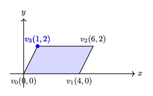
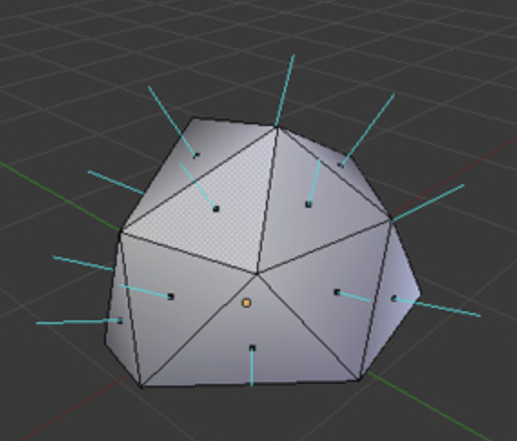
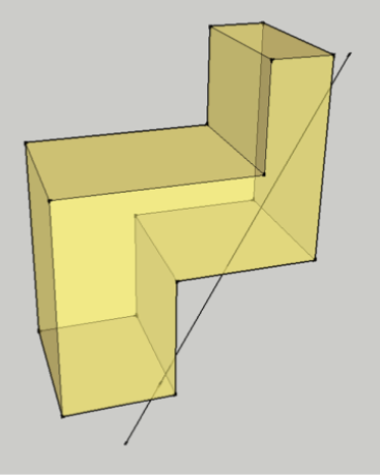
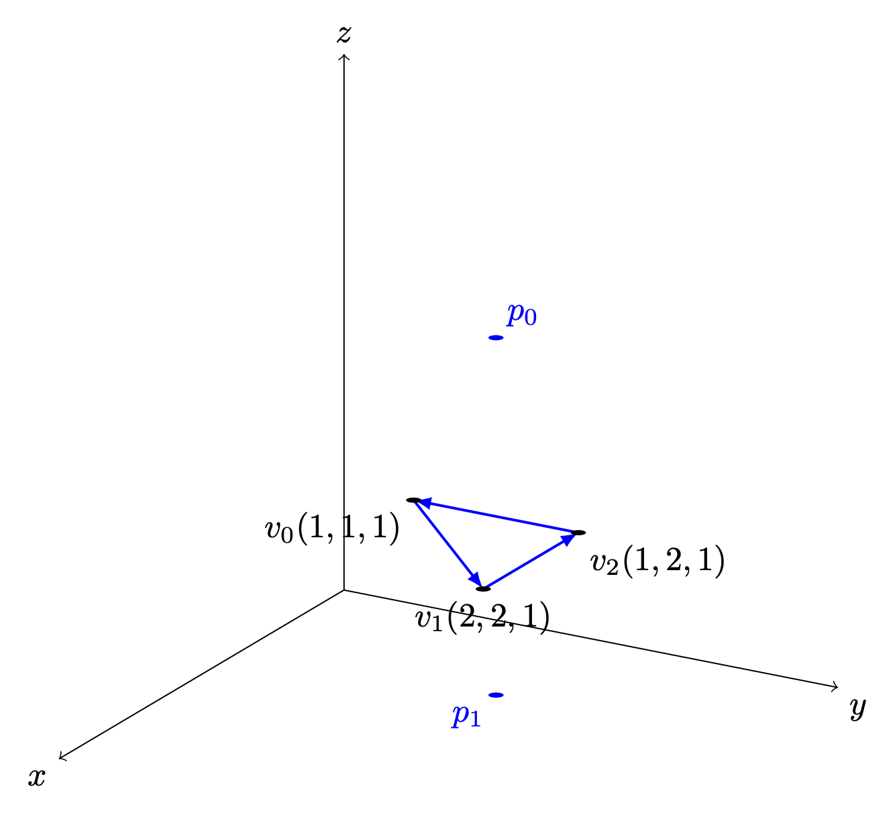
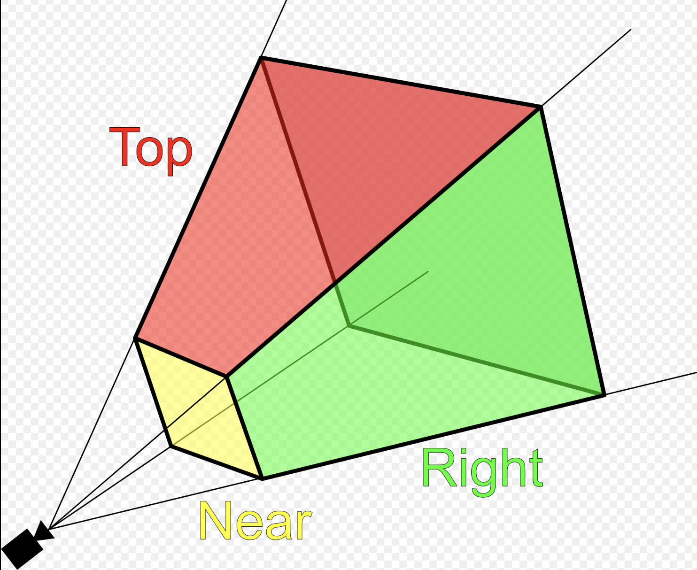

.. _geo-math:

Basic geometry in computer graphics
===================================

.. contents::
   :local:
   :depth: 4

This section introduces the fundamental geometry mathematics used in computer 
graphics.  
As discussed in the previous sections, 3D animation primarily based on 
geometric representations such as meshes (vertices) and surface discriptions
including textures, materials, shaders, and lighting models created in 3D 
content creation tools.
Consequently, vertex tranformations and lighting-based color computations form 
the mathematical foundation of modern computer graphics and animation.

The complete concept can be found in the book *Computer Graphics: Principles  
and Practice, 3rd Edition*, authored by John F. et al. However, the book  
contains over a thousand pages.

It is very comprehensive and may take considerable time to understand all the  
details.

Color
-----

- Additive colors in light are shown in :numref:`additive-colors`  
  [#additive-colors-wiki]_ [#additive-colors-ytube]_.

- In the case of paints, additive colors produce shades and become light gray  
  due to the addition of darker pigments [#additive-colors-shade]_.

.. _additive-colors: 
.. figure:: ../Fig/geo-math/additive-colors.png
  :align: center
  :scale: 50 %

  Additive colors in light

.. note:: **Additive colors**

   I know it doesn't match human intuition. However, additive RGB colors in  
   light combine to produce white light, while additive RGB in paints result in  
   light gray paint. This makes sense because light has no shade. This result  
   stems from the way human eyes perceive color. Without light, no color can be  
   sensed by the eyes.

   Computer engineers should understand that exploring the underlying reasons  
   falls into the realms of physics or the biology of the human eye structure.

.. _transformation:

Transformation
--------------

Overview

The tranformation matrices have been taught in high school and college.
However this mathematical details are not always retained clearly in memory.
The following section reviews the parts relevant to graphics rendering.

In both 2D and 3D graphics, every object transformation is performed by
multiplying the object's vertex coordinates by one or more **transformation
matrices**. Modern OpenGL uses **homogeneous coordinates** and **4×4 matrices**
to unify translation, rotation, scaling, projection, and even animation
(skinning) into a single mathematical framework.

A vertex in 3D is represented as:

.. math::

   \mathbf{v} =
   \begin{bmatrix}
   x \\ y \\ z \\ 1
   \end{bmatrix}

A transformation is applied by matrix multiplication:

.. math::

   \mathbf{v}' = M \mathbf{v}

Multiple transformations are combined by multiplying matrices:

.. math::

   \mathbf{v}' = P \, V \, M \, \mathbf{v}

Where:

- ``M`` = Model matrix (object → world)
- ``V`` = View matrix (world → camera)
- ``P`` = Projection matrix (camera → clip space)

This is the core of the OpenGL rendering pipeline, as shown in 
:numref:`trans_steps`.

.. _trans_steps: 
.. figure:: ../Fig/geo-math/trans-steps.png
  :align: center
  :scale: 50 %

  Cooridinates Transform Pipeline [#cg_basictheory]_

- Model space: The is the vertices position mentioned under :ref:`Root bone in 
  Animation flow <movement>`. All vertex coordinates are calcuated relative to the
  root bone.
- Model Rranform: ``M`` = Model matrix (object → world). This represents the 
  vertex positions mentioned under :ref:`Transform Animation in Animation flow 
  <movement>`.

Details for :numref:`trans_steps` can be found on "4.  Vertex Processing" of 
the website [#cg_basictheory]_.

Transformation Matrices [#wiki-transformation]_

- Translation: Moves an object in 3D space.

  :math:`T(x,y,z)=\begin{bmatrix}1&0&0&x\\0&1&0&y\\0&0&1&z\\0&0&0&1\end{bmatrix}
  \begin{bmatrix}X\\Y\\Z\\1\end{bmatrix}
  =
  \begin{bmatrix}X+x\\Y+y\\Z+z\\1\end{bmatrix}`

- Scaling: Resizes an object.

  :math:`S(s_x,s_y,s_z)=\begin{bmatrix}s_x&0&0&0\\0&s_y&0&0\\0&0&s_z&0\\0&0&0&1\end{bmatrix}
  \begin{bmatrix}X\\Y\\Z\\1\end{bmatrix}
  =
  \begin{bmatrix}s_x X\\s_y Y\\s_z Z\\1\end{bmatrix}`

- Rotation X: Rotates around the X-axis.

  :math:`R_x(\theta)=\begin{bmatrix}1&0&0&0\\0&\cos\theta&-\sin\theta&0\\0&\sin\theta&\cos\theta&0\\0&0&0&1\end{bmatrix}
  \begin{bmatrix}X\\Y\\Z\\1\end{bmatrix}
  =
  \begin{bmatrix}X\\Y\cos\theta - Z\sin\theta\\Y\sin\theta + Z\cos\theta\\1\end{bmatrix}`

- Rotation Y: Rotates around the Y-axis.

  :math:`R_y(\theta)=\begin{bmatrix}\cos\theta&0&\sin\theta&0\\0&1&0&0\\-\sin\theta&0&\cos\theta&0\\0&0&0&1\end{bmatrix}
  \begin{bmatrix}X\\Y\\Z\\1\end{bmatrix}
  =
  \begin{bmatrix}X\cos\theta + Z\sin\theta\\Y\\-X\sin\theta + Z\cos\theta\\1\end{bmatrix}`

- Rotation Z: Rotates around the Z-axis.

  :math:`R_z(\theta)=\begin{bmatrix}\cos\theta&-\sin\theta&0&0\\\sin\theta&\cos\theta&0&0\\0&0&1&0\\0&0&0&1\end{bmatrix}
  \begin{bmatrix}X\\Y\\Z\\1\end{bmatrix}
  =
  \begin{bmatrix}X\cos\theta - Y\sin\theta\\X\sin\theta + Y\cos\theta\\Z\\1\end{bmatrix}`

- Shear in X: - Skews geometry along axis X.
 
  :math:`\text{Shear}_X(a,b)=
  \begin{bmatrix}1&a&b&0\\0&1&0&0\\0&0&1&0\\0&0&0&1\end{bmatrix}
  \begin{bmatrix}X\\Y\\Z\\1\end{bmatrix}
  =
  \begin{bmatrix}X + aY + bZ\\Y\\Z\\1\end{bmatrix}`

- Shear in Y: Skews geometry along axis Y.

  :math:`\text{Shear}_Y(c,d)=
  \begin{bmatrix}1&0&0&0\\c&1&d&0\\0&0&1&0\\0&0&0&1\end{bmatrix}
  \begin{bmatrix}X\\Y\\Z\\1\end{bmatrix}
  =
  \begin{bmatrix}X\\cX + Y + dZ\\Z\\1\end{bmatrix}`

- Shear in Z: Skews geometry along axis Z.

  :math:`\text{Shear}_Z(e,f)=
  \begin{bmatrix}1&0&0&0\\0&1&0&0\\e&f&1&0\\0&0&0&1\end{bmatrix}
  \begin{bmatrix}X\\Y\\Z\\1\end{bmatrix}
  =
  \begin{bmatrix}X\\Y\\eX + fY + Z\\1\end{bmatrix}`

- Reflection: Mirrors across a plane.

  :math:`\text{Reflect}_{XY},\ \text{Reflect}(\mathbf{n})`

The "4.2  Model Transform (or Local Transform, or World Transform)" of on the 
website [#cg_basictheory]_ provides conceptual coverage of transformations.
List the websites that provide proofs of the non-obvious transformation 
formulas below.

**Rotation** 

The mathematical proof is given below.

1. https://en.wikipedia.org/wiki/Rotation_matrix

- Prove the 2D formula and then intutively extend it to 3D along the X, Y, and 
  Z axes [#wiki-rotation]_.

2. Proof in greater details:

https://austinmorlan.com/posts/rotation_matrices/

**Shear (Skew)**

Shear is a skewing transformation as shown in :numref:`shear`.

.. _shear: 
.. figure:: ../Fig/geo-math/shear.png
  :align: center
  :scale: 20 %

  3D shear

Shear in X:
plane x = 0 (the YZ‑plane), slides points parallel to the X‑axis.

The mathematical proof is given below.

https://en.wikipedia.org/wiki/Shear_mapping

**Reflection**

Reflection is nothing but a mirror image of an object. 

Reflection across the XY-plane:

.. math::

   \text{Reflect}_{XY} =
   \begin{bmatrix}
   1 & 0 & 0 & 0 \\
   0 & 1 & 0 & 0 \\
   0 & 0 & -1 & 0 \\
   0 & 0 & 0 & 1
   \end{bmatrix}

Reflection across an arbitrary plane with unit normal :math:`\mathbf{n}`:

.. math::

   R = I - 2 \mathbf{n}\mathbf{n}^T

The mathematical proof is given below.

https://www.geeksforgeeks.org/computer-graphics/computer-graphics-reflection-transformation-in-3d/

The following Quaternion Product (Hamilton product) is from the wiki  
[#wiki-quaternion]_ since it is not covered in the book.

.. math::

  \mathbf ij = -ji = k, jk = -kj = i, ki = -ik = j.

.. _cross-product:

Cross Product
-------------

Todo:

- Computing the direction of the line of intersection between two planes  
  (via :math:`n_1 \mathsf x n_2`)

end-of-Todo

Both triangles and quads are polygons. So, objects can be formed with  
polygons in both 2D and 3D. The transformation in 2D or 3D is well covered in  
almost every computer graphics book. This section introduces the most  
important concept and method for **determining inner and outer planes**. Then,
a **point or object can be checked for visibility** during 2D or 3D rendering.

Any **area** of a polygon can be calculated by dividing it into triangles or  
quads. The area of a triangle or quad can be calculated using the cross  
product in 3D.

✅ The role of cross product:

In 2D geometry mathematics, :math:`v_0, v_1 and v_2` can form the area of a 
parallelogram as shown in :numref:`rectangle-2d`.
The fourth vertex, :math:`\mathbf{v}_3`, can then be determined to complete the 
parallelogram.

.. _rectangle-2d:

   The area determined by :math:`v_0, v_1, v_2` in 2D

The area of the parallelogram is given by: 

.. math::

  \mathbf a = v_1-v_0, \mathbf b = v_2-v_0

  \Vert \mathbf a \mathsf x \mathbf b \Vert = \Vert a \Vert \Vert b \Vert | 
  sin(\Theta) |

The area of a parallelogram is same in both 2D and 3D.
To extend the definition of the corss product to 3D, all we must additionally 
consider the orientation of the plane, since a plane has two possible faces.

.. math::

  \mathbf a \mathsf x \mathbf b = \Vert a \Vert \Vert b \Vert sin(\Theta) n

- :math:`n` is a unit vector perpendicular to the plane. 
  :math:`\Rightarrow` direction.

As shown in :numref:`parallelogram-3d:left`, the plane determined by 
:math:`v_0, v_1, v_2` with CCW ordering defines a unique orientation. 

The area of the parallelogram remains unchanged after rotation as shown in
:numref:`parallelogram-3d:right`, which means the 
area and plane face determined by extending the definition of cross product from
2D to 3D correctly.

.. list-table::
   :widths: 50 50
   :align: center

   * - .. _parallelogram-3d:left:
       .. figure:: ../Fig/geo-math/parallelogram-3d.png
          :scale: 100 %

          The area and plane face determined by :math:`v_0, v_1, v_2` with CCW 
          ordering before rotation :math:`z` axis.

     - .. _parallelogram-3d:right: 
       .. figure:: ../Fig/geo-math/parallelogram-3d-2.png
          :scale: 100 %

          The area and plane face determined by :math:`v_0, v_1, v_2` with CCW 
          ordering after rotation :math:`z` axis.

.. _triangle-area:

The area of the triangle is obtained by dividing the parallelogram by 2:

.. math::

  \frac{1}{2} \Vert \mathbf a \mathsf x \mathbf b \Vert \quad \text{... 
  (triangle area)}

✅ Matrix Notation for Cross Product:

The cross product in **2D** is defined by a formula and can be represented  
with matrix notation, as proven here  
[#cross-product-2d-proof]_ [#cross-product-2d-proof2]_.

The cross product in **2D** is defined by a formula and can be represented  
with matrix notation, as proven here  
[#cross-product-2d-proof]_ [#cross-product-2d-proof2]_.

.. math::

  \mathbf a \mathsf x \mathbf b = \Vert a \Vert \Vert b \Vert sin(\Theta)

.. math::

  \mathbf a \mathsf x \mathbf b = 
  \begin{vmatrix}
  \mathbf i & \mathbf j& \mathbf k\\ 
  a_1& a_2& 0\\ 
  b_1& b_2& 0 
  \end{vmatrix} =
  \begin{bmatrix}
  a_1& a_2 \\
  b_1& b_2
  \end{bmatrix}

After the above matrix form is proven, the antisymmetry property  
may be demonstrated as follows:

.. math::

  a \mathsf x b = \mathsf x&
  \begin{bmatrix}
  a \\ 
  b 
  \end{bmatrix} =
  \begin{bmatrix}
  a_1& a_2 \\ 
  b_1& b_2 
  \end{bmatrix} =
  a_1b_2 - a_2b_1 = 

.. math::

  -b_1a_2 - (-b_2a_1) = 
  \begin{bmatrix}
  - b_1& - b_2 \\ 
  a_1& a_2 
  \end{bmatrix} =
  \mathsf x&
  \begin{bmatrix}
  -b \\ 
  a 
  \end{bmatrix} =
  -b \mathsf x a 

✅ Determine the area in a plane:

As described earlier of in this section, three vertices form a parallelogram or
triangle and the area in the plane can be determined since the angle between
:math:`v_1 - v_0` and :math:`v_2 - v_1` satisfied :math:`0 < \Theta < 180^\circ` 
under CCW orientation.
In fact **one single vector :math:`v_1 - v_0` is sufficient** to determine the 
area.
We describle this below.

In 2D, any two points :math:`\text{from } P_i \text{ to } P_{i+1}` can form a  
vector and determine the inner or outer side.  

For example, as shown in :numref:`inward-edge-normals`, :math:`\Theta` is the  
angle from :math:`P_iP_{i+1}` to :math:`P_iP'_{i+1} = 180^\circ`.  

Using the right-hand rule and counter-clockwise order, any vector  
:math:`P_iQ` between :math:`P_iP_{i+1}` and :math:`P_iP'_{i+1}`, with angle  
:math:`\theta` such that :math:`0^\circ < \theta < 180^\circ`, indicates the  
inward direction.

.. _inward-edge-normals: 
.. figure:: ../Fig/geo-math/inward-edge-normals.png
  :align: center
  :scale: 50 %

  Inward edge normals

.. _2d-vector-inward: 
.. figure:: ../Fig/geo-math/2d-vector-inward.png
  :align: center
  :scale: 50 %

  Inward and outward in 2D for a vector.

Based on this observation, the rule for inward and outward vectors is shown in  
:numref:`inward-edge-normals`. Facing the same direction as a specific vector,  
the left side is inward and the right side is outward, as shown in  
:numref:`2d-vector-inward`.

For each edge :math:`P_i - P_{i+1}`, the inward edge normal is the vector  
:math:`\mathsf{x} \; v_i`; the outward edge normal is  
:math:`- \; \mathsf{x} \; v_i`, where :math:`\mathsf{x} \; v_i` is the  
cross-product of :math:`v_i`, as shown in :numref:`inward-edge-normals`.

A polygon can be created from a set of vertices. Suppose  
:math:`(P_0, P_1, ..., P_n)` defines a polygon. The line segments  
:math:`P_0P_1, P_1P_2`, etc., are the polygon’s edges. The vectors  
:math:`v_0 = P_1 - P_0, v_1 = P_2 - P_1, ..., v_n = P_0 - P_n` represent those  
edges.

Using counter-clockwise ordering, the left side is considered inward. 
Thus, the inward region of a polygon can be determined, as shown in 
:numref:`convex:left` and :numref:`convex:middle`.

.. list-table::
   :widths: 33 34 33
   :align: center

   * - .. _convex:left:
       .. figure:: ../Fig/geo-math/triangle-ccw.png
          :scale: 50 %

          Triangle with CCW

     - .. _convex:middle: 
       .. figure:: ../Fig/geo-math/hexagon-ccw.png
          :scale: 30 %

          Hexagon with CCW

     - .. _convex:right:
       .. figure:: ../Fig/geo-math/triangle-cw.png
          :scale: 50 %

          Triangle with CW

For a convex polygon with vertices listed in counter-clockwise order, the  
inward edge normals point toward the interior of the polygon, and the outward  
edge normals point toward the unbounded exterior. This matches our usual  
intuition.

However, if the polygon vertices are listed in clockwise (CW) order, the interior  
and exterior definitions are reversed. :numref:`convex:right` shows an example
where :math:`P_0, P_1, P_2` are arranged in CW order.

This cross product has an important property: going from :math:`v` to  
:math:`\times v` involves a 90° rotation in the same direction as the  
rotation from the positive x-axis to the positive y-axis.

.. _in-polygon: 
.. figure:: ../Fig/geo-math/polygon.png
  :align: center
  :scale: 50 %

  Draw a polygon with vectices counter clockwise

As shown in :numref:`in-polygon`, when drawing a polygon with vectors (lines)  
in counter-clockwise order, the polygon will be formed, and the two sides of  
each vector (line) can be identified [#cgpap]_.

Furthermore, whether a point is inside or outside the polygon can be  
determined.

One simple method to test whether a point lies inside or outside a simple  
polygon is to cast a ray from the point in any fixed direction and count how  
many times it intersects the edges of the polygon.

If the point is outside the polygon, the ray will intersect its edges an even  
number of times. If the point is inside the polygon, it will intersect the  
edges an odd number of times [#wiki-point-in-polygon]_.

.. _3d-cross-product: 
.. figure:: ../Fig/geo-math/3d-cross-product.png
  :align: center
  :scale: 50 %

  Cross product definition in 3D

In the same way, by following the counter-clockwise direction to create a  
2D polygon step by step, a 3D polygon can be constructed.

As shown in :numref:`3d-cross-product` from the wiki  
[#cross-product-wiki]_, the inward direction is determined by  
:math:`a \times b < 0`, and the outward direction is determined by  
:math:`a \times b > 0` in OpenGL.

Replacing :math:`a` and :math:`b` with :math:`x` and :math:`y`, as shown in  
:numref:`ogl-pointing-outwards`, the positive Z-axis (:math:`z+`) represents  
the outer surface, while the negative Z-axis (:math:`z-`) represents the  
inner surface [#ogl-point-outwards]_.

.. _ogl-pointing-outwards: 
.. figure:: ../Fig/geo-math/ogl-pointing-outwards.png
  :align: center
  :scale: 50 %

  OpenGL pointing outwards, indicating the outer surface (z axis is +)

.. _in-3d-polygon: 

  3D polygon with directions on each plane

Reposition each triangle in front of camera and construct it using triangle 
with CCW ordering, as shown in :numref:`convex:left`.
By building every triangle with CCW ordering, we can defined a consistent outer 
surface (front face).
The :numref:`in-3d-polygon` shows an example of a 3D polygon created from 2D  
triangles. The direction of the plane (triangle) is given by the line  
perpendicular to the plane.

Cast a ray from the 3D point along the X-axis and count how many intersections  
with the outer object occur. Depending on the number of intersections along  
each axis (even or odd), you can understan if **the point (or the camara) is i
nside or outside** [#point-in-3d-object]_.

An odd number means inside, and an even number means outside. As shown in  
:numref:`in-3d-object`, points on the line passing through the object satisfy  
this rule.

.. _in-3d-object: 

  Point is inside or outside of 3D object

✅ Summary:

Based on these description of this section, this means:

✔️  Each mesh (triangle or primitive) has a fixed “outer” and “inner” side,
determined by CCW ordering in object space.

✔️  By reading these CCW-ordered vertices sequentially, the shape and surface 
orientation of the 3D model can be constructed.

✔️  There is no need to wait for the entire mesh to be received; once three 
CCW-ordered vertices are available, each triangle can be processed correctly
as shown in :numref:`construct-triangle` from the camera position :math:`p_0`.

.. _construct-triangle: 

  A triangle can be constructed as soon as three vertices are received

✔️  When the camera moves to the :math:`p_1` inside an object: CCW ↔ CW 
flips as shown in :numref:`construct-triangle`.

✔️  As shown in :ref:`Trangle Area Calculation <triangle-area>` when
:math:`0 < \Theta < 180^\circ` under CCW orientation, the area of a triangle 
area is given by:

.. math::

   \frac{1}{2} \mathbf \Vert (v_1-v_0) \mathsf x \mathbf (v_2-v_0) \Vert =
   \frac{1}{2} \Vert (v_1-v_0) \Vert \Vert (v_2-v_0) \Vert sin(\Theta)

✔️  Though each triangle can be correctly identified and processed using its
CCW ordering.
As mentioned in :numref:`trans_steps` of section :ref:`transformation`,
the Cooridinates Transform Pipeline maps geometry from Camera Space to 
Clipping Space (Clipping Volume). 
This tranformation significantly simplifies the calculation required
for discarding and clipping triangles, as will be desribed in the next
section :ref:`projection`.

How does OpenGL render (draw) the inner face of a triangle?

OpenGL does NOT determine front/back in world space.

When the camera moves to the inner space of a object:

-  The projection changes
-  The triangle’s screen‑space orientation changes
-  CCW ↔ CW flips
-  So the GPU flips front/back classification

.. rubric:: OpenGL uses counter clockwise and pointing outwards as default
.. code-block:: c++

  // unit cube      
  // A cube has 6 sides and each side has 4 vertices, therefore, the total number
  // of vertices is 24 (6 sides * 4 verts), and 72 floats in the vertex array
  // since each vertex has 3 components (x,y,z) (= 24 * 3)
  //    v6----- v5  
  //   /|      /|   
  //  v1------v0|   
  //  | |     | |   
  //  | v7----|-v4  
  //  |/      |/    
  //  v2------v3    

  // vertex position array
  GLfloat vertices[]  = {
     .5f, .5f, .5f,  -.5f, .5f, .5f,  -.5f,-.5f, .5f,  .5f,-.5f, .5f, // v0,v1,v2,v3 (front)
     .5f, .5f, .5f,   .5f,-.5f, .5f,   .5f,-.5f,-.5f,  .5f, .5f,-.5f, // v0,v3,v4,v5 (right)
     .5f, .5f, .5f,   .5f, .5f,-.5f,  -.5f, .5f,-.5f, -.5f, .5f, .5f, // v0,v5,v6,v1 (top)
    -.5f, .5f, .5f,  -.5f, .5f,-.5f,  -.5f,-.5f,-.5f, -.5f,-.5f, .5f, // v1,v6,v7,v2 (left)
    -.5f,-.5f,-.5f,   .5f,-.5f,-.5f,   .5f,-.5f, .5f, -.5f,-.5f, .5f, // v7,v4,v3,v2 (bottom)
     .5f,-.5f,-.5f,  -.5f,-.5f,-.5f,  -.5f, .5f,-.5f,  .5f, .5f,-.5f  // v4,v7,v6,v5 (back)
  };

From the code above, we can see that OpenGL uses counter-clockwise [#vbo2]_ and  
pointing outwards as the default. However, OpenGL provides  
``glFrontFace(GL_CW)`` for clockwise winding [#ogl_frontface]_.

For a group of objects, a scene graph provides better animation support and  
saves memory [#scene-graph-wiki]_.

.. _dot-product:

Dot Product
-----------

Dot Product

- Ray–plane (line–plane) intersection
- Determining angles between vectors
- Lighting (Lambertian shading)
- Solving for a point on the intersection line of two planes  
  (because plane equations use dot products)

Described in wiki here:

https://en.wikipedia.org/wiki/Dot_product

✅ As described in the previous section :ref:`cross-product`,
the cross-product is:

.. math::

  \mathbf a = v_1-v_0, \mathbf b = v_2-v_0

  \mathbf a \mathsf x \mathbf b = \Vert a \Vert \Vert b \Vert sin(\Theta) n

- :math:`n` is a unit vector perpendicular to the plane 
  :math:`\Rightarrow` direction.

The dot product definition is:

.. math::

  \mathbf a \mathsf \cdot \mathbf b = \Vert a \Vert \Vert b \Vert cos(\Theta)

✅ Since :math:`n` is the outward normal vector for a CCW-ordered triangle, we 
have:

- :math:`(\mathbf p - v_0) \mathsf \cdot \mathbf n > 0 \Rightarrow \mathbf p` 
  lies on the front (outer) side of the plane.

- :math:`(\mathbf p - v_0) \mathsf \cdot \mathbf n = 0 \Rightarrow \mathbf p` 
  lies on the plane. 

- :math:`(\mathbf p - v_0) \mathsf \cdot \mathbf n < 0 \Rightarrow \mathbf p` 
  lies on the back (inner) side of the plane.

✅ A plane is represented by:

.. math::

   \mathbf{n} \cdot (\mathbf{x}_1 - \mathbf{x}_0) = 0

where:

- :math:`n` is the plane’s normal vector
- :math:`x_0, x_1` are any points on the plane

.. math::

   \mathbf{n} \cdot (\mathbf{x}_1 - \mathbf{x}_0) = 0

   \Rightarrow \mathbf{n} \cdot \mathbf{x}_1 - \mathbf{n} \cdot \mathbf{x}_0 = 0

   \Rightarrow \mathbf{n} \cdot \mathbf{x}_1 = \mathbf{n} \cdot \mathbf{x}_0

Let's define the scalar constant :math:`d` by:

.. math::

   d = -\,\mathbf{n} \cdot \mathbf{x}_0

Thus, the set of all points :math:`\mathbf{p}` satisfying

.. math::

   \mathbf{n} \cdot \mathbf{p} + d = 0

✅ Ray–plane (line–plane) intersection

For an edge between vertices :math:`\mathbf{p}_0` and :math:`\mathbf{p}_1`,
parameterized as:

.. math::

   \mathbf{p}(t) = \mathbf{p}_0 + t(\mathbf{p}_1 - \mathbf{p}_0)

the intersection with a clipping plane is found by solving:

.. math::

   \mathbf{n} \cdot \mathbf{p}(t) + d = 0

This yields:

.. math::

   t = \frac{- (\mathbf{n} \cdot \mathbf{p}_0 + d)}
   {\mathbf{n} \cdot (\mathbf{p}_1 - \mathbf{p}_0)}

.. _projection:

Projection
----------

✅ Reason:

As described in the previous section :ref:`cross-product`,
each mesh (triangle or primitive) has a fixed “outer” and “inner” side, 
determined by CCW ordering in object space.
By reading these CCW-ordered vertices sequentially, the shape and surface 
orientation of the 3D model can be constructed, and hidden primitives
can be clipped or discarded.

However primitive clipping and discarding can be performed much
more efficiently by mapping the view frustum to **clip space**, where the GPU 
can **easily clip or discard primitives**, as shown :numref:`trans_steps_2` 
from the earlier section :ref:`transformation` again for clarity. 
Performing clipping and discarding in **world space** would be significantly 
more **difficult**.

.. _trans_steps_2: 
.. figure:: ../Fig/geo-math/trans-steps.png
  :align: center
  :scale: 50 %

  Cooridinates Transform Pipeline [#cg_basictheory]_

✅ Projection Area:

.. _ViewFrustum: 

  Clipping-Volume Cuboid

Only objects within the cone between near and far planes are projected to 2D  
in perspective projection.

Perspective and orthographic projections (used in CAD tools) from 3D to 2D  
can be represented by transformation matrices as described in wiki here 
[#wiki-prospective-projection]_.

The "4.4  Projection Transform - Perspective Projection"  of on the
website [#cg_basictheory]_ provides conceptual coverage of projections.

**Camera Space Setup**

Assume a right-handed camera coordinate system as shown in :numref:`ViewFrustum`:

* The camera is located at the origin.
* The camera looks down the negative :math:`z` axis.
* The near plane is located at :math:`z = -n`.
* The far plane is located at :math:`z = -f`.
* The view frustum bounds on the near plane are:
  
  * left: :math:`l`
  * right: :math:`r`
  * bottom: :math:`b`
  * top: :math:`t`

✅ Matrix :math:`P_{\text{persp}}` converts 3D coordinates into clip space:

Perspective projection :math:`P_{\text{persp}}` (general form): 
Converts 3D → clip space with depth

.. math::

   P =
   \begin{bmatrix}
   \frac{2n}{r-l} & 0 & \frac{r+l}{r-l} & 0 \\
   0 & \frac{2n}{t-b} & \frac{t+b}{t-b} & 0 \\
   0 & 0 & -\frac{f+n}{f-n} & -\frac{2fn}{f-n} \\
   0 & 0 & -1 & 0
   \end{bmatrix}

A point :math:`p` in camera space is represented as:

.. math::

   \mathbf{p} =
   \begin{bmatrix} x \\ y \\ z \\ 1 \end{bmatrix}

Converting from camera space to cliping space produces a
homogeneous coordinate of the form :math:`[x_c, y_c, z_c, w_c]`:

.. math::

   P \mathbf{p} =
   \begin{bmatrix}
   \frac{2n}{r-l} x + \frac{r+l}{r-l} z \\
   \frac{2n}{t-b} y + \frac{t+b}{t-b} z \\
   -\frac{f+n}{f-n} z - \frac{2fn}{f-n} \\
   -z
   \end{bmatrix}
   =
   \begin{bmatrix} x_c \\ y_c \\ z_c \\ w_c \end{bmatrix}

After transforming to **ciip space**, each vertex corrodinate is expressed in 
**homogeneous** form, and the **view frustum boundaries are encoded in the 
coordinate values**.
A vertex lies inside the view frustum if the following conditions are satisfied:

.. math::

   -w_c \le x_c \le w_c \
   -w_c \le y_c \le w_c \
   -w_c \le z_c \le w_c

.. _math-proof-clip:

✅ Matrix :math:`P_{\text{persp}}`  Derivation:

★ **Idea**:

The perspective projection matrix :math:`P_{\text{persp}}` is derived by 
choosing its coefficients such that, after perspective division, the 
frustum boundaries :math:`l,r,b,t,n,f` are mapped to the **canonical cube**
:math:`\mathbf{[-1,1]^3}`.

More explicitly, we impose the following constraints:

.. math::

   x = l \rightarrow x_{ndc} = -1

   x = r \rightarrow x_{ndc} = 1

   y = b \rightarrow y_{ndc} = -1

   y = t \rightarrow y_{ndc} = 1

   z = -n \rightarrow z_{ndc} = -1

   z = -f \rightarrow z_{ndc} = 1

These conditions determine the coefficients of the matrix.

**X Coordinate Mapping**

Since the near plane is located at :math:`z = -n`, by similar triangles, the 
projected x-coordinate on the near plane is proportional to the ratio between
:math:`-n` and :`math:`z` as follows:

.. math::

   x_n = \frac{-n}{z} x

The near-plane bounds map to NDC such that 
:math:`x = l \Rightarrow x_{ndc} = -1` and 
:math:`x = r \Rightarrow x_{ndc} = +1`.
Since the midpoint :math:`\frac{l + r}{2}` is generally not equal to 0, the 
mapping is not centered at the origin.
Therefore, a linear mapping requires an offset term :math:`B_x` as follows:

.. math::

   x_{ndc} = A_x x_n + B_x

Applying the near constraints: substituting :math:`x_n = l\ and\ x_{ndc} = -1`:

.. math::

   -1 = A_x l + B_x
   \qquad ...(1)

Applying the far constraints: substituting :math:`x_n = r\ and\ x_{ndc} = 1`:

.. math::

   1 = A_x r + B_x
   \qquad ...(2)

Solving equations (1) and (2) to get :math:`A_x`:

.. math::

  2 = A_x (r-l) \Rightarrow A_x = \frac{2}{r-l} 
  \qquad ...(3)

Substituting equation (3) to (2):

.. math::

  1 = A_x r + B_x \Rightarrow 1 = \frac{2}{r-l}r + B_x 
  \Rightarrow B_x = \frac{r-l-2r}{r-1} = -\frac{r+l}{r-l} \qquad ...(4)

From (3) and (4):
Solving for :math:`A_x` and :math:`B_x` yields:

.. math::

   A_x = \frac{2}{r-l}, \quad
   B_x = -\frac{r+l}{r-l}

Substituting :math:`x_n = \frac{-n}{z} x` gives the resulting mapping is:

.. math::

   x_{ndc}
   = A_x x_n + B_x = \frac{-2n}{r-l} \frac{x}{z}
     - \frac{r+l}{r-l}

Since :math:`x_{ndc} = \frac{x_c}{w_c}` and :math:`w_c = -z`, therefore:
 
.. math::

   x_c = x_{ndc} (-z) = \frac{2n}{r-l} x + \frac{r+l}{r-l} z.

**The physical meaning** of :math:`x_c = x_{ndc} (-z)` is:

Multiplying :math:`x_c = x_{ndc}` by :math:`(-z)` converts the normalized 
coordinate back into the **real horizontal position at that depth**.

**Y Coordinate Mapping**:

Using the same derivation for the y-axis:

.. math::

   y_n = \frac{-n}{z} y

The resulting mapping is:

.. math::

   A_y = \frac{2}{t-b}, \quad
   B_y = -\frac{t+b}{t-b}

:math:`y_{ndc}`:

.. math::

   y_{ndc}
   = A_y y_n + B_y = \frac{-2n}{t-b} \frac{y}{z}
     - \frac{t+b}{t-b}

:math:`y_c`:

.. math::

   y_c = y_{ndc} (-z) = \frac{2n}{t-b} y + \frac{t+b}{t-b} z.

**Z Coordinate Mapping**

Depth is mapped linearly such that:

.. math::

   z = -n \Rightarrow z_{ndc} = -1
   \qquad
   z = -f \Rightarrow z_{ndc} = +1

Assume:

.. math::

   z_c = A_z z + B_z

Then:

.. math::

   z_{ndc} = \frac{A_z z + B_z}{-z}

Applying the near constraints: substituting :math:`z = -n\ and\ z_{ndc} = -1`:

.. math::

   -1 = \frac{A_z(-n) + B_z}{-(-n)} \Rightarrow -n = {A_z(-n) + B_z} 
   \qquad ...(1)

Applying the far constraints: substituting :math:`z = -f\ and\ z_{ndc} = 1`:

.. math::

   1 = \frac{A_z(-f) + B_z}{-(-f)} \Rightarrow  f = {A_z(-f) + B_z} 
   \qquad ...(2)

Solving equations (1) and (2) to get :math:`A_z`:

.. math::

  -n-f = {A_z(-n+f)} \Rightarrow {A_z} = \frac{-n-f}{-n+f} = -\frac{f+n}{f-n}
  \qquad ...(3)

Substituting equation (3) to (2):

.. math::

  f = {A_z(-f) + B_z} \Rightarrow f = {-\frac{f+n}{f-n}(-f) + B_z} 

  \Rightarrow {B_z} = f+\frac{f+n}{f-n}(-f) = \frac{(f^2-fn)+(-f^2-fn)}{f-n} = 
  -\frac{2fn}{f-n} \qquad ...(4)

From (3) and (4):

.. math::

   A_z = -\frac{f+n}{f-n}, \quad
   B_z = -\frac{2fn}{f-n}

:math:`z_{ndc}`:

.. math::

   z_{ndc} = \frac{A_z z + B_z}{-z} = \frac{-\frac{f+n}{f-n} z -\frac{2fn}{f-n}}{-z}

:math:`z_c`:

.. math::

   z_c = z_{ndc} (-z) = -\frac{f+n}{f-n} z -\frac{2fn}{f-n}

**Perspective Projection Matrix**

Combining all components, the perspective projection matrix is:

.. math::

   P =
   \begin{bmatrix}
   \frac{2n}{r-l} & 0 & \frac{r+l}{r-l} & 0 \\
   0 & \frac{2n}{t-b} & \frac{t+b}{t-b} & 0 \\
   0 & 0 & -\frac{f+n}{f-n} & -\frac{2fn}{f-n} \\
   0 & 0 & -1 & 0
   \end{bmatrix}

A point :math:`p` in camera space is represented as:

.. math::

   \mathbf{p} =
   \begin{bmatrix} x \\ y \\ z \\ 1 \end{bmatrix}

Converting from camera space to cliping space produces a
homogeneous coordinate of the form :math:`[x_c, y_c, z_c, w_c]`:

.. math::

   P \mathbf{p} =
   \begin{bmatrix} x_c \\ y_c \\ z_c \\ w_c \end{bmatrix}

As mentioned the **physical meaning** of 
:math:`x_c = x_{ndc} (-z), y_c = y_{ndc} (-z), z_c = z_{ndc} (-z)` is:

Converts the normalized coordinate back into the **real horizontal position at
that depth**.

If :math:`x_c = x_{ndc} (-z_i), y_c = y_{ndc} (-z_i), z_c = z_{ndc} (-z_i)`,
where :math:`z_i` is the depth of plane :math:`P_i` (a plane located between 
the near and far planes), then this operation projects NDC corridinates onto 
**the plane** :math:`P_i`.

For all vertices that survived clipping, the resulting coordinates satisfy:

.. math::

    -1 \le x_{ndc} \le 1 \
    -1 \le y_{ndc} \le 1 \
    -1 \le z_{ndc} \le 1

After transforming to **ciip space**, each vertex corrodinate is expressed in 
**homogeneous** form, and the **view frustum boundaries are encoded in the 
coordinate values**.
A vertex lies inside the view frustum if the following conditions are satisfied:

.. math::

   -w_c \le x_c \le w_c \
   -w_c \le y_c \le w_c \
   -w_c \le z_c \le w_c

Based on the clip-space representation, when :math:`w_c` is :math:`-z` the 
coordinates :math:`[x, y, z]` **can be clipped according to their depth 
values**.

✅ Map points to NDC:

After applying matrix :math:`P_{\text{persp}}`, any vertex in view space is mapped
to clip space:

.. math::

   (x,y,z,1)
   \rightarrow
   (x_c, y_c, z_c, w_c)

For the standard perspective matrix:

.. math::

   w_c = -z

The normalized device coordinates (NDC) are obtained by perspective division:

.. math::

    x_{ndc} = \frac{x_c}{w_c},
    \quad
    y_{ndc} = \frac{y_c}{w_c},
    \quad
    z_{ndc} = \frac{z_c}{w_c}

Substituting the matrix coefficients:

.. math::

   w_c = -z

   x_{ndc} = \frac{x_c}{w_c} = 
      \frac{\frac{2n}{r-l} x + \frac{r+l}{r-l} z}{-z}
      = \frac{2n}{r-l} \frac{x}{-z} + \frac{r+l}{r-l}, 

   \quad
   y_{ndc} = \frac{y_c}{w_c} = 
      \frac{\frac{2n}{t-b} y + \frac{t+b}{t-b} z}{-z}
      = \frac{2n}{t-b} \frac{y}{-z} + \frac{t+b}{t-b}, 

   \quad
   z_{ndc} = \frac{z_c}{w_c} =
      \frac{-\frac{f+n}{f-n} z - \frac{2fn}{f-n}}{-z}
      = \frac{f+n}{f-n} + \frac{2fn}{(f-n) z}

This matrix maps the view frustum in camera space to the normalized cube
in NDC after homogeneous division.

For all vertices that survived clipping, the resulting coordinates satisfy:

.. math::

    -1 \le x_{ndc} \le 1 \
    -1 \le y_{ndc} \le 1 \
    -1 \le z_{ndc} \le 1

Therefore, the visible region lies inside the **canonical cube**:

.. math::

   \mathbf{[-1,1]^3}

✅ Comparsion for clipping and discarding in World Space and Clipping Space

When a triangle intersects the view frustum, it must be clipped so that only the
portion inside the frustum is rasterized. Although the clipping procedure is
conceptually similar in world space and clip space, the mathematical complexity
differs significantly. Clipping and discarding in clip space will saves **85%** 
in instructions.

**1A. Discarding in world space**:

As described in the section :ref:`dot-product`:

The definition of Dot Product is:

.. math::

  \mathbf a = v_1-v_0, \mathbf b = v_2-v_0

  \mathbf a \mathsf \cdot \mathbf b = \Vert a \Vert \Vert b \Vert cos(\Theta)

When :math:`(\mathbf p - v_0) \mathsf \cdot \mathbf n < 0 \Rightarrow \mathbf p` 
lies on the back (inner) side of the plane.

For the ray–plane (line–plane) 
intersection, the :math:`d_i` can be obtained by choosing any point 
:math:`\mathbf{p}_0` on the plane with normal vector :math:`\mathbf{n}_i`.

.. math::

   d_i = -\,\mathbf{n}_i \cdot \mathbf{p}_0

In world (or view) space, the view frustum is bounded by six arbitrary planes,
each defined by a normal vector :math:`\mathbf{n}` and distance :math:`d`.

For each vertex :math:`\mathbf{p}`, discarding requires testing against all
planes:

.. math::

   (\mathbf p - p_0) \mathsf \cdot \mathbf n_i < 0 

   \Rightarrow 
   \mathbf{n}_i \cdot \mathbf{p} + d_i < 0
   \quad \text{for any } i \in [1,6]

Cost per vertex

  - 6 dot products (each ≈ 3 multiplications + 2 additions)
  - 6 additions with plane constants
  - 6 comparisons

Approximate arithmetic cost:

  - 18 multiplications
  - 18 additions
  - 6 comparisons

**1B. Discarding in clip space**:

In clip space, vertices are represented in homogeneous coordinates
:math:`(x_c, y_c, z_c, w_c)`.
The view frustum becomes an axis-aligned volume defined by:

.. math::

   -w_c \le x_c \le w_c \
   -w_c \le y_c \le w_c \
   -w_c \le z_c \le w_c

Approximate arithmetic cost:

  - 6 comparisons

Overall arithmetic instruction reduction **85% ~ 95%**.

**2A. Clipping in World Space**:

Edge–plane intersection

As described in the section :ref:`dot-product`, the ray–plane (line–plane) 
intersection can be derived as follows:

.. math::

   t = \frac{- (\mathbf{n} \cdot \mathbf{p}_0 + d)}
   {\mathbf{n} \cdot (\mathbf{p}_1 - \mathbf{p}_0)}

Each frustum plane requires a separate equation and dot-product evaluation.

Triangle reconstruction

After computing all intersection points:

  - New vertices are inserted along intersecting edges
  - The original triangle is split into one or more triangles
  - Perspective projection is applied afterward

Care must be taken to preserve perspective correctness during interpolation.

**2B. Clipping in Clip Space**:

Edge–plane intersection

Edges are interpolated linearly in homogeneous space:

.. math::

   \mathbf{v}(t) = \mathbf{v}_0 + t(\mathbf{v}_1 - \mathbf{v}_0)

Intersection with a clipping boundary is found by solving equations such as:

.. math::

   x(t) = \pm w(t), \quad y(t) = \pm w(t), \quad z(t) = \pm w(t)

Each case reduces to a single scalar equation for :math:`t`.

.. math::

   x(t) = x_0 + t(x_1 - x_0) \
   w(t) = w_0 + t(w_1 - w_0)

   x(t) = w(t) \rightarrow

   x_0 + t(x_1 - x_0) = w_0 + t(w_1 - w_0)

   x_0 - w_0 = t \bigl[(w_1 - w_0) - (x_1 - x_0)\bigr]

   t = \frac{x_0 - w_0}{(x_0 - w_0) - (x_1 - w_1)}

Compare :math:`t = \frac{x_0 - w_0}{(x_0 - w_0) - (x_1 - w_1)}` and the 
equation from world space :math:`t = \frac{- (\mathbf{n} \cdot \mathbf{p}_0 
+ d)}{\mathbf{n} \cdot (\mathbf{p}_1 - \mathbf{p}_0)}`, it saves **85%** for 
reducing two dot operations and more opertions.

Triangle reconstruction

After clipping:

  - New vertices remain in homogeneous coordinates
  - Perspective division is deferred
  - Linear interpolation remains perspective-correct

The final step applies the perspective divide:

.. math::

   (x_c, y_c, z_c, w_c) \rightarrow
   \left( \frac{x_c}{w_c}, \frac{y_c}{w_c}, \frac{z_c}{w_c} \right)

4.3 Comparison and Practical Implications

  - World-space clipping and discarding uses general plane equations and 
    complex geometry.
  - Clip-space clipping and discarding uses axis-aligned bounds and simple 
    interpolation.
  - Perspective correctness is naturally preserved in clip space.
  - GPU hardware can implement clip-space clipping and discarding efficiently.

For these reasons, modern graphics pipelines perform triangle clipping and 
discarding in clip space, not in world space.

Reference:

1. Every computer graphics book covers the topic of transformation of objects 
and
their positions in space. Chapter 4 of the *Blue Book: OpenGL SuperBible, 7th  
Edition* provides a concise yet useful 40-page overview of transformation 
concepts and is good material for gaining a deeper understanding of transformations.
description of transformation.

2. Chapter 7 of Red book covers the tranformations and projections.

3. https://en.wikipedia.org/wiki/3D_projection

.. [#additive-colors-wiki] https://en.wikipedia.org/wiki/RGB_color_model

.. [#additive-colors-ytube] https://www.youtube.com/watch?v=kEnz_3miiAc

.. [#additive-colors-shade] https://www.tiktok.com/@tonesterpaints/video/7059565281227853102

.. [#cg_basictheory] https://www3.ntu.edu.sg/home/ehchua/programming/opengl/CG_BasicsTheory.html

.. [#wiki-transformation] https://en.wikipedia.org/wiki/Transformation_matrix

.. [#wiki-rotation] https://en.wikipedia.org/wiki/Rotation_matrix

.. [#wiki-quaternion] https://en.wikipedia.org/wiki/Quaternion

.. [#wiki-prospective-projection] https://en.wikipedia.org/wiki/3D_projection

.. [#cross-product-wiki] https://en.wikipedia.org/wiki/Cross_product
   
.. [#cross-product-2d-proof] https://www.xarg.org/book/linear-algebra/2d-perp-product/

.. [#cross-product-2d-proof2] https://www.nagwa.com/en/explainers/175169159270/

.. [#cgpap] Figure 7.19 of Book: Computer graphics principles and practice 3rd edition

.. [#wiki-point-in-polygon] https://en.wikipedia.org/wiki/Point_in_polygon

.. [#ogl-point-outwards] Normals are used to differentiate the front- and back-face, and for other processing such as lighting. Right-hand rule (or counter-clockwise) is used in OpenGL. The normal is pointing outwards, indicating the outer surface (or front-face). https://www3.ntu.edu.sg/home/ehchua/programming/opengl/CG_BasicsTheory.html

.. [#point-in-3d-object] https://stackoverflow.com/questions/63557043/how-to-determine-whether-a-point-is-inside-or-outside-a-3d-model-computationally

.. [#vbo2] http://www.songho.ca/opengl/gl_vbo.html

.. [#ogl_frontface] https://registry.khronos.org/OpenGL-Refpages/gl4/html/glFrontFace.xhtml

.. [#scene-graph-wiki] https://en.wikipedia.org/wiki/Scene_graph
