.. _graphics:

Graphics Structure and Principle
================================

.. contents::
   :local:
   :depth: 4

.. _three-d-model:

3D Modeling
-----------

By creating 3D models with triangles or quads on a surface, the model is formed
using a polygon mesh [#polygon]_. This mesh consists of all the vertices shown in
the first image as :numref:`modeling1`.

.. _modeling1: 
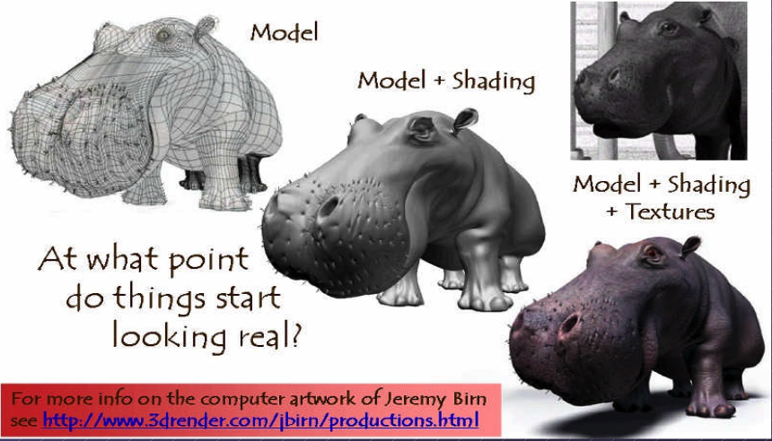

  Creating 3D model and texturing

After applying smooth shading [#polygon]_, the vertices and edge lines are
covered with color (or the edges are visually removed — **edges never actually 
have black outlines**). As a result, the model appears much smoother 
[#shading]_.

Furthermore, after texturing (texture mapping), the model looks even more
realistic [#texturemapping]_.

.. _animation:

Animation
*********

★ Animation Layers: High → Low

This breakdown organizes animation systems from the **highest gameplay
logic** down to the **lowest GPU skinning**, and clearly marks which
parts are controlled by the **user** and which parts are handled by the
**3D engine**.

1. Gameplay Animation Logic (High Level): set by user (game developer)

See video here [#animation-state-video]_.

**Examples**

- Play "walk" when speed > 0.1
- Trigger "jump" on button press
- Switch to "attack" when enemy detected
- Blend run when velocity increases

**Where it lives**

Live in **gameplay scripts** (C#, Blueprints, GDScript, Python)

- Unity: C# scripts
- Unreal: Blueprints or C++
- Godot: GDScript
- ThinMatrix: Java (no scripting layer)

This layer decides *when* animations should play.

2. Animation State Machine / Animation Graph: set by user (game developer)

**Examples**

- Idle → Walk → Run transitions
- Blend trees
- Animation layers (upper body, lower body)
- Animation parameters (speed, grounded, direction)

**Where it lives**

- Unity: Animator Controller
- Unreal: Animation Blueprint
- Godot: AnimationTree
- ThinMatrix: *Does not have this layer*

This layer controls *which* animation clip is active and how transitions
occur.

3. Animation Clip Playback Layer: user chooses

An **animation clip** is **a sequence of keyframes** over a period of time that 
represents a **motion or action**.

**Examples**

- Play animation clip
- Loop animation
- Set animation speed
- Crossfade between clips
- Blend two clips together

**Who sets it?**  
User chooses which clip to play.

**Who implements it?**  
Engine handles blending, timing, and playback.

**Where it lives**

- Unity: Mecanim runtime
- Unreal: AnimInstance
- Godot: AnimationPlayer
- ThinMatrix: Java engine code (Animator.java)

This layer executes the user’s choices.

4. Skeleton Animation System (Low Level): 3D engine implements it

**Examples**

- Bone hierarchy
- Keyframe interpolation
- Joint transforms
- Matrix palette generation
- Pose calculation

**Who sets it?**  
Engine

**Who uses it?**  
User indirectly, by playing animations.

**Where it lives**

- Unity: C++ engine core
- Unreal: C++ engine core
- Godot: C++ engine core
- ThinMatrix: Java engine code (he writes this manually)

This layer performs the mathematical work of animation.

5. GPU Skinning (Lowest Level): 3D engine implements it

**Examples**

- Vertex shader skinning
- Applying bone matrices
- Weighted vertex deformation
- Sending matrices to GPU

**Who sets it?**  
Engine

**Who uses it?**  
User never touches this layer directly (except in custom engines).

**Where it lives**

- Unity: C++ + HLSL
- Unreal: C++ + HLSL
- Godot: C++ + GLSL
- ThinMatrix: GLSL shader he writes manually

This is the final stage where the GPU deforms the mesh.

Full Hierarchy (Summary)

::

    HIGH LEVEL (User)
    ──────────────────────────────────────────────
    1. Gameplay Animation Logic
    2. Animation State Machine / Animation Graph
    3. Animation Clip Playback

    LOW LEVEL (Engine)
    ──────────────────────────────────────────────
    4. Skeleton Animation System
    5. GPU Skinning

Developers only write the highest‑level animation logic and designed 
transitions & blends as shown in :numref:`animation-levels`.
The engine automatically handles all lower‑level animation work.
Like the video [#animation-state-video]_, Jason’s tutorials operate only in 
Level 1 and Level 2:

✔ Level 1 — Scripts

He writes code like:

.. code-block:: c++

   animator.SetFloat("Speed", speed);

✔ Level 2 — State Machine

He configures transitions and parameters.

.. _animation-levels: 
.. graphviz:: ../Fig/graphics/animation-levels.gv
  :caption: Animation levels

ThinMatrix’s engine collapses the top three layers into Java because it
has **no scripting layer** and **no animation graph**, so the user must
modify the engine code directly.

According to the video on ThinMatrix’s skeleton animation [#animation1]_, 
he is sampling the animation clip at different times.
The animation clip already contains: keyframes, bone transforms, timestamps, 
interpolation curves.
All of this comes from Blender’s exported .dae file.
Joints are positioned at different poses at specific times (keyframes), as 
illustrated in :numref:`animationfigure`.

.. _animationfigure: 
.. figure:: ../Fig/graphics/animation.png
  :align: center
  :scale: 50 %

  Get time points at keyframes

Although most of 3D game engines are written C++, **ThinMatrix’s engine** is 
100% Java.
In this series of videos, you will see that he writes new Java engine modules, 
edits existing engine code, loads animation data from Blender, interpolates 
keyframes, updates bone matrices and sends them to the GPU.
Because ThinMatrix's engine is **tiny and educational** for engine programmer or
game developer, does not provide Scripting Layer (such as C#, Python, GDScript, 
Blueprints) most commercial 3D engines.
Instead, he modifies ThinMatrix’s Java engine directly, which differs from most
other 3D engines operate.

**Animation flow**

Every modern 3D animation tool comes with its own **built‑in render engine**, 
and often more than one. In 3D game design, **game engines (Unity, Unreal, 
Godot) use real‑time engines** for real-time animation.

**Pipeline: Blender → Engine → OpenGL**

.. code-block:: text

    +------------------+
    |     Blender      |
    |  (Modeling Tool) |
    +------------------+
              |
              |  Exports assets:
              |  - Meshes (.obj, .fbx, .gltf)
              |  - Armatures / bones
              |  - Animations (keyframes)
              |  - Textures (PNG, EXR, TGA)
              v
    +---------------------------+
    |       Game Engine         |
    | (Unity, Unreal, Godot,    |
    |  LWJGL, JOGL, Custom)     |
    +---------------------------+
              |
              |  Engine loads assets:
              |  - Parses mesh data
              |  - Loads skeletons
              |  - Loads animation curves
              |  - Loads materials/shaders
              |
              |  Engine code you write:
              |  - Java (JOGL/LWJGL)
              |  - C++ (custom engine)
              |  - C# (Unity)
              |  - GDScript/C++ (Godot)
              |
              |  Engine compiles shaders:
              |  - GLSL (OpenGL)
              |  - HLSL (DirectX)
              |  - SPIR-V (Vulkan)
              v
    +---------------------------+
    |         Renderer          |
    |    (OpenGL / Vulkan /     |
    |     DirectX / Metal)      |
    +---------------------------+
              |
              |  GPU receives:
              |  - Vertex buffers
              |  - Index buffers
              |  - Textures
              |  - Uniforms (matrices, bones)
              |  - Compiled shaders
              v
    +---------------------------+
    |            GPU            |
    | (Vertex Shader → Raster → |
    |  Fragment Shader → Frame) |
    +---------------------------+
              |
              v
    +---------------------------+
    |        Final Image        |
    |     (On your screen)      |
    +---------------------------+

.. note::

   3D modeling tools do store animation and movement data 
     — but they do NOT store any rendering or API‑specific code. 

   Game engines do store animation data
     — but programmers still write the logic that plays, blends, 
     and controls those animations.

.. _movement:

**Animation Data vs. Movement Speed in Games**

List the animation types in a table for inclusion in this book.

.. list-table:: Animation Types
   :header-rows: 1
   :widths: 20 25 35 20

   * - **Animation Type**
     - What Moves
     - Description
     - GPU Requirement
   * - **Transform Animation**
     - Object transform
     - The entire mesh moves as a rigid body using
       position, rotation, and scale. No vertex-level
       deformation occurs.
     - Optional (fixed-function or shaders)
   * - **Skinning**
     - Vertex positions
     - Vertices are blended by bone matrices to deform
       the mesh (arms bending, legs walking). Requires
       per-vertex matrix blending.
     - Requires shaders
   * - **Morph Target Animation**
     - Vertex positions
     - Vertices blend between multiple stored shapes
       (facial expressions, muscle bulges). Uses morph
       weights to interpolate.
     - Requires shaders
   * - **Procedural Deformation**
     - Vertex positions
     - Vertices are modified by mathematical functions
       (wind, waves, noise, squash-and-stretch). Driven
       by time or simulation parameters.
     - Requires shaders

**Example: Walking Animation: Skinning + Transform Animation**

When a character walks in a game, the animation is produced by two
different systems working together:

1. **Skinning (Bone Animation)**
   Skinning is responsible for deforming the mesh. It drives the motion
   of limbs such as legs, arms, spine, and feet. Without skinning, the
   character would move as a rigid statue with no bending or articulation.

2. **Transform Animation (Rigid-Body Movement)**
   Transform animation moves the entire character through the world.
   This includes translation, rotation, and root motion. Without transform
   animation, the character would walk in place without actually moving
   forward.

   - Root bone: the bone that represents the entire object’s transform — 
     the top‑most parent of the hierarchy. An example of person:

.. code-block:: text

    Root
     └─ Pelvis
         ├─ Spine
         │   ├─ Chest
         │   │   ├─ Neck
         │   │   │   └─ Head
         │   │   └─ Shoulders
         │   │       ├─ Arm_L
         │   │       └─ Arm_R
         ├─ Leg_L
         └─ Leg_R

Both systems are required to create a complete walking animation:

- **Skinning** provides the internal limb motion.
- **Transform animation** provides the external world-space movement.

Together, they produce the final effect of a character walking naturally
through the environment.

The following explains what animation data 3D modeling tools store, what
game engines store, and what programmers must implement manually. It also
clarifies the relationship between animation curves, movement speed, and
gameplay logic.

1. What 3D Modeling Tools Actually Store

3D modeling and animation tools such as Blender, Maya, and 3ds Max store
**animation data**, not gameplay logic.

They **do store**:

- Keyframes (frame 0, frame 10, frame 24, etc.)
- Bone transforms at each keyframe
- Interpolation curves (Bezier, linear, quaternion)
- Animation duration (e.g., 1.2 seconds)
- Frame rate (e.g., 24 fps)
- Skeleton hierarchy
- Skin weights (vertex-to-bone influences)
- Optional root bone motion (displacement over time)

Modeling tools produce **data**, not rendering code and not gameplay rules in 
OpenGL/DirectX code.

Example:

.. code-block:: text

  Bone "Arm" rotation at frame 0 = (0°, 0°, 0°)
  Bone "Arm" rotation at frame 10 = (45°, 0°, 0°)

2. What Game Engines Actually Store

The **engine’s built‑in C++ renderer handles all OpenGL/Vulkan/Metal calls 
automatically**.
Game engines such as Unity, Unreal Engine, Godot, or custom engines store
and manage animation data, but still do not define gameplay movement speed.

They **do store**:

- Animation clips
- State machines (Idle → Walk → Run)
- Blend trees
- Transition rules
- Animation events
- Curves for rotation, scaling, and root motion

Again: data, not OpenGL/DirectX code.

Example:

.. code-block:: text

  If speed < 0.1 → Idle
  If speed > 0.1 → Walk
  If speed > 4.0 → Run

This is engine logic, not GPU code.

Game engines interpret animation data but rely on programmer logic to
control how characters move in the world.

3. What Programmers Must Implement

Programmers write the **logic** that uses animation data to move objects.

Examples:

In Unity (C#)

.. code-block:: csharp

  animator.SetFloat("speed", playerVelocity);
  ...
  float speed = 3.5f;
  transform.position += direction * speed * Time.deltaTime;

In a custom engine (C++/OpenGL)

.. code-block:: c++

  shader.setMatrix("boneMatrices[0]", boneMatrix);
  ...
  float velocity = 3.5f;
  position += velocity * deltaTime;

In JOGL/LWJGL (Java)

.. code-block:: java

  glUniformMatrix4fv(boneLocation, false, boneMatrixBuffer);
  ...
  float velocity = 3.5f;
  position += velocity * deltaTime;

Programmers write:

Programmers implement:

- Movement speed

  - E.g. **Set the value for speed or velocity as the code above.**

- Acceleration and deceleration
- Physics integration
- AI movement
- Player input
- Animation blending logic
- Uploading bone matrices to the GPU
- GLSL shader code for skinning

Animation data is *used* by code, not replaced by it.

4. Root Motion vs. Movement Speed

Some animations include **root motion**, where the root bone moves forward
during a walk cycle. Modeling tools export this as bone displacement over
time, but they still do **not** define speed.

Example:

If the root bone moves 1 meter in 0.5 seconds, the engine can compute:

::

    speed = 1m / 0.5s = 2 m/s

However:

- Blender does not store "2 m/s"
- The engine derives speed from displacement
- Programmers decide whether to use root motion or in-place animation

5. Summary Table

+------------------------+----------------------+----------------------+---------------------------+
| Concept                | Stored in Blender?   | Stored in Engine?    | Controlled by Programmer? |
+========================+======================+======================+===========================+
| Keyframes              | Yes                  | Yes                  | No                        |
+------------------------+----------------------+----------------------+---------------------------+
| Bone transforms        | Yes                  | Yes                  | No                        |
+------------------------+----------------------+----------------------+---------------------------+
| Animation length       | Yes                  | Yes                  | No                        |
+------------------------+----------------------+----------------------+---------------------------+
| Movement speed         | No                   | Yes (derived)        | Yes                       |
+------------------------+----------------------+----------------------+---------------------------+
| Physics movement       | No                   | Yes                  | Yes                       |
+------------------------+----------------------+----------------------+---------------------------+
| AI movement            | No                   | Yes                  | Yes                       |
+------------------------+----------------------+----------------------+---------------------------+

6. Final Clarification

- **3D modeling tools store animation timing, not gameplay speed.**
- **Game engines store animation clips, not movement speed.**
- **Programmers control movement speed, physics, and gameplay behavior.**
- **No tool generates JOGL/OpenGL/Vulkan/DirectX code.**
- **All rendering API calls are written by engine developers or by you in a 
  custom engine.**

**Example for accelerating playing**

Animation Speed vs Engine Rendering (5× Speed)

The following table shows how animation playback, movement speed, and GPU
rendering interact when the gameplay speed is multiplied by five. The
animation remains 24 fps internally, but its playback time advances five
times faster. The GPU continues to render at 60 fps and samples the
animation at the current time.

+--------------------------+----------------------+---------------------------+
| Property                 | Original Value       | After 5× Speed            |
+==========================+======================+===========================+
| Animation FPS (baked)    | 24 fps               | 24 fps (unchanged)        |
+--------------------------+----------------------+---------------------------+
| Animation Playback Speed | 1×                   | 5×                        |
+--------------------------+----------------------+---------------------------+
| Steps per Second         | 6 steps/sec          | 30 steps/sec              |
+--------------------------+----------------------+---------------------------+
| Movement Speed           | 6 m/sec              | 30 m/sec                  |
+--------------------------+----------------------+---------------------------+
| GPU Rendering FPS        | 60 fps               | 60 fps                    |
+--------------------------+----------------------+---------------------------+
| Engine Playing Frames    | Samples animation    | Samples animation at      |
| (What GPU Displays)      | at 60 fps            | 60 fps (skips/interpolates|
|                          |                      | intermediate animation    |
|                          |                      | frames)                   |
+--------------------------+----------------------+---------------------------+

Summary:

- The animation does **not** become 120 fps; it is simply played 5× faster.
- The runner appears to take **30 steps per second** and move **30 meters per
  second**.
- The GPU still renders **60 frames per second**.
- The engine **samples** the animation at each rendered frame, so it
  effectively displays every fifth animation sample, using interpolation
  for smoothness. For this case, it may display **1 out of 2 animation frames**
  from 3D modeling.

.. _node-editor:

Node-Editor (shaders generator)
*******************************

-  3D animation tools (Blender, Maya, Houdini) use render engines and node 
   editors for materials, lighting, and effects.
-  Game engines (Unity, Unreal, Godot) use real‑time engines and node editors 
   for shaders, VFX, and sometimes logic.

A node editor defines the **entire material** that is applied to the
surface of a 3D object. The shader generated from the node graph runs on
**every pixel** (fragment) of the object's surface. In this sense, the
node editor controls the **whole surface**, not only a specific region.

However, the node graph can include **masks**, **textures**, **vertex
colors**, or **procedural patterns** that allow the artist to specify
which *parts* of the surface receive a particular effect. These masks do
not limit the shader to only part of the surface; instead, they instruct
the shader how to behave differently across different regions.

Node-Editor
^^^^^^^^^^^

**Example**

Let’s say you want:

•  rust only on the edges
•  metal everywhere else

In the node editor:

1.  Load a rust texture
2.  Load a metal texture
3.  Use a mask (curvature or hand-painted)
4.  Mix them using a Mix node

The shader still runs on the whole surface, but the mask tells it:

•  “Use rust here”
•  “Use metal here”

In summary:

- The node editor defines the **full material** for the **entire
  surface**.
- Artists can use masks or textures to **target specific areas** within
  that surface.
- The shader still executes globally, but its **output varies** based on
  the mask inputs.

Thus, a node editor controls the whole surface, while masks determine how
different parts of that surface are shaded.

For 3D video game engines,
the only case where mask data is inside the model file is vertex colors.
Everything else lives in textures or material/shader assets.

**Procedural Rust on Edges Using Shader Nodes**

To demonstrate how to create a **rust-on-edges** material using Blender's shader 
node editor as shown in :numref:`node_editor_ex1`. 
The goal is to reproduce the effect commonly used on metal containers: clean 
metal on flat surfaces and rust accumulation along exposed edges.

.. _node_editor_ex1: 
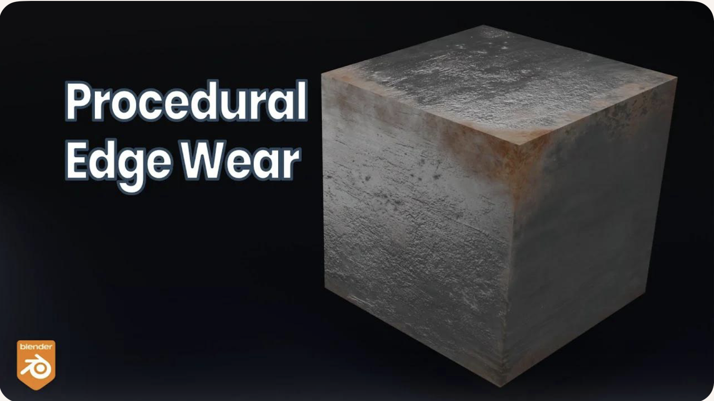

   An example to Rust on Edges Using Shader Nodes [#node-editor-web1]_.

The technique relies on three core ideas:

1. Detecting edges using the *Bevel* or *Pointiness* attribute.
2. Creating a mask that isolates only the worn edges.
3. Blending a rust material with a metal material using that mask.

This workflow is fully procedural and does not require painting or
external textures.

Procedural Edge Wear Node Graph (ASCII Diagram) to create 
:numref:`node_editor_ex1` in video [#node-editor-web1]_ includes 
1. edge detection, 2. mask breakup, 3. material creation, and 4. final blending 
as follows:

::

    +================================================================+
    |                    1.  EDGE DETECTION BLOCK                    |
    |                     (Generating an Edge-Wear Mask)             |
    +================================================================+

       Geometry Node
            |
            |----> Pointiness (Cycles only)
            |
       Bevel Node (Eevee/Cycles)
            Radius = 0.01–0.03
            |
            v
       ColorRamp (Sharpen edge highlight)
            |
            v
       Edge Mask (base convex-edge detection)

    +================================================================+
    |              2. MASK BREAKUP / RANDOMIZATION BLOCK             |
    |               (Refining the Mask With Noise Textures)          |
    +================================================================+

       Noise Texture (Scale 5–15)
            |
            v
       ColorRamp (optional shaping)
            |
            v
       Multiply Node  <---------------- Edge Mask
            |
            v
       ColorRamp (final threshold control)
            |
            v
       Final Edge Wear Mask

    material creation
    +================================================================+
    |                      3. MATERIAL BLOCK                         |
    |                       (Base Material Structure)                |
    +================================================================+

       METAL MATERIAL:
            Principled BSDF
            Metallic = 1.0
            Roughness = 0.2–0.4

       RUST MATERIAL:
            Principled BSDF
            Base Color = orange/brown
            Roughness = 0.7–1.0
            Optional Noise → color variation
            Optional Bump → rust height

    +================================================================+
    |                      4. BLENDING BLOCK                         |
    |                       (Blending Metal and Rust Materials)      |
    +================================================================+

       Metal BSDF ----------------------+
                                        |
                                        v
                                   Mix Shader ----> Material Output
                                        ^
                                        |
       Rust BSDF -----------------------+
                                        |
                                        |
                             Final Edge Wear Mask (Fac)

Code Generation from Node-Editor
^^^^^^^^^^^^^^^^^^^^^^^^^^^^^^^^

Node-based shader editors are visual tools used in modern game engines
and DCC (Digital Content Creation) software. They allow users to build
shaders by connecting nodes instead of writing GLSL, HLSL, or Metal code
manually. These editors **do generate shader code automatically**.

1. Node-Based Editors Do Generate Shader Code

Node-based shader editors such as:

- Unity Shader Graph
- Unreal Engine Material Editor
- Godot Visual Shader Editor
- Blender Shader Nodes (for Eevee/Cycles)

all **compile the visual node graph into real shader code**.

Depending on the engine, the generated code may be:

- GLSL (OpenGL / Vulkan)
- HLSL (DirectX)
- MSL (Metal)
- SPIR-V (Vulkan intermediate format)

The generated code is usually not shown to the user, but it is compiled
and sent to the GPU at runtime.

2. How Users Generate Shader Code with Nodes

The workflow for generating shader code through a node editor typically
looks like this:

1. The user opens the shader editor.
2. The user creates nodes representing:

   - math operations (add, multiply, dot product)
   - texture sampling

     - Determine FS.

   - lighting functions
   - color adjustments
   - UV transformations

3. The user connects nodes visually to define the shader logic.

   - Defines surface color,lighting, and texture sampling → **determine FS**.
   - For simple deformations (waves, wind, dissolve) → **determine the VS**.
   - Generate both **TCS and TES** code for **displacement and subdivision 
     control**.
   - **GS** code is typically **written manually** by  graphics programmers
     since **primitives culling and clipping** are not related with model 
     resolution and texture materials.

4. The engine converts the node graph into an internal shader
   representation.
5. The engine compiles this representation into platform-specific shader
   code (GLSL, HLSL, MSL, or SPIR-V).
6. The compiled shader is sent to the GPU and used for rendering.

The user never writes the shader code directly; the editor generates it
automatically.

3. Who Is the "User" of Node-Based Editors?

The typical users of node-based shader editors are:

**Graphics Designers / Technical Artists**
    - Primary users.
    - They create visual effects, materials, and surface shaders.
    - They usually do not write GLSL or HLSL manually.
    - Node editors allow them to work visually without programming.

**Software Programmers / Graphics Programmers**
    - Secondary users.
    - They may create custom nodes or extend the shader system.
    - They write low-level shader code when needed.
    - They integrate the generated shaders into the rendering pipeline.

In most workflows:

- **Graphics designers** build the shader visually.
- **The engine** generates the shader code.
- **Programmers** handle advanced logic, optimization, or custom nodes.

4. Summary

- Node-based shader editors **do generate shader code** automatically.
- Users generate shaders by connecting visual nodes rather than writing
  GLSL/HLSL manually.
- The primary "user" is the **graphics designer or technical artist**.
- Programmers support the system by writing custom nodes or low-level
  shaders when needed.

The shaders introduction is illustrated in the next section :ref:`opengl`.

3D Modeling Tools
*****************

Every CAD software manufacturer, such as AutoDesk and Blender, has their own
proprietary format. To solve interoperability problems, neutral or open source
formats were created as intermediate formats to convert between proprietary
formats.

Naturally, these neutral formats have become very popular. Two famous examples
are STL (with a `.STL` extension) and COLLADA (with a `.DAE` extension). Below
is a list showing 3D file formats along with their types.

.. table:: 3D file formats [#3dfmt]_

  ==============  ==================
  3D file format  Type
  ==============  ==================
  STL             Neutral
  OBJ             ASCII variant is neutral, binary variant is proprietary
  FBX             Proprietary
  COLLADA         Neutral
  3DS             Proprietary
  IGES            Neutral
  STEP            Neutral
  VRML/X3D        Neutral
  ==============  ==================

The four key features a 3D file can store include the model’s geometry, the 
model’s surface texture, scene details, and animation of the model [#3dfmt]_.

Specifically, they can store details about four key features of a 3D model, 
though it’s worth bearing in mind that you may not always take advantage of 
all four features in all projects, and not all file formats support all four 
features!

3D printer applications do not to support animation. CAD and CAM such as
designing airplane does not need feature of scene details.

DAE (Collada) appeared in the video animation above.
Collada files  belong to a neutral format used heavily in the video game and 
film industries. It’s managed by the non-profit technology consortium, the 
Khronos Group.

The file extension for the Collada format is .dae.
The Collada format stores data using the XML mark-up language.

The original intention behind the Collada format was to become a standard among 
3D file formats. Indeed, in 2013, it was adopted by ISO as a publicly available 
specification, ISO/PAS 17506. As a result, many 3D modeling programs support 
the Collada format.

That said, the consensus is that the Collada format hasn’t kept up with the 
times. It was once used heavily as an interchange format for Autodesk Max/Maya 
in film production, but the industry has now shifted more towards OBJ, FBX, 
and Alembic [#3dfmt]_.

.. _ghast:

Graphics HW and SW Stack
------------------------

This section provides a more detailed illustration of animation accross the 
software and hardware stacks on both CPU and GPU, and explains how data flows 
between the CPU, the GPU, and each layer of the software stack.

In the previous section :ref:`three-d-model`, described what information 3D 
models store and how this information is used to perform animation.

In the incoming section :ref:`sw-stack` will describe **how each frame is 
generated** to display the **movement animation or skinning effects** using the 
small animation parameters stored in 3D model and sent from CPU.

The the incoming section :ref:`Role and Purpose of Shaders <role-shaders>` will
explain different visual effects can be achieved by **switching shaders** to 
shapplying different materials across frames. 

Reference:

- https://en.wikipedia.org/wiki/Free_and_open-source_graphics_device_driver

HW Block Diagram
****************

The block diagram of the Graphic Processing Unit (GPU) is shown in
:numref:`gpu_block_diagram`.

.. _gpu_block_diagram: 
.. figure:: ../Fig/graphics/gpu-block-diagram.png
  :align: center
  :scale: 50 %

  Components of a GPU: GPU has accelerated video decoding and encoding 
  [#wiki-gpu]_

The roles of the CPU and GPU in graphic animation are illustrated in
:numref:`graphic_cpu_gpu`.

.. _graphic_cpu_gpu: 
.. figure:: ../Fig/graphics/graphic-cpu-gpu.png
  :align: center
  :scale: 70 %

  OpenGL and Vulkan are both rendering APIs. In both cases, the GPU executes 
  shaders, while the CPU executes everything else [#ogl-cpu-gpu]_.

- GPU can't directly read user input from, say, keyboard, mouse, gamepad, or 
  play audio, or load files from a hard drive, or anything like that. In this
  situation, cannot let GPU handle the animation work [#cpu-gpu-role]_. 

- A graphics driver consists of an implementation of the OpenGL state machine 
  and a compilation stack to compile the shaders into the GPU's machine language. 
  This compilation, as well as pretty much anything else, is executed on the CPU, 
  then the compiled shaders are sent to the GPU and are executed by it. 
  (SDL = Simple DirectMedia Layer) [#mesawiki]_.

.. _graphic_gpu_csf: 
.. figure:: ../Fig/graphics/graphic-gpu-csf.png
  :align: center
  :scale: 70 %

  MCU and specific HW circuits to speedup the processing of CSF 
  (Command Stream Fronted) [#csf]_.

The GPU driver write command and data from CPU to GPU's system memory through 
PCIe. These commands are called Command Stream Fronted (CSF) in the memory of 
GPU. A chipset of GPU includes tens of SIMD processors (cores). In order to
speedup the GPU driver's processing, the CSF is designed to a simpler form.
As result, GPU chipset include MCU (Micro Chip Unit) and specfic HW to transfer
the CSF into individual data structure for each SIMD processor to execute as 
:numref:`graphic_gpu_csf`. The firmware version of MCU is updated by MCU itself
usually.

.. _sw-stack:

SW Stack and Data Flow
**********************

The driver runs on the CPU side as shown in :numref:`graphic_sw_stack`.  
The OpenGL API eventually calls the driver's functions, and the driver  
executes these functions by issuing commands to the GPU hardware and/or  
sending data to the GPU.  

Even so, the GPU’s rendering work, which uses data such as 3D vertices and  
colors sent from the CPU and stored in GPU or shared memory, consumes  
more computing power than the CPU.

.. _graphic_sw_stack: 
.. graphviz:: ../Fig/graphics/graphic-sw-stack.gv
  :caption: Graphic SW Stack and data flow in initializing graphic model

✅  As section :ref:`animation` and :numref:`graphic_sw_stack`. 
The **game engine’s built‑in C++ renderer handles all OpenGL/Vulkan/Metal 
calls automatically**. 
Users set the value for speed, velocity, ..., etc, customize the animation
logic.

After the user creates a skeleton and textures  
for each model and sets keyframe times using a 3D modeling tool, users can  
write **gameplay scripts** (**Java code**, C#, Blueprints, GDScript, Python, 
etc.) to tell the engine to play animations [#joglwiki]_.

As section :ref:`node-editor`, the skin materials created by Graphics Designers 
/ Technical Artists and secondly created by Software Programmers / Graphics 
Programmers using the tool Node-Editor (shaders generator).
As result, shaders generated from tool Node-Editor (shaders generator).

Shaders may call built-in functions written in Compute Shaders, SPIR-V, or  
LLVM-IR. LLVM `libclc` is a project for OpenCL built-in functions, which can  
also be used in OpenGL [#libclc]_. Like CPU built-ins, new GPU ISAs or  
architectures must implement their own built-ins or port them from open source  
projects like `libclc`.

The 3D model on the CPU performs these animations in movement and others by 
computing each frame from the stored keyframes, as illustrated in animation 
section :ref:`animation`.

.. _graphic_sw_stack-2: 
.. graphviz:: ../Fig/graphics/graphic-sw-stack-2.gv
  :caption: Graphic SW Stack and data flow in rendering

The per-frame data is not the full set of vertices, but rather a small set of
animation parameters named **Uniform Updates** as appeared in 
:numref:`graphic_sw_stack-2`, which are described later.

.. note::

   **Bone matrices** determine the positions of triangles within a 3D model 
   during animation.
   This bone transformation data is much **smaller** than the complete mesh of 
   the 3D model.
   We will provide an example and explain this in more detail in the 
   :ref:`animation-ex` section.
   Because this transformation data is small and constant across all shader 
   pipeline stages, it is stored in the GPU’s global memory and can be cached in 
   the **uniform/constant cache** for performance, as illustrated in 
   :numref:`mem-hierarchy` of :ref:`sec-mem-hierarchy` section.
 
The CPU updates only these small animation parameters and issues draw command to 
the GPU server side. 

.. _in-out-rendering: 
.. graphviz:: ../Fig/graphics/in-out-rendering.gv
  :caption: The input and output for GPU rendering

Next, the 3D Rendering-pipeline is illustrated in :numref:`in-out-rendering`.

The shape of object data are stored in the form of VAOs (Vertex Array Objects) in  
OpenGL. This will be explained in a later :ref:`section OpenGL <opengl>`.
Additionally, OpenGL provides VBOs (Vertex Buffer Objects), which allow  
vertex array data to be stored in high-performance graphics memory on the  
server side GPU and enable efficient data transfer [#vbo]_ [#classorvbo]_.

After GPU receives the **Uniform Updates** from CPU, it performs the 
computationally intensive per‑vertex work within the rendering pipeline to 
generate the **final pixel values** for **each frame** displayed on screen.
These final pixel values are collectively referred to the 
**Rendered Image**.

✅  “**Rendered Image**” = the final per‑frame output written into the 
framebuffer.
The **Uniform Updates** will be described in detail later.

✅ CPU only updates small animation parameters named **Uniform Updates** as
appeared in :numref:`graphic_sw_stack-2`; GPU computes the heavy per‑vertex work.

As mentioned in the previous section on :ref:`animation movement <movement>`, 
3D modeling tools store Keyframes, bone transforms at each keyframe and related 
data, and perform animation based on this information. 

The CPU updates only the **bone** transformation data ..., rather than updating 
the entire vertex or mesh data for each animation frame.
These updates are very small—on the order of kilobytes rather than megabytes.
For each rendered frame, the CPU sends these small updates to the GPU, and the 
**GPU takes over the animation work from the CPU**.
This type of movement animation is called **skinning**, and is illustrated as 
follows:

**Skinning**

Skinning is a vertex deformation technique used to animate a mesh by attaching
its vertices to a hierarchical skeleton (bones). Each vertex stores one or more
bone indices and corresponding weights that describe how strongly each bone
influences that vertex.

During animation, the application updates the bone transformation matrices.
The vertex shader then computes the final vertex position by blending the
transformed positions according to the stored weights. This allows the mesh to
bend, twist, and deform smoothly as the skeleton moves.

Skinning does not create new geometry or smooth the surface topology. It only
transforms the existing vertices of the mesh. Examples include bending an arm,
flapping a wing, or deforming a flexible tube as its bones rotate.

CPU only update high‑level animation state, such as:

-  Current animation time
-  **Bone matrices (small)**
-  **Morph weights**
-  Material parameters
-  Particle emitter settings
-  Global uniforms (camera, lights, etc.)

These are tiny updates — kilobytes, not megabytes.

.. math::

   finalPosition =
   \sum_{i=0}^{N-1}
   \mathbf{weight}_i \left( \mathbf{boneMatrix}_i \cdot originalPosition \right)

In practice (real engines): the weights are normalized so the sum = 1.0 
:math:`\Rightarrow \sum_{i=0}^{N-1}\mathbf{weight}_i = 1.0`

Example: Bending an Arm

Imagine a character’s arm mesh.  
Each vertex in the elbow area has weights like:

-  70% influenced by upper‑arm bone
-  30% influenced by lower‑arm bone

When the elbow bends:

-  Upper‑arm bone rotates
-  Lower‑arm bone rotates
-  GPU blends the influence
-  The elbow area deforms smoothly

This is skinning.

✅  After the GPU animation, the color pixels are write to framebuffer 
(video memory). The display device (monitor, LCD, OLED, etc.) fetches these 
pixels and displays them on the screen. The interface between framebuffer and 
display device is explained in the next section :ref:`display`.

.. _display:

Pixels Displaying
*****************

The interface between frame buffer and displaying device is shown as 
:numref:`pc-lcd`.

.. _pc-lcd: 
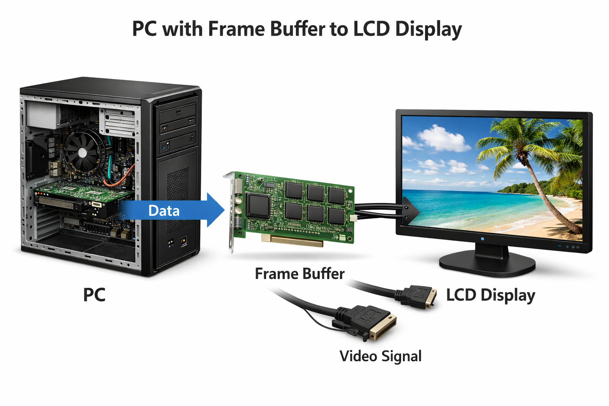

  PC with Frame Buffer to LCD Display

GPU and screen (monitor, LCD, OLED, etc.) use **VSync, NVIDIA G-SYNC or AMD 
FreeSync** to prevent **screen tearing**, as described below:

.. raw:: latex

   \clearpage

.. _db-vsync: 
.. figure:: ../Fig/graphics/db-vsync.png
  :align: center
  :scale: 50 %

  VSync

.. rubric:: VSync
.. code-block:: text

  No tearing occurs when the GPU and display operate at the same refresh rate,  
  since the GPU refreshes faster than the display as shown below.

                A    B

  GPU      | ----| ----|

  Display  |-----|-----|

              B      A

  Tearing occurs when the GPU has exact refresh cycles but VSync takes  
  one more cycle than the display as shown below.

                A

  GPU      | -----|

  Display  |-----|-----|

              B      A

  To avoid tearing, the GPU runs at half the refresh rate of the display,  
  as shown below.

                A          B

  GPU      | -----|    | -----|

  Display  |-----|-----|-----|-----|

              B      B    A     A

- Double Buffering

  While the display is reading from the frame buffer to display the current 
  frame, we might be updating its contents for the next frame (not necessarily 
  in raster-scan manner). This would result in the so-called tearing, in which 
  the screen shows parts of the old frame and parts of the new frame.
  This could be resolved by using so-called double buffering. Instead of using 
  a single frame buffer, modern GPU uses two of them: a front buffer and a back 
  buffer. The display reads from the front buffer, while we can write the next 
  frame to the back buffer. When we finish, we signal to GPU to swap the front 
  and back buffer (known as buffer swap or page flip).

- VSync

  Double buffering alone does not solve the entire problem, as the buffer swap 
  might occur at an inappropriate time, for example, while the display is in 
  the middle of displaying the old frame. This is resolved via the so-called 
  vertical synchronization (or VSync) at the end of the raster-scan. 
  When we signal to the GPU to do a buffer swap, the GPU will wait till the next
  VSync to perform the actual swap, after the entire current frame is displayed.

  As above text digram.
  The most important point is: When the VSync buffer-swap is enabled, you cannot 
  refresh the display faster than the refresh rate of the display!!! 
  If GPU is capable of producing higher frame rates than the display's 
  refresh rate, then GPU can use fast rate without tearing.
  If GPU has same or less frame rates then display's and you application 
  refreshes at a fixed rate, the resultant refresh rate is 
  likely to be an integral factor of the display's refresh rate, i.e., 1/2, 1/3, 
  1/4, etc. Otherwise it will cause tearing [#cg_basictheory]_.

- NVIDIA G-SYNC and AMD FreeSync

  If your monitor and graphics card both in your customer computer support 
  NVIDIA G-SYNC, you’re in luck. With this technology, a special chip in the 
  display communicates with the graphics card. This lets the monitor vary the 
  refresh rate to match the frame rate of the NVIDIA GTX graphics card, up to 
  the maximum refresh rate of the display. This means that the frames are 
  displayed as soon as they are rendered by the GPU, eliminating screen tearing 
  and reducing stutter for when the frame rate is both higher and lower than 
  the refresh rate of the display. This makes it perfect for situations where 
  the frame rate varies, which happens a lot when gaming. 
  Today, you can even find G-SYNC technology in gaming laptops!

  AMD has a similar solution called FreeSync. However, this doesn’t require a 
  proprietary chip in the monitor. 
  In FreeSync, the AMD Radeon driver, and the display firmware handle the 
  communication. 
  Generally, FreeSync monitors are less expensive than their G-SYNC counterparts,
  but gamers generally prefer G-SYNC over FreeSync as the latter may cause 
  ghosting, where old images leave behind artifacts [#g-sync]_.

.. _role-shaders:

The Role and Purpose of Shaders
*******************************

The flow for 3D/2D graphic processing is shown in :numref:`opengl_flow`.

.. _opengl_flow: 
.. graphviz:: ../Fig/graphics/opengl-flow.gv
  :caption: OpenGL Flow

The compiled shaders are sent to the GPU when you call glLinkProgram().  
That is the moment the driver uploads the compiled shader binaries into 
GPU‑executable form.

The glLinkProgram() is called when you finish preparing a shader program — 
**not when creating a mesh, and not when issuing a draw command**.

When a game actually call `glLinkProgram()` to re-link the shader, the shader 
need to be compiled and load to GPU.

Usually it is happend in game startup, level load, or creating a new shader 
variant (e.g., enabling shadows, fog, skinning).

Games switch shaders constantly — sometimes hundreds of times per frame — 
but they do not re‑link them.

When playing a video game, different materials, effects and rendering passes 
will applying to difference shaders.

Examples of switching shaders:

- When the player enters a snowy biome, ice meshes use the ice shader. 
- The axe blade uses a metal PBR shader. 
  Sparks fly when the axe blade hits stone it switch to particle shader.

Basic geometry in computer graphics
-----------------------------------

This section introduces the fundamental geometry mathematics used in computer 
graphics.  
As discussed in the previous sections, 3D animation primarily based on 
geometric representations such as meshes (vertices) and surface discriptions
including textures, materials, shaders, and lighting models created in 3D 
content creation tools.
Consequently, vertex tranformations and lighting-based color computations form 
the mathematical foundation of modern computer graphics and animation.

The complete concept can be found in the book *Computer Graphics: Principles  
and Practice, 3rd Edition*, authored by John F. et al. However, the book  
contains over a thousand pages.

It is very comprehensive and may take considerable time to understand all the  
details.

Color
*****

- Additive colors in light are shown in :numref:`additive-colors`  
  [#additive-colors-wiki]_ [#additive-colors-ytube]_.

- In the case of paints, additive colors produce shades and become light gray  
  due to the addition of darker pigments [#additive-colors-shade]_.

.. _additive-colors: 
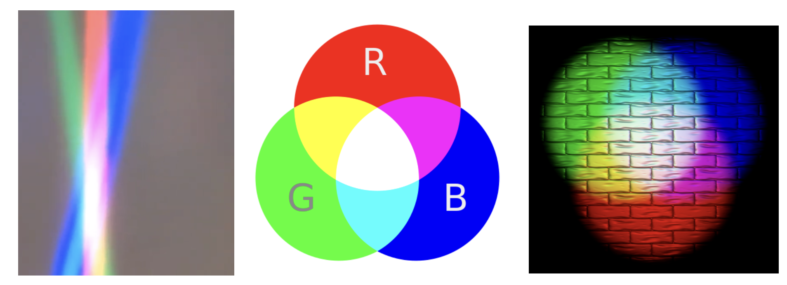

  Additive colors in light

.. note:: **Additive colors**

   I know it doesn't match human intuition. However, additive RGB colors in  
   light combine to produce white light, while additive RGB in paints result in  
   light gray paint. This makes sense because light has no shade. This result  
   stems from the way human eyes perceive color. Without light, no color can be  
   sensed by the eyes.

   Computer engineers should understand that exploring the underlying reasons  
   falls into the realms of physics or the biology of the human eye structure.

.. _transformation:

Transformation
**************

Overview

The tranformation matrices have been taught in high school and college.
However this mathematical details are not always retained clearly in memory.
The following section reviews the parts relevant to graphics rendering.

In both 2D and 3D graphics, every object transformation is performed by
multiplying the object's vertex coordinates by one or more **transformation
matrices**. Modern OpenGL uses **homogeneous coordinates** and **4×4 matrices**
to unify translation, rotation, scaling, projection, and even animation
(skinning) into a single mathematical framework.

A vertex in 3D is represented as:

.. math::

   \mathbf{v} =
   \begin{bmatrix}
   x \\ y \\ z \\ 1
   \end{bmatrix}

A transformation is applied by matrix multiplication:

.. math::

   \mathbf{v}' = M \mathbf{v}

Multiple transformations are combined by multiplying matrices:

.. math::

   \mathbf{v}' = P \, V \, M \, \mathbf{v}

Where:

- ``M`` = Model matrix (object → world)
- ``V`` = View matrix (world → camera)
- ``P`` = Projection matrix (camera → clip space)

This is the core of the OpenGL rendering pipeline, as shown in 
:numref:`trans_steps`.

.. _trans_steps: 
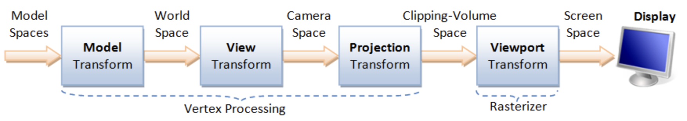

  Cooridinates Transform Pipeline [#cg_basictheory]_

- Model space: The is the vertices position mentioned under :ref:`Root bone in 
  Animation flow <movement>`. All vertex coordinates are calcuated relative to the
  root bone.
- Model Rranform: ``M`` = Model matrix (object → world). This represents the 
  vertex positions mentioned under :ref:`Transform Animation in Animation flow 
  <movement>`.

Details for :numref:`trans_steps` can be found on "4.  Vertex Processing" of 
the website [#cg_basictheory]_.

Transformation Matrices [#wiki-transformation]_

- Translation: Moves an object in 3D space.

  :math:`T(x,y,z)=\begin{bmatrix}1&0&0&x\\0&1&0&y\\0&0&1&z\\0&0&0&1\end{bmatrix}
  \begin{bmatrix}X\\Y\\Z\\1\end{bmatrix}
  =
  \begin{bmatrix}X+x\\Y+y\\Z+z\\1\end{bmatrix}`

- Scaling: Resizes an object.

  :math:`S(s_x,s_y,s_z)=\begin{bmatrix}s_x&0&0&0\\0&s_y&0&0\\0&0&s_z&0\\0&0&0&1\end{bmatrix}
  \begin{bmatrix}X\\Y\\Z\\1\end{bmatrix}
  =
  \begin{bmatrix}s_x X\\s_y Y\\s_z Z\\1\end{bmatrix}`

- Rotation X: Rotates around the X-axis.

  :math:`R_x(\theta)=\begin{bmatrix}1&0&0&0\\0&\cos\theta&-\sin\theta&0\\0&\sin\theta&\cos\theta&0\\0&0&0&1\end{bmatrix}
  \begin{bmatrix}X\\Y\\Z\\1\end{bmatrix}
  =
  \begin{bmatrix}X\\Y\cos\theta - Z\sin\theta\\Y\sin\theta + Z\cos\theta\\1\end{bmatrix}`

- Rotation Y: Rotates around the Y-axis.

  :math:`R_y(\theta)=\begin{bmatrix}\cos\theta&0&\sin\theta&0\\0&1&0&0\\-\sin\theta&0&\cos\theta&0\\0&0&0&1\end{bmatrix}
  \begin{bmatrix}X\\Y\\Z\\1\end{bmatrix}
  =
  \begin{bmatrix}X\cos\theta + Z\sin\theta\\Y\\-X\sin\theta + Z\cos\theta\\1\end{bmatrix}`

- Rotation Z: Rotates around the Z-axis.

  :math:`R_z(\theta)=\begin{bmatrix}\cos\theta&-\sin\theta&0&0\\\sin\theta&\cos\theta&0&0\\0&0&1&0\\0&0&0&1\end{bmatrix}
  \begin{bmatrix}X\\Y\\Z\\1\end{bmatrix}
  =
  \begin{bmatrix}X\cos\theta - Y\sin\theta\\X\sin\theta + Y\cos\theta\\Z\\1\end{bmatrix}`

- Shear in X: - Skews geometry along axis X.
 
  :math:`\text{Shear}_X(a,b)=
  \begin{bmatrix}1&a&b&0\\0&1&0&0\\0&0&1&0\\0&0&0&1\end{bmatrix}
  \begin{bmatrix}X\\Y\\Z\\1\end{bmatrix}
  =
  \begin{bmatrix}X + aY + bZ\\Y\\Z\\1\end{bmatrix}`

- Shear in Y: Skews geometry along axis Y.

  :math:`\text{Shear}_Y(c,d)=
  \begin{bmatrix}1&0&0&0\\c&1&d&0\\0&0&1&0\\0&0&0&1\end{bmatrix}
  \begin{bmatrix}X\\Y\\Z\\1\end{bmatrix}
  =
  \begin{bmatrix}X\\cX + Y + dZ\\Z\\1\end{bmatrix}`

- Shear in Z: Skews geometry along axis Z.

  :math:`\text{Shear}_Z(e,f)=
  \begin{bmatrix}1&0&0&0\\0&1&0&0\\e&f&1&0\\0&0&0&1\end{bmatrix}
  \begin{bmatrix}X\\Y\\Z\\1\end{bmatrix}
  =
  \begin{bmatrix}X\\Y\\eX + fY + Z\\1\end{bmatrix}`

- Reflection: Mirrors across a plane.

  :math:`\text{Reflect}_{XY},\ \text{Reflect}(\mathbf{n})`

The "4.2  Model Transform (or Local Transform, or World Transform)" of on the 
website [#cg_basictheory]_ provides conceptual coverage of transformations.
List the websites that provide proofs of the non-obvious transformation 
formulas below.

**Rotation** 

The mathematical proof is given below.

1. https://en.wikipedia.org/wiki/Rotation_matrix

- Prove the 2D formula and then intutively extend it to 3D along the X, Y, and 
  Z axes [#wiki-rotation]_.

2. Proof in greater details:

https://austinmorlan.com/posts/rotation_matrices/

**Shear (Skew)**

Shear is a skewing transformation as shown in :numref:`shear`.

.. _shear: 
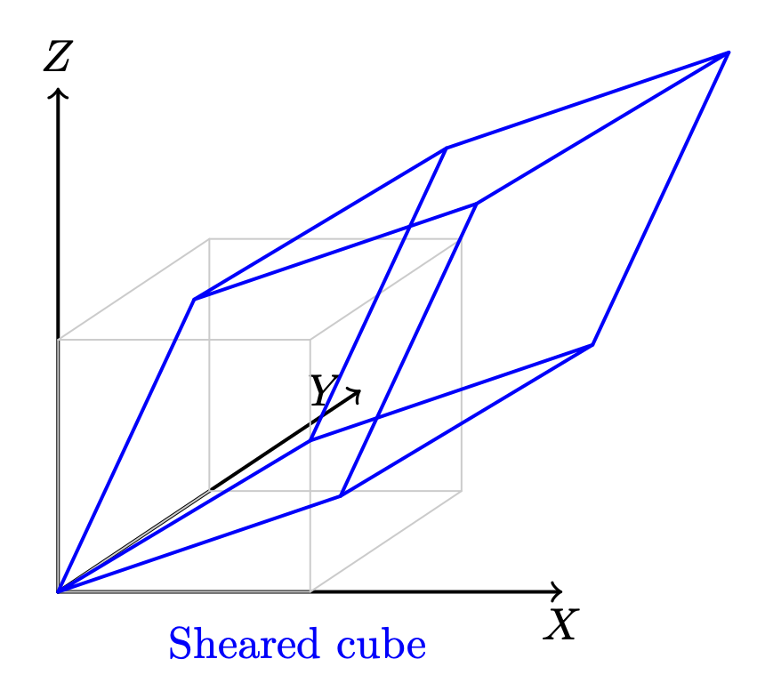

  3D shear

Shear in X:
plane x = 0 (the YZ‑plane), slides points parallel to the X‑axis.

The mathematical proof is given below.

https://en.wikipedia.org/wiki/Shear_mapping

**Reflection**

Reflection is nothing but a mirror image of an object. 

Reflection across the XY-plane:

.. math::

   \text{Reflect}_{XY} =
   \begin{bmatrix}
   1 & 0 & 0 & 0 \\
   0 & 1 & 0 & 0 \\
   0 & 0 & -1 & 0 \\
   0 & 0 & 0 & 1
   \end{bmatrix}

Reflection across an arbitrary plane with unit normal :math:`\mathbf{n}`:

.. math::

   R = I - 2 \mathbf{n}\mathbf{n}^T

The mathematical proof is given below.

https://www.geeksforgeeks.org/computer-graphics/computer-graphics-reflection-transformation-in-3d/

The following Quaternion Product (Hamilton product) is from the wiki  
[#wiki-quaternion]_ since it is not covered in the book.

.. math::

  \mathbf ij = -ji = k, jk = -kj = i, ki = -ik = j.

.. _cross-product:

Cross Product
*************

Todo:

- Computing the direction of the line of intersection between two planes  
  (via :math:`n_1 \mathsf x n_2`)

end-of-Todo

Both triangles and quads are polygons. So, objects can be formed with  
polygons in both 2D and 3D. The transformation in 2D or 3D is well covered in  
almost every computer graphics book. This section introduces the most  
important concept and method for **determining inner and outer planes**. Then,
a **point or object can be checked for visibility** during 2D or 3D rendering.

Any **area** of a polygon can be calculated by dividing it into triangles or  
quads. The area of a triangle or quad can be calculated using the cross  
product in 3D.

✅ The role of cross product:

In 2D geometry mathematics, :math:`v_0, v_1 and v_2` can form the area of a 
parallelogram as shown in :numref:`rectangle-2d`.
The fourth vertex, :math:`\mathbf{v}_3`, can then be determined to complete the 
parallelogram.

.. _rectangle-2d:
.. figure:: ../Fig/graphics/parallelogram-2d.png
   :scale: 100 %

   The area determined by :math:`v_0, v_1, v_2` in 2D

The area of the parallelogram is given by: 

.. math::

  \mathbf a = v_1-v_0, \mathbf b = v_2-v_0

  \Vert \mathbf a \mathsf x \mathbf b \Vert = \Vert a \Vert \Vert b \Vert | 
  sin(\Theta) |

The area of a parallelogram is same in both 2D and 3D.
To extend the definition of the corss product to 3D, all we must additionally 
consider the orientation of the plane, since a plane has two possible faces.

.. math::

  \mathbf a \mathsf x \mathbf b = \Vert a \Vert \Vert b \Vert sin(\Theta) n

- :math:`n` is a unit vector perpendicular to the plane. 
  :math:`\Rightarrow` direction.

As shown in :numref:`parallelogram-3d:left`, the plane determined by 
:math:`v_0, v_1, v_2` with CCW ordering defines a unique orientation. 

The area of the parallelogram remains unchanged after rotation as shown in
:numref:`parallelogram-3d:right`, which means the 
area and plane face determined by extending the definition of cross product from
2D to 3D correctly.

.. list-table::
   :widths: 50 50
   :align: center

   * - .. _parallelogram-3d:left:
       .. figure:: ../Fig/graphics/parallelogram-3d.png
          :scale: 100 %

          The area and plane face determined by :math:`v_0, v_1, v_2` with CCW 
          ordering before rotation :math:`z` axis.

     - .. _parallelogram-3d:right: 
       .. figure:: ../Fig/graphics/parallelogram-3d-2.png
          :scale: 100 %

          The area and plane face determined by :math:`v_0, v_1, v_2` with CCW 
          ordering after rotation :math:`z` axis.

.. _triangle-area:

The area of the triangle is obtained by dividing the parallelogram by 2:

.. math::

  \frac{1}{2} \Vert \mathbf a \mathsf x \mathbf b \Vert \quad \text{... 
  (triangle area)}

✅ Matrix Notation for Cross Product:

The cross product in **2D** is defined by a formula and can be represented  
with matrix notation, as proven here  
[#cross-product-2d-proof]_ [#cross-product-2d-proof2]_.

The cross product in **2D** is defined by a formula and can be represented  
with matrix notation, as proven here  
[#cross-product-2d-proof]_ [#cross-product-2d-proof2]_.

.. math::

  \mathbf a \mathsf x \mathbf b = \Vert a \Vert \Vert b \Vert sin(\Theta)

.. math::

  \mathbf a \mathsf x \mathbf b = 
  \begin{vmatrix}
  \mathbf i & \mathbf j& \mathbf k\\ 
  a_1& a_2& 0\\ 
  b_1& b_2& 0 
  \end{vmatrix} =
  \begin{bmatrix}
  a_1& a_2 \\
  b_1& b_2
  \end{bmatrix}

After the above matrix form is proven, the antisymmetry property  
may be demonstrated as follows:

.. math::

  a \mathsf x b = \mathsf x&
  \begin{bmatrix}
  a \\ 
  b 
  \end{bmatrix} =
  \begin{bmatrix}
  a_1& a_2 \\ 
  b_1& b_2 
  \end{bmatrix} =
  a_1b_2 - a_2b_1 = 

.. math::

  -b_1a_2 - (-b_2a_1) = 
  \begin{bmatrix}
  - b_1& - b_2 \\ 
  a_1& a_2 
  \end{bmatrix} =
  \mathsf x&
  \begin{bmatrix}
  -b \\ 
  a 
  \end{bmatrix} =
  -b \mathsf x a 

✅ Determine the area in a plane:

As described earlier of in this section, three vertices form a parallelogram or
triangle and the area in the plane can be determined since the angle between
:math:`v_1 - v_0` and :math:`v_2 - v_1` satisfied :math:`0 < \Theta < 180^\circ` 
under CCW orientation.
In fact **one single vector :math:`v_1 - v_0` is sufficient** to determine the 
area.
We describle this below.

In 2D, any two points :math:`\text{from } P_i \text{ to } P_{i+1}` can form a  
vector and determine the inner or outer side.  

For example, as shown in :numref:`inward-edge-normals`, :math:`\Theta` is the  
angle from :math:`P_iP_{i+1}` to :math:`P_iP'_{i+1} = 180^\circ`.  

Using the right-hand rule and counter-clockwise order, any vector  
:math:`P_iQ` between :math:`P_iP_{i+1}` and :math:`P_iP'_{i+1}`, with angle  
:math:`\theta` such that :math:`0^\circ < \theta < 180^\circ`, indicates the  
inward direction.

.. _inward-edge-normals: 
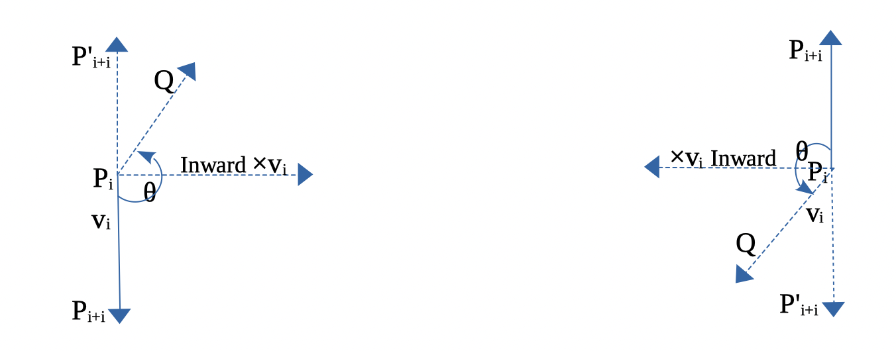

  Inward edge normals

.. _2d-vector-inward: 
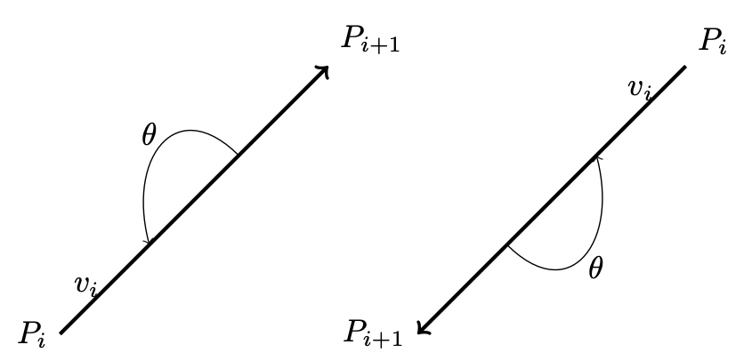

  Inward and outward in 2D for a vector.

Based on this observation, the rule for inward and outward vectors is shown in  
:numref:`inward-edge-normals`. Facing the same direction as a specific vector,  
the left side is inward and the right side is outward, as shown in  
:numref:`2d-vector-inward`.

For each edge :math:`P_i - P_{i+1}`, the inward edge normal is the vector  
:math:`\mathsf{x} \; v_i`; the outward edge normal is  
:math:`- \; \mathsf{x} \; v_i`, where :math:`\mathsf{x} \; v_i` is the  
cross-product of :math:`v_i`, as shown in :numref:`inward-edge-normals`.

A polygon can be created from a set of vertices. Suppose  
:math:`(P_0, P_1, ..., P_n)` defines a polygon. The line segments  
:math:`P_0P_1, P_1P_2`, etc., are the polygon’s edges. The vectors  
:math:`v_0 = P_1 - P_0, v_1 = P_2 - P_1, ..., v_n = P_0 - P_n` represent those  
edges.

Using counter-clockwise ordering, the left side is considered inward. 
Thus, the inward region of a polygon can be determined, as shown in 
:numref:`convex:left` and :numref:`convex:middle`.

.. list-table::
   :widths: 33 34 33
   :align: center

   * - .. _convex:left:
       .. figure:: ../Fig/graphics/triangle-ccw.png
          :scale: 50 %

          Triangle with CCW

     - .. _convex:middle: 
       .. figure:: ../Fig/graphics/hexagon-ccw.png
          :scale: 30 %

          Hexagon with CCW

     - .. _convex:right:
       .. figure:: ../Fig/graphics/triangle-cw.png
          :scale: 50 %

          Triangle with CW

For a convex polygon with vertices listed in counter-clockwise order, the  
inward edge normals point toward the interior of the polygon, and the outward  
edge normals point toward the unbounded exterior. This matches our usual  
intuition.

However, if the polygon vertices are listed in clockwise (CW) order, the interior  
and exterior definitions are reversed. :numref:`convex:right` shows an example
where :math:`P_0, P_1, P_2` are arranged in CW order.

This cross product has an important property: going from :math:`v` to  
:math:`\times v` involves a 90° rotation in the same direction as the  
rotation from the positive x-axis to the positive y-axis.

.. _in-polygon: 
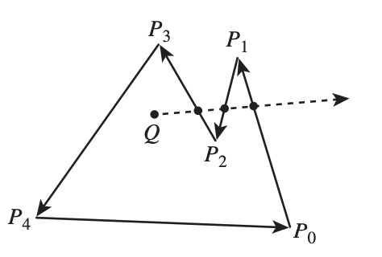

  Draw a polygon with vectices counter clockwise

As shown in :numref:`in-polygon`, when drawing a polygon with vectors (lines)  
in counter-clockwise order, the polygon will be formed, and the two sides of  
each vector (line) can be identified [#cgpap]_.

Furthermore, whether a point is inside or outside the polygon can be  
determined.

One simple method to test whether a point lies inside or outside a simple  
polygon is to cast a ray from the point in any fixed direction and count how  
many times it intersects the edges of the polygon.

If the point is outside the polygon, the ray will intersect its edges an even  
number of times. If the point is inside the polygon, it will intersect the  
edges an odd number of times [#wiki-point-in-polygon]_.

.. _3d-cross-product: 
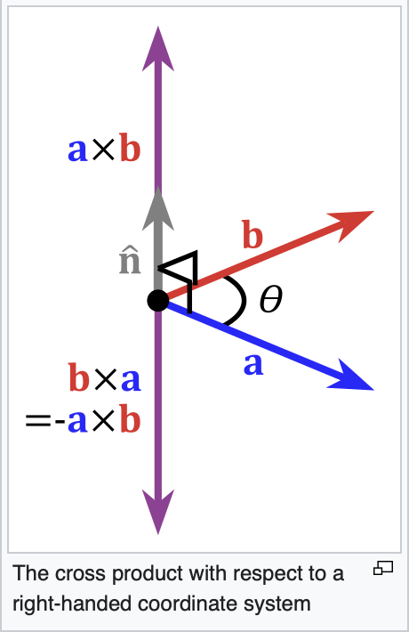

  Cross product definition in 3D

In the same way, by following the counter-clockwise direction to create a  
2D polygon step by step, a 3D polygon can be constructed.

As shown in :numref:`3d-cross-product` from the wiki  
[#cross-product-wiki]_, the inward direction is determined by  
:math:`a \times b < 0`, and the outward direction is determined by  
:math:`a \times b > 0` in OpenGL.

Replacing :math:`a` and :math:`b` with :math:`x` and :math:`y`, as shown in  
:numref:`ogl-pointing-outwards`, the positive Z-axis (:math:`z+`) represents  
the outer surface, while the negative Z-axis (:math:`z-`) represents the  
inner surface [#ogl-point-outwards]_.

.. _ogl-pointing-outwards: 
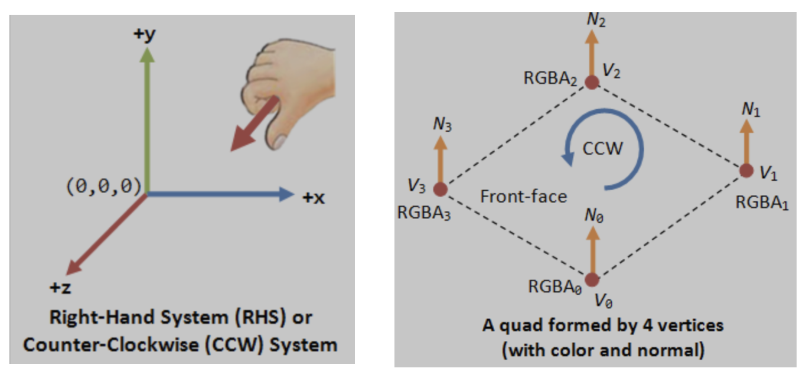

  OpenGL pointing outwards, indicating the outer surface (z axis is +)

.. _in-3d-polygon: 
.. figure:: ../Fig/graphics/3d-polygon.png
  :align: center
  :scale: 50 %

  3D polygon with directions on each plane

Reposition each triangle in front of camera and construct it using triangle 
with CCW ordering, as shown in :numref:`convex:left`.
By building every triangle with CCW ordering, we can defined a consistent outer 
surface (front face).
The :numref:`in-3d-polygon` shows an example of a 3D polygon created from 2D  
triangles. The direction of the plane (triangle) is given by the line  
perpendicular to the plane.

Cast a ray from the 3D point along the X-axis and count how many intersections  
with the outer object occur. Depending on the number of intersections along  
each axis (even or odd), you can understan if **the point (or the camara) is i
nside or outside** [#point-in-3d-object]_.

An odd number means inside, and an even number means outside. As shown in  
:numref:`in-3d-object`, points on the line passing through the object satisfy  
this rule.

.. _in-3d-object: 
.. figure:: ../Fig/graphics/in-3d-object.png
  :align: center
  :scale: 50 %

  Point is inside or outside of 3D object

✅ Summary:

Based on these description of this section, this means:

✔️  Each mesh (triangle or primitive) has a fixed “outer” and “inner” side,
determined by CCW ordering in object space.

✔️  By reading these CCW-ordered vertices sequentially, the shape and surface 
orientation of the 3D model can be constructed.

✔️  There is no need to wait for the entire mesh to be received; once three 
CCW-ordered vertices are available, each triangle can be processed correctly
as shown in :numref:`construct-triangle` from the camera position :math:`p_0`.

.. _construct-triangle: 
.. figure:: ../Fig/graphics/construct-triangle.png
  :align: center
  :scale: 25 %

  A triangle can be constructed as soon as three vertices are received

✔️  When the camera moves to the :math:`p_1` inside an object: CCW ↔ CW 
flips as shown in :numref:`construct-triangle`.

✔️  As shown in :ref:`Trangle Area Calculation <triangle-area>` when
:math:`0 < \Theta < 180^\circ` under CCW orientation, the area of a triangle 
area is given by:

.. math::

   \frac{1}{2} \mathbf \Vert (v_1-v_0) \mathsf x \mathbf (v_2-v_0) \Vert =
   \frac{1}{2} \Vert (v_1-v_0) \Vert \Vert (v_2-v_0) \Vert sin(\Theta)

✔️  Though each triangle can be correctly identified and processed using its
CCW ordering.
As mentioned in :numref:`trans_steps` of section :ref:`transformation`,
the Cooridinates Transform Pipeline maps geometry from Camera Space to 
Clipping Space (Clipping Volume). 
This tranformation significantly simplifies the calculation required
for discarding and clipping triangles, as will be desribed in the next
section :ref:`projection`.

How does OpenGL render (draw) the inner face of a triangle?

OpenGL does NOT determine front/back in world space.

When the camera moves to the inner space of a object:

-  The projection changes
-  The triangle’s screen‑space orientation changes
-  CCW ↔ CW flips
-  So the GPU flips front/back classification

.. rubric:: OpenGL uses counter clockwise and pointing outwards as default [#vbo]_.
.. code-block:: c++

  // unit cube      
  // A cube has 6 sides and each side has 4 vertices, therefore, the total number
  // of vertices is 24 (6 sides * 4 verts), and 72 floats in the vertex array
  // since each vertex has 3 components (x,y,z) (= 24 * 3)
  //    v6----- v5  
  //   /|      /|   
  //  v1------v0|   
  //  | |     | |   
  //  | v7----|-v4  
  //  |/      |/    
  //  v2------v3    

  // vertex position array
  GLfloat vertices[]  = {
     .5f, .5f, .5f,  -.5f, .5f, .5f,  -.5f,-.5f, .5f,  .5f,-.5f, .5f, // v0,v1,v2,v3 (front)
     .5f, .5f, .5f,   .5f,-.5f, .5f,   .5f,-.5f,-.5f,  .5f, .5f,-.5f, // v0,v3,v4,v5 (right)
     .5f, .5f, .5f,   .5f, .5f,-.5f,  -.5f, .5f,-.5f, -.5f, .5f, .5f, // v0,v5,v6,v1 (top)
    -.5f, .5f, .5f,  -.5f, .5f,-.5f,  -.5f,-.5f,-.5f, -.5f,-.5f, .5f, // v1,v6,v7,v2 (left)
    -.5f,-.5f,-.5f,   .5f,-.5f,-.5f,   .5f,-.5f, .5f, -.5f,-.5f, .5f, // v7,v4,v3,v2 (bottom)
     .5f,-.5f,-.5f,  -.5f,-.5f,-.5f,  -.5f, .5f,-.5f,  .5f, .5f,-.5f  // v4,v7,v6,v5 (back)
  };

From the code above, we can see that OpenGL uses counter-clockwise and  
pointing outwards as the default. However, OpenGL provides  
``glFrontFace(GL_CW)`` for clockwise winding [#ogl_frontface]_.

For a group of objects, a scene graph provides better animation support and  
saves memory [#scene-graph-wiki]_.

.. _dot-product:

Dot Product
***********

Dot Product

- Ray–plane (line–plane) intersection
- Determining angles between vectors
- Lighting (Lambertian shading)
- Solving for a point on the intersection line of two planes  
  (because plane equations use dot products)

Described in wiki here:

https://en.wikipedia.org/wiki/Dot_product

✅ As described in the previous section :ref:`cross-product`,
the cross-product is:

.. math::

  \mathbf a = v_1-v_0, \mathbf b = v_2-v_0

  \mathbf a \mathsf x \mathbf b = \Vert a \Vert \Vert b \Vert sin(\Theta) n

- :math:`n` is a unit vector perpendicular to the plane 
  :math:`\Rightarrow` direction.

The dot product definition is:

.. math::

  \mathbf a \mathsf \cdot \mathbf b = \Vert a \Vert \Vert b \Vert cos(\Theta)

✅ Since :math:`n` is the outward normal vector for a CCW-ordered triangle, we 
have:

- :math:`(\mathbf p - v_0) \mathsf \cdot \mathbf n > 0 \Rightarrow \mathbf p` 
  lies on the front (outer) side of the plane.

- :math:`(\mathbf p - v_0) \mathsf \cdot \mathbf n = 0 \Rightarrow \mathbf p` 
  lies on the plane. 

- :math:`(\mathbf p - v_0) \mathsf \cdot \mathbf n < 0 \Rightarrow \mathbf p` 
  lies on the back (inner) side of the plane.

✅ A plane is represented by:

.. math::

   \mathbf{n} \cdot (\mathbf{x}_1 - \mathbf{x}_0) = 0

where:

- :math:`n` is the plane’s normal vector
- :math:`x_0, x_1` are any points on the plane

.. math::

   \mathbf{n} \cdot (\mathbf{x}_1 - \mathbf{x}_0) = 0

   \Rightarrow \mathbf{n} \cdot \mathbf{x}_1 - \mathbf{n} \cdot \mathbf{x}_0 = 0

   \Rightarrow \mathbf{n} \cdot \mathbf{x}_1 = \mathbf{n} \cdot \mathbf{x}_0

Let's define the scalar constant :math:`d` by:

.. math::

   d = -\,\mathbf{n} \cdot \mathbf{x}_0

Thus, the set of all points :math:`\mathbf{p}` satisfying

.. math::

   \mathbf{n} \cdot \mathbf{p} + d = 0

✅ Ray–plane (line–plane) intersection

For an edge between vertices :math:`\mathbf{p}_0` and :math:`\mathbf{p}_1`,
parameterized as:

.. math::

   \mathbf{p}(t) = \mathbf{p}_0 + t(\mathbf{p}_1 - \mathbf{p}_0)

the intersection with a clipping plane is found by solving:

.. math::

   \mathbf{n} \cdot \mathbf{p}(t) + d = 0

This yields:

.. math::

   t = \frac{- (\mathbf{n} \cdot \mathbf{p}_0 + d)}
   {\mathbf{n} \cdot (\mathbf{p}_1 - \mathbf{p}_0)}

.. _projection:

Projection
**********

.. _ViewFrustum: 
.. figure:: ../Fig/graphics/ViewFrustum.png
  :align: center
  :scale: 15 %

  Clipping-Volume Cuboid

Only objects within the cone between near and far planes are projected to 2D  
in perspective projection.

Perspective and orthographic projections (used in CAD tools) from 3D to 2D  
can be represented by transformation matrices as described in wiki here 
[#wiki-prospective-projection]_.

The "4.4  Projection Transform - Perspective Projection"  of on the
website [#cg_basictheory]_ provides conceptual coverage of projections.

**Camera Space Setup**

Assume a right-handed camera coordinate system as shown in :numref:`ViewFrustum`:

* The camera is located at the origin.
* The camera looks down the negative :math:`z` axis.
* The near plane is located at :math:`z = -n`.
* The far plane is located at :math:`z = -f`.
* The view frustum bounds on the near plane are:
  
  * left: :math:`l`
  * right: :math:`r`
  * bottom: :math:`b`
  * top: :math:`t`

A point in camera space is represented as:

.. math::

   (x, y, z, 1), \quad z < 0

The position on the near plane is:

.. math::

   (x_n, y_n, -n) \quad with \quad x_n = \frac{n}{-z}x, \quad \frac{n}{-z}y

✅ Reason:

As described in the previous section :ref:`cross-product`,
each mesh (triangle or primitive) has a fixed “outer” and “inner” side, 
determined by CCW ordering in object space.
By reading these CCW-ordered vertices sequentially, the shape and surface 
orientation of the 3D model can be constructed, and hidden primitives
can be clipped or discarded.

However primitive clipping and discarding can be performed much
more efficiently by mapping the view frustum to **clip space**, where the GPU 
can **easily clip or discard primitives**, as shown :numref:`trans_steps_2` 
from the earlier section :ref:`transformation` again for clarity. 
Performing clipping and discarding in **world space** would be significantly 
more **difficult**.

.. _trans_steps_2: 

  Cooridinates Transform Pipeline [#cg_basictheory]_

Perspective projection :math:`P_{\text{persp}}` (general form): 
Converts 3D → clip space with depth

.. math::

   P =
   \begin{bmatrix}
   \frac{2n}{r-l} & 0 & \frac{r+l}{r-l} & 0 \\
   0 & \frac{2n}{t-b} & \frac{t+b}{t-b} & 0 \\
   0 & 0 & -\frac{f+n}{f-n} & -\frac{2fn}{f-n} \\
   0 & 0 & -1 & 1
   \end{bmatrix}

by a homogeneous point

.. math::

   \mathbf{p} =
   \begin{bmatrix} x \\ y \\ z \\ 1 \end{bmatrix}

Converting from camera space to cliping space produces a
homogeneous coordinate of the form :math:`[x, y, z, w_c]`:

.. math::

   P \mathbf{p} =
   \begin{bmatrix}
   \frac{2n}{r-l} x + \frac{r+l}{r-l} z \\
   \frac{2n}{t-b} y + \frac{t+b}{t-b} z \\
   -\frac{f+n}{f-n} z - \frac{2fn}{f-n} \\
   -z
   \end{bmatrix}
   =
   \begin{bmatrix} x_c \\ y_c \\ z_c \\ w_c \end{bmatrix}

After transforming to **ciip space**, each vertex corrodinate is expressed in 
**homogeneous** form, and the **view frustum boundaries are encoded in the 
coordinate values**.
A vertex lies inside the view frustum if the following conditions are satisfied:

.. math::

   -w_c \le x_c \le w_c \
   -w_c \le y_c \le w_c \
   -w_c \le z_c \le w_c

The **near plane** is located at :math:`z = -n`. 
When :math:`w_c = -n`, the geometry is mapped to the normalized device 
coordinates (NDC) on the **screen**.

After **perspective division** ---- that is, dividing clip-space coordinates by 
:math:`w_c = -n` ---- the resulting NDC are:

.. math::

   w_c = -z

   x_{ndc} = \frac{x_c}{w_c} = 
      \frac{\frac{2n}{r-l} x + \frac{r+l}{r-l} z}{-z}
      = \frac{2n}{r-l} \frac{x}{-z} + \frac{r+l}{r-l}, 

   \quad
   y_{ndc} = \frac{y_c}{w_c} = 
      \frac{\frac{2n}{t-b} y + \frac{t+b}{t-b} z}{-z}
      = \frac{2n}{t-b} \frac{y}{-z} + \frac{t+b}{t-b}, 

   \quad
   z_{ndc} = \frac{z_c}{w_c} =
      \frac{-\frac{f+n}{f-n} z - \frac{2fn}{f-n}}{-z}
      = \frac{f+n}{f-n} + \frac{2fn}{(f-n) z}

This matrix maps the view frustum in camera space to the normalized cube
in NDC after homogeneous division.

✅ Comparsion for clipping and discarding in World Space and Clipping Space

When a triangle intersects the view frustum, it must be clipped so that only the
portion inside the frustum is rasterized. Although the clipping procedure is
conceptually similar in world space and clip space, the mathematical complexity
differs significantly. Clipping and discarding in clip space will saves **85%** 
in instructions.

**1A. Discarding in world space**:

As described in the section :ref:`dot-product`:

The definition of Dot Product is:

.. math::

  \mathbf a = v_1-v_0, \mathbf b = v_2-v_0

  \mathbf a \mathsf \cdot \mathbf b = \Vert a \Vert \Vert b \Vert cos(\Theta)

When :math:`(\mathbf p - v_0) \mathsf \cdot \mathbf n < 0 \Rightarrow \mathbf p` 
lies on the back (inner) side of the plane.

For the ray–plane (line–plane) 
intersection, the :math:`d_i` can be obtained by choosing any point 
:math:`\mathbf{p}_0` on the plane with normal vector :math:`\mathbf{n}_i`.

.. math::

   d_i = -\,\mathbf{n}_i \cdot \mathbf{p}_0

In world (or view) space, the view frustum is bounded by six arbitrary planes,
each defined by a normal vector :math:`\mathbf{n}` and distance :math:`d`.

For each vertex :math:`\mathbf{p}`, discarding requires testing against all
planes:

.. math::

   (\mathbf p - p_0) \mathsf \cdot \mathbf n_i < 0 

   \Rightarrow 
   \mathbf{n}_i \cdot \mathbf{p} + d_i < 0
   \quad \text{for any } i \in [1,6]

Cost per vertex

  - 6 dot products (each ≈ 3 multiplications + 2 additions)
  - 6 additions with plane constants
  - 6 comparisons

Approximate arithmetic cost:

  - 18 multiplications
  - 18 additions
  - 6 comparisons

**1B. Discarding in clip space**:

In clip space, vertices are represented in homogeneous coordinates
:math:`(x_c, y_c, z_c, w_c)`.
The view frustum becomes an axis-aligned volume defined by:

.. math::

   -w_c \le x_c \le w_c \
   -w_c \le y_c \le w_c \
   -w_c \le z_c \le w_c

Approximate arithmetic cost:

  - 6 comparisons

Overall arithmetic instruction reduction **85% ~ 95%**.

**2A. Clipping in World Space**:

Edge–plane intersection

As described in the section :ref:`dot-product`, the ray–plane (line–plane) 
intersection can be derived as follows:

.. math::

   t = \frac{- (\mathbf{n} \cdot \mathbf{p}_0 + d)}
   {\mathbf{n} \cdot (\mathbf{p}_1 - \mathbf{p}_0)}

Each frustum plane requires a separate equation and dot-product evaluation.

Triangle reconstruction

After computing all intersection points:

  - New vertices are inserted along intersecting edges
  - The original triangle is split into one or more triangles
  - Perspective projection is applied afterward

Care must be taken to preserve perspective correctness during interpolation.

**2B. Clipping in Clip Space**:

Edge–plane intersection

Edges are interpolated linearly in homogeneous space:

.. math::

   \mathbf{v}(t) = \mathbf{v}_0 + t(\mathbf{v}_1 - \mathbf{v}_0)

Intersection with a clipping boundary is found by solving equations such as:

.. math::

   x(t) = \pm w(t), \quad y(t) = \pm w(t), \quad z(t) = \pm w(t)

Each case reduces to a single scalar equation for :math:`t`.

.. math::

   x(t) = x_0 + t(x_1 - x_0) \
   w(t) = w_0 + t(w_1 - w_0)

   x(t) = w(t) \rightarrow

   x_0 + t(x_1 - x_0) = w_0 + t(w_1 - w_0)

   x_0 - w_0 = t \bigl[(w_1 - w_0) - (x_1 - x_0)\bigr]

   t = \frac{x_0 - w_0}{(x_0 - w_0) - (x_1 - w_1)}

Compare :math:`t = \frac{x_0 - w_0}{(x_0 - w_0) - (x_1 - w_1)}` and the 
equation from world space :math:`t = \frac{- (\mathbf{n} \cdot \mathbf{p}_0 
+ d)}{\mathbf{n} \cdot (\mathbf{p}_1 - \mathbf{p}_0)}`, it saves **85%** for 
reducing two dot operations and more opertions.

Triangle reconstruction

After clipping:

  - New vertices remain in homogeneous coordinates
  - Perspective division is deferred
  - Linear interpolation remains perspective-correct

The final step applies the perspective divide:

.. math::

   (x_c, y_c, z_c, w_c) \rightarrow
   \left( \frac{x_c}{w_c}, \frac{y_c}{w_c}, \frac{z_c}{w_c} \right)

4.3 Comparison and Practical Implications

  - World-space clipping and discarding uses general plane equations and 
    complex geometry.
  - Clip-space clipping and discarding uses axis-aligned bounds and simple 
    interpolation.
  - Perspective correctness is naturally preserved in clip space.
  - GPU hardware can implement clip-space clipping and discarding efficiently.

For these reasons, modern graphics pipelines perform triangle clipping and 
discarding in clip space, not in world space.

✅ Perspective Projection Matrix Derivation

This section derives the perspective projection matrix by mapping a view
frustum in camera space to Normalized Device Coordinates (NDC).

A vertex is kept
only if it satisfies the following inequalities:

.. math::

   -w_c \le x_c \le w_c

.. math::

   -w_c \le y_c \le w_c

.. math::

   -w_c \le z_c \le w_c

These inequalities define the **view frustum in homogeneous coordinates**.

If a vertex violates any of these conditions, it lies outside the view
frustum (left, right, top, bottom, near, or far plane) and is clipped or
discarded.

The goal is to map this frustum to Normalized Device Coordinates (NDC):

.. math::

   x_{ndc}, y_{ndc}, z_{ndc} \in [-1, 1]

**Homogeneous Perspective Divide**

After projection, homogeneous division is applied:

.. math::

   x_{ndc} = \frac{x_c}{w_c}, \quad
   y_{ndc} = \frac{y_c}{w_c}, \quad
   z_{ndc} = \frac{z_c}{w_c}

To achieve perspective foreshortening, the homogeneous coordinate must satisfy:

.. math::

   w_c = -z

This requirement determines the last row of the projection matrix.

**X Coordinate Mapping**

.. math::

   A_x = \frac{2}{r-l}, \quad
   B_x = -\frac{r+l}{r-l}

By similar triangles, the projected x-coordinate on the near plane is:

.. math::

   x_n = \frac{n}{-z} x

The near-plane bounds map to NDC as follows:

.. math::

   x = l \Rightarrow x_{ndc} = -1
   \qquad
   x = r \Rightarrow x_{ndc} = +1

Assume a linear mapping:

.. math::

   x_{ndc} = A_x x_n + B_x

Applying the near constraints: substituting :math:`x_n = l\ and\ x_{ndc} = -1`:

.. math::

   -1 = A_x l + B_x
   \qquad ...(1)

Applying the far constraints: substituting :math:`x_n = r\ and\ x_{ndc} = 1`:

.. math::

   1 = A_x r + B_x
   \qquad ...(2)

Solving equations (1) and (2) to get :math:`A_x`:

.. math::

  2 = A_x (r-l) \Rightarrow A_x = \frac{2}{r-l} 
  \qquad ...(3)

Substituting equation (3) to (2):

.. math::

  1 = A_x r + B_x \Rightarrow 1 = \frac{2}{r-l}r + B_x 
  \Rightarrow B_x = \frac{r-l-2r}{r-1} = -\frac{r+l}{r-l} \qquad ...(4)

From (3) and (4):
Solving for :math:`A_x` and :math:`B_x` yields:

.. math::

   A_x = \frac{2}{r-l}, \quad
   B_x = -\frac{r+l}{r-l}

Substituting :math:`x_n` gives the resulting mapping is:

.. math::

   x_{ndc}
   = \frac{2n}{r-l} \frac{x}{-z}
     + \frac{r+l}{r-l}

**Y Coordinate Mapping**:

Using the same derivation for the y-axis:

.. math::

   y_n = \frac{n}{-z} y

The resulting mapping is:

.. math::

   A_y = \frac{2}{t-b}, \quad
   B_y = -\frac{t+b}{t-b}

   y_{ndc}
   = \frac{2n}{t-b} \frac{y}{-z}
     + \frac{t+b}{t-b}

**Z Coordinate Mapping**

Depth is mapped linearly such that:

.. math::

   z = -n \Rightarrow z_{ndc} = -1
   \qquad
   z = -f \Rightarrow z_{ndc} = +1

Assume:

.. math::

   z_c = A_z z + B_z

Then:

.. math::

   z_{ndc} = \frac{A_z z + B_z}{-z}

Applying the near constraints: substituting :math:`z = -n\ and\ z_{ndc} = -1`:

.. math::

   -1 = \frac{A_z(-n) + B_z}{-(-n)} \Rightarrow -n = {A_z(-n) + B_z} 
   \qquad ...(1)

Applying the far constraints: substituting :math:`z = -f\ and\ z_{ndc} = 1`:

.. math::

   1 = \frac{A_z(-f) + B_z}{-(-f)} \Rightarrow  f = {A_z(-f) + B_z} 
   \qquad ...(2)

Solving equations (1) and (2) to get :math:`A_z`:

.. math::

  -n-f = {A_z(-n+f)} \Rightarrow {A_z} = \frac{-n-f}{-n+f} = -\frac{f+n}{f-n}
  \qquad ...(3)

Substituting equation (3) to (2):

.. math::

  f = {A_z(-f) + B_z} \Rightarrow f = {-\frac{f+n}{f-n}(-f) + B_z} 

  \Rightarrow {B_z} = f+\frac{f+n}{f-n}(-f) = \frac{(f^2-fn)+(-f^2-fn)}{f-n} = 
  -\frac{2fn}{f-n} \qquad ...(4)

From (3) and (4):

.. math::

   A_z = -\frac{f+n}{f-n}, \quad
   B_z = -\frac{2fn}{f-n}

**Perspective Projection Matrix**

Combining all components, the perspective projection matrix is:

.. math::

   P =
   \begin{bmatrix}
   \frac{2n}{r-l} & 0 & \frac{r+l}{r-l} & 0 \\
   0 & \frac{2n}{t-b} & \frac{t+b}{t-b} & 0 \\
   0 & 0 & -\frac{f+n}{f-n} & -\frac{2fn}{f-n} \\
   0 & 0 & -1 & 0
   \end{bmatrix}

Projection: The explanation and mathematical proof is given below also.

https://www.cse.unr.edu/~bebis/CS791E/Notes/PerspectiveProjection.pdf?copilot_analytics_metadata=eyJldmVudEluZm9fY2xpY2tTb3VyY2UiOiJjaXRhdGlvbkxpbmsiLCJldmVudEluZm9fbWVzc2FnZUlkIjoiY21HdnpMWDdSd3lxeFdzWjJWVUNxIiwiZXZlbnRJbmZvX2NvbnZlcnNhdGlvbklkIjoiOUNxcXFVdDhhRnBCbVFrS3RWTXNKIiwiZXZlbnRJbmZvX2NsaWNrRGVzdGluYXRpb24iOiJodHRwczpcL1wvd3d3LmNzZS51bnIuZWR1XC9+YmViaXNcL0NTNzkxRVwvTm90ZXNcL1BlcnNwZWN0aXZlUHJvamVjdGlvbi5wZGYifQ%3D%3D

Reference:

1. Every computer graphics book covers the topic of transformation of objects 
and
their positions in space. Chapter 4 of the *Blue Book: OpenGL SuperBible, 7th  
Edition* provides a concise yet useful 40-page overview of transformation 
concepts and is good material for gaining a deeper understanding of transformations.
description of transformation.

2. Chapter 7 of Red book covers the tranformations and projections.

3. https://en.wikipedia.org/wiki/3D_projection

- https://registry.khronos.org/OpenGL-Refpages/

- https://www.mesa3d.org

- https://www.opengl.org/sdk/, https://www.opengl.org/sdk/libs/

.. [#cg_basictheory] https://www3.ntu.edu.sg/home/ehchua/programming/opengl/CG_BasicsTheory.html

.. [#polygon] https://www.quora.com/Which-one-is-better-for-3D-modeling-Quads-or-Tris

.. [#shading] https://en.wikipedia.org/wiki/Shading

.. [#texturemapping] https://en.wikipedia.org/wiki/Texture_mapping

.. [#animation-state-video] https://www.youtube.com/watch?v=7QIcd6_TTys

.. [#animation1] https://www.youtube.com/watch?v=f3Cr8Yx3GGA

.. [#joglwiki] https://en.wikipedia.org/wiki/Java_OpenGL

.. [#node-editor-web1] https://odysee.com/@jsabbott:d/how-to-make-procedural-edge-wear-in:2

.. [#3dfmt] https://all3dp.com/3d-file-format-3d-files-3d-printer-3d-cad-vrml-stl-obj/

.. [#wiki-gpu] https://en.wikipedia.org/wiki/Graphics_processing_unit

.. [#ogl-cpu-gpu] https://en.wikipedia.org/wiki/Vulkan

.. [#cpu-gpu-role] https://stackoverflow.com/questions/47426655/cpu-and-gpu-in-3d-game-whos-doing-what

.. [#mesawiki] <https://en.wikipedia.org/wiki/Mesa_(computer_graphics)>

.. [#csf] https://developer.arm.com/documentation/102813/0107/GPU-activity

.. [#libclc] https://libclc.llvm.org

.. [#vbo] http://www.songho.ca/opengl/gl_vbo.html

.. [#classorvbo] If your models will be rigid, meaning you will not change each vertex individually, and you will render many frames with the same model, you will achieve the best performance not by storing the models in your class, but in vertex buffer objects (VBOs) https://gamedev.stackexchange.com/questions/19560/what-is-the-best-way-to-store-meshes-or-3d-models-in-a-class

.. [#g-sync] https://www.avadirect.com/blog/frame-rate-fps-vs-hz-refresh-rate/

.. [#additive-colors-wiki] https://en.wikipedia.org/wiki/RGB_color_model

.. [#additive-colors-ytube] https://www.youtube.com/watch?v=kEnz_3miiAc

.. [#additive-colors-shade] https://www.tiktok.com/@tonesterpaints/video/7059565281227853102

.. [#wiki-transformation] https://en.wikipedia.org/wiki/Transformation_matrix

.. [#wiki-rotation] https://en.wikipedia.org/wiki/Rotation_matrix

.. [#wiki-quaternion] https://en.wikipedia.org/wiki/Quaternion

.. [#wiki-prospective-projection] https://en.wikipedia.org/wiki/3D_projection
.. [#cross-product-wiki] https://en.wikipedia.org/wiki/Cross_product
   
.. [#cross-product-2d-proof] https://www.xarg.org/book/linear-algebra/2d-perp-product/

.. [#cross-product-2d-proof2] https://www.nagwa.com/en/explainers/175169159270/

.. [#cgpap] Figure 7.19 of Book: Computer graphics principles and practice 3rd edition

.. [#wiki-point-in-polygon] https://en.wikipedia.org/wiki/Point_in_polygon

.. [#ogl-point-outwards] Normals are used to differentiate the front- and back-face, and for other processing such as lighting. Right-hand rule (or counter-clockwise) is used in OpenGL. The normal is pointing outwards, indicating the outer surface (or front-face). https://www3.ntu.edu.sg/home/ehchua/programming/opengl/CG_BasicsTheory.html

.. [#point-in-3d-object] https://stackoverflow.com/questions/63557043/how-to-determine-whether-a-point-is-inside-or-outside-a-3d-model-computationally

.. [#ogl_frontface] https://registry.khronos.org/OpenGL-Refpages/gl4/html/glFrontFace.xhtml

.. [#scene-graph-wiki] https://en.wikipedia.org/wiki/Scene_graph
