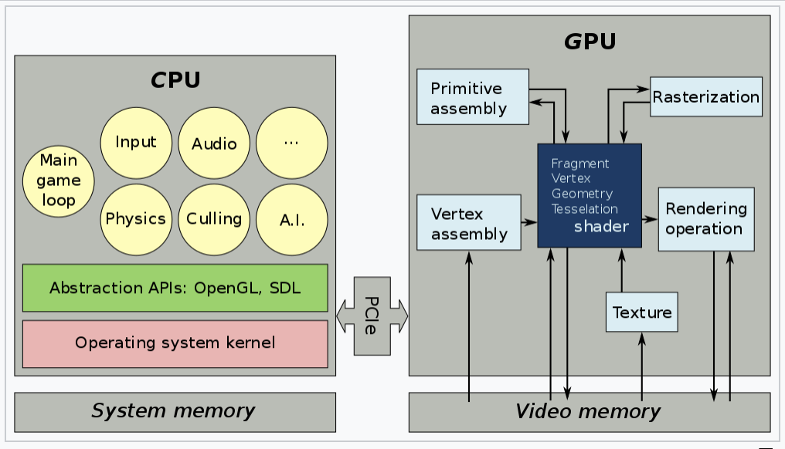
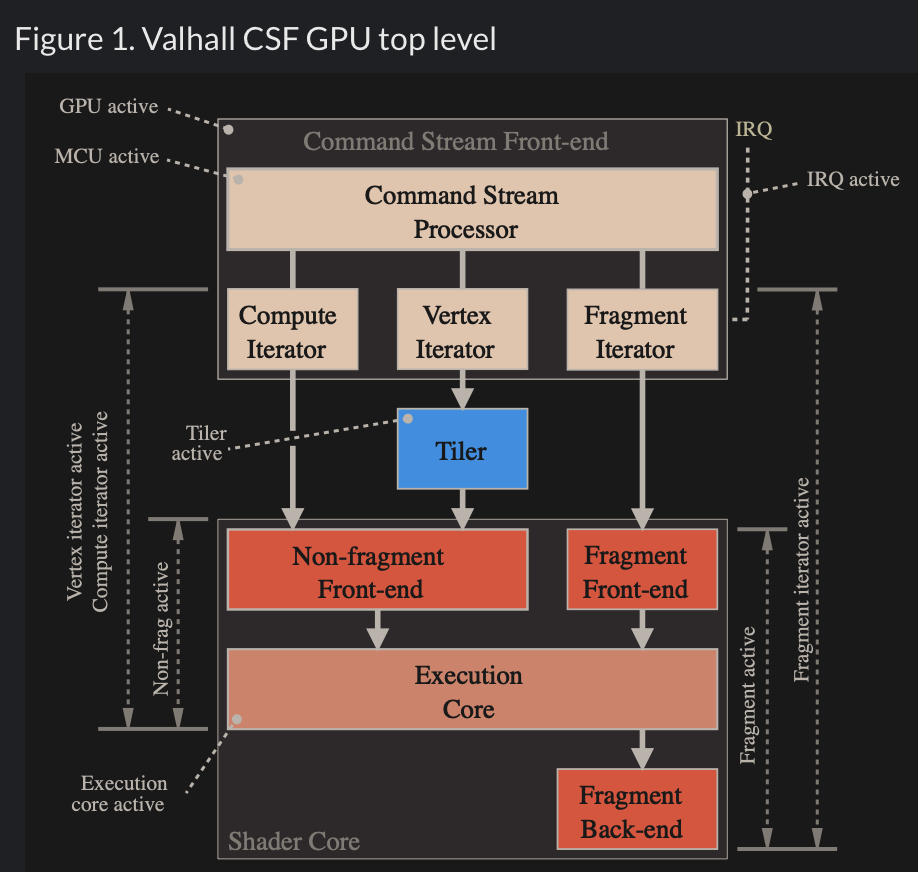
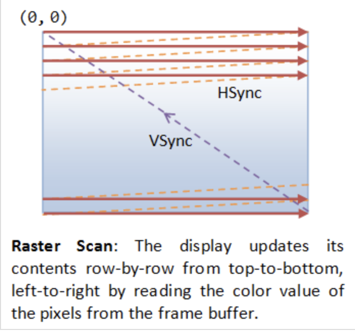

.. _hw-sw-stack:

Graphics HW and SW Stack
========================

.. contents::
   :local:
   :depth: 4

This section provides a more detailed illustration of animation across the
software and hardware stacks on both the CPU and GPU, and explains how data flows
between the CPU, the GPU, and each layer of the software stack.

The previous section, :ref:`3D Modeling <three-d-model>`, described the
information stored in 3D models and how it is used for animation.

The following section, :ref:`sw-stack`, describes **how each frame is
generated** to display **motion and skinning effects** using the small animation
parameters stored in a 3D model and sent by the CPU.

The following section, :ref:`Role and Purpose of Shaders <role-shaders>`,
explains how different visual effects can be achieved by **switching shaders**
and applying different materials across frames.

Reference:

- https://en.wikipedia.org/wiki/Free_and_open-source_graphics_device_driver

HW Block Diagram
----------------

The block diagram of the Graphic Processing Unit (GPU) is shown in
:numref:`gpu_block_diagram`.

.. _gpu_block_diagram: 
.. figure:: ../Fig/hw-sw-stack/gpu-block-diagram.png
  :align: center
  :scale: 50 %

  Components of a GPU: GPU has accelerated video decoding and encoding 
  [#wiki-gpu]_

The roles of the CPU and GPU in graphic animation are illustrated in
:numref:`graphic_cpu_gpu`.

.. _graphic_cpu_gpu: 

  OpenGL and Vulkan are both rendering APIs. In both cases, the GPU executes 
  shaders, while the CPU executes everything else [#ogl-cpu-gpu]_.

- A GPU cannot directly read user input from a keyboard, mouse, or gamepad;
  play audio; or load files from a drive. Therefore, the GPU cannot handle all
  animation-related work on its own [#cpu-gpu-role]_.

- A graphics driver consists of an implementation of the OpenGL state machine 
  and a compilation stack to compile the shaders into the GPU's machine language. 
  This compilation, like most driver work, is executed on the CPU. The compiled
  shaders are then sent to and executed by the GPU.
  (SDL = Simple DirectMedia Layer) [#mesawiki]_.

.. _graphic_gpu_csf: 

  An MCU and specialized hardware circuits accelerate CSF
  (Command Stream Frontend) processing [#csf]_.

The GPU driver writes commands and data from the CPU to GPU-visible memory over
PCIe. On Arm GPUs, these commands form a Command Stream Frontend (CSF). A GPU
chipset contains many SIMD processors (cores). To accelerate command processing,
the CSF is represented in a compact form. As shown in :numref:`graphic_gpu_csf`,
the chipset includes an MCU (microcontroller) and specialized hardware that
translates the CSF into data structures for individual SIMD processors.

.. _sw-stack:

SW Stack and Data Flow
----------------------

The driver runs on the CPU side as shown in :numref:`graphic_sw_stack`.  
The OpenGL API eventually calls the driver's functions, and the driver  
executes these functions by issuing commands to the GPU hardware and/or  
sending data to the GPU.  

Even so, the GPU’s rendering work, which uses data such as 3D vertices and  
colors sent from the CPU and stored in GPU or shared memory, consumes  
more computing power than the CPU.

.. _graphic_sw_stack: 
.. graphviz:: ../Fig/hw-sw-stack/graphic-sw-stack.gv
  :caption: Graphic SW Stack and data flow in initializing graphic model

✅ As described in the :ref:`animation` section and
:numref:`graphic_sw_stack`, the **game engine’s built-in C++ renderer handles
OpenGL, Vulkan, or Metal calls automatically**. Users set values such as speed
and velocity and customize the animation logic.

After the user creates a skeleton and textures  
for each model and sets keyframe times using a 3D modeling tool, users can  
write **gameplay scripts** (**Java code**, C#, Blueprints, GDScript, Python, 
etc.) to tell the engine to play animations [#joglwiki]_.

As described in the :ref:`node-editor` section, graphics designers and technical
artists create skin materials, while software and graphics programmers create
additional materials with node-editor tools (shader generators). These tools
generate the shaders used for rendering.

Shaders may call built-in functions written in Compute Shaders, SPIR-V, or  
LLVM-IR. LLVM `libclc` is a project for OpenCL built-in functions, which can  
also be used in OpenGL [#libclc]_. Like CPU built-ins, new GPU ISAs or  
architectures must implement their own built-ins or port them from open source  
projects like `libclc`.

The CPU evaluates the stored keyframes to produce motion and other animations,
as illustrated in the :ref:`animation` section.

.. _graphic_sw_stack-2: 
.. graphviz:: ../Fig/hw-sw-stack/graphic-sw-stack-2.gv
  :caption: Graphic SW Stack and data flow in rendering

The per-frame data is not the full set of vertices, but rather a small set of
animation parameters called **uniform updates**, as shown in
:numref:`graphic_sw_stack-2` and described later.

.. note::

   **Bone matrices** determine the positions of triangles within a 3D model 
   during animation.
   This bone transformation data is much **smaller** than the complete mesh of 
   the 3D model.
   We will provide an example and explain this in more detail in the 
   :ref:`animation-ex` section.
   Because this transformation data is small and constant across all shader 
   pipeline stages, it is stored in the GPU’s global memory and can be cached in 
   the **uniform/constant cache** for performance, as illustrated in 
   :numref:`mem-hierarchy` of :ref:`sec-mem-hierarchy` section.
 
The CPU updates only these small animation parameters and issues draw commands
to the GPU.

.. _in-out-rendering: 
.. graphviz:: ../Fig/hw-sw-stack/in-out-rendering.gv
  :caption: The input and output for GPU rendering

The 3D rendering pipeline is illustrated in :numref:`in-out-rendering`.

Object-shape data is described by VAOs (Vertex Array Objects) in OpenGL. This
is explained later in the :ref:`OpenGL section <opengl>`.
Additionally, OpenGL provides VBOs (Vertex Buffer Objects), which allow  
vertex array data to be stored in high-performance graphics memory on the  
GPU and enable efficient data transfer [#vbo]_ [#classorvbo]_.

After the GPU receives the **uniform updates** from the CPU, it performs the
computationally intensive per‑vertex work within the rendering pipeline to 
generate the **final pixel values** for **each frame** displayed on the screen.
These final pixel values are collectively referred to as the
**Rendered Image**.

✅  “**Rendered Image**” = the final per‑frame output written into the 
framebuffer.
The **Uniform Updates** will be described in detail later.

✅ The CPU updates only the small animation parameters called **uniform updates**,
as shown in :numref:`graphic_sw_stack-2`; the GPU performs the computationally
intensive per-vertex work.

As mentioned in the previous section on :ref:`animation movement <movement>`, 
3D modeling tools store keyframes, bone transforms at each keyframe, and related
data, then use this information to perform animation.

The CPU updates only the **bone** transformation data ..., rather than updating 
the entire vertex or mesh data for each animation frame.
These updates are very small—on the order of kilobytes rather than megabytes.
For each rendered frame, the CPU sends these small updates to the GPU, and the 
**GPU takes over the animation work from the CPU**.
This type of movement animation is called **skinning**, and is illustrated as 
follows:

**Skinning**

Skinning is a vertex deformation technique used to animate a mesh by attaching
its vertices to a hierarchical skeleton (bones). Each vertex stores one or more
bone indices and corresponding weights that describe how strongly each bone
influences that vertex.

During animation, the application updates the bone transformation matrices.
The vertex shader then computes the final vertex position by blending the
transformed positions according to the stored weights. This allows the mesh to
bend, twist, and deform smoothly as the skeleton moves.

Skinning does not create new geometry or smooth the surface topology. It only
transforms the existing vertices of the mesh. Examples include bending an arm,
flapping a wing, or deforming a flexible tube as its bones rotate.

The CPU updates only high-level animation state, such as:

-  Current animation time
-  **Bone matrices (small)**
-  **Morph weights**
-  Material parameters
-  Particle emitter settings
-  Global uniforms (camera, lights, etc.)

These are tiny updates — kilobytes, not megabytes.

.. math::

   finalPosition =
   \sum_{i=0}^{N-1}
   \mathbf{weight}_i \left( \mathbf{boneMatrix}_i \cdot originalPosition \right)

In practice, game engines normalize the weights so that their sum is 1.0:
:math:`\Rightarrow \sum_{i=0}^{N-1}\mathbf{weight}_i = 1.0`

Example: Bending an Arm

Imagine a character’s arm mesh.  
Each vertex in the elbow area has weights like:

-  70% influenced by upper‑arm bone
-  30% influenced by lower‑arm bone

When the elbow bends:

-  Upper‑arm bone rotates
-  Lower‑arm bone rotates
-  GPU blends the influence
-  The elbow area deforms smoothly

This is skinning.

✅ After GPU processing, the color pixels are written to the framebuffer
(video memory). The display device (monitor, LCD, OLED, etc.) fetches these
pixels and displays them on the screen. The interface between the framebuffer
and the display device is explained in the next section, :ref:`display`.

.. _display:

Displaying Pixels
-----------------

The interface between the framebuffer and the display device is shown in
:numref:`pc-lcd`.

.. _pc-lcd: 
.. figure:: ../Fig/hw-sw-stack/pc-lcd.png
  :align: center
  :scale: 50 %

  PC with Frame Buffer to LCD Display

The GPU and display (monitor, LCD, OLED, etc.) use **VSync, NVIDIA G-SYNC, or
AMD FreeSync** to prevent **screen tearing**, as described below:

.. raw:: latex

   \clearpage

.. _db-vsync: 

  VSync [#cg_basictheory]_

- Double Buffering

  While the display is reading from the frame buffer to display the current 
  frame, we might be updating its contents for the next frame (not necessarily 
  in a raster-scan manner). This would result in so-called tearing, in which
  the screen shows parts of the old frame and parts of the new frame.
  Double buffering resolves this issue. Instead of using a single framebuffer,
  a modern GPU uses a front buffer and a back buffer. The display reads from the
  front buffer while the GPU writes the next frame to the back buffer. When the
  frame is complete, the GPU swaps the front and back buffers (a buffer swap or
  page flip).

- VSync

  A refresh period is roughly:

  visible scan-out → blanking interval (including VSync) → next visible scan-out

  - Visible scan-out: the display reads pixel rows from top to bottom and shows 
    them.
  - Blanking interval: a short time after the last row and before the next first
    row. Historically the electron beam returned to the top; modern LCD/LED 
    displays retain a timing interval for coordination.
  - VSync: a timing signal within that blanking interval indicating the boundary
     between refreshes.

  vertical blanking interval = front porch + VSync pulse + back porch

  - Front porch: brief delay after the last visible row finishes.
  - VSync pulse: timing signal that marks synchronization between refreshes.
  - Back porch: brief delay after the VSync pulse before the first visible row 
    of the next frame starts.

  In most display modes, the **visible scan-out becomes slower** because the 
  **pixel clock is lower**. The blanking/VSync interval may also change 
  somewhat, depending on the timing mode, but it is usually a small part of the 
  total period.

  Changing from a 5-cycle refresh period to a 10-cycle refresh period doubles 
  the time for the entire refresh interval:

  active scan-out + blanking/VSync interval = 10 cycles

  - 5 cycles per refresh → VSync occurs every 5 cycles.
  - 10 cycles per refresh → VSync occurs every 10 cycles.

  If the refresh period is changed from 5 cycles to 10 cycles on an LCD or LED
  display, the display scans the screen more slowly: the active scan plus its blanking
  interval portion together occupy the 10 cycles.

  Double buffering alone does not solve the entire problem, as the buffer swap 
  might occur at an inappropriate time, for example, while the display is in 
  the middle of displaying the old frame. This is resolved via the so-called 
  vertical synchronization (or VSync) at the end of the raster-scan. 
  When the application signals the GPU to perform a buffer swap, the GPU waits until the next
  VSync to perform the actual swap, after the entire current frame is displayed.

  .. rubric:: Tearing
  .. code-block:: text

    To avoid tearing, the GPU runs at half the refresh rate of the display,  
    as shown below.

    GPU      |  GPU is writing buffer A  | GPU is writing buffer B |

    Display  | VSync B |

    Display  | VSync B and stay on B | VSync A and stay on A |
                                       ^
                                       |
                                    tearing 

  As the text diagram above illustrates, enabling VSync prevents the display
  from presenting frames faster than its refresh rate. If the GPU can render
  frames faster than the display refresh rate, the additional frames are not
  presented; VSync still prevents tearing.

  If an application presents frames with VSync enabled at a fixed cadence, its 
  displayed-frame cadence may be an integral fraction of the display refresh 
  rate: 1/1, 1/2, 1/3, 1/4, and so on.

  Examples on a 60 Hz display:

  - GPU/app ≥ 60 FPS: 1/1 → 60 presented FPS (extra rendered frames may be dropped or replaced).
  - GPU/app = 30 FPS: 1/2 → 30 presented FPS.
  - GPU/app = 20 FPS: 1/3 → 20 presented FPS.
  - GPU/app = 15 FPS: 1/4 → 15 presented FPS.

- NVIDIA G-SYNC and AMD FreeSync

  If your monitor and graphics card both in your customer computer support 
  NVIDIA G-SYNC, you’re in luck. With this technology, a special chip in the 
  display communicates with the graphics card. This lets the monitor vary the 
  refresh rate to match the frame rate of the NVIDIA GTX graphics card, up to 
  the maximum refresh rate of the display. This means that the frames are 
  displayed as soon as they are rendered by the GPU, eliminating screen tearing 
  and reducing stutter for when the frame rate is both higher and lower than 
  the refresh rate of the display. This makes it perfect for situations where 
  the frame rate varies, which happens a lot when gaming. 
  Today, you can even find G-SYNC technology in gaming laptops!

  AMD has a similar solution called FreeSync. However, this doesn’t require a 
  proprietary chip in the monitor. 
  In FreeSync, the AMD Radeon driver, and the display firmware handle the 
  communication. 
  Generally, FreeSync monitors are less expensive than their G-SYNC counterparts,
  but gamers generally prefer G-SYNC over FreeSync as the latter may cause 
  ghosting, where old images leave behind artifacts [#g-sync]_.

.. _role-shaders:

The Role and Purpose of Shaders
-------------------------------

The flow for 3D/2D graphic processing is shown in :numref:`opengl_flow`.

.. _opengl_flow: 
.. graphviz:: ../Fig/hw-sw-stack/opengl-flow.gv
  :caption: OpenGL Flow

Compiled shaders are sent to the GPU when the application calls
``glLinkProgram()``. At that point, the driver prepares the shader binaries for
GPU execution.

``glLinkProgram()`` is called when an application finishes preparing a shader program —
**not when creating a mesh, and not when issuing a draw command**.

When a game calls ``glLinkProgram()`` to relink a shader program, the shaders
must be compiled and prepared for the GPU.

This usually happens during game startup, level loading, or the creation of a new shader
variant (e.g., enabling shadows, fog, skinning).

Games switch shaders constantly — sometimes hundreds of times per frame — 
but they do not re‑link them.

When a game runs, different materials, effects, and rendering passes use
different shaders.

Examples of switching shaders:

- When the player enters a snowy biome, ice meshes use the ice shader. 
- The axe blade uses a metal PBR shader. 
  When the axe blade strikes stone, a particle shader renders the sparks.

.. [#wiki-gpu] https://en.wikipedia.org/wiki/Graphics_processing_unit

.. [#ogl-cpu-gpu] https://en.wikipedia.org/wiki/Vulkan

.. [#cpu-gpu-role] https://stackoverflow.com/questions/47426655/cpu-and-gpu-in-3d-game-whos-doing-what

.. [#mesawiki] <https://en.wikipedia.org/wiki/Mesa_(computer_graphics)>

.. [#csf] https://developer.arm.com/documentation/102813/0107/GPU-activity

.. [#joglwiki] https://en.wikipedia.org/wiki/Java_OpenGL

.. [#libclc] https://libclc.llvm.org

.. [#vbo] http://www.songho.ca/opengl/gl_vbo.html

.. [#classorvbo] If your models will be rigid, meaning you will not change each vertex individually, and you will render many frames with the same model, you will achieve the best performance not by storing the models in your class, but in vertex buffer objects (VBOs) https://gamedev.stackexchange.com/questions/19560/what-is-the-best-way-to-store-meshes-or-3d-models-in-a-class

.. [#cg_basictheory] https://www3.ntu.edu.sg/home/ehchua/programming/opengl/CG_BasicsTheory.html

.. [#g-sync] https://www.avadirect.com/blog/frame-rate-fps-vs-hz-refresh-rate/
