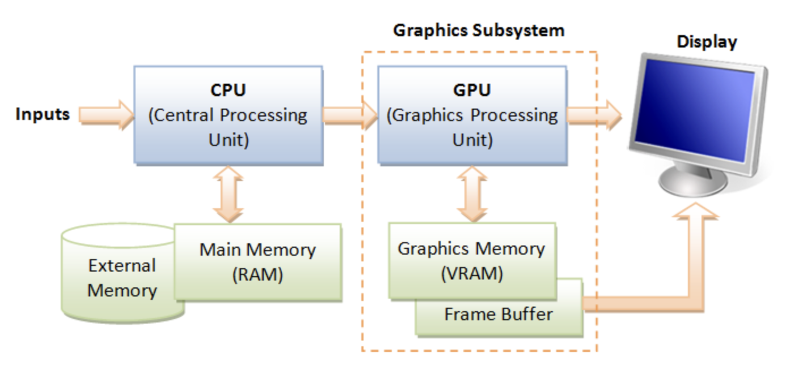
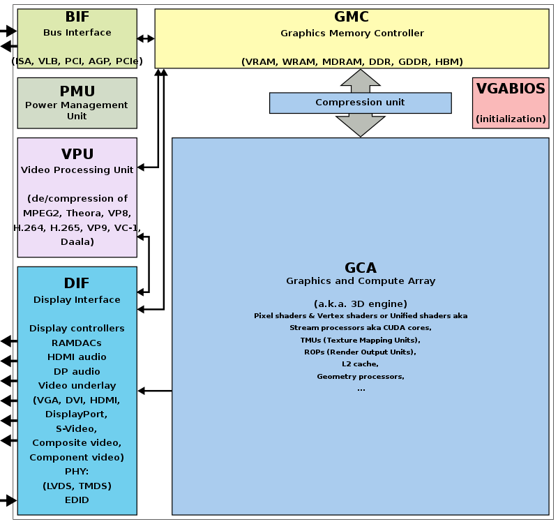
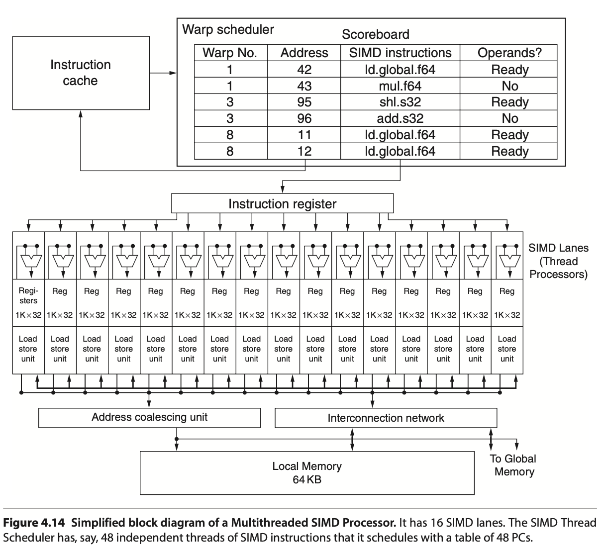
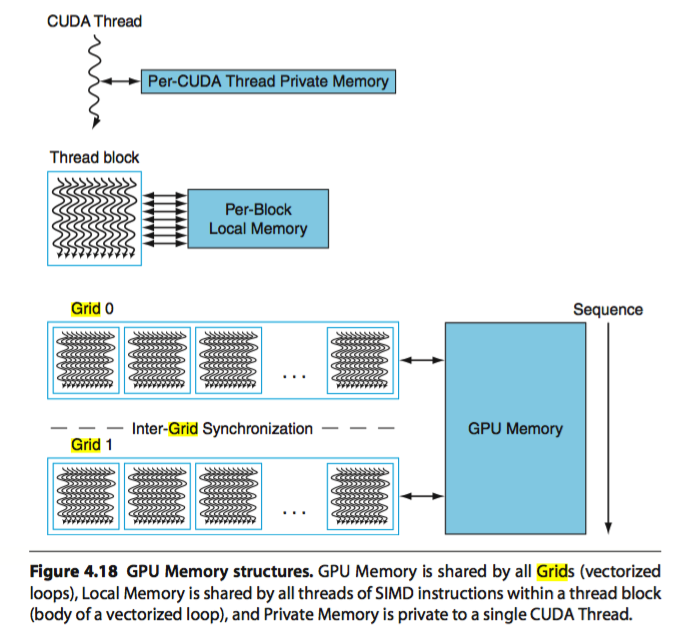
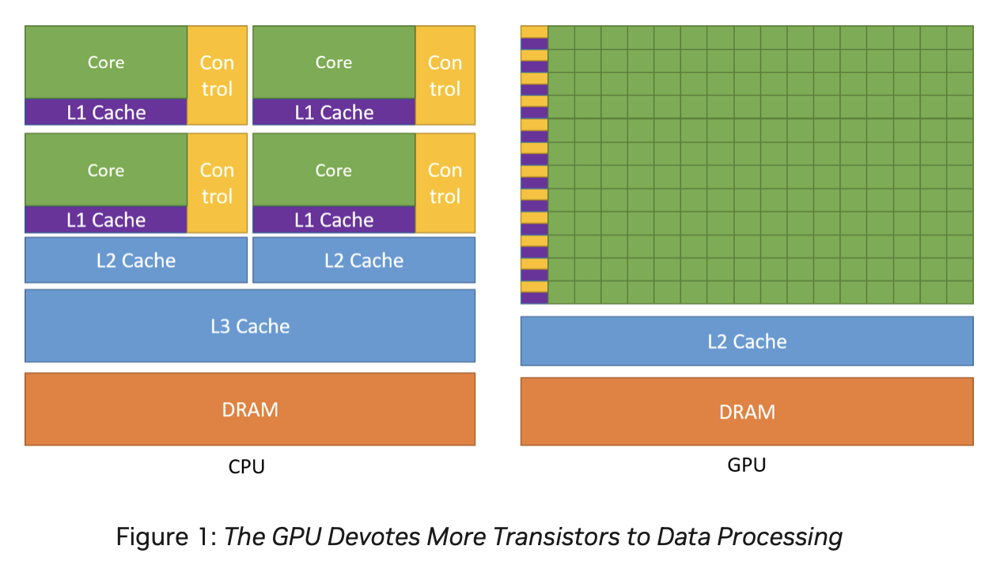
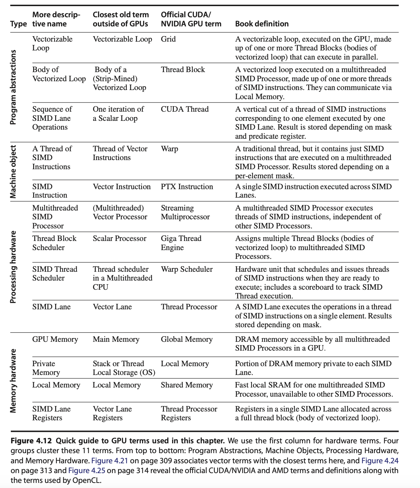
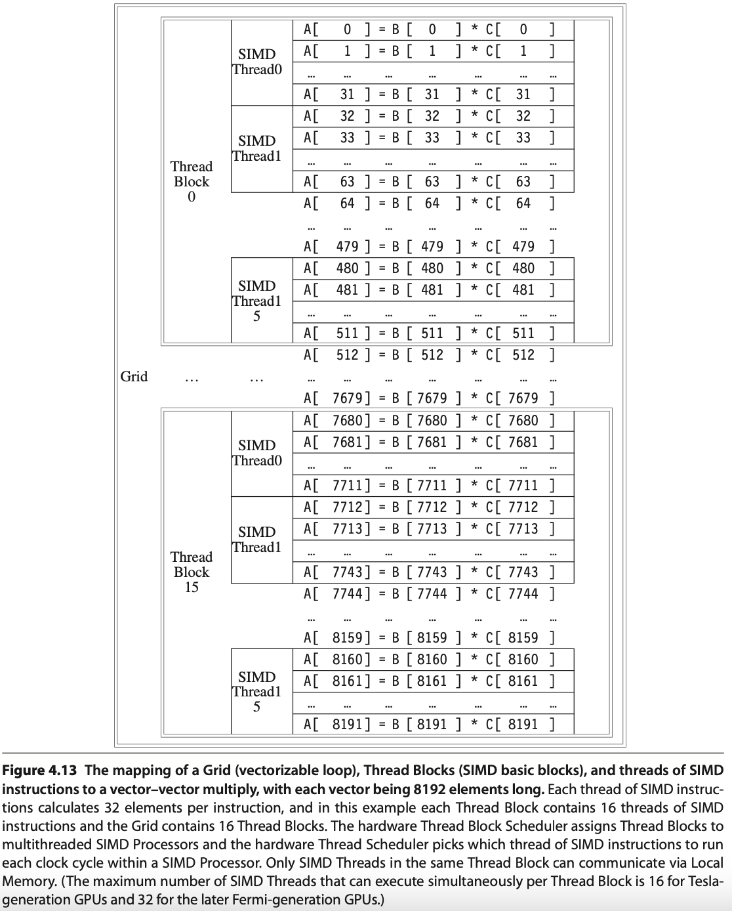
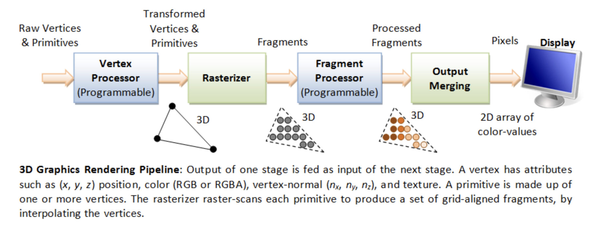

.. _gpu-arch:

GPU Architecture
================

.. contents::
   :local:
   :depth: 4

.. _cg-hw: 

  Computer Graphics Hardware (figure from book [#cg_basictheory]_)

GPU Hardware Units
------------------

A GPU (graphics processing unit) is built as a massively generic parallel 
processor of SIMD/SIMT architecture with several specialized processing units 
inside shown as :numref:`gpu_block_diagram_2` from the 
:ref:`section Graphics HW and SW Stack <hw-sw-stack>`.

.. _gpu_block_diagram_2: 

  Components of a GPU: GPU has accelerated video decoding and encoding 
  [#wiki-gpu]_

From compiler's view, GPU is shown as :numref:`gpu-hw`.

.. _gpu-hw: 
.. graphviz:: ../Fig/hw/gpu-hw.gv
  :caption: Components of a GPU: SIMD/SIMT + several specialized processing units

 
A GPU is not just “many cores” — it’s a mix of general-purpose ompute clusters, 
specialized units, and the memory subsystem. It corresponds to the block 
diagram graph shown in :numref:`gpu-hw`. 

The stages of the OpenGL rendering pipeline and the GPU hardware units
that accelerate them as shown in :numref:`ogl-pipeline-hw`:

.. _ogl-pipeline-hw: 
.. graphviz:: ../Fig/hw/ogl-pipeline-hw.gv
  :caption: The stages of OpenGL pipeline and GPU's acceleration components

**Compute Cluster**

- **Role:**  
  Provide large-scale data-parallel execution. Each GPU contains many
  Streaming Multiprocessors (SMs) or Compute Units (CUs), each capable
  of executing thousands of threads in parallel.

- **Components:**

  * **Warp Scheduler** – Schedules groups of threads (Warps/Wavefronts),
    issues instructions in SIMT (Single Instruction, Multiple Threads) fashion.
  * **Registers** – Per-thread private storage, the fastest memory level.
  * **Shared Memory / L1 Cache** – On-chip memory close to the SM.
    Shared Memory is explicitly managed by the programmer for cooperation
    across threads, while L1 acts as a transparent cache.
  * **ALUs (FP/INT)** – Execute floating-point and integer arithmetic.
    They form the bulk of compute resources inside an SM.
  * **SFUs (Special Function Units)** – Execute transcendental functions
    such as sin, cos, exp, and reciprocal approximations.
  * **Load/Store Units** – Handle global, local, and shared memory access,
    interact with coalescing and caching logic.
  * **RegLess Staging Operands (RSO)** – Temporary operand buffers used
    to hide instruction and memory latencies.

- **Usage:**  

  * Run programmable shaders (vertex, fragment, geometry, compute).  
  * Perform general-purpose compute workloads (GPGPU).  
  * Issue texture fetch requests to TMUs.  
  * Interact with memory hierarchy via load/store units.  
  * Offload certain operations to Tensor or Ray-Tracing units.  

**Specialized Units**

- **Role:**  
  Accelerate fixed-function or specialized stages of the graphics and
  compute pipeline that are inefficient to run purely in SMs.

- **Components and Usage:**

  * **Geometry Units** –  
    Assemble input vertices into primitives (points, lines, triangles).
    Perform tessellation (subdivide patches into smaller primitives),
    clipping (discard geometry outside view), and geometry shading.  

    *Usage:* Corresponds to the geometry/tessellation stage in the graphics pipeline.

  * **Rasterization Units** –  
    Convert vector-based primitives into fragments (potential pixels).
    Interpolate per-vertex attributes (texture coordinates, normals, colors)
    across the surface of each primitive.  

    *Usage:* Bridge between geometry and fragment stages; produces fragments
    for SM fragment shading.

  * **Texture Mapping Units (TMUs)** –  
    Fetch texture data from memory, apply filtering (bilinear, trilinear,
    anisotropic), and compute texel addresses (wrap, clamp).  

    *Usage:* Invoked during fragment shading inside SMs to provide sampled
    texture values.

  * **Render Output Units (ROPs)** –  
    Handle late-stage pixel processing. Perform blending operations
    (alpha, additive), depth and stencil tests, and write final pixel values
    to the framebuffer in VRAM.  

    *Usage:* Final step of the graphics pipeline before display scanout.

  * **Tensor / Matrix Cores** –  
    Perform fused-multiply-add (FMA) on large matrix tiles.
    Designed for machine learning, AI inference, and linear algebra.  

    *Usage:* Accelerate deep learning workloads or matrix-heavy compute kernels.

  * **Ray-Tracing Units (RT Cores)** –  
    Traverse bounding volume hierarchies (BVH) and perform ray–primitive
    intersection tests in hardware.  

    *Usage:* Enable real-time ray tracing [#wiki-ray-tracing]_ by offloading 
    intersection work from SMs.

  * **Video Engines** –  
    Dedicated ASICs for video codec operations such as H.264/H.265/AV1 encode
    and decode.  

    *Usage:* Media playback, streaming, and video encoding without occupying SMs.

  * **Display Controller** –  
    Reads final framebuffer images from VRAM and drives display interfaces
    like HDMI and DisplayPort.  

    *Usage:* Outputs rendered frames to monitors or VR headsets.

**Memory Subsystem**

- **Role:**  
  Deliver high-bandwidth data access to thousands of threads while
  minimizing latency through caching and access optimization.

- **Components:**

  * **L1 / Shared Memory** –  
    Closest to SMs. Shared Memory is explicitly used by programs for
    intra-block communication, while L1 acts as an automatic cache.  

    *Usage:* Boosts performance by keeping frequently accessed data
    close to execution units.

  * **L2 Cache** –  
    Shared across all SMs. Reduces redundant traffic to VRAM and
    improves latency for reused data.  

    *Usage:* Provides intermediate caching layer for both compute and graphics.

  * **VRAM (GDDR / HBM)** –  
    External high-bandwidth DRAM. Stores textures, framebuffers,
    vertex/index buffers, and large compute datasets.  

    *Usage:* The main memory backing for all GPU workloads.

  * **Interconnect / Memory Controller** –  
    Orchestrates memory requests, manages access to VRAM,
    and ensures fairness between SMs.  

    *Usage:* Handles scheduling and distribution of memory transactions.

  * **Memory Coalescing Unit** –  
    Combines multiple per-thread memory requests from a Warp into fewer,
    wider transactions. Most effective for contiguous access patterns.  

    *Usage:* Improves memory bandwidth efficiency and reduces wasted cycles.

  * **Gather–Scatter Unit** –  
    Handles irregular or sparse memory accesses where coalescing is not possible.
    May break requests into multiple smaller transactions.  

    *Usage:* Supports workloads such as sparse matrix operations, graph traversal,
    or irregular data structures.

**Data Flow Highlights**

- **Graphics pipeline path:**  
  Vertex data → Geometry Units → Rasterization Units → Fragment Shading (SMs)
  → TMUs (texture fetch) → ROPs (blend/depth/stencil) → VRAM (framebuffer).

- **Compute path:**  
  SMs execute general-purpose kernels → optional offload to Tensor or RT cores
  → interact with caches → VRAM.

- **Memory behavior:**  
  SMs issue memory requests → Coalescing Unit optimizes if possible → L2 cache →
  VRAM. For irregular access (e.g., sparse data), Gather–Scatter generates
  multiple VRAM transactions.

- **Display path:**  
  Final framebuffer stored in VRAM → Display Controller → HDMI / DP scanout.

**All Together**

**GPU provides the following hardware to accelerate graphics rendering pipeline as follows:**

✅ Simplified Flow (OpenGL → Hardware)
	1.	Vertex Fetch → VRAM & Memory Controllers.
	2.	Vertex Shader → SM cores + Geometry Units.
	3.	Geometry/Tessellation → SM core + Geometry Units.
	4.	Rasterization → Rasterization units.
	5.	Fragment Shader → SM cores + TMUs (texture sampling).
	6.	Depth/Stencil/Blending → ROPs.
	7.	Framebuffer Write → L2 cache & VRAM → Display Controller.

**Variable Rate Shading (VRS) Support**

By utilizing certain GPU units as outlined below, Variable Rate Shading (VRS) can be 
supported [#vrs]_.

- Rasterizer (Rasterization Units):

  - Decides how many fragments per pixel (or group of pixels) will actually be shaded.
  - Instead of generating 1 fragment per pixel, it may shade 1 fragment for a 2×2 or 4×4 block and reuse that result.

- Fragment Shader Cores (SMs/CUs):

  - Still run the shading code, but at a reduced frequency (fewer fragment invocations).

- ROPs (and pipeline integration):

  - Apply results to the framebuffer, handling blending/depth as usual.

SM (SIMT)
---------

Single instruction, multiple threads (SIMT) is an execution model used in 
parallel computing where a single central "Control Unit" broadcasts an 
instruction to multiple "Processing Units" for them to all optionally perform 
simultaneous synchronous and fully-independent parallel execution of that one 
instruction. **Each PU has its own independent data and address registers, its 
own independent Memory, but no PU in the array has a Program counter** 
[#simt-wiki]_.

Summary:

- Each Control Unit has a Program Counter (PC) and  has tens of Processor Unit 
  (PU).

- Each Processor Unit (PU) has it's General Purpose Register Set (GPR) and stack
  memory.

- The PU is a pipleline execution unit compared to CPU architecture.

SM Hardware
***********

The leading NVIDIA GPU architecture is illustrated in :numref:`gpu-sched`, 
**where the scoreboard is shown without the mask field**. 
This represents a SIMT pipeline with a scoreboard.

.. _gpu-sched: 

  Simplified block diagram of a Multithreaded SIMD Processor. (figure from book 
  [#Quantitative-threads-lanes]_)

.. note:: A SIMD Thread executed by SIMD Processor, a.k.a. SM, has 16 Lanes.

.. raw:: latex

   \clearpage

.. list-table::
   :widths: 60 40
   :align: center

   * - .. _sm:left:
       .. figure:: ../Fig/hw/sm.png
          :scale: 50 %

          Streaming Multiprocessor SM figure from book [#Quantitative-gpu-sm]_.

     - .. _sm:right:
       .. figure:: ../Fig/hw/sm2.png
          :scale: 15 %

          SM figure from websites [#cuda-sm]_ [#fermi]_.
 
- Streaming Multiprocessor SM has two 16-way SIMD units and four special 
  function units.
  Fermi has 32 SIMD Lanes and Cuda cores. 
  SM has L1 and Read Only Cache (Uniform Cache)
  GTX480 has 48 SMs. 

- In Fermi,
  ALUs run at twice the clock rate of rest of chip. So each 
  decoded instruction runs on 32 pieces of data on the 16 ALUs over two ALU 
  clocks [#chime]_. However after Fermi, the ALUs run at the same clock rate
  of rest of chip.

- As :numref:`sm:left` in Fermi and Volta, it can dual-issue "float + integer" or 
  "integer + load/store" but cannot dual-issue "float + float" or "int + int".

- Uniform cache: used for storing constant variables in OpenGL (see 
  :ref:`uniform of Pipeline Qualifiers <pipeline-qualifier>`) and in OpenCL/CUDA.

.. _cfg-warps:

**Configurable maximum resident warps and allocated registers per thread** as 
follows:

- Example: Fermi SM (SM 2.x)

  - Hawdware limit:

    - Total registers per SM = 32,768 × 32-bit
    - Max Warps per SM = 48
    - Max threads per SM = 1536
    - Max registers/thread = 63

  - Configuration: If each thread uses R registers:

    - Max resident threads = floor(32768 / R)
    - Max resident Warps   = floor(Max resident threads / 32)
    - E.g. **R=32: Max resident threads = 32768/32 = 1024, Max resident Warps = 
      1024/32 = 32.**

- After Fermi, the hardware limit for Maxwell, Pascal, Volta and Ampere are:

  - Hawdware limit:

    - Each SM includes 32 Cuda cores and Lanes → 32 active threads. 
    - Total registers per SM = 64K x 32-bit
    - Max Warps per SM = 64
    - Max threads per SM = 2048 (64 Warps x 32 threads)
    - Max registers/thread = 255

  - Notes:

    - Registers per thread: max number of registers **compiler can allocate to 
      a thread**.
    - The “registers per thread” limit (255) is a hardware/compiler limit, but 
      the actual number used depends on the kernel. 
      If a kernel uses too many registers per thread, occupancy drops (fewer 
      threads can be resident).
    - The “max threads per SM = 2048” is a theoretical upper limit; actual 
      resident threads will also depend on shared memory usage, number of 
      thread-blocks per SM, and register usage.

.. note::

   A SIMD thread executed by a Multithreaded SIMD processor, also known as an SM,
   processes 32 elements.  

   As configuation above, the 32,768 registers per SM can be configured to  each 
   thread alllocated 32 registers, Max resident Warps = 32.

   Fermi has a mode bit that offers the choice of using 64 KB of SRAM as 
   a 16 KB L1 cache with 48 KB of Local Memory or as a 48 KB L1 cache 
   with 16 KB of Local Memory [#Quantitative-gpu-l1]_.

.. list-table::
   :widths: 60 40
   :align: center

   * - .. _threadblock:
       .. figure:: ../Fig/hw/threadblock.jpg 
          :scale: 50 %

          SM select Thread Blocks to run [#wiki-tbcp]_.

     - .. _threadblocks-map:
       .. figure:: ../Fig/hw/threadblocks-map.png
          :scale: 50 %

          Mapping Thread Block to SMs [#mapping-blocks-to-sm]_.

 
SM Scheduling
*************

- A GPU is built around an array of Streaming Multiprocessors (SMs). 
  A multithreaded program is partitioned into blocks of threads that execute 
  independently from each other, so that a GPU with more multiprocessors will 
  automatically execute the program in less time than a GPU with fewer 
  multiprocessors [#mapping-blocks-to-sm]_.

- Nvidia's GPUs:
 
  Fermi (2010), Kepler (2012), Maxwell (2014), Pascal (2016), Volta (2017), 
  Turing (2018), Ampere (2020), Ada Lovelace (2022), and Hopper (2022, for data 
  centers). 

- Two levels of scheduling:

  - Level 1: Thread Block Scheduler

    For Fermi/Kepler/Maxwell/Pascal (pre-Volta): Warp-synchronous SIMT
    (lock-step in Warp):

    A Warp includes 32 threads in Fermi GPU.
    Each Streaming Multiprocessor SM includes 32 Lanes in Fermi GPU, as shown 
    in :numref:`threadblock`, the Thread Block includes a Warp (32 threads).
    According :numref:`threadblocks-map`, more than one block can be assigned
    and run on a same SM.

    .. _l1-warp-sched:

    When an SM executes a Thread Block, all the threads within the block are  
    are executed at the same time. If any thread in a Warp is not ready due to 
    operand data dependencies, the scheduler switches context between Warps.  
    During a context switch, all the data of the current Warp remains in the  
    register file so it can resume quickly once its operands are ready  
    [#wiki-tbcp]_.

    Once a Thread Block is launched on a multiprocessor (SM), all
    of its Warps are **resident** until their execution finishes.
    Thus a new block is not launched on an SM until there is sufficient
    number of free registers for all Warps of the new block, and until there
    is enough free shared memory for the new block [#wiki-tbcp]_.

  - Level 2: Warp Scheduler

    Manages CUDA threads (resident threads) within the same Warp.

    A **resident thread** is a thread whose execution context has been
    allocated on an SM (registers, Warp slot, shared memory).  Once resident,
    the thread is always in exactly one of the following execution states.

    .. code-block:: text

        Resident Thread
        ├── Ready
        │     Thread is eligible to execute; no pending dependencies.
        │
        ├── Running
        │     Warp containing the thread is currently issued by the scheduler.
        │
        │     ├── Active (mask = 1)
        │     │     Thread participates in the current instruction.
        │     │
        │     └── Inactive (mask = 0)
        │           Thread is masked off due to branch divergence and
        │           will re-activate at a reconvergence point.
        │
        ├── Stalled
        │     Warp cannot issue due to memory latency, synchronization,
        │     or scoreboard dependency.
        │
        └── Exited
              Thread has completed execution but its Warp has not yet been
              released from the SM.

    Threads retain their registers and per-thread local memory during the 
    stalled state. 
    Therefore, **the context switch incurs almost no overhead compared to CPU 
    threads**.

    - No pipeline flush: illustrate below.
    - No register save/restore
    - No stack frame swapping
    - **No OS involvement**
    - Takes roughly **1 cycle**
    
    No pipeline flush because:

    For Fermi/Kepler/Maxwell/Pascal (pre-Volta): Warp-synchronous SIMT 
    (lock-step in Warp):

    - No data is saved/restored when switching to another Warp
    - Switching Warps = selecting a different Warp in the Warp scheduler
    - No pipeline flush

      On an NVIDIA GPU, no pipeline flush occurs when a Warp stalls because
      the Warp’s next instruction is **never issued until its operands are 
      ready** as illustrated in 
      :ref:`Warp scheduling in Level 1 <l1-warp-sched>`. 
      The stalled Warp simply stops issuing instructions, and its 
      pipeline slot is taken by another ready Warp. 
      When the stall condition clears, the Warp re-enters the pipeline by 
      issuing the stalled instruction anew. No state is saved or restored.

    For Volta, Turing, Ampere, Hopper: Independent Thread Scheduling:

    - No pipeline flush

      - Stalled threads simply do not issue instructions. 
      - Other threads in the same warp continue issuing independently.
      - No pipeline flush needed and No data is saved/restored because 
        instructions are tracked per thread, not per warp.

- Thread Active/Inactive

  .. code-block::

    GLSL example for branch divergence
    ----------------------------------

    // The value of x is different between threads
    if (x > 0.0)
        color = red;
    else
        color = blue;

    GPUs use conditional instructions like CPUs.

    When a shader executes a conditional branch and threads evaluate the 
    condition differently, the GPU splits execution using a mask register.

    predicate = cond       // predicate is the mask register
    @predicate instruction

    is a form of conditional (predicated) instruction execution on GPUs.

    In NVIDIA PTX, it is activemask register.

    if EXEC_MASK[thread] == 1
        execute
    else
        skip

SIMT and SPMD Pipelines
***********************

This section illustrates the difference between SIMT and SPMD
pipelines using the same pipeline stages: Fetch (F), Decode (D),
Execute (E), Memory (M), and Writeback (W).

A GPU contains many SMs. 
The execution model between SMs is MIMD (Multiple Instructions, Multiple Data) 
when running different programs, or SPMD (Single Program, Multiple Data). 
However, within a single SM, the execution model is SIMD/SIMT.”

Low-end GPUs implement SIMD in their pipelines, where all instructions are 
executed in lockstep. High-end GPUs, however, approximate SPMD in their 
pipelines, meaning that instructions are interleaved within the pipeline, as 
shown below.

**SPMD Programming Model vs SIMD/SIMT Execution**

In the SISD of CPU, a thread is a single pipeline execution unit which can be 
issued at any specific address.
 
**In a multi-core CPU running SPMD, each core can schedule and execute 
instructions at any program counter (PC)**. For example, core-1 may execute 
I(1–10), while core-2 executes I(31–35).
**For GPU, however, within an SM, it is not possible to schedule thread-1 to 
execute I(1–10) while thread-2 executes I(31–35)**.

As result,
**there is no mainstream GPU that is truly hardware-SPMD** (where each thread 
has its own independent pipeline).
All modern GPUs (NVIDIA, AMD, Intel) implement SPMD as a programming model, but 
under the hood they execute in SIMD lock-step groups (Warps or Wavefronts).
GPUs expose an **SPMD programming model** (each thread runs the same kernel on
different data). However, the hardware actually executes instructions in
**SIMD/SIMT lock-step groups**.

.. rubric:: An example to illustrate the difference between Pascal SIMT, Volta 
            SIMT and SPMD.
.. code-block:: 

  Divergent Kernel Example:
  -------------------------

  if (tid % 2 == 0) {         // even threads: long loop
    for (...) { loop_body } // many iterations
  } else {                    // odd threads: short path
    C[tid] = A[tid] + B[tid];
  }

  Legend: F=Fetch, D=Decode, E=Execute, M=Memory, W=Writeback
          S=Stall/masked-off, "..." = loop continues

  ===================================================================
  Pascal (lock-step SIMT with SIMT stack)
  -------------------------------------------------------------------
  Cycle →   0   1   2   3   4   5   6   7   8   9  10  11  12 ...
  T0 even:  F   D   E   M   W   F   D   E   M   W   F   D  ...
  T1 odd :  S   S   S   S   S   S   S   S   S   S   S   S  ...
            (Odd threads wait until even path completes, then:)
            ... F D E M W → done

  ===================================================================
  Volta (SIMT with independent thread scheduling)
  -------------------------------------------------------------------
  Cycle →   0   1   2   3   4   5   6   7   8   9  10  11 ...
  T0 even:  F   D   E   M   W   F   D   E   M   W   F   D  ...
  T1 odd :      F   D   E   M   W   done
            (Odd thread issues its short path early,
             interleaved with even loop instructions)

  ===================================================================
  True SPMD (CPU-like, fully independent threads)
  -------------------------------------------------------------------
  Cycle →   0   1   2   3   4   5   6   7   8   9 ...
  T0 even:  F   D   E   M   W   F   D   E   M   W  ...
  T1 odd :  F   D   E   M   W   done
            (Threads fetch/execute independently —
             odd thread finishes immediately)

.. note:: **SPMD and MIMD**
 
   When run a single program across all cores, SPMD and MIMD pipelines look the 
   same. 

:ref:`The subection Mapping data in GPU <mapping-data-in-gpu>` includes more 
details in Lanes masked.

**Scoreboard purpose:**

- GPU scoreboard = in-order issue, out-of-order completion

- CPU reorder buffer (ROB) = out-of-order issue + completion, but retire in-order
  - CPUs use a ROB to support out-of-order issue and retirement.

**Comparsion of Volta and Pascal**

In a lock-step GPU without divergence support, the scoreboard entries include 
only {Warp-ID, PC (Instruction Address), …}. With divergence support (as in 
real-world GPUs), the scoreboard entries expand to {Warp-ID, PC, mask, …}. 

**Volta (Cuda thread/SIMD Lane with PC, Program Couner and Call Stack)**

**GPU scoreboard = in-order issue, out-of-order completion**

	•	SIMT GPU before Volta = scoreboard contains: { Warp ID + PC + Active Mask }
	•	Volta = scoreboard contains: { Warp ID + PC per thread (+ readiness per thread) }

**Example for mutex** [#Volta]_

.. code:: c++ 

  // 
  __device__ void insert_after(Node *a, Node *b)
  {
    Node *c;
    lock(a); lock(a->next);
    ...
    unlock(c); unlock(a);
  }

Assume that the mutex is contended across SMs but not within the same SM. On 
average, each thread spends 10 cycles executing the insert_after operation 
without resource contention, and 20 cycles when accounting for contention.  
Therefore, the average total execution time for 32 threads in an SM is:

•  Volta: 20 cycles
•  Pascal: 640 cycles (20 cycles × 32 threads, due to lack of independent 
   progress inside a Warp)

.. _sec-mem-hierarchy:

Processor Units and Memory Hierarchy in NVIDIA GPU [#chatgpt-pumh]_
-------------------------------------------------------------------

.. _gpu-mem: 

  GPU memory (figure from book [#Quantitative-gpu-mem]_). 

.. _mem-hierarchy: 
.. graphviz:: ../Fig/hw/mem-hierarchy.gv
  :caption: Processor Units and Memory Hierarchy in NVIDIA GPU
            **Local Memory is shared by all threads and Cached in L1 and L2.**
            In addition, the **Shared Memory is provided to use per-SM, not 
            cacheable**.

Illustrate L1, L2 and Global Memory used by SM and whole chip of GPU as 
:numref:`l1-l2`.

.. _l1-l2: 

  
  **L1 Cache: Per-SM, Coherent across all 16 Lanes in the same SM.**
  L2 Cache: Coherent across all SMs and GPCs.
  Global Memory (DRAM: HBM/GDDR). Both HBM and GDDR are DRAM.
  GDDR (Graphics DDR) – optimized for GPUs (GDDR5, GDDR6, GDDR6X).
  HBM (High Bandwidth Memory) – 3D-stacked DRAM connected via TSVs 
  (Through-Silicon Vias) for extremely high bandwidth and wide buses 
  [#mapping-blocks-to-sm]_.

The :numref:`mem-hierarchy` **illustrates the memory hierarchy in NVIDIA GPU**.
The Cache flow for 3D Model Information, Animation Parameters, and GLSL Variables
is as follows:

3D Model Information:
  - VBO/IBO → Global → L2 → L1 → Registers
  - Material constants → Uniform Cache → Registers

Animation Parameters:
  - Bone matrices → Uniform Cache → Registers
  - Morph targets → Global → L2 → L1 → Registers
  - Shared bone data (compute) → Shared Memory

GLSL Variables:
  - uniform → Uniform Cache
  - in (vertex attributes) → Global → L2 → L1
  - out (varyings) → Registers → Interpolators
  - buffer (SSBO) → Global → L2 → L1
  - shared → Shared Memory
  - local arrays → Registers or Local Memory

More details of the NVIDIA GPU memory hierarchy are described as follows:

- **Registers**

  - Per-thread, fastest memory, located in CUDA cores, as illustrated also in 
    :numref:`sm:left`.
  - :ref:`Configurable maximum resident warps and 
    allocated registers per thread <cfg-warps>` following 
    :numref:`sm:left`.
  - Latency: ~1 cycle.

- **Uniform / Constant cache**

  - Stored constant variables in OpenGL and OpenCL/CUDA, as illustrated in 
    :numref:`sm:left`.

- **Local Memory**

  - Per-thread, stored in global DRAM.
  - Cached in L1 and L2.
  - Latency: high, depends on cache hit/miss.

- **Shared Memory**

  - **Per-SM, shared across threads in a Thread Block as shown in** 
    :numref:`sm:left`.
  - **On-chip, programmer-controlled.**
  - Latency: ~20 cycles.

- **L1 Cache**

  - Per-SM, unified with shared memory.
  - Hardware-managed.
  - Latency: ~20 cycles.

- **L2 Cache**

  - Shared across the entire GPU chip.
  - **Coherent across all SMs and GPCs as shown in** :numref:`l1-l2`.

- **Global Memory (DRAM: HBM/GDDR)**

  - Visible to all SMs across all GPCs.
  - Highest latency (~400–800 cycles).

**GPU Hierarchy Context**

- **GigaThread Engine (chip-wide scheduler)**

  - Contains multiple GPCs.

    - Fermi (2010): up to 4 GPCs per chip.
    - Pascal GP100 (Tesla P100): 6 GPCs.
    - Volta GV100 (Tesla V100): 6 GPCs.

  - Distributes Thread Blocks to all GPCs.

- **GPC (Graphics Processing Cluster)**

  - Contains multiple TPCs.

- **TPC (Texture Processing Cluster)**

  - Groups 1–2 SMs.

- **SM (Streaming Multiprocessor)**

  - Contains CUDA cores, registers, shared memory, L1 cache.

- **CUDA Cores**

  - Execute threads with registers and access the memory hierarchy.

.. _gpu-terms: 

  Terms in Nvidia's gpu (figure from book [#Quantitative-gpu-terms]_)

.. _Warp-sched-pipeline: 
.. graphviz:: ../Fig/hw/warp-sched-pipeline.gv
  :caption: In **dual-issue mode**, Chime A carries floating-point data while Chime 
            B carries integer data—both issued by the same CUDA thread. 
            In contrast, under **time-sliced execution**, Chime A and Chime B carry 
            either floating-point or integer data independently, and are 
            assigned to separate CUDA threads.

- A Warp of 32 threads is mapped across 16 Lanes. If each Lane has 2 Chimes, 
  it may support dual-issue or time-sliced execution as 
  :numref:`Warp-sched-pipeline`.

In the following matrix multiplication code, the 8096 elements of matrix 
A = B × C are mapped to Thread Blocks, SIMD Threads, Lanes, and Chimes as 
illustrated in the :numref:`grid`. In this example, it run on 
**time-sliced execution**.

.. _matmul-cuda:

.. code-block:: c++
   :caption: MATMUL CUDA Example

   // Invoke MATMUL with 256 threads per Thread Block
   __host__
   int nblocks = (n + 255) / 512;
   matmul<<<nblocks, 255>>>(n, A, B, C);
   // MATMUL in CUDA
   __device__
   void matmul(int n, double A, double *B, double *C) {
     int i = blockIdx.x*blockDim.x + threadIdx.x;
     if (i < n) A[i] = B[i] + C[i];
   }

.. _grid: 

  Mapping 8192 elements of matrix multiplication for Nvidia's GPU  
  (figure from [#Quantitative-grid]_).  
  SIMT: 16 SIMD threads in one Thread Block.

Explain the mapping and execution in :numref:`grid` for :ref:`matmul-cuda` using the terminology from 
:numref:`gpu-terms` and the previous sections of this book, presented in the 
table below.
 
.. list-table:: Summary terms for GPU.
  :widths: 10 15 50
  :header-rows: 1

  * - Terms
    - Structure
    - Description
  * - Grid, Giga Thread Engine
    - Each loop (Grid) consists of multiple Thread Blocks.  
    - Grid is Vectorizable Loop as :numref:`gpu-terms`.
      The hardware scheduler Guda Thread Engine schedules the Thread Blocks to
      SMs.
  * - Thread Block
    - In this example, each Grid has 16 Giga Thread [#Quantitative-gpu-threadblock]_.
    - Each Thread Block is assigned 512 elements of the vectors to 
      work on.
      As :numref:`grid`, it assigns 16 Thread Block to 16 SMs.
      Giga Thread is the name of the scheduler that distributes Thread Blocks 
      to Multiprocessors, each of which has its own SIMD Thread Scheduler
      [#Quantitative-gpu-threadblock]_.
      More than one Block can be mapped to a same SM as the explanation in 
      "Level 1: Thread Block Scheduler" for :numref:`threadblocks-map`.
  * - Streaming Multiprocessor, **SM**, GPU Core (Warp) [#gpu-core]_
    - Each SIMD Processor has 16 SIMD Threads. 
    - Each SIMD processor includes local memory, as in :numref:`gpu-mem`. Local
      memory is shared among SIMD Lanes within a SIMD processor but not across
      different SIMD processors. A Warp has its own PC and may correspond to a
      whole function or part of a function. Compiler and runtime may assign
      functions to the same or different Warps [#Quantitative-gpu-warp]_.
  * - Cuda core
    - Fermi has 32 Cuda cores in a SM as :numref:`sm:right`.
    - A CUDA core is the scalar execution unit inside an SM. 
      It is capable of executing one integer or floating-point instruction from 
      one Lane of a Warp. 
      The CUDA core is analogous to an ALU pipeline stage in a CPU.
  * - Cuda Thread
    - Each SM can configure to have different number of resident threads.
    - Fermi can configure Max resident threads = 32768/32 = 1024 for 32 
      registers/per thread in a SM as memtioned eariler.
      A CUDA thread is the basic unit of execution defined in CUDA’s programming 
      model. 
      Each thread executes the kernel code independently with its own registers, 
      program counter (PC), and per-thread local memory.
      Each Thread has its TLR
      (Thread Level Registers) allocated from Register file (32768 x
      32-bit) by SIMD Processor (SM) as :numref:`sm:left`.
  * - SIMD Lane
    - Each SIMD Thread has 32 Lanes.
    - A vertical cut of a thread of SIMD instructions corresponding to 
      one element executed by one SIMD Lane. It is a vector instruction with 
      processing 32-elements.
      A Warp of 32 threads is mapped across 32 Lanes. 
      Lane = per-thread execution slot inside a Warp.
      If each Lane has 2 Chimes, it may support dual-issue or time-sliced 
      execution as :numref:`Warp-sched-pipeline`.
  * - Chime
    - Each Lane has 2 Chimes.
    - A Chime represents one “attempt” or opportunity for issuing instructions 
      from Warps.
      In Fermi (SM2.x): Each SM has 2 Warp schedulers. Each Warp scheduler has 2 
      dispatch units (dual-issue, but with constraints, it can issue "float + 
      load/store" for "fadd and load C[i]" in this example).

References

- `NVIDIA GPU Architecture Overview <https://developer.nvidia.com/blog/nvidia-ampere-architecture-in-depth/>`_
- `Understanding Warps and Threads <https://docs.nvidia.com/cuda/cuda-c-programming-guide/index.html#Warps>`_

Memory Subsystem
----------------

Address Coalescing and Gather-scatter
*************************************

Brief description is shown in :numref:`coalescing-gather`.

.. _coalescing-gather: 
.. graphviz:: ../Fig/hw/coalescing-gather.gv
  :caption: Coalescing and Gather-scatter

The Load/Store Units (LD/ST) is important because memory latency is huge 
compared to ALU ops.
Some GPUs provide Address Coalescing and gather-scatter to accelerate memory 
access.

- Address Coalescing: **Memory coalescing is the process of merging memory 
  requests from threads in a Warp (NVIDIA: 32 threads, AMD: 64 threads) into as 
  few memory transactions as possible.**

  - Cache miss (global memory/DRAM): Coalescing = big performance improvement.
  - Cache hit (L1/L2): Coalescing = smaller benefit, since cache line fetch 
    already amortizes cost.

  - Note that unlike vector architectures, GPUs don’t have separate instructions 
    for sequential data transfers, strided data transfers, and gather-scatter 
    data transfers. All data transfers are gather-scatter! To regain the 
    efficiency of sequential (unit-stride) data transfers, GPUs include special 
    Address Coalescing hardware to recognize when the SIMD Lanes within a thread 
    of SIMD instructions are collectively issuing sequential addresses. That 
    runtime hardware then notifies the Memory Interface Unit to request a block 
    transfer of 32 sequential words. To get this important performance 
    improvement, the GPU programmer must ensure that adjacent CUDA Threads access
    nearby addresses at the same time that can be coalesced into one or a 
    few memory or cache blocks, which our example does [#Quantitative-gpu-ac]_.

- Gather-scatter data transfer: **HW support sparse vector access is called 
  gather-scatter.** The VMIPS instructions are LVI (load vector indexed or gather) 
  and SVI (store vector indexed or scatter) [#Quantitative-gpu-gs]_. 

**1. Address Coalescing in GPU Memory Transactions**

**Definition:**
Memory coalescing is the process of merging memory requests from threads
in a Warp (NVIDIA: 32 threads, AMD: 64 threads) into as few memory
transactions as possible.

**How It Works:**

- If threads access **contiguous and aligned addresses**, the hardware
  combines them into a single memory transaction.
- If threads access **strided or random addresses**, the GPU must issue
  multiple transactions, wasting bandwidth.

**Examples:**

- *Coalesced (efficient):*

  .. code-block:: c

     // Each thread accesses consecutive elements
     value = A[threadId];

  → One transaction for 32 threads.

- *Non-coalesced (inefficient):*

  .. code-block:: c

     // Each thread accesses strided elements
     value = A[threadId * 100];

  → Many transactions required due to striding.

**2. Gather–Scatter in Sparse Matrix Access**

**Definition:**
Gather–scatter refers to memory operations where each GPU thread in a Warp
loads from or stores to irregular memory addresses. This is common in sparse
matrix operations, where non-zero elements are stored in compressed formats.

**Sparse Matrix Example (CSR format):**

- *CSR (Compressed Sparse Row)* stores three arrays:

  - ``values[]``: non-zero entries of the matrix
  - ``colIndex[]``: column indices for each non-zero
  - ``rowPtr[]``: index into ``values[]`` for each row

- Sparse matrix-vector multiplication (SpMV):

  .. code-block:: c

     for row in matrix:
         for idx = rowPtr[row] to rowPtr[row+1]:
             col = colIndex[idx];      // gather index
             val = values[idx];        // gather nonzero
             y[row] += val * x[col];   // scatter result

**Characteristics:**

- **Gather:** Each thread loads from potentially scattered locations
  (``values[idx]`` or ``x[col]``).
- **Scatter:** Results may be written back to irregular output locations
  (``y[row]``).
- **Challenge: These accesses often break memory coalescing, leading to
  multiple memory transactions. An example is shown as follows:**

**Summary:**

- Gather–scatter is fundamental for sparse matrix access but typically
  results in non-coalesced memory patterns.
- Address coalescing is critical for high GPU throughput; restructuring
  data to improve coalescing often provides significant performance gains.

VRAM dGPU
*********

.. _mem: 
.. graphviz:: ../Fig/hw/mem.gv
  :caption: iGPU versus dGPU

**Reason:**

**1. Since CPU and GPU have different requirements, a shared memory design cannot 
match the performance of dedicated GPU memory.**

**2. In systems with shared memory (like integrated GPUs), both the CPU and GPU 
access the same physical memory (DRAM). This leads to several forms of 
contention:**

  - a. Cache Coherency Overhead

  - b. DMA Contention

  - c. Bus & Memory Controller Bottleneck

**Advantages:**

A discrete GPU has its own dedicated memory (VRAM) while an integrated GPU (iGPU)
shares memory with the CPU as shown in :numref:`mem`.

Dedicated GPU memory (VRAM) outperforms shared CPU-GPU memory due to
higher bandwidth, lower latency, parallel access optimization, and no
contention with CPU resources.

+----------------------+-----------------------------+------------------------------+
| Feature              | Shared Memory (CPU + iGPU)  | Dedicated GPU Memory (dGPU)  |
+======================+=============================+==============================+
| Bandwidth            | Lower (DDR/LPDDR)           | Higher (GDDR/HBM)            |
+----------------------+-----------------------------+------------------------------+
| Latency              | Higher                      | Lower                        |
+----------------------+-----------------------------+------------------------------+
| Parallel Access      | Limited                     | Optimized for many threads   |
+----------------------+-----------------------------+------------------------------+
| Cache Coherency      | Required (with CPU)         | Not required                 |
+----------------------+-----------------------------+------------------------------+
| DMA Bandwidth        | Shared with CPU             | GPU has exclusive DMA access |
+----------------------+-----------------------------+------------------------------+
| Memory Contention    | Yes                         | No                           |
+----------------------+-----------------------------+------------------------------+
| Performance          | Lower:                      | Higher:                      |
|                      | Bandwidth bottlenecks,      | Wide memory bandwidth,       |
|                      | CPU-GPU interference and    | Parallel thread access and   |
|                      | Cache/DMA conflicts         | Low latency memory access    |
+----------------------+-----------------------------+------------------------------+

Dedicated memory allows the GPU to run high-throughput workloads without
interference from the CPU. It provides **(1). wide bandwidth, (2). optimized
parallel access, and (3). low-latency paths**, avoiding cache and DMA
conflicts for superior performance.**

**(1). Wide bandwidth:** Dedicated GPU memory (VRAM) is often based on GDDR6, 
GDDR6X, or HBM2/3, which are much faster than standard system RAM (DDR4/DDR5).

  Typical bandwidths:

    - GDDR6: ~448–768 GB/s

    - HBM2: up to 1 TB/s+

    - DDR5 (shared memory): ~50–80 GB/s

  Impact: Faster access to textures, vertex buffers, and framebuffers—critical for rendering and compute tasks.

**(2). Optimized parallel access:**

  - VRAM is optimized for the massively parallel architecture of GPUs.

  - It allows thousands of threads to access memory simultaneously without stalling.

  Shared system memory is optimized for CPU access patterns, not thousands of GPU threads.

**(3). Low-latency paths:**

  - Dedicated memory is physically closer to the GPU die.

  - No need to traverse the PCIe bus like discrete GPUs accessing system RAM.

  In shared memory systems (like integrated GPUs), memory access may have to go through a memory controller shared with the CPU, adding delay.

RegLess-style architectures [#reg-less]_
****************************************

.. note::

  **RegLess remains a research concept, not (as far as public evidence shows) a 
  commercial design in shipping GPUs.**

**Difference:** Add **Staging Buffer** between Register Files and Execution Unit.

This section outlines the transition from traditional GPU operand coherence 
using a monolithic register file and L1 data cache, to a RegLess-style 
architecture that employs operand staging and register file-local coherence.

✅ Operand Delivery in Traditional GPU: :numref:`no-regless`:

.. _no-regless: 
.. graphviz:: ../Fig/hw/no-regless.gv
  :caption: **Operand Delivery in Traditional GPU 
            (Traditional Model: Register File + L1 Cache)**

**Architecture**:
   - Large monolithic register file per SM (e.g., 256KB, Maxwell, Pascal, Volta 
     and Ampere have 64K x 32-bit register file per SM, see 
     :ref:`Configurable maximum resident warps and allocated registers per 
     thread <cfg-warps>`)
   - Coherent with L1 data cache via write-through or write-back policies

**Challenges**:
   - High energy cost due to cache coherence traffic
   - Complex invalidation and synchronization logic
   - Register pressure limits Warp occupancy (limit the number of ative Warps)
   - Redundant operand tracking across register file and cache

**Example**::

   v1 = normalize(N)
   v2 = normalize(L)
   v3 = dot(v1, v2)
   v4 = max(v3, 0.0)
   v5 = mul(v4, color)

   # All operands reside in register file and may be cached in L1

✅ Operand Delivery in RegLess GPU (with L1 Cache in LD Path): :numref:`regless`:

.. _regless: 
.. graphviz:: ../Fig/hw/regless.gv
  :caption: **Operand Delivery in RegLess GPU (with L1 Cache in LD Path)**

Description

- **Global Memory**: Source of all operands and data.
- **L1 Cache**: Participates in memory hierarchy; may serve LD requests.
- **Register File**: Receives operands via LD; stages them into Staging Buffer 
  for Transient Operands.
- **Staging Buffer**: Holds transient operands for immediate execution.
- **Execution Unit**: Consumes operands from Staging Buffer for Transient 
  Operands and Register File for Persistent Operands.

Notes

- **L1 Cache is not part of staging**—it only serves LDs.
- **Dashed arrows**: Compiler-controlled operand movement.
- **Solid arrows**: Operand delivery to execution.
- **Green self-loop**: Internal coherence within Register File.

RegLess Model: Staging-Aware Register File

**Architecture**:
   - Smaller register file (e.g., 64–128KB per SM)
   - For Transient Operands, no L1 cache coherence required
   - Operands staged dynamically based on lifetime

**Key Concepts**:
   - Region slicing: compiler divides computation into operand regions
   - Operand tagging: transient, intermediate, persistent
   - Metadata compression: region-level hints, not per-instruction lifetimes

**Benefits**:
   - ~75% reduction in register file size
   - ~11% energy savings
   - Simplified coherence model
   - Improved Warp occupancy

**Example with Operand Staging**::

   v1 = normalize(N)         # transient
   v2 = normalize(L)         # transient
   v3 = dot(v1, v2)          # intermediate
   v4 = max(v3, 0.0)         # intermediate
   v5 = mul(v4, color)       # persistent

   # v1 and v2 staged briefly, v3–v4 may be staged or registered, v5 fully 
   # registered

Compiler-Hardware Interface

**Compiler Responsibilities**:
   - Emit structured IR with operand usage hints
   - Slice computation graph into regions
   - Avoid explicit staging register allocation

**Hardware Responsibilities**:
   - Interpret operand lifetime metadata
   - Dynamically stage operands or allocate registers
   - For Transient Operands, eliminate L1 cache coherence logic

**Metadata Compression Techniques**:
   - Region-level tagging
   - Operand class encoding
   - Profile-guided optimization
   - Off-chip metadata tables (e.g., DEER)

Conclusion

The move to RegLess-style coherence simplifies GPU operand management, reduces 
energy,
and enables more efficient shader execution. Compiler-guided operand staging and
region slicing allow hardware to dynamically optimize operand placement without
burdening the instruction stream with excessive metadata.

Specialized Units
-----------------

As shown in `section GPU Hardware Units`,
the stages of the OpenGL rendering pipeline and the GPU hardware units
that accelerate them as shown in :numref:`ogl-pipeline-hw2`:

.. _ogl-pipeline-hw2: 
.. graphviz:: ../Fig/hw/ogl-pipeline-hw.gv
  :caption: The stages of OpenGL pipeline and GPU's acceleration components

We now explain how these GPU hardware acceleration units—Geometry Units, 
Rasterization Units, Texture Mapping Units (TMUs), and Render Output Units (ROPs) 
—- work together with SMs to provide GPU-ISA instructions that accelerate the 
graphics pipeline illustrated in :numref:`short_rendering_pipeline2` of
section :ref:`rendering3d`. 

.. rubric:: Figure illustrated in section 3D Rendering
.. _short_rendering_pipeline2: 

  3D Graphics Rendering Pipeline [#cg_basictheory]_

Geometry Units
**************

**Function:**

::

  Raw Vertices & Primitives → Transformed Vertices & Primitives

Suppose the GLSL geometry shader looks like this:

.. rubric:: An example of GLSL geometry shader
.. code-block:: c++

  #version 450
  layout(triangles) in;
  layout(line_strip, max_vertices = 2) out;

  void main() {
    gl_Position = gl_in[0].gl_Position;
    EmitVertex();

    gl_Position = gl_in[1].gl_Position;
    EmitVertex();

    EndPrimitive();
  }

The corresponding PTX instructions and pipeline flow as :numref:`sm-geometry`.

.. _sm-geometry:
.. graphviz:: ../Fig/hw/sm-geometry.gv
  :caption: Fetch a sequence of Geometry instructions and pass to Geometry Unit

The **Geometry Unit** in a GPU is a collection of fixed-function and programmable stages
responsible for transforming assembled primitives (points, lines, triangles, patches)
into screen-space primitives ready for rasterization.  
The emit and cut are compiler intrinsics that map to control messages to the 
Geometry Unit.
When we say emit and cut in NVIDIA PTX (or HLSL/GLSL geometry shaders), they’re 
not ALU instructions that run in the SM like add or mul. Instead, they act like 
special control instructions that tell the GPU’s fixed-function Geometry Unit 
what to do with the vertex data currently in the SM’s output registers 
illustrated in :numref:`emit-cut-flow`.

.. _emit-cut-flow:
.. graphviz:: ../Fig/hw/emit-cut-flow.gv
  :caption: Micro-level flow: SM → Geometry Unit via Emit/Cut

Unlike GLSL textures, which are converted into a specific hardware ISA, the 
Geometry Shader in :numref:`ogl-pipeline-hw2` maps directly to the Geometry 
Units instead of the SMs.

Geometry Unit bridges the **vertex shading** stage and the **rasterization** 
stage as shown in :numref:`geometry-unit`.

.. _geometry-unit:
.. graphviz:: ../Fig/hw/geometry-unit.gv
  :caption: Geometry Unit with its sub-functions (assembly, tessellation, 
            clipping, viewport transform, etc.) 

Role

* Organize and process geometry data after vertex shading.
* Perform primitive-level operations such as assembly, tessellation, clipping,
  viewport transform, and primitive setup.
* Provide hardware acceleration for geometry amplification or reduction
  before rasterization.

Components

* **Primitive Assembly (Input Assembler)**
  
  - Groups vertices into primitives (triangles, lines, patches).
  - Fetches indices and vertex attributes from memory.
  - Prepares data structures for downstream geometry stages.

* **Tessellation Engine (optional, OpenGL 4.0+ / DirectX 11+)**
  
  - Subdivides patches into finer primitives.
  - Contains Tessellation Control Shader, Primitive Generator, and
    Tessellation Evaluation Shader.
  - Used in terrain rendering, displacement mapping, and adaptive LOD.

* **Geometry Shader (optional, programmable stage)**
  
  - Can generate new primitives or discard existing ones.
  - Enables shadow volume extrusion, point sprite expansion, or procedural geometry.
  - High flexibility but often limited in performance due to amplification.

* **Culling & Clipping**
  
  - Removes back-facing or out-of-view primitives.
  - Clips primitives against the view frustum or user-defined clipping planes.
  - Optimizes rendering by reducing fragment processing workload.

* **Viewport Transform**
  
  - Maps Normalized Device Coordinates (NDC) to screen-space pixel coordinates.
  - Applies viewport scaling, offset, and depth range mapping.

* **Primitive Setup**
  
  - Converts screen-space primitives into edge equations and interpolation rules.
  - Prepares slopes and barycentric coefficients for attribute interpolation in rasterization.
  - Ensures that per-fragment attributes (e.g., texture coordinates, normals)
    are interpolated correctly.

Usage

* Reduces workload on the fragment stage by culling invisible primitives.
* Provides tessellation and geometry shaders for advanced rendering effects.
* Ensures efficient and accurate rasterization setup.
* Works closely with specialized GPU fixed-function blocks such as
  **PolyMorph Engines** (NVIDIA) or **Geometry Processors** (AMD).

References

* Wikipedia – `Graphics pipeline <https://en.wikipedia.org/wiki/Graphics_pipeline>`_
* NVIDIA – `DirectX 11 GPU Architecture (Geometry and PolyMorph Engine) <https://developer.nvidia.com/content/directx-11-gpu-architecture>`_
* Intel – `3D Pipeline Overview (including Geometry Stage) <https://www.intel.com/content/www/us/en/developer/articles/technical/introduction-to-3d-pipeline.html>`_
* LearnOpenGL – `Geometry Shader <https://learnopengl.com/Advanced-OpenGL/Geometry-Shader>`_
* Microsoft Docs – `Tessellation and Geometry Pipeline <https://learn.microsoft.com/en-us/windows/win32/direct3d11/overviews-direct3d-11-graphics-pipeline>`_

Rasterization Units [#raster-unit]_
***********************************

**Function:**

::

  Transformed Vertices & Primitives → Fragments

Overview

The rasterization unit is a critical component of the graphics pipeline in 
modern GPUs. It converts geometric primitives (typically triangles) into 
fragments that correspond to pixels on the screen. This process is essential 
for rendering 3D scenes into 2D images.

The pipeline flow for Rasterization Units is shown as 
:numref:`rasterization-pipeline`.

.. _rasterization-pipeline:
.. graphviz:: ../Fig/hw/rasterization-pipeline.gv
  :caption: Rasterization pipeline

Key Functions

- **Triangle Setup**: Computes edge equations and bounding boxes for each 
  triangle.
- **Scan Conversion**: Determines which pixels are covered by the triangle.
- **Attribute Interpolation**: Calculates interpolated values (e.g., texture 
  coordinates, depth) for each fragment.
- **Fragment Generation**: Produces fragment data for downstream shading and 
  blending stages.

Hardware Architecture

Modern GPUs implement rasterization in highly parallel hardware blocks to 
maximize throughput. A simplified block diagram includes:

- **Primitive Assembly Unit**: Groups vertices into triangles.
- **Triangle Setup Engine**: Prepares edge equations and bounding boxes.
- **Rasterizer Core**: Performs scan conversion and fragment generation.
- **Early-Z Unit**: Performs early depth testing to discard hidden fragments.
- **Fragment Queue**: Buffers fragments for shading.

Optimization Techniques

- **Tile-Based Rasterization**: Divides the screen into tiles to reduce memory 
  bandwidth.
- **Early-Z Culling**: Discards fragments before shading if they fail depth 
  tests.
- **Compression**: Reduces data transfer costs between pipeline stages.

Use Cases

- Real-time rendering in games and simulations.
- 3D Gaussian Splatting acceleration for AI-based rendering.
- Mobile GPUs with power-efficient rasterization pipelines.

References

- `GauRast: Enhancing GPU Triangle Rasterizers 
  <https://arxiv.org/html/2503.16681v1>`_
- `NVIDIA Ada GPU Architecture PDF 
  <https://images.nvidia.com/aem-dam/Solutions/geforce/ada/nvidia-ada-gpu-architecture.pdf>`_
- `Stanford CS248A Lecture on Rasterization 
  <https://gfxcourses.stanford.edu/cs248a/winter23content/media/gpuhardware/19_mobilegpu.pdf>`_

Texture Mapping Units (TMUs) [#tpu]_
************************************

**Function:**

::

  Fragments → Processed Fragments

Overview

A Texture Mapping Unit (TMU) is a fixed-function hardware block inside a GPU 
responsible for *fetching, filtering, and preparing texture data* that shaders 
(sampled in fragment or compute stages) use during rendering.  

As explained in previous 
:ref:`section OpenGL Shader Compiler <opengl-shader-compiler>`, the texture 
instruction using TMU to accelerate calculation as the following explanation 
with :numref:`texture-fetch`.

TMUs sit between the shader cores (SMs/CUs) and the memory subsystem. 
They provide high-performance, specialized texture access operations that 
would be too slow or costly to emulate in general-purpose ALUs is shown as
:numref:`texture-fetch`.

.. _texture-fetch: 
.. graphviz:: ../Fig/hw/texture-fetch.gv
  :caption: The flow of issuing texture instruction from SM to TMU.

Pipeline Role

- In the **OpenGL / Direct3D graphics pipeline**, TMUs are mainly used in the 
  *fragment shading stage*, where textured surfaces are shaded with data 
  from 2D/3D textures.
- In **compute shaders**, TMUs are also used for image load/store operations 
  and texture sampling.

Key Responsibilities

1. Texture Addressing

   * Compute the correct texture coordinate for a given fragment or pixel.
   * Handle the following wrapping modes are shown as :numref:`texture-wrap-2`
     and as :numref:`texture-wrap`:

     Texture coordinates usually range from (0,0) to (1,1) but what happens if 
     we specify coordinates outside this range? OpenGL provides the following
     wrapping modes for outside this range.

     - Clamp-to-border (GL_CLAMP_TO_BORDER)

       - When a texture coordinate falls outside the [0,1] range, the GPU 
         does not sample the nearest texel.
       - Instead, it returns a user-defined border color for that texture.
       - This is useful for effects like shadow maps, where sampling outside 
         the valid area should produce a consistent value.

     - Repeat (GL_REPEAT): Wraps coordinates around (tiles the texture).
     - Clamp-to-edge (GL_CLAMP_TO_EDGE): Uses the edge texel when coordinates 
       are out of range. 
     - Mirrored repeat (GL_MIRRORED_REPEAT): Mirrors the texture each repetition.

       - For the middle row (t(V) in the range 0.0 to 1.0), the mirroring 
         operation applies only a left-right swap. For the top and bottom rows, 
         the mirroring includes both left-right and up-down swaps.

     .. _texture-wrap-2: 
     .. figure:: ../Fig/hw/texture-wrap-2.png
       :align: center
       :scale: 40 %

       Texture Warpping

     .. _texture-wrap: 
     .. figure:: ../Fig/hw/texture-wrap.png
       :align: center
       :scale: 40 %

       Texture Warpping [#texturewrapper]_

   * Convert normalized texture coordinates into actual memory addresses.

2. Texture Fetching

   * Retrieve texels (texture elements) from texture memory (L1 texture cache, 
     then L2/VRAM on miss).

   * Handle different texture layouts:
     - 1D, 2D, 3D textures
     - Cubemaps
     - Texture arrays

   * Support compressed texture formats (e.g., DXT, ASTC, ETC2).

3. Texture Filtering

   Give a Texture coordinates, OpenGL has to figure out which **texture pixel 
   (also known as a texel)** to map the texture coordinate to.

   * Perform *interpolation* between texels to produce smooth visual results.
   * Filtering requires multiple texel reads + weighted average calculations.
   * Common filtering modes as the following are shown as 
     :numref:`texture-filter`:

     - Nearest-neighbor (point sampling) (GL_NEAREST)

       - When set to GL_NEAREST, OpenGL selects the color of the texel that 
         center is closest to the texture coordinate shown as the example in 
         :numref:`nearest`. '+' is the coordinates of texel.
         'Returns' is the color of result.

         .. _nearest: 
         .. figure:: ../Fig/hw/nearest.png
           :align: center
           :scale: 40 %

           GL_NEAREST [#texturewrapper]_

     - Bilinear (GL_LINEAR)

       - The return color is the mix of four neighboring pixels. The smaller 
         the distance from the texture coordinate to a texel's center, the more 
         that texel's color contributes to the sampled color shown as the 
         example in :numref:`linear`.

         .. _linear: 
         .. figure:: ../Fig/hw/linear.png
           :align: center
           :scale: 40 %

           GL_LINEAR [#texturewrapper]_

     - Trilinear (with mipmaps)
     - Anisotropic filtering (for angled surfaces)

     - Let's see how these methods work when using a texture with a low 
       resolution on a large object (texture is therefore scaled upwards and 
       individual texels are noticeable). The GL_NEAREST and GL_LINEAR as the 
       following :numref:`texture-filter`. 
       As result, GL_LINEAR produces a more blurred color and smooth edge's 
       output.

       .. _texture-filter: 
       .. figure:: ../Fig/hw/texture-filter.png
         :align: center
         :scale: 100 %

         Texture Filter: GL_NEAREST has sharp color and jagged edge 
         [#texturewrapper]_

4. Mipmap Level of Detail (LOD) Selection

   * Choose the correct mipmap level based on screen-space derivatives of 
     texture coordinates.
   * Prevent aliasing and improve cache efficiency.
   * Optionally blend between mip levels for trilinear filtering.

5. Texture Caching

   * TMUs have a **dedicated texture cache** optimized for 2D/3D spatial 
     locality.
   * Neighboring threads in a Warp often fetch adjacent texels, improving cache 
     hits.
   * Caches reduce memory latency and improve bandwidth utilization.

6. Specialized Operations

   * Texture gather: fetch 4 neighboring texels around a coordinate.
   * Shadow mapping: compare fetched depth texel against reference value.
   * Multisample textures: fetch per-sample data for MSAA.
   * Border color application for out-of-bounds accesses.

Microarchitecture Aspects

- Each **Streaming Multiprocessor (SM)** or **Compute Unit (CU)** is paired 
  with several TMUs.  
- The number of TMUs is a key spec in GPU datasheets (e.g., "64 TMUs").
- TMU throughput is often measured in **texels per clock cycle**.  
- Modern GPUs balance **TMUs per ALU** to ensure shading and texture workloads 
  are not bottlenecked.

Performance Considerations

- **Bandwidth-limited**: TMUs rely heavily on memory bandwidth. Mipmapping 
  and caches reduce this pressure.
- **Latency hiding**: texture fetches may take hundreds of cycles, so GPUs 
  rely on massive multithreading to hide stalls.
- **Workload dependent**: texture-heavy games or rendering pipelines are 
  often limited by TMU throughput.

Summary

TMUs are highly specialized GPU units that:

- Translate texture coordinates into addresses.
- Fetch texels efficiently with dedicated caches.
- Perform filtering and LOD computations in hardware.
- Deliver high throughput for texture operations that are essential 
  in realistic rendering.

Without TMUs, all these operations would fall on general-purpose ALUs, 
resulting in drastically lower performance and efficiency.

Render Output Units (ROPs) [#rops]_
***********************************

**Function:**

::

  Processed Fragments → Pixels

Overview

Render Output Units (ROPs), also known as Raster Operations Pipelines, are the 
final stage in the GPU graphics pipeline before pixel data is written to the 
framebuffer. ROPs handle pixel-level operations such as blending, depth and 
stencil testing, multisample resolve, and writing to memory. They are crucial 
for assembling the final image that appears on screen.

Pipeline Responsibilities

- **Fragment Reception**: Accepts shaded fragments from the pixel shader.
- **Depth and Stencil Testing**: Compares fragment depth/stencil values against 
  buffers.
- **Blending**: Combines fragment color with existing framebuffer data.
- **Multisample Resolve**: Merges multiple samples into a final pixel (for MSAA).
- **Framebuffer Write**: Commits final pixel data to memory for display.

The pipeline flow is shown as :numref:`render_output_pipeline`.

.. _render_output_pipeline:
.. graphviz:: ../Fig/hw/render_output_pipeline.gv
  :caption: The pipeline for Render Output Units (ROPs)

Performance Considerations

- **ROP Count**: More ROPs can increase pixel throughput, especially at high 
  resolutions.
- **Memory Bandwidth**: ROPs are tightly coupled with memory controllers; 
  bandwidth limits can bottleneck performance.
- **Antialiasing Support**: Hardware MSAA and resolve operations are often 
  implemented in ROPs.
- **Compression**: Some GPUs use framebuffer compression to reduce bandwidth 
  usage.

Vendor-Specific Notes

- **NVIDIA**: Refers to these units as ROPs; tightly integrated with memory 
  partitions.
- **AMD**: Calls them Render Backends (RBs); RDNA architecture decouples ROPs 
  from shader engines.
- **Intel & ARM**: Implement simplified ROPs for power-efficient mobile 
  rendering.

References

- `Render Output Unit - Wikipedia 
  <https://en.wikipedia.org/wiki/Render_output_unit>`_
- `What is a ROP on a GPU? - CORSAIR 
  <https://www.corsair.com/us/en/explorer/gamer/gaming-pcs/what-is-a-rop-on-a-gpu/>`_
- `TechPowerUp Forums: ROPs and TMUs 
  <https://www.techpowerup.com/forums/threads/rops-and-tmus-what-is-it.227596/>`_

System Features -- Buffers
--------------------------

CPU and GPU provides different 
Buffers to speedup OpenGL pipeline rendering [#buffers-redbook]_.

.. list-table:: Graphics Buffers
   :widths: 20 10 14 16 20 20
   :header-rows: 1

   * - Buffer Type
     - Access
     - Location
     - API/Usage
     - Function
     - Description
   * - Vertex Buffer (VBO)
     - Read
     - GPU
     - OpenGL, Vulkan
     - Store vertex attributes
     - Holds data like position, normal, and texture coords for drawing geometry.
   * - Index Buffer (IBO/EBO)
     - Read
     - GPU
     - OpenGL, Vulkan
     - Reuse vertex data
     - Stores indices into the vertex buffer to avoid duplication.
   * - Uniform Buffer (UBO)
     - Read
     - GPU or Shared
     - OpenGL, Vulkan
     - Constant input data
     - Shares transformation matrices, lighting, or material data across shaders.
   * - Shader Storage Buffer (SSBO)
     - Read/Write
     - GPU or Shared
     - OpenGL, Vulkan
     - General data exchange
     - Flexible, large buffers accessible for structured shader I/O.
   * - Constant Buffer
     - Read
     - GPU or Shared
     - DirectX, Vulkan
     - Fast uniform access
     - Optimized for fast access to frequently read small data.
   * - Image / Texture Buffer
     - Read/Write
     - GPU
     - OpenGL, Vulkan
     - Sample/store pixels
     - Stores image data for sampling or read/write image operations in shaders.
   * - Color Buffer
     - Write
     - GPU
     - OpenGL, Vulkan
     - Store final pixel color
     - Stores output of fragment shaders; used for display or post-processing.
   * - Depth Buffer (Z-Buffer)
     - Write/Read
     - GPU
     - OpenGL, Vulkan
     - Visibility testing
     - Stores per-pixel depth values for hidden surface removal.
   * - Frame Buffer
     - Write
     - GPU
     - OpenGL, Vulkan
     - Store render output
     - Holds final color, depth, or other rendered output.
   * - Stencil Buffer
     - Read/Write
     - GPU
     - OpenGL, Vulkan
     - Pixel masking
     - Used to conditionally discard or preserve pixels in the pipeline.

- Color buffer

  They contain the RGB or sRGB color data and may also contain alpha values for 
  each pixel in the framebuffer. There may be multiple color buffers in a 
  framebuffer.
  You’ve already used double buffering for animation. Double buffering is done 
  by making the main color buffer have two parts: a front buffer that’s displayed 
  in your window; and a back buffer, which is where you render the new image 
  [#redbook-p155]_.

- Depth buffer (Z buffer)

  Depth is measured in terms of distance to the eye, so pixels with larger 
  depth-buffer values are overwritten by pixels with smaller values 
  [#redbook-p156]_ [#z-buffer-wiki]_ [#depthstencils-ogl]_.

- Frame Buffer

  OpenGL offers: the color, depth and stencil buffers. 
  This combination of buffers is known as the default framebuffer and as you've 
  seen, a framebuffer is an area in memory that can be rendered to 
  [#framebuffers-ogl]_. 

- Stencil Buffer

  In the simplest case, the stencil buffer is used to limit the area of 
  rendering (stenciling) [#stencils-buffer-wiki]_ [#depthstencils-ogl]_.  

.. list-table:: Compute Buffers
   :widths: 20 10 14 16 20 20
   :header-rows: 1

   * - Buffer Type
     - Access
     - Location
     - API/Usage
     - Function
     - Description
   * - Compute Buffer
     - Read/Write
     - GPU or Shared
     - OpenCL, Vulkan, CUDA
     - Parallel compute data
     - Buffers used in compute kernels or shaders for general processing.
   * - Atomic Buffer
     - Read/Write (Atomic)
     - GPU
     - OpenGL, Vulkan
     - Shared counters/data
     - Used with atomic ops for synchronization or accumulation.
   * - Acceleration Structure Buffer
     - Read
     - GPU
     - Vulkan RT, DXR
     - Ray tracing acceleration
     - Holds spatial hierarchy (BVH) for ray traversal efficiency.
   * - Indirect Draw Buffer
     - Read
     - GPU
     - Vulkan, DirectX
     - GPU-issued draw
     - Stores draw/dispatch args to issue commands without CPU.

- DXR: DirectX Raytracing — a D3D12 extension for real-time ray tracing using 
  GPU acceleration.

- Indirect Draw Buffer: A GPU-side buffer holding draw parameters so that GPU 
  (not CPU) can issue rendering work dynamically.
 

.. list-table:: System-Level and Utility Buffers
   :widths: 20 10 14 16 20 20
   :header-rows: 1

   * - Buffer Type
     - Access
     - Location
     - API/Usage
     - Function
     - Description
   * - Command Buffer
     - Write (CPU) / Read (GPU)
     - Host → GPU
     - Vulkan, DirectX12
     - Submit work
     - Encapsulates commands like draw, dispatch, and memory ops.
   * - Parking / Staging Buffer
     - Read/Write
     - Host-visible
     - Vulkan, CUDA
     - Temporary transfer
     - Temporary CPU-visible buffer for uploading/downloading GPU data.

.. [#cg_basictheory] https://www3.ntu.edu.sg/home/ehchua/programming/opengl/CG_BasicsTheory.html

.. [#wiki-gpu] https://en.wikipedia.org/wiki/Graphics_processing_unit

.. [#wiki-ray-tracing] <https://en.wikipedia.org/wiki/Ray_tracing_(graphics)>

.. [#vrs] https://developer.nvidia.com/vrworks/graphics/variablerateshading

.. [#simt-wiki] https://en.wikipedia.org/wiki/Single_instruction,_multiple_threads

.. [#Quantitative-threads-lanes] The SIMD Thread Scheduler includes a scoreboard that lets it know which threads of SIMD instructions are ready to run, and then it sends them off to a dispatch unit to be run on the multithreaded SIMD Processor. It is identical to a hardware thread scheduler in a traditional multithreaded processor (see Chapter 3), just that it is scheduling threads of SIMD instructions. Thus, GPU hardware has two levels of hardware schedulers: (1) the Thread Block Scheduler that assigns Thread Blocks (bodies of vectorized loops) to multi- threaded SIMD Processors, which ensures that Thread Blocks are assigned to the processors whose local memories have the corresponding data, and (2) the SIMD Thread Scheduler within a SIMD Processor, which schedules when threads of SIMD instructions should run. 
       Book Figure 4.14 of Computer Architecture: A Quantitative Approach 5th edition (The
       Morgan Kaufmann Series in Computer Architecture and Design) 
       
.. [#Quantitative-gpu-sm] Book Figure 4.20 of Computer Architecture: A Quantitative Approach 5th edition (The
       Morgan Kaufmann Series in Computer Architecture and Design) 

.. [#cuda-sm] https://www.tomshardware.com/reviews/geforce-gtx-480,2585-18.html
       
.. [#fermi] https://www.nvidia.com/content/PDF/fermi_white_papers/NVIDIA_Fermi_Compute_architecture_Whitepaper.pdf?utm_source=chatgpt.com

.. [#chime] https://www.cs.cmu.edu/afs/cs/academic/class/15418-s12/www/lectures/02_multicore.pdf

.. [#Quantitative-gpu-l1] Page 306 of Computer Architecture: A Quantitative Approach 5th edition (The
       Morgan Kaufmann Series in Computer Architecture and Design)

.. [#wiki-tbcp] <https://en.wikipedia.org/wiki/Thread_block_(CUDA_programming)>

.. [#mapping-blocks-to-sm] <https://docs.nvidia.com/cuda/cuda-c-programming-guide/index.html#warps>

.. [#Volta] See the same Figures from https://images.nvidia.com/content/volta-architecture/pdf/volta-architecture-whitepaper.pdf

.. [#chatgpt-pumh] chatgpt: Give me a memory hierarchy for L1, L2, local memory,
       shared memory for these processing units of hierarchy in reST and 
       seperate dot graph.

.. [#Quantitative-gpu-mem] Book Figure 4.17 of Computer Architecture: A Quantitative Approach 5th edition (The
       Morgan Kaufmann Series in Computer Architecture and Design)

.. [#Quantitative-gpu-terms] Book Figure 4.12 of Computer Architecture: A Quantitative Approach 5th edition (The
       Morgan Kaufmann Series in Computer Architecture and Design)
       
.. [#Quantitative-grid] Book Figure 4.13 of Computer Architecture: A Quantitative Approach 5th edition (The
       Morgan Kaufmann Series in Computer Architecture and Design)

.. [#Quantitative-gpu-threadblock] Figure 4.15 Floor plan of the Fermi GTX 480
       GPU of A Quantitative Approach 5th edition (The Morgan Kaufmann Series in
       Computer Architecture and Design). **Giga Thread** is the name of the
       scheduler that distributes Thread Blocks to Multiprocessors, each of
       which has its own SIMD Thread Scheduler.

.. [#gpu-core] Copilot: Is GPU core meaning SM in NVidia?
  
.. [#Quantitative-gpu-warp] Book Figure 4.14 and 4.24 of Computer Architecture: A Quantitative Approach 5th edition (The
       Morgan Kaufmann Series in Computer Architecture and Design)

.. [#Quantitative-gpu-ac] Page 300 of Computer Architecture: A Quantitative Approach 5th edition (The
       Morgan Kaufmann Series in Computer Architecture and Design)
  
.. [#Quantitative-gpu-gs] Page 280 of Computer Architecture: A Quantitative Approach 5th edition (The
       Morgan Kaufmann Series in Computer Architecture and Design)
  
.. [#reg-less] https://cccp.eecs.umich.edu/papers/jklooste-micro17.pdf 
       
.. [#raster-unit] copilot: Please provide detailed information about the Rasterization Unit and its pipeline, including a separated dot graph and relevant website references in reStructuredText (reST) format.

.. [#tpu] http://math.hws.edu/graphicsbook/c6/s4.html

.. [#texturewrapper] https://learnopengl.com/Getting-started/Textures

.. [#rops] copilot: Please provide detailed information about the Render Output Units (ROPs) and its pipeline, including a dot graph and relevant website references in reStructuredText (reST) format.

.. [#redbook] http://www.opengl-redbook.com

.. [#buffers-redbook] Page 155 - 185 of book "OpenGL Programming Guide 9th Edition" [#redbook]_. 

n Series in Computer Architecture and Design)

.. [#redbook-p155] Page 155 of book "OpenGL Programming Guide 9th Edition" [#redbook]_.

.. [#redbook-p156] Page 156 of book "OpenGL Programming Guide 9th Edition" [#redbook]_.

..  [#z-buffer-wiki] https://en.wikipedia.org/wiki/Z-buffering

.. [#depthstencils-ogl] https://open.gl/depthstencils

.. [#framebuffers-ogl] https://open.gl/framebuffers

.. [#stencils-buffer-wiki] https://en.wikipedia.org/wiki/Stencil_buffer
