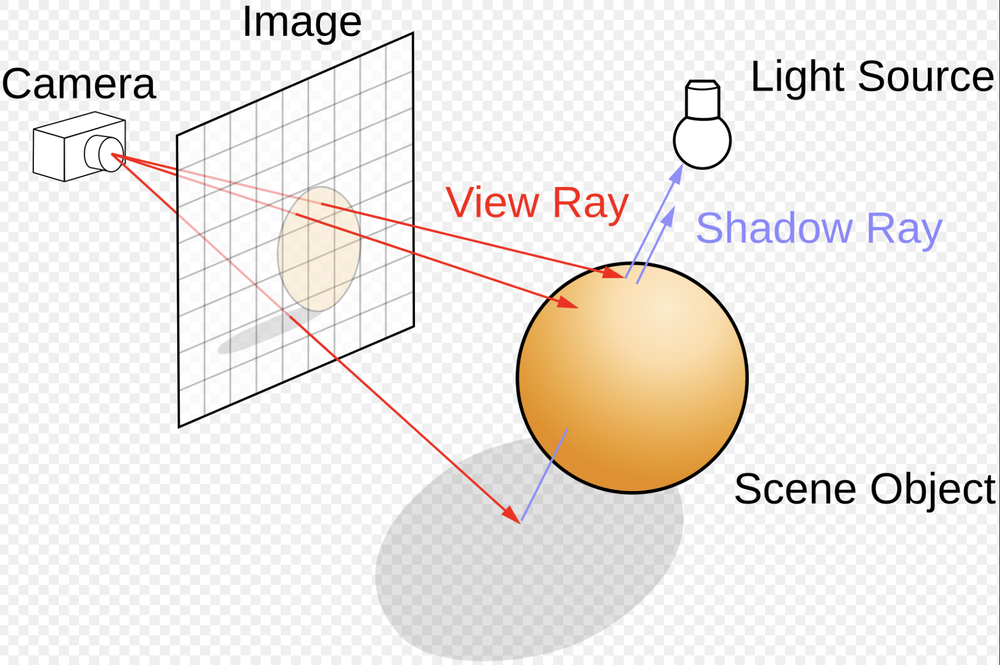
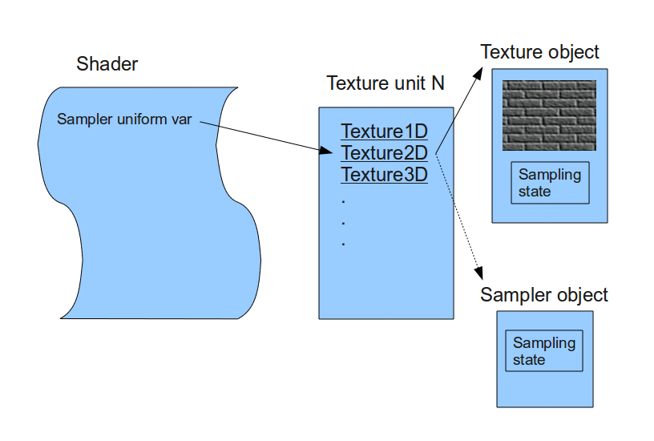
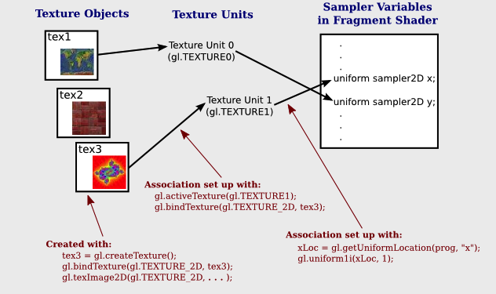

.. _opengl:

OpenGL
======

.. contents::
   :local:
   :depth: 4

Example of OpenGL program
-------------------------

The following example is from the OpenGL Red Book and its example code  
[#redbook]_ [#redbook-examples]_.

.. rubric:: References/triangles.vert
.. literalinclude:: ../References/triangles.vert

.. rubric:: References/triangles.frag
.. literalinclude:: ../References/triangles.frag

.. rubric:: References/01-triangles.cpp
.. literalinclude:: ../References/01-triangles.cpp
   :language: c++
   :linenos:

Init(): 

- Generate Vertex Array VAOs and bind VAOs[0].

  (glGenVertexArrays(NumVAOs, VAOs);  
  glBindVertexArray(VAOs[Triangles]);  
  glCreateBuffers(NumBuffers, Buffers);)

  A vertex-array object holds various data related to a collection of vertices.  
  Those data are stored in buffer objects and managed by the currently bound  
  vertex-array object.

  - glBindBuffer(GL_ARRAY_BUFFER, Buffers[ArrayBuffer]);

    Because there are many different places where buffer objects can be in  
    OpenGL, when we bind a buffer, we need to specify what we’d like to use it  
    for. In our example, because we’re storing vertex data into the buffer,  
    we use GL_ARRAY_BUFFER. The place where the buffer is bound is known as the  
    binding target.

- According to the counter-clockwise rule in the previous section, triangle  
  primitives are defined in variable `vertices`. After binding OpenGL  
  VBO Buffers[0] to `vertices`, vertex data will be sent to the memory of  
  the server (GPU).  

  Think of the "active" buffer as just a global variable, and there are a bunch  
  of functions that use the active buffer instead of taking using a parameter.  
  These global state variables are the ugly side of OpenGL [#vao-vbo-binding]_  
  and can be replaced with `glVertexArrayVertexBuffer()`,  
  `glVertexArrayAttribFormat()`, etc. Then call `glBindVertexArray(vao)` before  
  drawing in OpenGL 4.5 [#ogl-vavb]_ [#ogl-bluebook-p152]_.

- glVertexAttribPointer(vPosition, 2, GL_FLOAT, GL_FALSE, 0, BUFFER_OFFSET(0)):

  During GPU rendering, each vertex position will be held in `vPosition` and  
  passed to the "triangles.vert" shader through the `LoadShaders(shaders)`  
  function.

glfwSwapBuffers(window):

- You’ve already used double buffering for animation. Double buffering is done  
  by making the main color buffer have two parts: a front buffer that’s  
  displayed in your window; and a back buffer, which is where you render the  
  new image. When you swap the buffers (by calling `glfwSwapBuffers()`, for  
  example), the front and back buffers are exchanged  
  [#redbook-colorbuffer]_.

display():

- Bind VAOs[0], set render mode to GL_TRIANGLES and send vertex data to Buffer
  (gpu memory, OpenGL pipeline). Next, GPU will do rendering pipeline descibed
  in next section.

The triangles.vert has input vPosition and no output variable, so using 
gl_Position default varaible without declaration. The triangles.frag has not 
defined input variable and has defined output variable fColor instead of using
gl_FragColor.

The "in" and "out" in shaders above are "type qualifier". 
A type qualifier is used in the OpenGL Shading Language (GLSL) to modify the 
storage or behavior of global and locally defined variables. These qualifiers 
change particular aspects of the variable, such as where they get their data 
from and so forth [#ogl-qualifier]_. 

Though attribute and varying are removed from later version 1.4 of OpenGL,
many materials in website using them [#ogl-qualifier-deprecate]_ 
[#github-attr-varying-depr]_. 
It's better to use "in" and "out" to replace
them as the following code.
OpenGL has a few ways to binding API's variable with shader's variable.
glVertexAttrib* as the following code and glBindAttribLocation() 
[#ogl-layout-q]_, ...

.. rubric:: replace attribute and varying with in and out
.. code-block:: c++

  uniform float scale;
  layout (location = 0) attribute vec2 position;
  // layout (location = 0) in vec2 position;
  layout (location = 1) attribute vec4 color;
  // layout (location = 1) in vec4 color;
  varying vec4 v_color;
  // out v_color

  void main()
  {
    gl_Position = vec4(position*scale, 0.0, 1.0);
    v_color = color;
  }

.. code-block:: c++

  // OpenGL API
  GLfloat attrib[] = { x * 0.5f, x * 0.6f, x* 0.4f, 0.0f };
  // Update the value of input attribute 1 : layout (location = 1) in vec4 color
  glVertexAttrib4fv(1, attrib);

.. code-block:: c++

  varying vec4 v_color;
  // in vec4 v_color;

  void main()
  {
    gl_FragColor = v_color;
  }

An OpenGL program is made of two shaders [#monstar-lab-opengl]_ 
[#glumpy-shaders]_:

- The vertex shader is (commonly) executed once for every vertex we want to 
  draw. It receives some attributes as input, computes the position of this 
  vertex in space and returns it in a variable called gl_Position. It also 
  defines some varyings.

- The fragment shader is executed once for each pixel to be rendered. It 
  receives some varyings as input, computes the color of this pixel and 
  returns it in a variable called fColor.

Since we have 6 vertices in our buffer, this shader will be executed 6 times by 
the GPU (once per vertex)! We can also expect all 6 instances of the shader to 
be executed in parallel, since a GPU have so many cores.

.. _rendering3d:

3D Rendering
------------

3D animation is the process of creating moving images by manipulating digital 
objects within a three‑dimensional space.
3D rendering is the process of converting 3D models into 2D images on a  
computer [#3drendering_wiki]_.

Based on the previous section of 3D modeling, the 3D modeling tool will  
generate a 3D vertex model and OpenGL code. Then, programmers may manually  
modify the OpenGL code and add or update shaders. 

In section :ref:`sw-stack`, we mentioned the GPU will generate the rendering
image for each frame according the 3D Inforamtion and Uniform Updates sent from
CPU, and write each of the final frame of data in the form of color pixels to 
framebuffer (video memory) as :numref:`in-out-rendering`.

.. _animation-parameters:

Animation Parameters
********************

✅ CPU only updates small animation parameters named **Uniform Updates** as
appeared in :numref:`graphic_sw_stack-2`; GPU computes the heavy per‑vertex work.

The 3D animation will  
trigger the 3D rendering process for each 2D image drawing accoriding the
**Uniform Updates**.

The “small animation parameters” updated by the CPU are formally called:

✔ Uniform updates

✔ Constant buffer updates

✔ Per‑frame / per‑draw constants

✔ Bone matrix palette updates (for skinning)

✔ Morph weight updates (for morphing)

These are the correct technical terms used in modern graphics pipelines.

⚓ The Proper Term: “Uniform Updates”

The most accurate and universal name is:

✅ Uniform updates

or

✅ Updating uniform buffers

Because the CPU is updating uniform data that the GPU reads during shading.

Examples of uniform data:

•  bone matrices
•  morph weights
•  animation time
•  material parameters
•  camera matrices
•  light parameters

These are small, constant‑for‑the‑draw values.

⚓ More Specific Terms Used in Game Engines

1. Animation Parameters

Used in animation systems:

- “animation parameters”
- “skinning parameters”
- “bone palette”
- “morph weights”

2. Per‑Frame Constants

Used in engine architecture:

- “frame constants”
- “per‑frame constant buffer”
- “global shader constants”

3. Per‑Draw Constants

Used in render pipelines:

- “per‑draw uniform block”
- “per‑object constant buffer”
- “material constant buffer”

⚓ In Modern APIs (GL, Vulkan, DirectX)

OpenGL

- Uniforms
- Uniform Buffer Objects (UBOs)
- Shader Storage Buffer Objects (SSBOs)

DirectX

- Constant Buffers (CBuffers)

Vulkan

- Descriptor sets
- Uniform buffers

All refer to the same concept:  
small CPU‑updated data that the GPU reads during shading.

.. _three-d-rendering-pipeline:

3D Rendering Pipeline
*********************

The steps are shown in :numref:`short_rendering_pipeline`.

.. _short_rendering_pipeline: 
.. figure:: ../Fig/opengl/short-rendering-pipeline.png
  :align: center
  :scale: 50 %

  3D Graphics Rendering Pipeline [#cg_basictheory]_

- A fragment can be treated as a pixel in 3D spaces, which is aligned with the 
  pixel grid, with attributes such as position, color, normal and texture.

From the previous :numref:`graphic_sw_stack-2` and :numref:`in-out-rendering` 
in section :ref:`sw-stack`, we introduce the 3D anmiation data are classified 
as follows:

-  **Vertex Data = 3D model information** (the mesh (geometry), such as VBO/VAO)
-  **Animation Parameters = per‑frame uniform updates** (transforms, bone 
   matrices, camera, materials, ...)

The complete steps of 3D Rendering pipeline, **excluding animation** are shown 
in the :numref:`rp:left` from the OpenGL website [#rendering]_ and 
in the :numref:`rp:right`. 
The website also provides a description for each stage.
To clarify the modern GPU pipeline, :numref:`gpu-pipeline` shows the use of 
Primitive Assembly (fixed-function) and Primitive Setup (fixed-function).

.. list-table::
   :widths: 30 70
   :align: center

   * - .. _rp:left:
       .. figure:: ../Fig/opengl/rendering_pipeline.png
          :scale: 50 %

          Diagram of the Rendering Pipeline. The blue boxes are programmable 
          shader stages. Shaders with dashed outlines indicate optional shader 
          stages.

     - .. _rp:right: 
       .. figure:: ../Fig/opengl/OpenGL-pipeline.png
          :scale: 30 %

          OpenGL pipeline in blue book

.. _gpu-pipeline: 
.. graphviz:: ../Fig/opengl/gpu-pipeline.gv
  :caption: Modern GPU Pipeline

As shown in :numref:`gpu-pipeline`:

- Vertex Shader and Tessellation: processing and transform for **vertices** 
  data.
- Primitive Processing: processing and transform for **primitives** data.
- Rasterizer: **Primitives → Fragment**.
- Fragment Shader: **Fragment → Colored Fragment**.

As illustred in :ref:`cross-product` section, 

✔️  Each mesh (triangle or primitive) has a fixed “outer” and “inner” side,
determined by CCW ordering in object space.

✔️  By reading these CCW-ordered vertices sequentially, the shape and surface 
orientation of the 3D model can be constructed.

✔️  There is no need to wait for the entire mesh to be received; once three 
CCW-ordered vertices are available, each triangle can be processed correctly.

✔️  When the camera moves to the inside an object: CCW ↔ CW flips.

This means:

✔️  Vertex Shader and Tessellation: **may processing each vertex independently**
as long as the vertex order is preserved.

✔️  Once **three CCW-ordered vertices are available**, Primitive Assembly can 
convert them into a triangle and pass it to the next pipeline stage.

   - For example: once v0,v1,v2,v3 are available, Primitive Assembly outputs:

     Triangle A (v0,v1,v2)

     Triangle B (v2,v3,v0)

After vertices are assembled into
primitives (such as triangles), the front-facing and back-facing surfaces can 
be determined, and the hidden primitives can be removed.

The Red Book and Blue Book show only **Vertex Specification** and 
**Vertex Data** in the rendering flow because 
they **never show Animation Parameters as part of the rendering flow**.
The animation flow from CPU to GPU is shown in
:numref:`short-rendering-pipeline-shaders-cpu-gpu`, based on 
:numref:`short_rendering_pipeline`.

.. _short-rendering-pipeline-shaders-cpu-gpu: 
.. graphviz:: ../Fig/opengl/short-rendering-pipeline-shaders-cpu-gpu.gv
  :caption: CPU and GPU Pipeline For Shaders

Each draw call may correspond to:

- one mesh
- one submesh
- one meshlet (in mesh‑shader pipelines)
- or many meshes batched together

Although the Rendering Pipeline shown in :numref:`rp:left` and
:numref:`rp:right` do not explicitly include per-frame animation flow—
because the inputs are labeled **Vertex Specification** and **Vertex Data** and
they do not show Animation Parameters as part of the rendering process—the 
pipeline is still applicable.

However the following table from OpenGL rendering pipeline Figure 1.2 and its 
stages from the book *OpenGL Programming Guide, 9th Edition* [#redbook]_ is 
broad enough to cover animation.

.. list-table:: OpenGL rendering pipeline from page 10 and page 36 of book
   "OpenGL Programming Guide 9th Edition" [#redbook]_ and [#rendering]_.
   :widths: 20 60
   :header-rows: 1

   * - Stage.
     - Description
   * - Vertex Shading
     - **Vertex → Vertex and other data such as color for later passes.**
       For each vertex issued by a drawing command, a vertex shader processes
       the data associated with that vertex.
       **Vertex Shader:** provides the Vertex → Vertex transformation effects
       controlled by the users.
   * - Tessellation Shading
     - **Create more detail on demand when zoomed in.**
       After the vertex shader processes each vertex, the tessellation shader
       stage (if active) continues processing.
       The tessellation stage is actually divided into two shaders known as the 
       **tessellation control shader** and the **tessellation evaluation 
       shader**. A single patch from Tesslation Control Shader (TCS) and 
       Tesslation Evaluation Shader (TVS) can generate **millions of 
       micro‑triangles**. See reference below.
   * - Primitive Assembly
     - This is a fixed‑function hardware stage: forms triangles/lines/points.
   * - Geometry Shader
     - **Primitive Transformation**: output zero primitives (cull), output one 
       primitive (pass‑through), output many primitives (amplify) and output 
       different topology (e.g., point → quad)
       Allows additional processing of geometric primitives.
       This stage may create new primitives before rasterization. 
       The Geometry shading stage is another optional stage that can modify 
       entire geometric primitives within the OpenGL pipeline. This stage 
       operates on individual geometric primitives allowing each to be modified. 
       In this stage, you might generate more geometry from the input primitive, 
       change the type of geometric primitive (e.g., converting triangles to 
       lines), or discard the geometry altogether.
   * - Culling
     - **Remove entire primitives** that are hidden or outside the viewport.
   * - Clipping
     - **Clip the hidden portions** of the primitive, separating it into visible 
       and hidden parts and discarding the hidden portions.
   * - Primitive Setup (rasterization preparation)
     - This stage: takes the final primitive (after GS), computes edge 
       equations, computes barycentric interpolation coefficients, determine 
       rasterization rules and prepare for triangle traversal.
   * - Rasterization
     - **Geometric Primitives → Fragment**.
       The job of the rasterizer is to determine which 
       screen locations are **covered** by a particular piece of geometry (point, 
       line, or triangle). Knowing those locations, along with the input vertex 
       data, the rasterizer linearly **interpolates** the data values for each 
       varying variable in the fragment shader and sends those values as inputs 
       into your fragment shader. A fragment can be treated as a pixel in 3D 
       spaces, which is aligned with the pixel grid, with attributes such as 
       position, color, normal and texture.
       Early Depth and Stencil Tests (**Early‑Z**): reject hidden fragments 
       before shading.
   * - Fragment Shading
     - **Fragment → Colored Fragment**. **Determine color for each pixel.** 
       In this stage, a fragment’s **color and depth** values are computed and 
       then sent for further processing in the **fragment-testing** and 
       **blending** parts of the pipeline.
       The final stage where you have programmable control over the color of 
       a screen location is fragment shading. In this shader stage, you use a 
       shader to determine the fragment’s final color (although the next stage, 
       per-fragment operations, can modify the color one last time) and 
       potentially its depth value. Fragment shaders are very powerful, as they 
       often employ texture mapping to augment the colors provided by the 
       vertex processing stages. A fragment shader may also terminate 
       processing a fragment if it determines the fragment shouldn’t be drawn; 
       this process is called fragment discard. A helpful way of thinking about 
       the difference between shaders that deal with vertices and fragment 
       shaders is this: vertex shading (including tessellation and geometry 
       shading) determines where on the screen a primitive is, while fragment 
       shading uses that information to determine what color that fragment will 
       be.

.. list-table:: Continue OpenGL rendering pipeline from page 10 and page 36 of 
   book "OpenGL Programming Guide 9th Edition" [#redbook]_ and [#rendering]_.
   :widths: 20 60
   :header-rows: 1

   * - Stage.
     - Description
   * - Per-Fragment Operations
     - During this stage, a **fragment’s visibility** is determined using depth 
       testing (also commonly known as z-buffering) and stencil testing. 
       If a fragment successfully makes it through all of the enabled tests, 
       it may be written directly to the framebuffer, updating the color 
       (and possibly depth value) of its pixel, or 
       **if blending is enabled, the fragment’s color will be combined with 
       the pixel’s current color to generate a new color that is written into 
       the framebuffer.**
   * - Compute shading stage
     - **Compute shader:** may be applied in any stage.
       This is not part of the graphical pipeline like the stages above, but 
       stands on its own as the only stage in a program. A compute shader 
       processes generic work items, driven by an application-chosen range, 
       rather than by graphical inputs like vertices and fragments. 
       Compute shaders can process buffers created and consumed by other shader 
       programs in your application. 
       This includes framebuffer post-processing effects or really anything you 
       want. Compute shaders are described in Chapter 12 of Red Book, 
       “Compute Shaders” [#redbook-p36]_.

**Tessllation**

- Tessellation Shading: 
  The core problem that Tessellation deals with is the static nature of 3D models
  in terms of their detail and polygon count. The thing is that when we look at 
  a complex model such as a human face up close we prefer to use a highly 
  detailed model that will bring out the tiny details (e.g. skin bumps, etc). 
  A highly detailed model automatically translates to more triangles and more 
  compute power required for processing. ... 
  One possible way to solve this problem using the existing features of OpenGL 
  is to generate the same model at multiple levels of detail (LOD). For example, 
  highly detailed, average and low. We can then select the version to use based 
  on the distance from the camera. This, however, will require more artist 
  resources and often will not be flexible enough. ...
  Let's take a look at how Tessellation has been implemented in the graphics 
  pipeline. The core components that are responsible for Tessellation are two 
  new shader stages and in between them a **fixed function** stage that can be 
  configured to some degree but does not run a shader. The first shader stage 
  is called **Tessellation Control Shader (TCS)**, the **fixed function** stage 
  is called the **Primitive Generator (PG)**, and the second shader stage is 
  called **Tessellation Evaluation Shader (TES)**. 
  Some GPU havn't this fixed function stage implemented in HW and even havn't
  provide these TCS, TES and Gemoetry Shader. User can write 
  **Compute Shaders** instead for this on-fly detail display.
  This surface is usually defined by some **polynomial formula** and the idea 
  is that moving a **CP** has an effect on the entire surface. ...
  The group of CPs is usually called a **Patch** [#ts-tu30]_.
  The data flow in Tessllation Stage between TCS, Fixed-Function Tessellator 
  and TES is illustrated in :numref:`imr-rendering-pipeline-1`.
  Chapter 9 of Red Book [#redbook]_ has details. 
  The next section :ref:`tessellation-ex` describes the details for the 
  Tessallation with an example.

- Tessellation **cannot** decrease the resolution of vertices from the VS.
  The Geometry Shader can **reduce geometry** (by discarding primitives), but it
  **cannot** reduce the number of input vertices coming from VS/TES.
  The rasterizer can **reduce fragments**, but it cannot reduce vertices.

**Data Flow**

Sumarize the OpenGL Rendering Pipeline as shown in the 
:numref:`imr-rendering-pipeline-1` and 
:numref:`imr-rendering-pipeline-2`.

.. _imr-rendering-pipeline-1: 
.. graphviz:: ../Fig/opengl/imr-rendering-pipeline-1.gv
  :caption: The part 1 of GPU Rendering Pipeline Stages

.. _imr-rendering-pipeline-2: 
.. graphviz:: ../Fig/opengl/imr-rendering-pipeline-2.gv
  :caption: The part 2 of GPU Rendering Pipeline Stages

.. raw:: latex

   \clearpage

The data flow through the OpenGL Shader and the details flow
in TCS, Fixed-Function Tessellator and TES are described in below.

.. list-table:: Data Flow Through the OpenGL Shader Pipeline
   :widths: 20 35 35 45
   :header-rows: 1

   * - Shader Stage
     - Input Data (from CPU or previous stage)
     - Output Data (to next stage)
     - How GPU Hardware Uses These Data (with Stage Name)

   * - Vertex Shader
     - - Per-vertex attributes:

         - Positions (vec3/vec4)
         - Normals, tangents
         - Texture coordinates
         - Vertex colors
         - Skinning weights/indices

       - Uniforms and UBOs
       - Textures / samplers
     - - gl_Position (clip-space)

       - Varyings
       - Optional point size

     - - **Vertex Processing Stage**:

         - ALUs transform vertices
         - Writes positions into Primitive Assembly
         - Stores varyings in interpolation registers

   * - Tessellation Control Shader (TCS)
     - - Patch control points
       - Uniforms
       - Per-patch attributes
     - - **Modified control points**: gl_out
       - **Tessellation levels**: gl_TessLevelInner, gl_TessLevelOuter
     - - **Tessellation Control Stage**:

         - Writes tessellation levels to fixed-function tessellator
         - Stores control points in patch memory

   * - Fixed‑Function Tessellator (TS)
     - - Modified control points: gl_out
       - Tessellation levels:  gl_TessLevelInner, gl_TessLevelOuter
       - Per-patch attribute (triangles, quads, isolines)
       - Partitioning mode (integer, fractional_even, fractional_odd)
       - Winding order
     - - **Tessellated coordinates (u,v,w)**: gl_TessCoord
       - Bypass modified Control Points
     - - **Fixed‑Function Tessellator (TS)**, also name as **Primitive Generator (PG)**:

         - Generates tessellated domain coordinates (u,v,w) to TES

   * - Tessellation Evaluation Shader (TES)
     - - Tessellated coordinates (u,v,w): gl_TessCoord
       - modified Control Points
       - Uniforms
       - gl_PrimitiveID
     - - **Tessellated Vertices**: gl_Position
       - Any per‑vertex **varyings** for GS or rasterizer
       - Optional custom attributes
     - - **Tessellation Evaluation Stage**:

         - ALUs compute final vertex positions
         - Outputs to Primitive Assembly
         - Sends varyings to interpolation hardware

   * - Geometry Shader
     - - Assembled primitives
       - All varyings
     - - Zero or more primitives
       - New varyings
       - New gl_Position
     - - **Geometry Processing Stage**:

         - Allocates per-primitive scratch memory
         - Emits new primitives
         - Expands or reduces geometry

.. list-table:: Data Flow Through the OpenGL Shader Pipeline Continue
   :widths: 20 35 35 45
   :header-rows: 1

   * - Shader Stage
     - Input Data (from CPU or previous stage)
     - Output Data (to next stage)
     - How GPU Hardware Uses These Data (with Stage Name)

   * - Rasterizer (Fixed Function)
     - - Primitives (triangles/lines/points)
       - Per-vertex varyings
     - - Fragments
       - Interpolated varyings
       - gl_FragCoord
     - - **Rasterization Stage**:

         - Barycentric units interpolate varyings
         - Generates fragments
         - Sends fragments to fragment shader cores

   * - Fragment Shader
     - - gl_FragCoord
       - Interpolated varyings
       - Textures / samplers
       - Uniforms
     - - gl_FragColor or user-defined outputs
       - Depth override (optional)
     - - **Fragment Processing Stage**:

         - ALUs compute pixel color
         - Texture units fetch texels
         - Outputs color/depth to ROP

   * - Output Merger / ROP (Fixed Function)
     - - Fragment shader outputs
       - Depth/stencil values
       - Blending state
     - - Final framebuffer color
       - Updated depth/stencil buffers
     - - **Output Merger Stage**:

         - Performs depth/stencil tests
         - Applies blending
         - Writes final pixels to framebuffer memory
         - Handles MSAA resolve

**Varying**

A varying is a piece of data that:

-  Comes out of the vertex shader
-  Gets interpolated by the rasterizer
-  Arrives as input to the fragment shader

It is called **varying** because its value **varies across the surface of a 
triangle**.

.. list-table:: Examples of Common Varyings
   :widths: 20 30 40
   :header-rows: 1

   * - Varying Name
     - Meaning
     - Why It Varies Across the Primitive

   * - vNormal
     - Surface normal at each vertex
     - Lighting requires a smoothly changing normal across the triangle
       so per-pixel shading can compute correct diffuse and specular terms

   * - vUV
     - Texture coordinates
     - Each pixel needs its own UV to sample the correct texel from the texture

   * - vColor
     - Vertex color (per-vertex material tint)
     - Enables smooth color gradients or per-vertex painting effects

   * - vWorldPos
     - World-space position of the vertex
     - Used for per-pixel lighting, reflections, shadows, and screen-space effects;
       must be interpolated so each fragment knows its own world position

For 2D animation, the model is created by 2D only (1 face only), so it only can be 
viewed from the same face of model. If you want to display different faces of model,
multiple 2D models need to be created and switch these 2D models from face(flame) to 
face(flame) from time to time [#2danimation]_.

.. _tessellation-ex:

Tessellation Example
********************

In Chapter 9 (Tessellation), the Red Book [#redbook]_ focuses on:

- gl_TessLevelOuter[]
- gl_TessLevelInner[]

It never mentioned to gnerate modified CPs in TCS.
The following example give the output for  (TCS → TS → TES) in patching a
single rectangle.

**An example for Inflated 4×4 Bézier Patch (TCS → TS → TES)**

The following diagram illustrates the complete OpenGL tessellation
pipeline for a **4×4** bicubic Bézier patch on **1 single rectangle**. 
Only the four interior control points (5, 6, 9, 10) are lifted off the plane, 
producing a smooth inflated surface.

**Tessellation Control Shader (TCS)**: output:

- **modified Control Points (CPs, Patch)**: gl_out
- **Tessellation level**: gl_TessLevelInner, gl_TessLevelOuter

Another name for **CPs** is **Patch**.

The TCS outputs 16 CPs arranged in a 4×4 grid.  
Only CPs 5, 6, 9, and 10 are elevated to create curvature.

.. code-block:: glsl

   #version 450 core
   layout(vertices = 16) out;

   void main()
   {
       // Copy all CPs
       gl_out[gl_InvocationID].gl_Position =
           gl_in[gl_InvocationID].gl_Position;

       // Inflate interior CPs
       if (gl_InvocationID == 5 ||
           gl_InvocationID == 6 ||
           gl_InvocationID == 9 ||
           gl_InvocationID == 10)
       {
           gl_out[gl_InvocationID].gl_Position +=
               vec4(0.0, 0.0, 1.0, 0.0);
       }

       // Tessellation levels
       if (gl_InvocationID == 0) {
           gl_TessLevelOuter[0] = 4.0;
           gl_TessLevelOuter[1] = 4.0;
           gl_TessLevelOuter[2] = 4.0;
           gl_TessLevelOuter[3] = 4.0;

           gl_TessLevelInner[0] = 4.0;
           gl_TessLevelInner[1] = 4.0;
       }
   }

**Fixed-Function Tessellator (TS)**, also name as **Primitive Generator 
(PG)**: output:

- **Tessellated coordinates (u,v,w)**: gl_TessCoord

The PG takes the TLs and based on their values generates a **set of points** 
inside the triangle. Each point is defined by its own barycentric coordinate.
The set of points named **Tessellated coordinates**.

The grid size depends on tessellation levels:

- If gl_TessLevelOuter[0..3] = 4.0 and gl_TessLevelInner[0..1] = 4.0 → you 
  get a 5×5 grid, **Tessellated coordinates (u,v,w)**
- If you set 8.0 → you get a 9×9 grid
- If you set 2.0 → you get a 3×3 grid

The fixed‑function tessellator generates a 5×5 evaluation grid
for tessellation level 4.0.  
No shading language code is written for this stage.

**Tessellation Evaluation Shader (TES)**: output:

- **Tessellated Vertices**: gl_Position

For each ``(u, v)``, the TES computes the surface point ``P(u, v)`` as:

.. math::

   P(u, v)
   \;=\;
   \sum_{i=0}^{3} \sum_{j=0}^{3}
   B_i(u)\, B_j(v)\, P_{ij}

where the Bernstein basis functions are:

.. math::

   B_0(t) = (1 - t)^3,\qquad
   B_1(t) = 3t(1 - t)^2,\qquad
   B_2(t) = 3t^2(1 - t),\qquad
   B_3(t) = t^3.

The TES evaluates the Bézier surface at each tessellated (u, v)
coordinate using the 16 CPs.

.. code-block:: glsl

   #version 450 core
   layout(quads, equal_spacing, cw) in;

   float B(int i, float t) {
       if (i == 0) return (1 - t) * (1 - t) * (1 - t);
       if (i == 1) return 3 * t * (1 - t) * (1 - t);
       if (i == 2) return 3 * t * t * (1 - t);
       return t * t * t;
   }

   void main()
   {
       float u = gl_TessCoord.x;
       float v = gl_TessCoord.y;

       vec4 p = vec4(0.0);
       int idx = 0;

       for (int i = 0; i < 4; ++i) {
           float bu = B(i, u);
           for (int j = 0; j < 4; ++j) {
               float bv = B(j, v);
               p += gl_in[idx].gl_Position * (bu * bv);
               idx++;
           }
       }

       gl_Position = p;
   }

**Result**

The output for (TCS → TS → TES) in patching a single rectangle as the 
following table. 

Inflated Bézier Patch: Control Points and Evaluated Surface (vec4)

All control points use homogeneous coordinates (x, y, z, w = 1.0).
Evaluated surface points P(u,v) are also vec4.

.. list-table::
   :header-rows: 1
   :widths: 10 20 30 30

   * - **CP Index**
     - **Grid Position (i, j)**
     - **Control Point (x, y, z, w)**
     - **Evaluated P(u,v) = vec4**
   * - 0
     - (0, 0)
     - (0, 0, 0, 1)
     - (0.0, 0.0, 0.0, 1)
   * - 1
     - (1, 0)
     - (1, 0, 0, 1)
     - (1.0, 0.0, 0.0, 1)
   * - 2
     - (2, 0)
     - (2, 0, 0, 1)
     - (2.0, 0.0, 0.0, 1)
   * - 3
     - (3, 0)
     - (3, 0, 0, 1)
     - (3.0, 0.0, 0.0, 1)
   * - 4
     - (0, 1)
     - (0, 1, 0, 1)
     - (0.0, 1.0, 0.0, 1)
   * - 5
     - (1, 1)
     - (1, 1, 1, 1)
     - (1.0, 1.0, 0.5625, 1)
   * - 6
     - (2, 1)
     - (2, 1, 1, 1)
     - (2.0, 1.0, 0.5625, 1)
   * - 7
     - (3, 1)
     - (3, 1, 0, 1)
     - (3.0, 1.0, 0.0, 1)
   * - 8
     - (0, 2)
     - (0, 2, 0, 1)
     - (0.0, 2.0, 0.0, 1)
   * - 9
     - (1, 2)
     - (1, 2, 1, 1)
     - (1.0, 2.0, 0.5625, 1)
   * - 10
     - (2, 2)
     - (2, 2, 1, 1)
     - (2.0, 2.0, 0.5625, 1)
   * - 11
     - (3, 2)
     - (3, 2, 0, 1)
     - (3.0, 2.0, 0.0, 1)
   * - 12
     - (0, 3)
     - (0, 3, 0, 1)
     - (0.0, 3.0, 0.0, 1)
   * - 13
     - (1, 3)
     - (1, 3, 0, 1)
     - (1.0, 3.0, 0.0, 1)
   * - 14
     - (2, 3)
     - (2, 3, 0, 1)
     - (2.0, 3.0, 0.0, 1)
   * - 15
     - (3, 3)
     - (3, 3, 0, 1)
     - (3.0, 3.0, 0.0, 1)

.. list-table::
   :widths: 50 50
   :align: center

   * - .. _ts-ex:left:
       .. figure:: ../Fig/opengl/ts-ex.png
          :scale: 50 %

          The final rendering result for 5×5 tessellated mesh.

     - .. _ts-ex:right: 
       .. figure:: ../Fig/opengl/ts-gs-ex.png
          :scale: 50 %

          Geometry Shader (GS) can expand a 5×5 tessellated grid into a 6×6 mesh

The following TCS glsl from the Red Book can patch high or low resolution of 
CPs at runtime according the distance of the squre vertices.

Specifying Tessellation Level Factors Using Perimeter Edge Centers.

.. code-block:: glsl

   #version 450 core

   // Each patch has four precomputed edge centers:
   //   edgeCenter[0] = left edge center
   //   edgeCenter[1] = bottom edge center
   //   edgeCenter[2] = right edge center
   //   edgeCenter[3] = top edge center
   struct EdgeCenters {
       vec4 edgeCenter[4];
   };

   // Array of edge-center data, one entry per patch
   uniform EdgeCenters patch[];

   // Camera position in world space
   uniform vec3 EyePosition;

   layout(vertices = 16) out;

   void main()
   {
       // Pass through control points unchanged
       gl_out[gl_InvocationID].gl_Position =
           gl_in[gl_InvocationID].gl_Position;

       // Synchronize all invocations
       barrier();

       // Only invocation 0 computes tessellation levels
       if (gl_InvocationID == 0)
       {
           // Loop over the four perimeter edges
           for (int i = 0; i < 4; ++i)
           {
               // Distance from eye to this edge center
               float d = distance(
                   patch[gl_PrimitiveID].edgeCenter[i],
                   vec4(EyePosition, 1.0)
               );

               // Scale factor controlling how quickly tessellation increases
               const float lodScale = 2.5;

               // Convert distance to tessellation level
               float tessLOD = mix(
                   0.0,
                   gl_MaxTessGenLevel,
                   d * lodScale
               );

               gl_TessLevelOuter[i] = tessLOD;
           }
       #if 1
           // Compute the inner tessellation as the average of opposing outer 
           // edges: differently from Red Book.
           // It’s what most engines (Unreal, Unity HDRP, Vulkan samples) do.
           // Inner tessellation is the average of outer levels
           float inner = 0.5 *
               (gl_TessLevelOuter[0] + gl_TessLevelOuter[2]);

           inner = clamp(inner, 0.0, gl_MaxTessGenLevel);
           gl_TessLevelInner[0] = inner;
           gl_TessLevelInner[1] = inner;
       #else
           // The Red Book computes outer tessellation levels first, then 
           // derives the inner levels from the last computed tessLOD.
           tessLOD = clamp(0.5 * tessLOD, 0.0, gl_MaxTessGenLevel);
           gl_TessLevelInner[0] = tessLOD;
           gl_TessLevelInner[1] = tessLOD;
       #endif
       }
   }

The texture function with the argument DisplacementMap in the Red Book, as 
shown in the following code, does not return color data as in the Fragment 
Shader. 
It returns the vertex position data for displacement, such as a roughness map 
or anything related to surface appearance.

.. code-block:: glsl

  p += texture(DisplacementMap, gl_TessCoord.xy);

Mobile GPU 3D Rendering
***********************

The traditional desktop GPUs is **IMR — Immediate‑Mode Rendering**:
Cache misses dominate bandwidth.

**TBDR — Tile‑Based Deferred Rendering**:
Cache misses are nearly eliminated.

.. note:: 

   **Idea:**

   1. TBDR divides the whole frame into small tiles that fit entirely into 
   on‑chip **SRAM**. 

   2. Remove stages of Tessellation Control Shader (TCS), Tessellation 
   Evaluation Shader (TES) and Geometry Shader (GS) since they are optional stages 
   are shown in :numref:`rp:right`.
   Instead, developers use **compute shaders** before the graphics pipeline to 
   generate meshlets, perform LOD selection, or add extra geometric detail for 
   close‑up **room-in** effects is shown as 
   :numref:`mobile-mesh-to-meshlets-to-render`. 

★ TBDR reduces **cache‑miss** rate by roughly **10×–50×** compared to IMR, 
because all intermediate color/depth/stencil traffic stays in on‑chip 
tile memory instead of going to L2/DRAM.

★ Desktop GPUs adopt IMR partly because GS/Tess/Mesh Shaders cannot run 
efficiently on TBDR.
In addition, desktop GPUs adopt IMR because they have the **power**, 
**bandwidth**, and architectural freedom to **support unpredictable 
geometry pipelines** and massive workloads that would break TBDR’s 
tile‑based constraints.

TBDR — Tile‑Based Deferred Rendering
^^^^^^^^^^^^^^^^^^^^^^^^^^^^^^^^^^^^

⚠️  For **low power** mobile device, mobile GPUs use **tile-based** 
rendering to **reduce the traffice to DRAM** as 
described below:

The traditional desktop GPUs is IMR — Immediate‑Mode Rendering:

1. IMR: “Draw call arrives → render immediately”

CPU issues DrawCall #1

→ GPU transforms vertices

→ GPU rasterizes fragments

→ GPU writes to DRAM

It never waits to see the rest of the frame.

2. TBDR: “Draw call arrives → store geometry, don’t render yet”. 
TBDR processes it into two phases as follows:

**Phase 1 — Binning** (Full‑Frame Geometry Processing) is shown as 
:numref:`tbdr-pipeline`.

.. _tbdr-pipeline: 
.. graphviz:: ../Fig/opengl/tbdr-pipeline.gv
  :caption: TBDR Pipeline 

When a draw call arrives on a TBDR GPU:

→ It runs the vertex shader

→ It transforms all triangles

→ It determines which tiles each triangle touches

→ It stores triangle references in **per‑tile lists** is shown as follows:

.. rubric:: Example of per‑tile lists
.. code-block:: text

   Tile 0 → triangles: [T1, T7, T8, T20]
   Tile 1 → triangles: [T2, T3, T7]
   Tile 2 → triangles: [T4, T5, T6, T9, T10]
   ...

**Phase 2 — Tile Rendering** (Deferred Shading)

For each tile:

→ Load tile’s triangle list

→ Rasterize only those triangles

→ Shade only visible fragments

→ Keep all intermediate buffers in on‑chip **SRAM**

→ Write final tile to DRAM once

★ As you can see, tile is a small part of rendering frame. 
In Phase 2 — Tile Rendering, GPU rendering each tile and
keep the rendering result of each **tile in SRAM**.

TBDR Rendering
^^^^^^^^^^^^^^

✅ Rendering flow: 

   - Vertax Shader → Primitive Setup → **Tile-Based Culling and Clipping** → 
     Rasterization → Fragment Shader

TBDR architectures depend on:

- predictable geometry counts,
- small on-chip tile memory,
- minimal external memory traffic.

⚠️  As described in section :ref:`three-d-rendering-pipeline`,
Geometry Shader (GS) can generate both more vertices and more 
primitives than it receives. 
A single patch from Tesslation Control Shader (TCS) and Tesslation Evaluation 
Shader (TVS) can generate millions of micro‑triangles.
GS and Tessellation introduce **unbounded geometry amplification**, which
breaks these assumptions and forces expensive DRAM spills for TBDR as shown in 
:numref:`mobile-tile-base-pipeline`,

.. _mobile-tile-base-pipeline: 
.. graphviz:: ../Fig/opengl/mobile-tile-base-pipeline.gv
  :caption: CPU and GPU Pipeline For Shaders in Mobile Device

This is why Mali,
PowerVR, Apple, and Adreno mobile GPUs all omit these stages [#arm-gs]_
[#img-gs]_.

Developers manually invoke **compute shaders** to generate meshlets or 
additional geometry, adding extra geometric detail for close-up **zoom-in** 
effects.
Both Mali and PowerVR GPUs then run the standard vertex shader on the generated 
results.

✔ Step 1 — Developer dispatches a compute shader

This compute shader can do things like:

- break a **big mesh** into **meshlets** as 
  :numref:`mobile-mesh-to-meshlets-to-render`.
  The mesh and meshlets are described in the :ref:`mesh-shader` next 
  section.
- generate **more vertices** for detail (subdivision, displacement)
- perform **LOD** selection
- cull invisible meshlets
- generate new index/vertex buffers

This is developer‑controlled, not automatic.

.. _mobile-mesh-to-meshlets-to-render: 
.. graphviz:: ../Fig/opengl/mobile-mesh-to-meshlets-to-render.gv
  :caption: CPU and GPU Pipeline For Shader`s in Mobile Device

The compute shader writes results into:

- SSBOs
- vertex buffers
- index buffers

These buffers now contain the final geometry you want to render.

✔ Step 2 — Developer issues a normal draw call

The Mali and PowerVR's rendering flow is illustrated as
:numref:`mobile-rendering-pipeline-shaders-cpu-gpu`.

.. _mobile-rendering-pipeline-shaders-cpu-gpu: 
.. graphviz:: ../Fig/opengl/mobile-rendering-pipeline-shaders-cpu-gpu.gv
  :caption: CPU and GPU Pipeline For Shaders in Mobile Device

- Modern mobile engines instead use **compute shaders** for culling, LOD,
  meshlet prep, and procedural geometry.

✅ Geometry Shaders are notoriously inefficient even on desktop GPUs.
GPU vendors (NVIDIA + AMD + Intel) designed the mesh‑shader pipeline described
in the section :ref:`mesh-shader`.

.. _mesh-shader:

Mesh-Shader Pipeline
********************

A single 3D object can contain 1 mesh, multiple meshes or hundreds of meshes 
(complex characters, vehicles, weapons).

**Reasons**

The purpose of converting **a mesh into small clusters (meshlets)** is 
to give the GPU **small, coherent**, cullable, cache‑friendly work units 
that dramatically improve parallelism, memory locality, and LOD efficiency.

Raw meshes can have anywhere from thousands to millions of vertices/triangles, 
while meshlets intentionally restrict clusters to ~32–128 vertices and 
~32–256 triangles to maximize GPU efficiency.

**Motivation**

NVIDIA, AMD, and Intel all needed:

- a compute‑like geometry pipeline
- meshlet‑based processing
- better culling
- GPU‑driven rendering
- a **replacement** for VS → TCS → TES → GS

  - TCS → Fixed-Function Tessellator → TES: geometry amplification.

    - Fixed‑Function Tessellator: subdivides the patch, generates new domain 
      coordinates and creates the tessellated grid.

    - *Mesh-Shader replaces the fixed‑function tessellator** with compute‑like 
      geometry pipeline.

    - Mesh Shading provides a programmable alternative to the traditional 
      tessellation and geometry-shader stages. 
      A Mesh Shader can implement tessellation-like subdivision and geometry 
      amplification while also integrating operations such as culling, LOD 
      selection, and procedural geometry generation.

So the vendors co‑designed the hardware pipeline.

✔ Microsoft and Khronos (Vulkan) each standardized it in their own APIs

✅ **Solution**: As shown in :numref:`meshlet-offline-to-render`.

.. _meshlet-offline-to-render: 
.. graphviz:: ../Fig/opengl/meshlet-offline-to-render.gv
  :caption: Meshlet Offline To Render

**Rendering Pipeline**

✔ GPU vendors (NVIDIA + AMD + Intel) designed the mesh‑shader pipeline:

3D Modeling Tool Output (big mesh)

→ CPU Meshlet Generator Tool (offline) 

  - Converting **big mesh** into **small clusters (meshlets)** to maximize GPU 
    efficiency.

→ Precomputed meshlets (static clusters)

→ Task Shader (optional)

→ Mesh Shader

3D modeling tools do NOT generate meshlets.  
Meshlets are always generated later, using specialized meshlet‑generation 
→ tools, most commonly:

- NVIDIA meshlet generator (NV_mesh_shader ecosystem)
- meshoptimizer (Khronos‑recommended, open source)
- Engine‑specific meshlet builders (Unreal, Frostbite, etc.)

So the meshlet conversion happens after the model is exported — not inside 
Blender, Maya, 3ds Max, etc.

The animation flow from CPU to GPU for **Traditional**, **Compute Shader** 
based and **Mesh Shader** are 
shown in :numref:`short-rendering-pipeline-shaders-cpu-gpu-2`,
:numref:`short-mobile-rendering-pipeline-shaders-cpu-gpu` and 
:numref:`short-mesh-rendering-pipeline-shaders-cpu-gpu`. 

Mesh shading (Vulkan VK_EXT_mesh_shader, similarly in NV mesh shader) replaces 
the fixed vertex-input + VS + optional tess/GS stages with a compute-like 
geometry pipeline:

.. _short-rendering-pipeline-shaders-cpu-gpu-2: 
.. graphviz:: ../Fig/opengl/short-rendering-pipeline-shaders-cpu-gpu-2.gv
  :caption: CPU and GPU **Traditional** Pipeline For Shaders

.. _short-mobile-rendering-pipeline-shaders-cpu-gpu: 
.. graphviz:: ../Fig/opengl/short-mobile-rendering-pipeline-shaders-cpu-gpu.gv
  :caption: CPU and GPU **Mobile** Pipeline For Shaders

.. _short-mesh-rendering-pipeline-shaders-cpu-gpu: 
.. graphviz:: ../Fig/opengl/short-mesh-rendering-pipeline-shaders-cpu-gpu.gv
  :caption: CPU and GPU **Mesh Shader** Pipeline For Shaders

As in :numref:`short-mesh-rendering-pipeline-shaders-cpu-gpu`,
NVIDIA/AMD desktop provide mesh‑shader to do the following pipeline.

**Task Shader Responsibilities**

The **Task Shader** acts as a coarse-grained work distributor.

Key responsibilities:

- Perform coarse culling at the meshlet or instance level.
- Select appropriate **LODs** for distant geometry.

  - But it does not create new detail like the Tessellation Shaders.

- Build a compact list of meshlets to be processed.
- Determine how many mesh shader workgroups to launch.
- Pass a payload (task data) to mesh shader workgroups.

The task shader does *not* emit vertices or primitives.

**Mesh Shader Responsibilities**

The **mesh shader** replaces the vertex shader, tessellation, and often
the geometry shader. It operates on meshlets inside workgroups.

Key responsibilities:

- Load meshlet vertices and indices from GPU memory.
- Apply transforms, skinning, morphing, and procedural deformation.
- Mesh Shader outputs exactly what the meshlet contains usually, unless you 
  code it manually.
  
  - Custom procedural code inside a Mesh Shader can generate more vertices,
    subdivide triangles, procedurally generate detail, amplify geometry.
    Mesh Shaders replace Vertex Shader, Geometry Shader and Tessellation 
    (optional). But they do not perform automatic tessellation.
    They simply take a meshlet, run a workgroup and output the triangles 
    inside that meshlet.

- Perform fine-grained culling:
  - frustum culling
  - backface culling
  - small triangle culling
  - cluster-level culling
- Generate the final set of vertices and primitives.
- Emit primitives directly to the rasterizer.

Because mesh shaders run in workgroups, they can use shared memory and
synchronize threads, enabling efficient reuse of vertex data.

**Why Meshlets Fit GPU Architecture Well**

Meshlets align naturally with GPU hardware for several reasons:

- **Workgroup-Friendly:**  
  Each meshlet maps cleanly to a single workgroup, keeping memory usage
  predictable and minimizing divergence.

- **Cache Efficiency:**  
  Meshlets maximize vertex reuse and reduce memory bandwidth by grouping
  spatially local geometry.

- **Hierarchical Culling:**  
  - Task shader: coarse culling of entire meshlets.  
  - Mesh shader: fine culling of individual primitives.

- **Reduced CPU Overhead:**  
  The GPU can perform culling, LOD selection, and primitive generation
  without CPU intervention, enabling GPU-driven rendering.

- **Scalable Parallelism:**  
  Each meshlet is processed independently, allowing thousands of
  workgroups to run in parallel across GPU SMs.

Both Mobile GPU and Mesh-Shader GPU convert big mesh to small meshlets and
render them efficiently using GPU SIMT executation and memory hierarchy. 
The comparsion is shown in the following table.

**Comparsion: Mobile GPU (Compute-Shader Based) vs Desktop Mesh-Shader GPU**

The **Mesh Shader** is similar to the previous section of **Mobile 
Compute Shader** based Meshlets as the following table:

.. list-table:: Mobile GPU vs Desktop Mesh-Shader GPU -- **Concept Comparison**
   :header-rows: 1
   :widths: 25 35 35

   * - Concept
     - Mobile GPU (Compute-Shader Based)
     - Desktop Mesh-Shader GPU

   * - **Meshlet generation**
     - **Compute Shader** generates meshlets at runtime
     - **CPU Meshlet Generator Tool** (offline)

   * - Tile-based
     - Yes
     - No

   * - Work distribution
     - Compute Shader dispatch groups handle distribution
     - Task Shader distributes meshlet workloads

   * - Meshlet expansion
     - Vertex Shader processes vertices after compute pre-processing
     - Mesh Shader expands meshlets and emits triangles

   * - Culling & LOD
     - Compute Shader performs culling and LOD before raster
     - Task + Mesh Shader perform culling and LOD selection

   * - Draw submission
     - Compute Shader writes indirect draw commands
     - Mesh Shader emits primitives directly to rasterizer

   * - Pipeline family
     - Traditional Pipeline (VS → Raster → FS)
     - Mesh-Shader Pipeline (Task → Mesh → Raster → FS)

**Summary**

Meshlets and the mesh-shader pipeline transform geometry processing into
a compute-like workflow. By organizing geometry into small, cache-friendly
clusters and distributing work across task and mesh shaders, modern GPUs
achieve higher throughput, better culling efficiency, and reduced CPU
overhead compared to the traditional vertex-processing pipeline.

.. _animation-ex:

Animation Example
*****************

The skinning formula is described in :ref:`sw-stack` section as follows:

.. math::

   finalPosition =
   \sum_{i=0}^{N-1}
   \mathbf{weight}_i \left( \mathbf{boneMatrix}_i \cdot originalPosition \right)

The following code implements the formula shown above.

.. rubric:: GLSL Vertex Shader
.. code-block:: c++
   :caption: Example GPU skinning

   layout(location = 0) in vec3 position;
   layout(location = 1) in uvec4 boneIndex;
   layout(location = 2) in vec4 boneWeights;

   // Simple Uniforms (non-UBO)
   uniform mat4 boneMatrices[100];
   uniform mat4 model;
   uniform mat4 view;
   uniform mat4 projection;

   vec4 skinnedPos = vec4(0.0);
   for (int i = 0; i < 4; ++i) {
       skinnedPos += boneMatrices[boneIndex[i]] * vec4(position, 1.0) * boneWeight[i];
   }
   gl_Position = projection * view * model * skinnedPos;

Here:

- **position, boneIndex, boneWeight = vertex attributes**
- **boneMatrices, model, view, projection = uniforms**
- The OpenGL code used to pass these varaibles to GLSL will be shown in 
  :ref:`OpenGL API Commands That Trigger GPU Skinning <opengl-uniform>` later.
  The OpenGL API sets position, boneIndex and boneWeight to locations 0, 1 and 
  2, respectively, using **glVertexAttribPointer**.

  - void glVertexAttribPointer(**GLuint index, GLint size, GLenum type**, 
    GLboolean normalized, GLsizei stride, const GLvoid * pointer);

    Examples:

    - glBindBuffer(GL_ARRAY_BUFFER, vboPositions);

      glVertexAttribPointer(**0, 3, GL_FLOAT, GL_FALSE**, stride, offset); →
      layout(**location = 0**) in **vec3** position;

    - glBindBuffer(GL_ARRAY_BUFFER, vboBoneIndex);

      glVertexAttribIPointer(**1, 4, GL_UNSIGNED_BYTE**, stride, offset); →
      layout(**location = 1**) in **uvec4** boneIndex;

      - Bone indices are small integers (0–255), so storing them as 
        GL_UNSIGNED_BYTE: OpenGL will automatically zero‑extend 8‑bit 
        unsigned integers into 32‑bit unsigned integers inside the shader.

✔ Why boneIndex[] and boneWeight[] are 3D Model Information

These two arrays describe how the mesh is bound to the skeleton.

They are part of the static mesh data, created during rigging in Blender/Maya/etc.

boneIndex[] → tells which bone

- For each vertex: which bones influence it
- Example: { 3, 7, 12, 0 }

boneWeight[] → tells how much

-  For each vertex: how much each bone influences it
-  Example: { 0.5, 0.3, 0.2, 0.0 }

These values never change during animation.  
They are baked into the mesh and stored in the VBO as vertex attributes.

✔ Why boneMatrices[] is Animation Parameters

boneMatrices[] → tells where the bone is this frame

- Example: boneMatrices[3] (upper arm bone this frame)

[ 0.87  -0.49   0.00   0.12 ]
[ 0.49   0.87   0.00   0.03 ]
[ 0.00   0.00   1.00   0.00 ]
[ 0.00   0.00   0.00   1.00 ]

This matrix might represent:

- a 30° rotation of the upper arm
- plus a small translation (0.12, 0.03, 0.0)

Animation Parameters are dynamic per‑frame data, such as:

- bone matrices
- animation time
- morph weights
- blend factors
- procedural animation inputs

These change every frame.

.. _opengl-uniform:

✔ OpenGL API Commands That Trigger GPU Skinning

Overview

In OpenGL, animation is not built into the API. Instead, animation occurs
because the application updates *Animation Parameters* (such as bone
matrices) and the *vertex shader* interprets them. The GPU performs the
animation math during the draw call.

The following sections describe the exact OpenGL commands involved in
triggering GPU-based vertex animation.

1. Updating Animation Parameters (Uniforms or UBOs)

Animation Parameters such as ``boneMatrices[]`` are updated every frame.
They are supplied to the vertex shader as uniforms or through a uniform
buffer object (UBO).

**Uniform array example:**

.. code-block:: c

   // Matrix Uniforms
   GLint locModel = glGetUniformLocation(program, "model");
   GLint locView  = glGetUniformLocation(program, "view");
   GLint locProj  = glGetUniformLocation(program, "proj");

   glUniformMatrix4fv(locModel, 1, GL_FALSE, glm::value_ptr(modelMatrix));
   glUniformMatrix4fv(locView,  1, GL_FALSE, glm::value_ptr(viewMatrix));
   glUniformMatrix4fv(locProj,  1, GL_FALSE, glm::value_ptr(projMatrix));

   // Bone Matrix Array
   GLint loc = glGetUniformLocation(program, "boneMatrices");
   glUniformMatrix4fv(loc, boneCount, GL_FALSE, boneMatrixData);

**Uniform Buffer Object example:**

.. code-block:: c

   glBindBuffer(GL_UNIFORM_BUFFER, boneUBO);
   glBufferSubData(GL_UNIFORM_BUFFER, 0, size, boneMatrixData);
   glBindBufferBase(GL_UNIFORM_BUFFER, bindingPoint, boneUBO);

These commands send the per-frame animation data to the GPU.

2. Binding Vertex Data (Mesh Information)

Static mesh data such as positions, normals, ``boneIndex[]`` and
``boneWeight[]`` is stored in vertex buffer objects (VBOs) and attached
to a vertex array object (VAO).

.. code-block:: c

   glBindVertexArray(vao);

   glBindBuffer(GL_ARRAY_BUFFER, vboPositions);
   glVertexAttribPointer(0, 3, GL_FLOAT, GL_FALSE, stride, offset);

   // Activate attribute location 1, then ehe shader’s layout(location = 1) 
   // input receives real data.
   glEnableVertexAttribArray(0);

   glBindBuffer(GL_ARRAY_BUFFER, vboBoneIndex);
   glVertexAttribIPointer(1, 4, GL_UNSIGNED_BYTE, stride, offset);
   glEnableVertexAttribArray(1);

   glBindBuffer(GL_ARRAY_BUFFER, vboBoneWeight);
   glVertexAttribPointer(2, 4, GL_FLOAT, GL_FALSE, stride, offset);
   glEnableVertexAttribArray(2);

These commands provide the static 3D model information to the vertex
shader.

3. Activating the Shader Program

The vertex shader containing the skinning logic must be activated before
drawing.

.. code-block:: c

   glUseProgram(program);

This step ensures that the GPU will execute the correct vertex shader
when the draw call is issued.

4. Issuing the Draw Call (Animation Trigger)

The draw call is the moment when the GPU executes the vertex shader for
each vertex. This is where animation actually happens.

.. code-block:: c

   glDrawElements(GL_TRIANGLES, indexCount, GL_UNSIGNED_INT, 0);

or:

.. code-block:: c

   glDrawArrays(GL_TRIANGLES, 0, vertexCount);

The vertex shader runs once per vertex, combining:

- vertex attributes (``position``, ``boneIndex[]``, ``boneWeight[]``)
- animation parameters (``boneMatrices[]``)

to compute the animated vertex position.

Summary Table

.. list-table::
   :header-rows: 1
   :widths: 22 25 28 25

   * - Purpose
     - Data Type
     - OpenGL API
     - Static or Dynamic
   * - Mesh data (positions, bone indices, bone weights)
     - Vertex Attributes
     - ``glVertexAttribPointer``  
       ``glEnableVertexAttribArray``
     - Static (stored in VBO)
   * - Animation Parameters (bone matrices)
     - Uniforms / UBO
     - ``glUniformMatrix4fv``  
       ``glBufferSubData``
     - Dynamic (updated every frame)
   * - Activate shader program
     - Shader Program
     - ``glUseProgram``
     - Per draw
   * - Trigger animation
     - Draw Call
     - ``glDrawElements`` / ``glDrawArrays``
     - Per frame

Conclusion

OpenGL does not provide a built-in animation system. Instead, animation
occurs because the application updates Animation Parameters each frame
and the vertex shader applies animation math during the draw call. The
GPU performs the animation only when the draw command is issued.

Ray Tracing Pipeline
********************

.. _ray_trace_diagram: 

  Relationships between the texturing concept [#raytracewiki]_.

The key conceptual difference between rasterization and ray tracing is the
direction of processing.

Rasterization starts from **geometry** and determines which pixels are covered
by each triangle.

Ray tracing starts from **pixels** and determines which object is visible
through each pixel.

**Typically, each ray must be tested for intersection with some subset of all 
the objects in the scene. Once the nearest object has been identified, the 
algorithm will estimate the incoming light at the point of intersection, 
examine the material properties of the object, and combine this information to 
calculate the final color of the pixel** [#raytracewiki]_. 

Ray Tracing (Pixel → Object)

Ray tracing reverses this process.

::

    Camera
        │
        ▼
    For every pixel
        │
        ▼
    Generate Viewing Ray
        │
        ▼
    Traverse BVH
        │
        ▼
    Find Closest Intersection
        │
        ▼
    Evaluate Material
        │
        ▼
    Pixel Color

Instead of asking

::

    Which pixels belong to this triangle?

ray tracing asks

::

    What object is visible through this pixel?

Primary Ray Generation

For an image of size

::

    1920 × 1080

the renderer generates approximately

::

    2,073,600

primary rays (one per pixel).

For pixel ``(x, y)``:

::

    origin = camera_position

    direction =
        normalize(pixel_position - camera_position)

Each ray represents the viewing direction through one screen pixel.

Finding the Visible Object

Suppose the scene contains

::

    Triangle A
    Triangle B
    Sphere
    Floor

The generated ray is tested against the acceleration structure (typically a
Bounding Volume Hierarchy, or BVH).

::

    Ray
      │
      ├── Triangle A ?  no
      │
      ├── Triangle B ?  yes
      │        distance = 8.2
      │
      ├── Sphere ?      yes
      │        distance = 15.4
      │
      └── Floor ?       yes
               distance = 32

The closest intersection determines the visible object.

::

    Visible Object = Triangle B

Material Evaluation

Once the closest object is found, its material is evaluated.

For example,

::

    Diffuse Texture
    Normal Map
    Roughness
    Metallic
    Emissive

Lighting calculations are then performed similarly to a fragment shader,
except that the visible surface was determined by ray intersection instead of
rasterization.

Texture Coordinate Interpolation

Each triangle still stores per-vertex attributes.

::

    Vertex 0
        position
        normal
        uv

    Vertex 1
        position
        normal
        uv

    Vertex 2
        position
        normal
        uv

After the ray intersects the triangle, barycentric coordinates are computed.

For example,

::

    u = 0.2
    v = 0.3
    w = 0.5

The texture coordinates at the hit point are interpolated as

::

    uv =
        u * uv0 +
        v * uv1 +
        w * uv2

The interpolated texture coordinates are then used to sample textures exactly
as in rasterization.

Comparison

+-------------------------------+----------------------------------+
| Rasterization                 | Ray Tracing                      |
+===============================+==================================+
| Process one triangle          | Process one pixel                |
+-------------------------------+----------------------------------+
| Triangle → Pixels             | Pixel → Ray                      |
+-------------------------------+----------------------------------+
| Rasterizer finds covered      | BVH traversal finds intersected  |
| pixels                        | object                           |
+-------------------------------+----------------------------------+
| Interpolate vertex attributes | Interpolate attributes at the    |
|                               | hit point                        |
+-------------------------------+----------------------------------+
| Sample textures               | Sample textures                  |
+-------------------------------+----------------------------------+
| Compute lighting              | Compute lighting                 |
+-------------------------------+----------------------------------+
| Write pixel                   | Write pixel                      |
+-------------------------------+----------------------------------+

Summary

Ray tracing uses the same geometric and material information as rasterization,
including:

* Triangle meshes
* Vertex normals
* Texture coordinates
* Materials
* Textures

The primary difference lies in how the visible surface is determined.

* Rasterization determines visibility by projecting triangles onto the screen
  and finding the pixels they cover.

* Ray tracing determines visibility by casting a viewing ray through each pixel
  and finding the closest surface intersected by that ray.

After the visible surface has been identified, the remaining shading process
(interpolating attributes, sampling textures, and evaluating materials) is
very similar to traditional OpenGL fragment shading.

GLSL (GL Shader Language)
-------------------------

OpenGL is a standard specification for designing 2D and 3D graphics and animation
in computer graphics. To support advanced animation and rendering, OpenGL provides
a large set of APIs (functions) for graphics processing. Popular 3D modeling and
animation tools—such as Maya, Blender, and others—can utilize these APIs to handle
3D-to-2D projection and rendering directly on the computer.

The hardware-specific implementation of these APIs is provided by GPU manufacturers,
ensuring that rendering is optimized for the underlying hardware.

Background
**********

In the previous section :ref:`sw-stack` described **how each frame is 
generated** to display the **movement animation or skinning effects** using the 
small animation parameters stored in 3D model and sent from CPU.

Based on description of section :ref:`sw-stack`, we know the animation can
be implemented using **fixed‑function skinning**.
The following are the animation examples for **shader-less era**.

✔ Some consoles and mobile GPUs did have fixed‑function skinning.

✔ In those systems, you could upload bone matrices and let hardware animate 
vertices.

❌ **But you could not change the formulas — only use the built‑in ones.**

The following console GPUs did have fixed‑function skinning:

PlayStation 2 (PS2) — VU0/VU1 Microcode

PS2 had fixed hardware instructions for:

-  skinning
-  morphing
-  matrix blending

Developers could upload bone matrices and let the hardware do the blending.  
No shaders existed yet.

Nintendo GameCube / Wii — XF Unit

The GameCube GPU had a fixed‑function transform unit that supported:

-  matrix palette skinning (up to 10 matrices)
-  per‑vertex weighted blending

Again, no shaders — but hardware skinning existed.

The previous :ref:`section Role and Purpose of Shaders <role-shaders>` also 
explained different visual effects can be achieved by **switching shaders** to 
shapplying different materials across frames. 

❌ However **the fixed‑function pipeline (OpenGL 1.x / early 2.x without 
shaders)** has:

-  no per‑vertex programmable math
-  no access to bone matrices
-  no ability to blend multiple positions
-  no ability to apply time‑based deformation
-  no ability to read custom vertex attributes
-  no ability to modify vertex positions except via the model‑view matrix

❌ As result the shader-less (fixed-function) pipeline in early OpenGL did not 
support GPU-based skinning.
Skinning had to be implemented on the CPU, which imposed limitations on both 
**animation capability and performance**, as described below:

**Major Disadvantages of a Shader-less (Fixed-Function) Pipeline**

- **No GPU-side animation**

  - Cannot perform skinning, morphing, or procedural deformation on the GPU.
  - All animation must be computed on the CPU, causing performance bottlenecks.

- **Limited lighting and materials**

  - Only fixed-function lighting is available.
  - No custom BRDFs, PBR workflows, toon shading, or stylized effects.

- **No procedural or time-based effects**

  - Cannot implement UV animation, distortion, dissolve, holograms, or particle effects.
  - No access to noise functions or time-driven logic in the pipeline.

- **No post-processing**

  - Motion blur, bloom, depth of field, color grading, and screen-space effects are impossible.

- **Rigid data flow**

  - Cannot define custom vertex attributes, varyings, or uniform buffers.
  - Material and animation systems cannot be data-driven.

- **Poor scalability and performance**

  - CPU must update all animated geometry every frame.
  - GPU parallelism is unused, limiting scene complexity.

- **Deprecated and non-portable**

  - Fixed-function pipeline is removed in modern OpenGL core profiles.
  - Not compatible with contemporary engines or hardware.

✔ **All modern consoles** (PS5, PS5 Pro, PS6‑class hardware of Sony, Switch 2 of
Nintendo) use **programmable shader architectures** rather than fixed‑function 
animation hardware. Fixed-function animation is now **obsolete**.

  - Sony’s current and upcoming GPUs are based on AMD RDNA architectures, which 
    are fully programmable shader GPUs.
  - Nintendo’s upcoming Switch 2 uses a custom Nvidia Ampere GPU.

Examples
********

An OpenGL program typically follows a structure like the example below:

.. rubric:: Vertex shader
.. code-block:: c++

  #version 330 core
  layout (location = 0) in vec3 aPos; // the position variable has attribute position 0
    
  out vec4 vertexColor; // specify a color output to the fragment shader
  
  void main()
  {
      gl_Position = vec4(aPos, 1.0); // see how we directly give a vec3 to vec4's constructor
      vertexColor = vec4(0.5, 0.0, 0.0, 1.0); // set the output variable to a dark-red color
  }

.. rubric:: Fragment shader
.. code-block:: c++

  #version 330 core
  out vec4 FragColor;
    
  in vec4 vertexColor; // the input variable from the vertex shader (same name and same type)  
  
  void main()
  {
      FragColor = computeColorOfThisPixel(...);
  } 
  
.. rubric:: OpenGL user program
.. code-block:: c++

  int main(int argc, char ** argv)
  {
    // init window, detect user input and do corresponding animation by calling opengl api
    ...
  }

The last `main()` function in an OpenGL application is written by the user, as expected. 
Now, let’s explain the purpose of the first two main components of the OpenGL pipeline.

As discussed in the *Concepts of Computer Graphics* textbook, OpenGL provides a 
rich set of APIs that allow programmers to render 3D objects onto a 2D computer screen.
The general rendering process follows these steps:

1. The user sets up lighting, textures, and object materials.
2. The system calculates the position of each vertex in 3D space.
3. The GPU and rendering pipeline automatically determine the color of each pixel 
   based on lighting, textures, and interpolation.
4. The final image is displayed on the screen by writing pixel colors to the framebuffer.

To give programmers the flexibility to add custom effects or visual enhancements—such 
as modifying vertex positions for animation or applying unique coloring—OpenGL provides
two programmable stages in the graphics pipeline:

- **Vertex Shader:** Allows the user to customize how vertex coordinates are 
  transformed and processed.
- **Fragment Shader:** Allows the user to define how each pixel (fragment) is shaded 
  and colored, enabling effects like lighting, textures, and transparency.

These shaders are written by the user and compiled at runtime, providing powerful 
control over the rendering process.

OpenGL uses fragment shader instead of pixel is : "Fragment shaders are a more 
accurate name for the same functionality as Pixel shaders. They aren’t pixels 
yet, since the output still has to past several tests (depth, alpha, stencil) 
as well as the fact that one may be using antialiasing, which renders 
one-fragment-to-one-pixel non-true [#fragmentshader_reason]_.
Programmer is allowed to add their converting functions that compiler translate them 
into GPU instructions running on GPU processor. With these two shaders, new 
features have been added to allow for increased flexibility in the rendering 
pipeline at the vertex and fragment level [#shaderswiki]_.
Unlike the shaders example here [#shadersex]_, some converting functions 
for coordinate in vertex shader or for color in fragment shade are more 
complicated according the scenes of 
animation. Here is an example [#glsleffect]_.
In wiki shading page [#shading]_, Gourand and Phong shading methods make the
surface of object more smooth by glsl. Example glsl code of Gourand 
and Phong shading on OpenGL api are here [#smoothshadingex]_.
Since the hardware of graphic card and software graphic driver can be replaced, 
the compiler is run on-line meaning driver will compile the shaders program when 
it is run at first time and kept in cache after compilation [#on-line]_.

The shaders program is C-like syntax and can be compiled in few mini-seconds, 
add up this few mini-seconds of on-line compilation time in running OpenGL 
program is a good choice for dealing the cases of driver software or gpu 
hardware replacement [#onlinecompile]_. 

Goals
*****

Goals of GLSL Shader Language:

GLSL was designed for real-time graphics using programmable GPUs.

1. Programmable Pipeline:

- Custom control over vertex, fragment, and other pipeline stages
- Enables dynamic effects, lighting, animation, and transformations

2. GPU Acceleration

- Executes on GPU cores for massive parallel performance
- Optimized for matrix and vector operations common in graphics

3. Cross-Platform Compatibility:

- Runs consistently across OSes and hardware via OpenGL
- Avoids vendor lock-in for portable shader code

4. C-Like Syntax

- Familiar syntax for developers used to C-style languages
- Supports functions, loops, conditionals, and custom types

5. Fine-Grained Rendering Control

- Direct access to geometry, color, texture, lighting parameters
- Enables advanced effects like shadows, fog, reflections

6. Real-Time Interactivity

- Responds to user input, time, and animations at runtime
- Suitable for games, simulations, and creative tools

7. Minimal Host Dependency

- Executes within the graphics driver context
- No need for external libraries, file I/O, or system calls

GLSL vs. C: Feature Overview
****************************

GLSL expands upon C for GPU-based graphics programming.

**Additions to C:**

1. Specialized Data Types

- vec2, vec3, vec4: float vectors
- mat2, mat3, mat4: float matrices
- bvec, ivec, uvec, dvec: boolean and integer vectors
- sampler2D, samplerCube: texture samplers

.. _pipeline-qualifier:

2. Pipeline Qualifiers

- attribute, varying (legacy)
- in, out, inout: stage and parameter I/O
- **uniform:** uniform variables are set externally by the host application 
  (e.g., OpenGL) and remain constant across all shader invocations for 
  a draw call.
- **layout(location = x)**: set GPU variable locations. See :ref:`animation-ex` 
  section. 
- precision qualifiers: lowp, mediump, highp

3. Built-in Functions

- texture(), reflect(), refract(), normalize()
- mix(), smoothstep(): interpolation and blending
- dot(), cross(), transpose(), inverse(): math ops
- dFdx(), dFdy(), fwidth(): pixel derivatives

4. Swizzling

- .xyzw, .rgba, .stpq access vector components
- e.g., vec4 pos = vec3(1, 2, 3).xyzx

5. Shader-Specific Keywords

- discard: drop fragments early
- gl_Position, gl_FragColor, gl_VertexID: built-ins
- subroutine, patch, sample: advanced pipeline control

**Removals and Restrictions:**

1. No Pointers or Memory Access

- No * or & operators
- No malloc, free

2. No File I/O or Standard C Libs

- No stdio.h, printf(), fopen()

3. No Recursion

- Recursive functions not allowed

4. No #include Support

- Files can't be included via preprocessor

5. Limited Control Flow

- goto not allowed
- Loops must be statically determinable in many cases for compiler optimization as follows:

.. rubric:: Example for loops must be statically determinable in many cases
.. code-block:: c++

  const int MAX_LIGHTS = 10;
  for (int i = 0; i < MAX_LIGHTS; ++i) {
    // Safe: MAX_LIGHTS is a compile-time constant
  }

6. Restricted C Keywords

- typedef, union, enum, class, namespace, inline, etc.
- Reserved or disallowed

**Notes:**

- Changes help GPU execute safely in parallel
- Designed for real-time, interactive graphics

GLSL Qualifiers by Shader Stage
*******************************

The CPU and GPU Pipeline For Shaders is introduced in section 
:ref:`three-d-rendering-pipeline`.
The :numref:`shaders-pipeline-in-out` is the summary of GLSL Qualifiers below.

.. _shaders-pipeline-in-out: 
.. graphviz:: ../Fig/opengl/shaders-pipeline-in-out.gv
  :caption: Shaders input and output

**Vertex Shader:**

- in: Receives per-vertex attributes from buffer objects, it is 
  **3D Model Information** described in :numref:`shaders-pipeline-in-out`.
- out: Passes data to next stage (e.g., fragment shader)
- **uniform**: Global parameters like matrices or lighting, it is 
  **Animation Parameters**, also referred to as **Uniform Updates** described 
  in :numref:`shaders-pipeline-in-out`. 
  The :ref:`animation-ex` section provides an example in Vertex Shader (VS) that
  demostrates animation using both the 3D model information and Uniform Updates.
  
- **layout(location = x)**: Binds input/output to attribute index. See 
  :ref:`animation-ex` section.
- const: Compile-time constants
- Cannot use interpolation qualifiers on inputs

**Fragment Shader:**

- in: Receives **interpolated data** from previous stage as shown in
  :numref:`shaders-pipeline-in-out`.
- out: Writes **Final Fragement Color** to FrameBuffer
- uniform: Global parameters like **textures** or **lighting** as shown in
  :numref:`shaders-pipeline-in-out`. 
  **Uniform data remains unchanged** across all pipeline stages and is shared by
  all shaders in the pipeline.
  This means that uniform data represents global parameters for 3D GPU rendering.
- flat: Disables interpolation; uses provoking vertex
- smooth: Enables perspective-correct interpolation (default)
- noperspective: Linear interpolation in screen space
- centroid: Samples within primitive area (for multisampling)
- sample: Per-sample interpolation (GLSL 4.0+)
- discard: Terminates fragment processing early

**Compute Shader:**

- layout(local_size_x = x): Defines workgroup size
- uniform: Input parameters from host
- buffer: Shader storage buffer access
- shared: Shared memory among invocations in a workgroup
- image2D, image3D: Direct image access
- coherent, volatile, restrict: Memory access control
- readonly, writeonly: Access mode for image/buffer
- Compute shader: **may be applied in any stage** as described in section
  :ref:`three-d-rendering-pipeline`.

**Common Across Stages:**

- const: Immutable values
- uniform: Host-set global parameters
- layout(binding = x): Bind uniform/buffer/image to index
- precise: Ensures consistent computation
- invariant: Prevents variation across shader executions

**Notes:**

- attribute and varying are deprecated (use in/out instead)
- Interpolation qualifiers only affect fragment shader inputs
- Uniforms are shared across all stages and remain constant

.. rubric:: Examples of GLSL Qualifiers by Shader Stage
.. code-block:: c++

  // ==============================================
  // Vertex Shader: Qualifier Summary (GLSL)
  // ==============================================

  // Vertex inputs
  layout(location = 0) in vec3 aPosition;   // in: per-vertex attribute
  layout(location = 1) in vec3 aNormal;

  // Outputs to fragment shader
  out vec3 vNormal;                         // out: passes to next stage

  // Uniforms
  uniform mat4 uModelMatrix;               // uniform: global parameter
  uniform mat4 uViewProjectionMatrix;

  // Constants
  const float PI = 3.14159265;             // const: compile-time constant

  void main() {
    vNormal = aNormal;
    gl_Position = uViewProjectionMatrix * uModelMatrix * vec4(aPosition, 1.0);
  }

  // ==============================================
  // Fragment Shader: Qualifier Summary (GLSL)
  // ==============================================

  // Inputs from vertex shader
  in vec3 vNormal;                          // in: interpolated input

  // Output to framebuffer
  out vec4 fragColor;                       // out: final pixel color

  // Uniforms
  uniform vec3 uLightDirection;            // uniform: shared global input
  uniform vec3 uBaseColor;

  // Interpolation control
  // flat in vec3 vFlatColor;              // flat: no interpolation
  // smooth in vec3 vSmoothColor;         // smooth: default interpolation
  // noperspective in vec3 vLinearColor;  // noperspective: screen-space linear

  void main() {
    float brightness = max(dot(normalize(vNormal), uLightDirection), 0.0);
    fragColor = vec4(uBaseColor * brightness, 1.0);
  }

  // ==============================================
  // Compute Shader: Qualifier Summary (GLSL)
  // ==============================================

  #version 430

  // Workgroup size
  layout(local_size_x = 16, local_size_y = 16) in;

  // Shared memory
  shared float tileData[256];              // shared: intra-group memory

  // Uniforms
  uniform float uTime;                     // uniform: global input

  // Buffer access
  layout(std430, binding = 0) buffer DataBuffer {
    float values[];
  };

  // Image access
  layout(binding = 1, rgba32f) uniform image2D uImage;

  // Memory qualifiers
  // coherent, volatile, restrict, readonly, writeonly

  void main() {
    uint idx = gl_GlobalInvocationID.x;
    values[idx] += sin(uTime);           // buffer write
    imageStore(uImage, ivec2(idx, 0), vec4(values[idx])); // image write
  }

.. _opengl-shader-compiler:

OpenGL Shader Compiler
----------------------

The OpenGL standard is defined in [#openglspec]_. OpenGL is primarily designed for 
desktop computers and servers, whereas OpenGL ES is a subset tailored for embedded systems 
[#opengleswiki]_.

Although shaders represent only a small part of the entire OpenGL software/hardware 
stack, implementing a compiler for them is still a significant undertaking. This is 
because a large number of APIs need to be supported. For instance, there are over 80 
texture-related APIs alone [#textureapi]_.

A practical approach to implementing such a compiler involves generating LLVM extended 
intrinsic functions from the shader frontend (parser and AST generator). These intrinsics 
can then be lowered into GPU-specific instructions in the LLVM backend. The overall 
workflow is illustrated as follows:

.. rubric:: Fragment shader
.. code-block:: c++

  #version 320 es
  uniform sampler2D x;
  out vec4 FragColor;
  
  void main()
  {
      FragColor = texture(x, uv_2d, bias);
  }
  
.. rubric:: llvm-ir
.. code-block:: text

  ...
  !1 = !{!"sampler_2d"}
  !2 = !{i32 SAMPLER_2D} ; SAMPLER_2D is integer value for sampler2D, for example: 0x0f02
  ; A named metadata.
  !x_meta = !{!1, !2}

  define void @main() #0 {
      ...
      %1 = @llvm.gpu0.texture(metadata !x_meta, %1, %2, %3); ; %1: %sampler_2d, %2: %uv_2d, %3: %bias
      ...
  }
  
.. rubric:: asm of gpu
.. code-block:: asm

  ...
  // gpu machine code
  load $1, tex_a;
  sample2d_inst $1, $2, $3 // $1: tex_a, $2: %uv_2d, $3: %bias

  .tex_a // Driver set the index of gpu descriptor regsters here

As shown at the end of the code above, the `.tex_a` memory address contains the Texture 
Object, which is bound by the driver during online compilation and linking. By binding 
a Texture Object (software representation) to a Texture Unit (hardware resource) via 
OpenGL API calls, the GPU can access and utilize Texture Unit hardware efficiently. 
This binding mechanism ensures that texture sampling and mapping are executed with 
minimal overhead during rendering.

For more information about LLVM extended intrinsic functions, please refer to 
[#intrinsiccpu0]_.

.. code-block:: c++

  gvec4 texture(gsampler2D sampler, vec2 P, [float bias]);

GPUs provide *Texture Units* to accelerate texture access in fragment shaders. 
However, *Texture Units* are expensive hardware resources, and only a limited number 
are available on a GPU. To manage this limitation, the OpenGL driver can associate 
a *Texture Unit* with a `sampler` variable using OpenGL API calls. This association 
can be updated or switched between shaders as needed. The following statements 
demonstrate how to bind and switch *Texture Units* across shaders:

.. _sampling: 

  Relationships between the texturing concept [#textureobject]_.

As shown in :numref:`sampling`, the texture object is not bound directly to a shader 
(where sampling operations occur). Instead, it is bound to a *texture unit*, and the 
index of this texture unit is passed to the shader. This means the shader accesses 
the texture object through the assigned texture unit. Most GPUs support multiple 
texture units, though the exact number depends on the hardware capabilities 
[#textureobject]_.

A *texture unit*—also known as a *Texture Mapping Unit (TMU)* or *Texture Processing Unit (TPU)*—
is a dedicated hardware component in the GPU that performs texture sampling operations.

The `sampler` argument in the texture sampling function refers to a `sampler2D` (or similar)
uniform variable. This variable represents the texture unit index used to access the 
associated texture object [#textureobject]_.

**Sampler Uniform Variables**:

OpenGL provides a set of special uniform variables for texture sampling, named according to 
the texture target: `sampler1D`, `sampler2D`, `sampler3D`, `samplerCube`, etc.

You can create as many *sampler uniform variables* as needed and assign each one to a 
specific texture unit index using OpenGL API calls. Whenever a sampling function is 
invoked with a sampler uniform, the GPU uses the texture unit (and its bound texture object) 
associated with that sampler [#textureobject]_.

.. _sampling_binding: 

  Binding sampler variables [#tpu]_.

For Java programmers, JOGL provides same level of API in Java for wrapping to 
OpenGL C API.
As shown in :numref:`sampling_binding`, the JOGL `gl.bindTexture()` 
binds a *Texture Object* to a specific *Texture Unit*. Then, using 
**gl.getUniformLocation() and gl.uniform1i()**, you **associate** the 
**Texture Unit** with a *sampler uniform variable* in the shader.

For example, **gl.uniform1i(xLoc, 1)** assigns **Texture Unit 1** to the 
sampler variable at location **xLoc**. 
Similarly, passing `2` would refer to *Texture Unit 2*, and so on 
[#tpu]_.

The following :numref:`driver-sampler-table` illustrates how the OpenGL driver 
reads metadata from a compiled GLSL object, how the OpenGL API **links** 
**sampler uniform variables** to **Texture Units**, 
and how the GPU **executes** the corresponding **texture instructions**.

.. _driver-sampler-table: 
.. graphviz:: ../Fig/opengl/driver-sampler-table.gv
  :caption: Binding Sampler Variables to Texture Instructions

Explaining the detailed steps for the figure above:

1. To enable the GPU driver to bind the *texture unit*, the frontend compiler 
   must pass metadata for each *sampler uniform variable* 
   (e.g., `sampler_2d_var` in this example) [#samplervar]_ to the backend. 
   The backend then allocates and embeds this metadata in the compiled binary 
   file [#metadata]_.

2. During the link stage of on-line compilation of the GLSL shader, the GPU 
   driver reads this metadata from the compiled binary file. 
   It constructs an internal 
   table mapping each *sampler uniform variable* to its attributes, such as 
   `{name, type, location}`. This mapping allows the driver to properly 
   populate the *Texture Descriptor* in the GPU’s memory, linking the variable 
   to a specific *texture unit*.

3. API:

.. code-block:: c++

   xLoc = gl.getUniformLocation(prog, "x"); // prog: GLSL program, xLoc: location of sampler variable "x"

This API call queries the location of the `sampler uniform variable` named `"x"` 
from the internal table that the driver created after parsing the shader metadata.

The returned `xLoc` value corresponds to the location field associated with `"x"`, 
which will later be used to bind a specific *texture unit* to this sampler variable 
via `gl.uniform1i(xLoc, unit_index)`.

`SAMPLER_2D` is the internal representation (usually an integer) that identifies 
a `sampler2D` type in the shader.

4. API:

.. code-block:: c++

   gl.uniform1i(xLoc, 1);

This API call binds the sampler uniform variable `x` (located at `xLoc`) to 
**Texture Unit 1**. It works by writing the integer value `1` to the internal 
GLSL program memory at the location of the sampler variable `x`, as indicated 
by `xLoc`.

.. code-block:: console

   {xLoc, 1} : 1 is 'Texture Unit 1', xLoc is the memory address of 'sampler uniform variable' x

After this call, the OpenGL driver updates the **Texture Descriptor** table in GPU 
memory with this `{xLoc, 1}` information.

Next, the driver associates the memory address or index of the GPU's texture descriptor 
with a hardware register or pointer used during fragment shader execution. For example, 
as shown in the diagram, the driver may write a pointer `k` to the `.tex_a` field in memory.

This `.tex_a` address is used by the GPU to locate the correct **Texture Unit** 
and access the texture object during shader execution.
  
5.

.. code-block:: console

  // gpu machine code
  load $1, tex_a;
  sample2d_inst $1, $2, $3 // $1: tex_a, $2: %uv_2d, $3: %bias

  .tex_a // Driver set the index of gpu descriptor regsters here at step 4
      
When executing the texture instructions from glsl binary file on gpu, the 
corresponding 'Texture Unit 1' on gpu will being executed through texture 
descriptor in gpu's memory because .tex_a: {xLoc, 1}. Driver may set
texture descriptor in gpu's texture desciptors if gpu provides specific
texture descriptors in architecture [#descriptorreg]_.

For instance, Nvidia texture instruction as follow,

.. code-block:: console

  // the content of tex_a bound to texture unit as step 5 above
  tex.3d.v4.s32.s32  {r1,r2,r3,r4}, [tex_a, {f1,f2,f3,f4}];

  .tex_a

The content of tex_a bound to texture unit set by driver as the end of step 4.
The pixel of coordinates (x,y,z) is given by (f1,f2,f3) user input.
The f4 is skipped for 3D texture.

Above tex.3d texture instruction load the calculated color of pixel (x,y,z) from 
texture image into GPRs (r1,r2,r3,r4)=(R,G,B,A). 
And fragment shader can re-calculate the color of this pixel with the color of
this pixel at texture image [#ptxtex]_. 

If it is 1d texture instruction, the tex.1d as follows,

5. GPU Execution of Texture Instruction

.. code-block:: console

   // GPU machine code
   load $1, tex_a;
   sample2d_inst $1, $2, $3  // $1: tex_a, $2: %uv_2d, $3: %bias

   .tex_a // Set by driver to index of GPU descriptor at step 4

When the GPU executes the texture sampling instruction (e.g., `sample2d_inst`), it uses 
the `.tex_a` address, which was assigned by the driver in step 4, to access the appropriate 
**Texture Descriptor** from GPU memory. This descriptor corresponds to **Texture Unit 1** 
because of the earlier API call:

.. code-block:: c++

   gl.uniform1i(xLoc, 1);

If the GPU hardware provides dedicated **texture descriptor registers** or memory structures, 
the driver maps `.tex_a` to those structures [#descriptorreg]_.

**Example (NVIDIA PTX texture instruction):**

.. code-block:: console

   // The content of tex_a is bound to a texture unit, as in step 4
   tex.3d.v4.s32.s32 {r1,r2,r3,r4}, [tex_a, {f1,f2,f3,f4}];

   .tex_a

Here, the `.tex_a` register holds the texture binding information set by the driver. 
The vector `{f1, f2, f3}` represents the 3D coordinates (x, y, z) provided by the shader 
or program logic. The `f4` value is ignored for 3D textures.

This `tex.3d` instruction performs a texture fetch from the bound 3D texture and loads 
the resulting color values into general-purpose registers:

- `r1`: Red
- `r2`: Green
- `r3`: Blue
- `r4`: Alpha

The **fragment shader** can then use or modify this color value based on further calculations 
or blending logic [#ptxtex]_.

If a 1D texture is used instead, the texture instruction would look like:

.. code-block:: console

  // For compatibility with prior versions of PTX, the square brackets are not 
  // required and .v4 coordinate vectors are allowed for any geometry, with 
  // the extra elements being ignored.
  tex.1d.v4.s32.f32  {r1,r2,r3,r4}, [tex_a, {f1}];

Since the 'Texture Unit' is a limited hardware accelerator on the GPU, OpenGL  
provides APIs that allow user programs to bind 'Texture Units' to 'Sampler  
Variables'. As a result, user programs can balance the use of 'Texture Units'  
efficiently through OpenGL APIs without recompiling GLSL. Fast texture sampling  
is one of the key requirements for good GPU performance [#tpu]_.

In addition to the API for binding textures, OpenGL provides the  
``glTexParameteri`` API for texture wrapping [#texturewrapper]_. Furthermore, the  
texture instruction for some GPUs may include S# and T# values in the operands.  
Similar to associating 'Sampler Variables' to 'Texture Units', S# and T# are  
memory locations associated with texture wrapping descriptor registers. This  
allows user programs to change wrapping options without recompiling GLSL.

Even though the GLSL frontend compiler always expands function calls into inline  
functions, and LLVM intrinsic extensions provide an easy way to generate code  
through LLVM's target description (TD) files, the GPU backend compiler is still  
somewhat more complex than the CPU backend.

(However, considering the effort required for the CPU frontend compiler such as  
Clang, or toolchains like the linker and GDB/LLDB, the overall difficulty of  
building a CPU compiler is not necessarily less than that of a GPU compiler.)

Here is the software stack of the 3D graphics system for OpenGL on Linux  
[#mesawiki]_. The Mesa open source project website is here [#mesa]_.

.. [#redbook] http://www.opengl-redbook.com

.. [#redbook-examples] https://github.com/openglredbook/examples

.. [#cg_basictheory] https://www3.ntu.edu.sg/home/ehchua/programming/opengl/CG_BasicsTheory.html

.. [#shading] https://en.wikipedia.org/wiki/Shading

.. [#mesawiki] <https://en.wikipedia.org/wiki/Mesa_(computer_graphics)>

.. [#vao-vbo-binding] https://stackoverflow.com/questions/21652546/what-is-the-role-of-glbindvertexarrays-vs-glbindbuffer-and-what-is-their-relatio
 
.. [#ogl-vavb] https://registry.khronos.org/OpenGL-Refpages/gl4/html/glBindVertexBuffer.xhtml

.. [#ogl-bluebook-p152] Page 152 of Blue book: OpenGL SuperBible 7th Edition.

.. [#redbook-colorbuffer] Section of Color Buffer, page 222-223 of book "OpenGL Programming Guide 9th Edition" [#redbook]_.

.. [#ogl-qualifier] <https://www.khronos.org/opengl/wiki/Type_Qualifier_(GLSL)> 

.. [#ogl-qualifier-deprecate] <https://www.khronos.org/opengl/wiki/Type_Qualifier_(GLSL)#Removed_qualifiers>

.. [#github-attr-varying-depr] https://github.com/vispy/vispy/issues/242

.. [#ogl-layout-q] <https://www.khronos.org/opengl/wiki/Layout_Qualifier_(GLSL)>
   
.. [#monstar-lab-opengl] https://engineering.monstar-lab.com/en/post/2022/03/01/Introduction-To-GPUs-With-OpenGL/

.. [#glumpy-shaders] https://glumpy.github.io/modern-gl.html

.. [#3drendering_wiki] https://en.wikipedia.org/wiki/3D_rendering

.. [#rendering] https://www.khronos.org/opengl/wiki/Rendering_Pipeline_Overview

.. [#redbook-p36] Page 36 of book "OpenGL Programming Guide 9th Edition" [#redbook]_.

.. [#ts-tu30] https://ogldev.org/www/tutorial30/tutorial30.html

.. [#2danimation] https://tw.video.search.yahoo.com/search/video?fr=yfp-search-sb&p=2d+animation#id=12&vid=46be09edf57b960ae79e9cd077eea1ea&action=view

.. [#arm-gs] ARM Developer: *Why mobile GPUs avoid geometry shaders*
   https://developer.arm.com/documentation/102476/latest/

.. [#img-gs] Imagination Technologies: *Why Geometry Shaders Are Not Supported*  
   https://www.imgtec.com/blog/why-powervr-does-not-support-geometry-shaders/

.. [#fragmentshader_reason] https://community.khronos.org/t/pixel-vs-fragment-shader/52838

.. [#shaderswiki] https://en.m.wikipedia.org/wiki/OpenGL_Shading_Language

.. [#shadersex] https://learnopengl.com/Getting-started/Shaders

.. [#glsleffect] https://www.youtube.com/watch?v=LyoSSoYyfVU at 5:25 from beginning: combine different textures.

.. [#smoothshadingex] https://github.com/ruange/Gouraud-Shading-and-Phong-Shading

.. [#on-line] Compiler and interpreter: (https://www.guru99.com/difference-compiler-vs-interpreter.html). AOT compiler: compiles before running; JIT compiler: compiles while running; interpreter: runs (reference https://softwareengineering.stackexchange.com/questions/246094/understanding-the-differences-traditional-interpreter-jit-compiler-jit-interp). Both online and offline compiler are AOT compiler. User call OpenGL api to run their program and the driver call call online compiler to compile user's shaders without user compiling their shader before running their program. When user run a CPU program of C language, he must compile C program before running the program. This is offline compiler.

.. [#raytracewiki] <https://en.wikipedia.org/wiki/Ray_tracing_(graphics)>

.. [#onlinecompile] https://community.khronos.org/t/offline-glsl-compilation/61784

.. [#openglspec] https://www.khronos.org/registry/OpenGL-Refpages/

.. [#opengleswiki] https://en.wikipedia.org/wiki/OpenGL_ES

.. [#textureapi] All the api listed in section 8.9 of https://www.khronos.org/registry/OpenGL/specs/es/3.2/GLSL_ES_Specification_3.20.html#texture-functions

.. [#intrinsiccpu0] http://jonathan2251.github.io/lbd/funccall.html#add-specific-backend-intrinsic-function

.. [#textureobject] http://ogldev.atspace.co.uk/www/tutorial16/tutorial16.html

.. [#tpu] http://math.hws.edu/graphicsbook/c6/s4.html

.. [#samplervar] The type of 'sampler uniform variable' called "sampler variables". http://math.hws.edu/graphicsbook/c6/s4.html

.. [#metadata] This can be done by llvm metadata. http://llvm.org/docs/LangRef.html#namedmetadatastructure http://llvm.org/docs/LangRef.html#metadata

.. [#descriptorreg] When performing a texture fetch, the addresses to read pixel data from are computed by reading the GPRs that hold the texture descriptor and the GPRs that hold the texture coordinates. It's mostly just general purpose memory fetching. https://www.gamedev.net/forums/topic/681503-texture-units/

.. [#ptxtex] page 84: tex instruction, p24: texture memory https://www.nvidia.com/content/CUDA-ptx_isa_1.4.pdf

.. [#texturewrapper] https://learnopengl.com/Getting-started/Textures

.. [#mesa] https://www.mesa3d.org/

