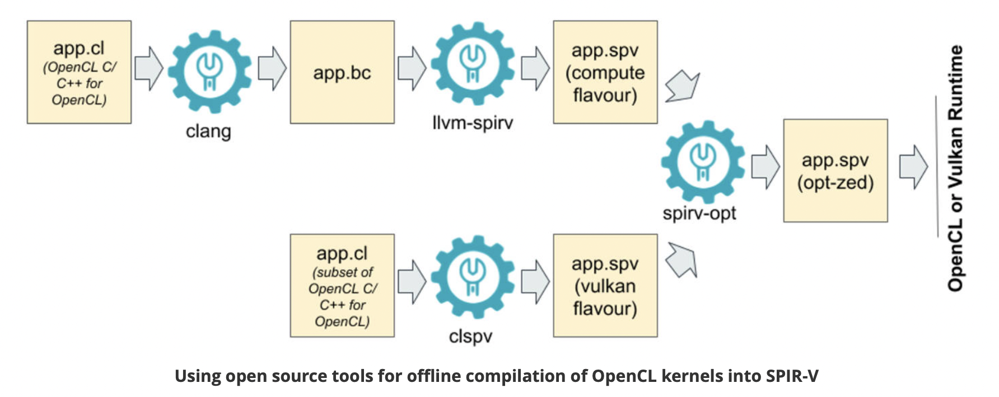
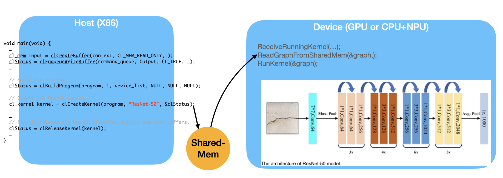
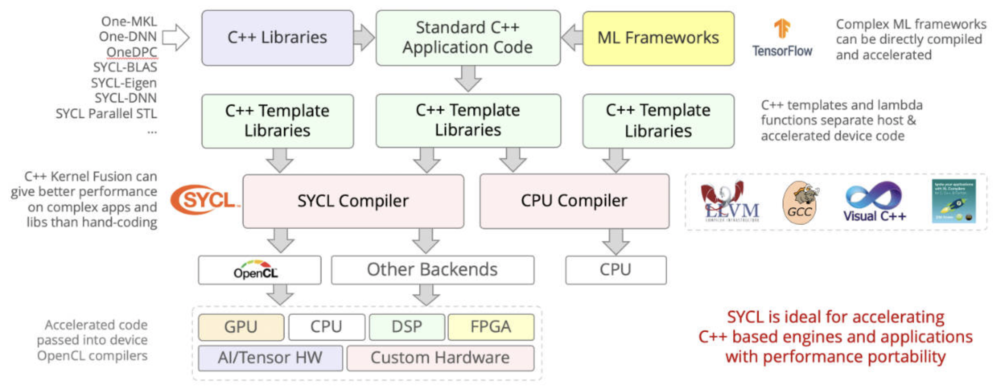

. _software-struct:

Software Structure
==================

.. contents::
   :local:
   :depth: 4

As the previous section illustrated, GPU is a SIMT (SIMD) for data parallel
application.
This section introduces the GPU evolved from Graphics GPU to the General 
purpose GPU (GPGPU) and the software architecture of GPUs and explores AI 
software frameworks designed for GPUs, NPUs, and CPUs.

General purpose GPU
-------------------

Since GLSL shaders provide a general way for writing C code in them, if applying
a software frame work instead of OpenGL API, then the system can run some data
parallel computation on GPU for speeding up and even get CPU and GPU executing 
simultaneously. Furthmore, any language that allows the code running on the CPU to poll 
a GPU shader for return values, can create a GPGPU framework [#gpgpuwiki]_.

.. _mapping-data-in-gpu:

Mapping data in GPU
*******************

As described in the previous section on GPUs, the subset of the array
calculation `y[] = a * x[] + y[]` is shown as follows:

.. code:: text

  // Invoke DAXPY with 256 threads per Thread Block
  __host__
  int nblocks = (n+255) / 256;
  daxpy<<<nblocks, 256>>>(n, 2.0, x, y);
  // DAXPY in CUDA
  __device__
  void daxpy(int n, double a, double *x, double *y) {
    int i = blockIdx.x*blockDim.x + threadIdx.x;
    if (i < n) y[i] = a*x[i] + y[i];
  }

- name<<<dimGrid, dimBlock>>>(... parameter list ...): 

  - dimGrid: Number of Blocks in Grid

  - dimBlock: 256 Threads in Block

.. rubric:: Assembly code of PTX (from page 300 of Quantitative book)
.. code:: text

  // code to set VLR, Vector Length Register, to (n % 256)
  //   ...
  // 
  shl.u32 R8, blockIdx, 9	; Thread Block ID * Block size (512)
  add.u32 R8, R8, threadIdx	; R8 = i = my CUDA Thread ID
  shl.u32 R8, R8, 3		; byte offset
  setp.neq.s32 P1, RD8, RD3	; RD3 = n, P1 is predicate register 1
  ld.global.f64 RD0, [X+R8]	; RD0 = X[i]
  ld.global.f64 RD2, [Y+R8]	; RD2 = Y[i]
  mul.f64 RD0, RD0, RD4		; Product in RD0 = RD0 * RD4 (scalar a)
  add.f64 RD0, RD0, RD2		; SuminRD0 = RD0 + RD2 (Y[i])
  st.global.f64 [Y+R8], RD0	; Y[i] = sum (X[i]*a + Y[i])

- Need to set VLR if PTX has this instruction. Otherwise, set lane-mask in 
  the similar way of the code below.

.. code:: text

  __device__
  void lane-mask-ex( double *X, double *Y, double *Z) {
    if (X[i] != 0)
      X[i] = X[i] – Y[i];
    else X[i] = Z[i];
  }

.. rubric:: Assembly code of Vector Processor
.. code:: asm

  LV V1,Rx         ;load vector X into V1
  LV V2,Ry         ;load vector Y
  L.D F0,#0        ;load FP zero into F0
  SNEVS.D V1,F0    ;sets VM(i) to 1 if V1(i)!=F0
  SUBVV.D V1,V1,V2 ;subtract under vector mask 
  SV V1,Rx         ;store the result in X

.. rubric:: Assembly code of PTX (modified code from refering page 208 - 302 of 
            Quantitative book)
.. code:: text

  ld.global.f64 RD0, [X+R9]	; RD0 = X[i]
  setp.neq.s32 P1, RD0, #0	; P1 is predicate register 1
  @!P1, bra ELSE1, *Push	; Push old mask, set new mask bits
                          	; if P1 false, go to ELSE1
  ld.global.f64 RD2, [Y+R8]	; RD2 = Y[i]
  sub.f64 RD0, RD0, RD2		; Difference in RD0
  st.global.f64 [X+R8], RD0	; X[i]=RD0
  ELSE1: 
  ld.global.f64 RD0, [Z+R8]	; RD0 = Z[i]
  st.global.f64 [X+R8], RD0	; X[i] = RD0
  ENDIF1: 
  ret, *Pop			; pop to restore old mask

- For Lane Mask, refer to [#VMR]_ [#Quantitative-gpu-asm-daxpy]_.

The following table explains how the elements of `saxpy()` are mapped to the
Lanes of a SIMD Thread (Warp), which belongs to a Thread Block (Core) within
a Grid.

.. list-table:: Mapping saxpy code to :numref:`grid`.
  :widths: 8 17 55
  :header-rows: 1

  * - saxpy(()
    - Instance in :numref:`grid`
    - Description
  * - blockDim.x
    - The index of Thread Block
    - blockDim: in this example configured as :numref:`grid` is 16(Thread Blocks) * 16(SIDM Threads) = 256
  * - blockIdx.x
    - The index of SIMD Thread
    - blockIdx: the index of Thread Block within the Grid
  * - threadIdx.x
    - The index of elements
    - threadIdx: the index of the SIMD Thread within its Thread Block

- With Fermi, each 32-wide thread of SIMD instructions is mapped to 16 physical 
  SIMD Lanes, so each SIMD instruction in a thread of SIMD instructions takes 
  two clock cycles to complete.

- You could say that it has 16 Lanes, the vector length would be 32, and the 
  Chime is 2 clock cycles.

- The mape of `y[0..31] = a * x[0..31] * y[0..31]` to `<Core, Warp, Cuda Thread>`
  of GPU as the following table. `x[0..31]` map to 32 Cuda Threads; **two Cuda
  Threads map to one SIMD Lane** as :numref:`Warp-sched-pipeline`..

.. table:: Map `<Core, Warp>` to saxpy

  ============  =================================================  =================================================  =======  ===========================================
  -             Warp-0                                             Warp-1                                             ...      Warp-15
  ============  =================================================  =================================================  =======  ===========================================
  Core-0        y[0..31] = a * x[0..31] * y[0..31]                 y[32..63] = a * x[32..63] + y[32..63]              ...      y[480..511] = a * x[480..511] + y[480..511] 
  ...           ...                                                ...                                                ...      ...
  Core-15       y[7680..7711] = a * ...                            ...                                                ...      y[8160..8191] = a * x[8160..8191] + y[8160..8191] 
  ============  =================================================  =================================================  =======  ===========================================

- Each Cuda Thread runs the GPU function code `saxpy`. Fermi has a register file  
  of size 32768 x 32-bit.  
  As shown in :numref:`sm:left`, the number of registers in a Thread Block is:  
  16 (SM) * 32 (Cuda Threads) * 64 (TLR, Thread Level Register) =  
  32768 x 32-bit (Register file).

- When mapping to fragments/pixels in a graphics GPU, `x[0..15]` corresponds to  
  a two-dimensional tile of fragments/pixels at `pixel[0..3][0..3]`, since images  
  use tile-based grouping to cluster similar colors together.

Work between CPU and GPU in Cuda
********************************

The previous `daxpy()` GPU code did not include the host (CPU) side code that  
triggers the GPU function.

The following example shows the host (CPU) side of a CUDA program that calls  
`saxpy` on the GPU [#cudaex]_:

.. code-block:: c++

  #include <stdio.h>

  __global__
  void saxpy(int n, float a, float * x, float * y)
  {
    int i = blockIdx.x*blockDim.x + threadIdx.x;
    if (i < n) y[i] = a*x[i] + y[i];
  }
  
  int main(void)
  {
    ...
    cudaMemcpy(d_x, x, N*sizeof(float), cudaMemcpyHostToDevice);
    cudaMemcpy(d_y, y, N*sizeof(float), cudaMemcpyHostToDevice);
    ...
    saxpy<<<(N+255)/256, 256>>>(N, 2.0, d_x, d_y);
    ...
    cudaMemcpy(y, d_y, N*sizeof(float), cudaMemcpyDeviceToHost);
    ...
  }

The `main()` function runs on the CPU, while `saxpy()` runs on the GPU.  
The CPU copies data from `x` and `y` to the corresponding device arrays `d_x`  
and `d_y` using `cudaMemcpy`.

The `saxpy` kernel is launched with the following statement:

.. code-block:: c++

   saxpy<<<(N+255)/256, 256>>>(N, 2.0, d_x, d_y);

This launches the kernel with Thread Blocks containing 256 threads, and uses  
integer arithmetic to determine the number of Thread Blocks needed to process  
all `N` elements in the arrays. The expression `(N+255)/256` ensures full  
coverage of the input data.

Using `cudaMemcpyHostToDevice` and `cudaMemcpyDeviceToHost`, the CPU can pass  
data in `x` and `y` to the GPU, and retrieve the results back to `y`.

Since both memory transfers are handled by DMA and do not require CPU operation,  
the performance can be improved by running CPU and GPU independently, each  
accessing their own cache.

After the DMA copy from CPU memory to GPU memory, the GPU performs the full  
matrix operation loop for `y[] = a * x[] + y[];` using a single Grid of threads.

DMA `memcpy` maps the data in CPU memory to each L1 cache of a core on GPU  
memory.

Many GPUs support scatter and gather operations to access DRAM efficiently  
for stream processing tasks [#Quantitative-gpu-sparse-matrix]_ [#gpgpuwiki]_  
[#shadingl1]_.

When the GPU function is dense computation in array such as MPEG4 encoder or
deep learning for tuning weights, it may get much speed up [#mpeg4speedup]_. 
However when GPU function is matrix addition and CPU will idle for waiting 
GPU's result. It may slow down than doing matrix addition by CPU only.
Arithmetic intensity is defined as the number of operations performed per word of 
memory transferred. It is important for GPGPU applications to have high arithmetic 
intensity else the memory access latency will limit computational speedup 
[#gpgpuwiki]_. 

Wiki here [#gpuspeedup]_ includes GPU-accelerated applications for speedup  
as follows:

General Purpose Computing on GPU, has found its way into fields as diverse as 
machine learning, oil exploration, scientific image processing, linear algebra,
statistics, 3D reconstruction and even stock options pricing determination.
In addition, section "GPU accelerated video decoding and encoding" for video 
compressing [#gpuspeedup]_ gives the more applications for GPU acceleration.

.. table:: The differences for speedup in architecture of CPU and GPU

  ============  ================================  =========
  Item          CPU                               GPU
  ============  ================================  =========
  Application   Non-data parallel                 Data parallel
  Architecture  SISD, small vector (eg.4*32bits)  Large SIMD (eg.16*32bits)
  Cache         Smaller and faster                Larger and slower (ref. The following Note)
  ILP           Pipeline                          Pipeline
   -            Superscalar, SMT                  SIMT
   -            Super-pipeline
  Core          Smaller threads for SMT (2 or 4)  Larger threads (16 or 32)
  Branch        Conditional-instructions          Mask & conditional-instructions
  ============  ================================  =========
                             
.. note:: **GPU-Cache**
 
  In theory, for data-parallel applications using GPU's SMT, the GPU can schedule  
  more threads and aims for throughput rather than speedup of a single thread,  
  as seen in SISD on CPUs.  
  
  However, in practice, GPUs provide only a small L1 cache, similar to CPUs,  
  and handle cache misses by scheduling another thread.  
  
  As a result, GPUs often lack L2 and L3 caches, which are common in CPUs with  
  deeper cache hierarchies.

OpenCL, Vulkan and Spir-v
-------------------------

.. _spirv: 
.. graphviz:: ../Fig/sw/spirv-lang-layers.gv
  :caption: OpenCL and GLSL(OpenGL)

.. table:: OpenCL and OpenGL SW system

  ==========   ============  =====================
  Name of SW   GPU language  Level of GPU language
  ==========   ============  =====================
  OpenCL       OpenCL        C99 dialect (with C pointer, ...)
  OpenGL       GLSL          C-like (no C pointer, ...)
  Vulkan       SPIR-V        IR
  ==========   ============  =====================

.. _opencl_to_spirv: 

  Offline Compilation of OpenCL Kernels into SPIR-V Using Open Source Tooling [#opencl-to-spirv]_

- clang: Compile OpenCL to spirv for runtime+driver. Or compile OpenCL to llvm, then
  "SPIR-V LLVM Translator" translate llvm to spirv for runtime+driver.

- clspv: Compile OpenCL to spirv directly.

.. _gpu_compiler_toolchain: 
.. graphviz:: ../Fig/sw/gpu-compiler-toolchain.gv
  :caption: GPU Compiler Components and Flow

The flow and relationships among GLSL, OpenCL, SPIR-V (Vulkan/OpenCL), LLVM IR, 
and the GPU compiler are shown in the :numref:`spirv`, 
:numref:`opencl_to_spirv` and :numref:`gpu_compiler_toolchain`.
As shown in :numref:`gpu_compiler_toolchain`, OpenCL-C to SPIR-V (OpenCL) can
be compiled using **clang + llvm-spirv** tools or a proprietary converter. 

As shown in :numref:`gpu_compiler_toolchain`, both GLSL and OpenCL use frontend 
tools to generate SPIR-V. 
The driver can invoke either the GLSL or OpenCL compiler based on metadata 
fields in the SPIR-V, as illustrated in :numref:`spirv_deploy` and the 
following figures, which describe offline compilation from GLSL/OpenCL to 
SPIR-V and online execution using the generated SPIR-V files.

.. _spirv_deploy: 
.. graphviz:: ../Fig/sw/spirv-deploy.gv
  :caption: Compiling and Deploying GPU Code from GLSL, Vulkan, and OpenCL

Based on the flows above, the public standards OpenGL and OpenCL provide 
tools for transferring these data format, as illustrated in 
:numref:`glsl_spirv`. 
The corresponding LLVM IR and SPIR-V formats are listed below.

.. _glsl_spirv: 
.. graphviz:: ../Fig/sw/glsl-spirv.gv
  :caption: Convertion between GLSL, OpenCL C, SPIRV-V and LLVM-IR

.. rubric:: References/add-matrix.ll
.. literalinclude:: ../References/add-matrix.ll

.. rubric:: References/add-matrix.spvasm
.. literalinclude:: ../References/add-matrix.spvasm

.. rubric:: Convert between spirv and llvm-ir
.. code-block:: console

   % pwd
   $HOME/git/lbd/References
   % llvm-as -o add-matrix.bc add-matrix.ll
   % llvm-spirv -o add-matrix.spv add-matrix.bc
   % spirv-dis -o add-matrix.spvasm add-matrix.spv
   // Convert spirv to llvm-ir again and check the converted llvm-ir is same 
   // with origin.
   % llvm-spirv -r add-matrix.spv -o add-matrix.spv.bc
   % llvm-dis add-matrix.spv.bc -o add-matrix.spv.bc.ll
   % diff add-matrix.ll add-matrix.spv.bc.ll
   1c1
   < ; ModuleID = 'add-matrix.ll'
   ---
   > ; ModuleID = 'add-matrix.spv.bc'

.. rubric:: Install llvm-spriv and llvm with Brew-install
.. code-block:: console

   % brew install spirv-llvm-translator
   % brew install llvm

**The following explains how the driver identifies whether the SPIR-V source is 
from GLSL or OpenCL.**

SPIR-V binaries contain metadata that can help identify whether they
were generated from OpenCL, GLSL, or another language.

- Execution Model

  Defined by the `OpEntryPoint` instruction. It is a strong indicator
  of the source language.
  
  +----------------+----------------------+-------------------------------+
  | ExecutionModel | Typical Source       | Notes                         |
  +================+======================+===============================+
  | Kernel         | OpenCL               | Used only by OpenCL C         |
  +----------------+----------------------+-------------------------------+
  | GLCompute      | GLSL or HLSL         | Used in compute shaders       |
  +----------------+----------------------+-------------------------------+
  | Fragment       | GLSL or HLSL         | For pixel shaders             |
  +----------------+----------------------+-------------------------------+
  | Vertex         | GLSL or HLSL         | For vertex shaders            |
  +----------------+----------------------+-------------------------------+

- Capabilities
  
  Declared using `OpCapability`. They provide clues about the SPIR-V's
  execution model and source.
  
  +----------------+------------------------+
  | Capability     | Likely Source          |
  +================+========================+
  | Kernel         | OpenCL                 |
  +----------------+------------------------+
  | Addresses      | OpenCL                 |
  +----------------+------------------------+
  | Linkage        | OpenCL                 |
  +----------------+------------------------+
  | Shader         | GLSL or HLSL           |
  +----------------+------------------------+

- Extensions
  
  Declared using `OpExtension`. Some are tied to specific compilers
  or languages.
  
  +----------------------------------------+---------------------------+
  | Extension                              | Likely Source             |
  +========================================+===========================+
  | SPV_KHR_no_integer_wrap_decoration     | OpenCL                    |
  +----------------------------------------+---------------------------+
  | SPV_INTEL_unified_shared_memory        | OpenCL (Intel)            |
  +----------------------------------------+---------------------------+
  | SPV_AMD_shader_ballot                  | GLSL (graphics)           |
  +----------------------------------------+---------------------------+

- Memory Model

  Defined by `OpMemoryModel`.
  
  - `OpenCL`    → OpenCL source
  - `GLSL450`   → GLSL or HLSL source

- How to Inspect

  Use the `spirv-dis` tool to disassemble SPIR-V to human-readable form:

  .. code-block:: bash

     spirv-dis kernel.spv -o kernel.spvasm

  Look for these at the top of the file:

  Example (GLSL):

  .. code-block:: none

     OpCapability Shader
     OpMemoryModel Logical GLSL450
     OpEntryPoint GLCompute %main "main"

  Example (OpenCL):
  
  .. code-block:: none

     OpCapability Kernel
     OpCapability Addresses
     OpMemoryModel Logical OpenCL
     OpEntryPoint Kernel %foo "foo"

Summary
*******

+--------------------------+------------------+
| Feature                  | Indicates        |
+==========================+==================+
| OpEntryPoint Kernel      | OpenCL           |
+--------------------------+------------------+
| OpCapability Shader      | GLSL or HLSL     |
+--------------------------+------------------+
| OpMemoryModel OpenCL     | OpenCL           |
+--------------------------+------------------+
| OpMemoryModel GLSL450    | GLSL or HLSL     |
+--------------------------+------------------+

- Comparsion for OpenCL and OpenGL's compute shader.

  - Same:

    Both are for General Computing of GPU.

  - Difference:

    OpenCL include GPU and other accelerate device/processor.
    OpenCL is C language on Device and C++ on Host based on OpenCL runtime. 
    Compute shader is GLSL shader language run on OpenGL graphic enviroment and
    integrate and access data of OpenGL API easily [#diff-compute-shader-opencl]_.

- OpenGL/GLSL vs Vulkan/spir-v.

  - High level of API and shader: OpenGL, GLSL.

  - Low level of API and shader: Vulkan, spir-v.

Though OpenGL api existed in higher level with many advantages from sections
above, sometimes it cannot compete in efficience with direct3D providing 
lower levels api for operating memory by user program [#vulkanapiwiki]_. 
Vulkan api is lower level's C/C++ api to fill the gap allowing user program to 
do these things in OpenGL to compete against Microsoft direct3D. 
Here is an example [#vulkanex]_. Meanwhile glsl is C-like language. The vulkan 
infrastructure provides tool, glslangValidator [#spirvtoolchain]_, to compile 
glsl into an Intermediate Representation 
Form (IR) called spir-v off-line. 
As a result, it saves part of compilation time from glsl to gpu instructions 
on-line
since spir-v is an IR of level closing to llvm IR [#spirvwiki]_. 
In addition, vulkan api reduces gpu drivers efforts in optimization and code 
generation [#vulkanapiwiki]_. These standards provide user programmer option to 
using vulkan/spir-v instead of OpenGL/glsl, and allow them pre-compiling glsl 
into spir-v off-line to saving part of on-line compilation time.

With vulkan and spir-v standard, the gpu can be used in OpenCL for Parallel 
Programming of Heterogeneous Systems [#opencl]_ [#computekernelwiki]_.
Similar with Cuda, a OpenCL example for fast Fourier transform (FFT) is here 
[#openclexfft]_.
Once OpenCL grows into a popular standard when more computer languages or 
framework supporting OpenCL language, GPU will take more jobs from CPU 
[#opencl-wiki-supported-lang]_.

Most GPUs have 16 or 32 Lanes in a SIMD processor (Warp), vulkan provides 
Subgroup operations to data parallel programming on Lanes of SIMD processor 
[#vulkan-subgroup]_.

Subgroup operations provide a fast way for moving data between Lanes intra Warp.
Assuming each Warp has eight Lanes.
The following table lists result of reduce, inclusive and exclusive operations.

.. table:: Lists each Lane's value after **Reduce**, **Inclusive** and 
  **Exclusive** operations repectively

  ================  ============  ============  ============  ============
  Lane              0             1             2             3           
  ================  ============  ============  ============  ============
  Initial value     a             b             c             d           
  Reduce            OP(abcd)      OP(abcd)      OP(abcd)      OP(abcd)
  Inclusive         OP(a)         OP(ab)        OP(abc)       OP(abcd)    
  Exclusive         not define    OP(a)         OP(ab)        OP(abc)     
  ================  ============  ============  ============  ============

- Reduce: e.g. subgroupAdd. Inclusive: e.g. subgroupInclusiveAdd. Exclusive: 
  e.g. subgroupExclusiveAdd.

- For examples: 

  - ADD operation: OP(abcd) = a+b+c+d.

  - MAX operation: OP(abc) = MAX(a,b,c).

- When Lane i is inactive, it is value is none.

  - For instance of Lane 0 is inactive, then MUL operation: OP(abcd) = b*c*d.

The following is a code example.

.. rubric:: An example of subgroup operations in glsl for vulkan
.. code-block:: c++

  vec4 sum = vec4(0, 0, 0, 0);
  if (gl_SubgroupInvocationID < 16u) {
    sum += subgroupAdd(in[gl_SubgroupInvocationID]);
  }
  else {
    sum += subgroupInclusiveMul(in[gl_SubgroupInvocationID]);
  }
  subgroupMemoryBarrier();

- Nvidia's GPU provides __syncWarp() for subgroupMemoryBarrier() or compiler to
  sync for the Lanes in the same Warp.

In order to let Lanes in the same SIMD processor work efficently, data unifomity
analysis will provide many optimization opporturnities in register allocation,
transformation and code generation [#llvm-uniformity]_.

LLVM IR expansion from CPU to GPU is becoming increasingly influential. 
In fact, LLVM IR has been expanding steadily from version 3.1 until now, 
as I have observed.

Unified IR Conversion Flows
---------------------------

This section outlines the intermediate representation (IR) flows for graphics 
(Microsoft DirectX, OpenGL) and OpenCL compilation across major GPU vendors: 
NVIDIA, AMD, ARM, Imagination Technologies, and Apple.

Graphics Compilation Flow (Microsoft DirectX & OpenGL)
******************************************************

Graphics shaders are compiled from high-level languages (HLSL, GLSL) into 
vendor-specific GPU binaries via intermediate representations like DXIL and 
SPIR-V.

.. rubric:: ✅ Each node in the graph is color-coded to indicate its category 
            or role within the structure.
.. graphviz::

    digraph G {
        node [shape=box, style=filled];
        PUIR [label="Public standard of IRs", fillcolor=lightyellow];
        PRIR [label="Private IRs", fillcolor=lightgray];
        VD [label="Vendor Driver", shape=oval, fillcolor=lightgreen];
        GPU [label="GPU", fillcolor=lightblue];
    }

- **Vendor Driver will call Vendor Compiler** for on-line compilation.

.. _ogl-ocl-flow:
.. graphviz:: ../Fig/sw/ogl-ocl-flow.gv
  :caption: Graphics and OpenCL Compiler IR Conversion Flow

- OpenCL C is the device side code in C language while Host side code is C/C++.

- OpenCL C is compiled to SPIR-V in later versions of OpenCL, while earlier 
  versions used SPIR. 
  SPIR-V has now largely replaced SPIR as the standard intermediate 
  representation.

.. list-table:: Comparison of PTX, GCN IR, Burst IR, and Metal IR
   :header-rows: 1
   :widths: 20 40 40

   * - IR Layer
     - Abstraction Level
     - Register Model
   * - PTX (NVIDIA)
     - Virtual ISA; portable across GPU generations; hides hardware scheduling
     - **Virtual registers (%r, %f); mapped to physical registers during SASS 
       lowering**
   * - GCN IR (AMD)
     - Machine IR; tightly coupled to GCN/RDNA architecture; exposes Wavefront 
       semantics
     - Explicit vector (vN) and scalar (sN) registers; register pressure affects 
       occupancy.
       **AMD’s compiler backend can lower vector operations to scalar 
       instructions on low-end GPUs, while preserving vector operations on 
       high-end architectures**.
   * - Burst IR (Imagination)
     - Power-aware IR; optimized for burst-core scheduling and latency hiding
     - **Operand staging model; abstracted register usage; mapped late to USC 
       ISA**
   * - Metal IR (Apple)
     - LLVM-inspired IR; abstracted from developers; tuned for tile shading and 
       threadgroup fusion
     - **Region-based register allocation; dynamic renaming; not exposed as 
       physical register model**

✅ NVIDIA, AMD, ARM and Imagination all have exposed LLVM IR and convert SPIR-V IR to LLVM IR.
  - SPIR:

    - For OpenCL development, the IR started from SPIR (LLVM-based IR). 
    - SPIRV's Limitation: tightly coupled to specific LLVM versions, making it 
      brittle across.

  - SPIR-V:

    - A complete redesign: binary format, not tied to LLVM.
    - Designed for Vulkan, but also supports OpenCL and OpenGL.
    - Enables cross-vendor portability, shader reflection, and custom extensions.
    - Used in graphics and compute pipelines, including ML workloads via Vulkan compute.
    - A Vulkan shader written in GLSL is compiled to SPIR-V, then passed to the GPU driver.
    - An OpenCL kernel written in C can be compiled to SPIR-V, then lowered to LLVM IR internally by vendors like AMD or NVIDIA.

⚠️  Apple

•  Uses LLVM IR Partially. Apple supports SPIR-V in Metal and OpenCL, but 
   LLVM IR is not always exposed.
•  Metal shaders are compiled via MetalIR, which is LLVM-inspired but not 
   standard LLVM IR. Metal 
   IR is not standard LLVM IR and is not exposed to developers.
•  Apple’s ML compiler stack may use LLVM IR internally, but it’s 
   abstracted from developers.
•  Apple is not a vendor of GPU IP, so it does not expose LLVM IR in its ML 
   or graphics APIs for the reasons below:

   •  Security: opaque compilation prevents tampering
   •  Performance tuning: Apple controls the entire stack for optimal hardware use
   •  Developer simplicity: high-level APIs reduce friction

Notes:

- **HLSL → DXIL → DirectX** is Microsoft’s graphics pipeline, used on Windows and Xbox.
- **GLSL → SPIR-V → OpenGL/Vulkan** is cross-platform and supported by all vendors.
- Final GPU ISA varies by vendor:

  - NVIDIA: PTX → SASS
  - AMD: LLVM IR → GCN/RDNA
  - ARM: Mali ISA
  - Imagination: USC ISA
  - Apple: Metal GPU ISA

Notes:

- **OpenCL C → SPIR → Vendor Driver → GPU ISA** is the standard compilation path.
- Some vendors (e.g., AMD, NVIDIA) may bypass SPIR and compile directly to LLVM IR or PTX.
- Apple deprecated OpenCL in favor of Metal, but legacy support remains.

✅ References

- OpenCL Specification: https://www.khronos.org/opencl/
- SPIR-V Specification: https://www.khronos.org/spir
- DirectX Shader Compiler: https://github.com/microsoft/DirectXShaderCompiler
- Imagination E-Series GPU: https://www.imaginationtech.com/
- Apple Metal API: https://developer.apple.com/metal/

ML and GPU Compilation
**********************

This section outlines the intermediate representation (IR) flows used by 
NVIDIA, AMD, and ARM in machine learning and GPU compilation pipelines. 
It includes both inference engines and compiler toolchains.

.. rubric:: ✅ Each node in the graph is color-coded to indicate its category 
            or role within the structure. In AI, usually use runtime 
            instead of driver for graphics.
.. graphviz::

    digraph G {
        node [shape=box, style=filled];
        PUIR [label="Public standard of IRs", fillcolor=lightyellow];
        PRIR [label="Private IRs", fillcolor=lightgray];
        VDLR [label="Vendor Driver,\nLibrary or Runtime", shape=oval, fillcolor=lightgreen];
        MA [label="Machine", fillcolor=lightblue];
    }

NVIDIA IR Conversion Flow
^^^^^^^^^^^^^^^^^^^^^^^^^

NVIDIA supports both TensorRT-based inference and MLIR-based compilation 
targeting CUDA GPUs is shown as :numref:`nvidia-flow`.

.. _nvidia-flow:
.. graphviz:: ../Fig/sw/nvidia-flow.gv
  :caption: NVIDIA IR Conversion Flow

- SASS stands for Streaming ASSembler, and it represents the native instruction 
  set architecture (ISA) for NVIDIA GPUs.
- TensorRT is a C++ library and runtime developed by NVIDIA for deep learning 
  inference—the phase where trained models make predictions.

  - It works with models trained in frameworks like TensorFlow, PyTorch, and 
    ONNX, converting them into highly optimized engines for execution on NVIDIA 
    hardware [#tensor-rt-nvidia]_ [#tensor-rt-geeks]_.

- **CUDA Kernel IR** is a bridge between LLVM IR and PTX/SASS, or a direct 
  output from TensorRT.
- **LLVM IR** is foundational in many flows, but **TensorRT may skip it** and 
  directly emit CUDA kernels.
- Although MLIR dialects may be publicly available, they are typically 
  hardware-dependent and tailored to specific vendors' GPU architectures. 
  As a result, their applicability is limited to the corresponding hardware 
  platforms.
- MLIR GPU Dialects is public but it is for Nvidia's GPU.

AMD IR Conversion Flow
^^^^^^^^^^^^^^^^^^^^^^

AMD uses ROCm and MIOpen for ML workloads, with LLVM-based compilation targeting 
GCN or RDNA architectures is shown as :numref:`amd-flow`.

.. _amd-flow:
.. graphviz:: ../Fig/sw/amd-flow.gv
  :caption: AMD IR Conversion Flow

- **ROCm** is not just a compiler or driver — it includes a full runtime stack that 
  enables AMD GPUs to execute compute workloads across HIP 
  (Heterogeneous-compute Interface for Portability), OpenCL, and ML frameworks. 
  It’s **analogous to NVIDIA’s CUDA runtime** but built around open standards like 
  HSA (Heterogeneous System Architecture) [#hsa]_  and LLVM.
- **MIOpen Graph IR** includes different form and structure. **(Pre-MLIR) and 
  (Post-GCN)** are different.

  - Developers interact with MIOpen via high-level APIs 
    (e.g., miopenConvolutionForward) — not via direct IR manipulation.
  - While MIOpen itself is open source (GitHub repo), its graph IR format and 
    transformation passes are internal.

ARM IR Conversion Flow
^^^^^^^^^^^^^^^^^^^^^^

ARM supports both CPU/NPU deployment (e.g., Ethos-U/N) and GPU execution (e.g., 
Mali via Vulkan). The IR flow diverges depending on the target is shown as 
:numref:`arm-flow`.

.. _arm-flow:
.. graphviz:: ../Fig/sw/arm-flow.gv
  :caption: ARM IR Conversion Flow

- Node **"Mali GPU (Vulkan)"** is the SPIR-V compilation flow that illustrated in
  the previous section.

- **Ethos-N** is ARM's NPU. **Cortex-M** is ARM's CPU.

**ARM Codegen** generally emits instructions for CPU/NPU execution, but for 
certain NN operations (especially those requiring vendor-specific acceleration),
it may generate function calls into the Ethos-N driver, which then orchestrates 
execution on the NPU.

✅ Common Case: Direct NPU/CPU Instruction Generation

•  For operations that are well-supported by the NPU or CPU, the codegen backend 
   emits hardware-specific instructions or IR directly.
•  These are scheduled for execution on the CPU or passed to the Ethos-N via its 
   driver stack.

⚙️ Special Case: Function Calls to Ethos-N Driver

•  For complex or fused neural network operations (e.g., custom activation 
   functions, quantized convolutions, or optimized memory layouts), the codegen 
   may emit calls **(LLVM-IR `call`)** to precompiled driver functions.
•  These function calls act as entry points into the Ethos-N runtime, which 
   handles:

   -  Memory management
   -  Scheduling
   -  Firmware-level execution
   -  Hardware-specific optimizations

Imagination Technologies IR Conversion Flow
^^^^^^^^^^^^^^^^^^^^^^^^^^^^^^^^^^^^^^^^^^^

.. _imagination-flow:
.. graphviz:: ../Fig/sw/imagination-flow.gv
  :caption: Imagination Technologies IR Conversion Flow

Notes:

- E-Series GPUs support up to **200 TOPS INT8/FP8** for edge AI workloads [B](https://www.techpowerup.com/336545/imagination-announces-e-series-gpu-ip-with-burst-processors-and-up-to-200-tops?copilot_analytics_metadata=eyJldmVudEluZm9fY29udmVyc2F0aW9uSWQiOiJMSlNQWjRaWjY5Y2ZuN0VnWnJEVzEiLCJldmVudEluZm9fbWVzc2FnZUlkIjoidVZhb2U4blgyYVVQb1pQdWlKZ0FzIiwiZXZlbnRJbmZvX2NsaWNrRGVzdGluYXRpb24iOiJodHRwczpcL1wvd3d3LnRlY2hwb3dlcnVwLmNvbVwvMzM2NTQ1XC9pbWFnaW5hdGlvbi1hbm5vdW5jZXMtZS1zZXJpZXMtZ3B1LWlwLXdpdGgtYnVyc3QtcHJvY2Vzc29ycy1hbmQtdXAtdG8tMjAwLXRvcHMiLCJldmVudEluZm9fY2xpY2tTb3VyY2UiOiJjaXRhdGlvbkxpbmsifQ%3D%3D&citationMarker=9F742443-6C92-4C44-BF58-8F5A7C53B6F1).
- The architecture is **programmable**, supporting **graphics and AI** workloads simultaneously.
- Developers can target the GPU using **OpenCL**, **Apache TVM**, or **oneAPI**.
- The **Burst Processor IR** optimizes power efficiency and memory locality.
- Final execution occurs on **Neural Cores**, deeply integrated into the GPU.

Comparison Summary
^^^^^^^^^^^^^^^^^^

+----------------------+----------------------+----------------------+------------------------+------------------------+
| Vendor               | High-Level IR        | Mid-Level IR         | Low-Level IR           | Libraries / Runtimes   |
+======================+======================+======================+========================+========================+
| NVIDIA               | ONNX, TensorRT IR    | MLIR GPU Dialects    | PTX → SASS             | TensorRT               |
+----------------------+----------------------+----------------------+------------------------+------------------------+
| AMD                  | ONNX, MIOpen IR      | MLIR Dialects        | LLVM IR → GCN ISA      | MIOpen, ROCm           |
+----------------------+----------------------+----------------------+------------------------+------------------------+
| ARM                  | ONNX, TFLite         | TOSA, MLIR Dialects  | LLVM IR / SPIR-V       | Ethos-N Driver, Vulkan |
+----------------------+----------------------+----------------------+------------------------+------------------------+
| Imagination          | ONNX, TFLite         | E-Series Compiler IR | Burst IR → Neural Core | OpenCL, TVM, oneAPI    |
+----------------------+----------------------+----------------------+------------------------+------------------------+

References
^^^^^^^^^^

- NVIDIA TensorRT: https://developer.nvidia.com/tensorrt
- AMD ROCm: https://rocm.docs.amd.com/
- ARM ML Toolchain: https://developer.arm.com/solutions/machine-learning
- Imagination:

  - Imagination E-Series GPU IP: https://www.imaginationtech.com/
  - TechPowerUp E-Series Launch: https://www.techpowerup.com/336545/imagination-announces-e-series-gpu-ip-with-burst-processors-and-up-to-200 [A](https://www.imaginationtech.com/?copilot_analytics_metadata=eyJldmVudEluZm9fY29udmVyc2F0aW9uSWQiOiJMSlNQWjRaWjY5Y2ZuN0VnWnJEVzEiLCJldmVudEluZm9fY2xpY2tTb3VyY2UiOiJjaXRhdGlvbkxpbmsiLCJldmVudEluZm9fY2xpY2tEZXN0aW5hdGlvbiI6Imh0dHBzOlwvXC93d3cuaW1hZ2luYXRpb250ZWNoLmNvbVwvIiwiZXZlbnRJbmZvX21lc3NhZ2VJZCI6InVWYW9lOG5YMmFVUG9aUHVpSmdBcyJ9&citationMarker=9F742443-6C92-4C44-BF58-8F5A7C53B6F1)-tops [B](https://www.techpowerup.com/336545/imagination-announces-e-series-gpu-ip-with-burst-processors-and-up-to-200-tops?copilot_analytics_metadata=eyJldmVudEluZm9fY2xpY2tTb3VyY2UiOiJjaXRhdGlvbkxpbmsiLCJldmVudEluZm9fbWVzc2FnZUlkIjoidVZhb2U4blgyYVVQb1pQdWlKZ0FzIiwiZXZlbnRJbmZvX2NsaWNrRGVzdGluYXRpb24iOiJodHRwczpcL1wvd3d3LnRlY2hwb3dlcnVwLmNvbVwvMzM2NTQ1XC9pbWFnaW5hdGlvbi1hbm5vdW5jZXMtZS1zZXJpZXMtZ3B1LWlwLXdpdGgtYnVyc3QtcHJvY2Vzc29ycy1hbmQtdXAtdG8tMjAwLXRvcHMiLCJldmVudEluZm9fY29udmVyc2F0aW9uSWQiOiJMSlNQWjRaWjY5Y2ZuN0VnWnJEVzEifQ%3D%3D&citationMarker=9F742443-6C92-4C44-BF58-8F5A7C53B6F1)

- MLIR Project: https://mlir.llvm.org/
- Vulkan API: https://www.khronos.org/vulkan/
- Apache TVM: https://tvm.apache.org/
- oneAPI: https://www.oneapi.io/

Accelerate ML/DL on OpenCL/SYCL
-------------------------------

.. _opengl_ml_graph: 

  Implement ML graph scheduler both on compiler and runtime

As shown in :numref:`opengl_ml_graph`, the Device, such as a GPU or a CPU+NPU, 
is capable of running the entire ML graph. However, if the Device has only 
an NPU, then operations like Avg-Pool, which require CPU support, must run 
on the Host side. This introduces communication overhead between the Host 
and the Device.

Similar to OpenGL shaders, the "kernel" function may be compiled either 
on-line or off-line and then sent to the GPU as a programmable function.

In order to run ML (Machine Learning) efficiently, all platforms for ML on 
GPU/NPU implement scheduling SW both on graph compiler and runtime. 
**If OpenCL can extend to support ML graph, then graph compiler such as TVM or 
Runtime from Open Source have chance to leverage the effort of scheduling SW from 
programmers** [#paper-graph-on-opencl]_. Cuda graph is an idea  like this 
[#cuda-graph-blog]_ [#cuda-graph-pytorch]_ .

- SYCL: Using C++ templates to optimize and genertate code for OpenCL and Cuda.
  Provides a consistent language, APIs, and ecosystem in which to write and tune 
  code for different accelerator architecture, CPUs, GPUs, and FPGAs [#sycl]_.

  - SYCL uses generic programming with templates and generic lambda functions to 
    enable higher-level application software to be cleanly coded with optimized 
    acceleration of kernel code across an extensive range of acceleration backend 
    APIs, such as OpenCL and CUDA [#sycl-cuda]_.

.. _sycl-role: 

  SYCL = C++ template and compiler for Data Parallel Applications on AI on CPUs, 
  GPUs and HPGAs.

- DPC++ (OneDPC) compiler: Based on SYCL, DPC++ can compile the DPC++ language 
  for both CPU host and GPU device. DPC++ (Data Parallel C++) is a language 
  developed by Intel and may be adopted into standard C++. The GPU-side 
  (kernel code) is written in C++ but does not support exception handling 
  [#dpcpp]_ [#dpcpp-book]_.

  - Features of Kernel Code:
    
    - Not supported: 

      Dynamic polymorphism, dynamic memory allocations (therefore no object 
      management using new or delete operators), static variables, function 
      pointers, runtime type information (RTTI), and **exception handling**. 
      No virtual member functions, and no variadic functions, are allowed to 
      be called from kernel code. Recursion is not allowed within kernel code.

    - Supported: 

      Lambdas, operator overloading, templates, classes, and static polymorphism
      [#dpcpp-features]_.

.. [#gpgpuwiki] https://en.wikipedia.org/wiki/General-purpose_computing_on_graphics_processing_units

.. [#cudaex] https://devblogs.nvidia.com/easy-introduction-cuda-c-and-c/

.. [#VMR] subsection Vector Mask Registers: Handling IF Statements in Vector Loops of Computer Architecture: A Quantitative Approach 5th edition (The
       Morgan Kaufmann Series in Computer Architecture and Design)

.. [#Quantitative-gpu-asm-daxpy] Code written by refering page 208 - 302 of Computer Architecture: A Quantitative Approach 5th edition (The
       Morgan Kaufmann Series in Computer Architecture and Design)

.. [#Quantitative-gpu-sparse-matrix] Reference "Gather-Scatter: Handling Sparse Matrices in Vector Architectures": section 4.2 Vector Architecture of A Quantitative Approach 5th edition (The
       Morgan Kaufmann Series in Computer Architecture and Design)

.. [#shadingl1] The whole chip shares a single L2 cache, but the different units will have individual L1 caches. https://computergraphics.stackexchange.com/questions/355/how-does-texture-cache-work-considering-multiple-shader-units

.. [#mpeg4speedup] https://www.manchestervideo.com/2016/06/11/speed-h-264-encoding-budget-gpu/

.. [#gpuspeedup] https://en.wikipedia.org/wiki/Graphics_processing_unit

.. [#diff-compute-shader-opencl] https://stackoverflow.com/questions/15868498/what-is-the-difference-between-opencl-and-opengls-compute-shader

.. [#opencl-to-spirv] https://www.khronos.org/blog/offline-compilation-of-opencl-kernels-into-spir-v-using-open-source-tooling

.. [#ogl-cpu-gpu] https://en.wikipedia.org/wiki/Vulkan

.. [#vulkanapiwiki] Vulkan offers lower overhead, more direct control over the GPU, and lower CPU usage... By allowing shader pre-compilation, application initialization speed is improved... A Vulkan driver only needs to do GPU specific optimization and code generation, resulting in easier driver maintenance... [#ogl-cpu-gpu]_ https://en.wikipedia.org/wiki/Vulkan#OpenGL_vs._Vulkan

.. [#vulkanex] https://github.com/SaschaWillems/Vulkan/blob/master/examples/triangle/triangle.cpp

.. [#spirvtoolchain] glslangValidator is the tool used to compile GLSL shaders into SPIR-V, Vulkan's shader format. https://vulkan.lunarg.com/doc/sdk/latest/windows/spirv_toolchain.html

.. [#spirvwiki] SPIR 2.0: LLVM IR version 3.4. SPIR-V 1.X: 100% Khronos defined Round-trip lossless conversion to llvm.  https://en.wikipedia.org/wiki/Standard_Portable_Intermediate_Representation

.. [#opencl] https://www.khronos.org/opencl/

.. [#computekernelwiki] https://en.wikipedia.org/wiki/Compute_kernel

.. [#openclexfft] https://en.wikipedia.org/wiki/OpenCL

.. [#opencl-wiki-supported-lang] The OpenCL standard defines host APIs for C and C++; third-party APIs exist for other programming languages and platforms such as Python,[15] Java, Perl[15] and .NET.[11]:15 https://en.wikipedia.org/wiki/OpenCL

.. [#vulkan-subgroup] https://www.khronos.org/blog/vulkan-subgroup-tutorial

.. [#llvm-uniformity] https://llvm.org/docs/ConvergenceAndUniformity.html

.. [#tensor-rt-nvidia] https://resources.nvidia.com/en-us-inference-resources/nvidia-tensorrt 

.. [#tensor-rt-geeks] https://www.geeksforgeeks.org/deep-learning/what-is-tensorrt/

.. [#hsa] HSA is an open standard developed to simplify programming across 
          heterogeneous systems — especially those combining CPUs and GPUs. 
          It defines:

          •  Agents: CPUs, GPUs, and other compute units treated uniformly
          •  Queues: Asynchronous command queues for dispatching kernels
          •  Memory model: Shared virtual memory across agents
          •  Signals: Lightweight synchronization primitives

.. [#paper-graph-on-opencl] https://easychair.org/publications/preprint/GjhX

.. [#cuda-graph-blog] https://developer.nvidia.com/blog/cuda-graphs/

.. [#cuda-graph-pytorch] https://pytorch.org/blog/accelerating-pytorch-with-cuda-graphs/

.. [#sycl] https://www.khronos.org/sycl/

.. [#sycl-cuda] https://github.com/codeplaysoftware/sycl-for-cuda/blob/cuda/sycl/doc/GetStartedWithSYCLCompiler.md

.. [#dpcpp] https://www.intel.com/content/www/us/en/developer/tools/oneapi/dpc-compiler.html#gs.cxolyy

.. [#dpcpp-book] https://link.springer.com/book/10.1007/978-1-4842-5574-2

.. [#dpcpp-features] Page 14 of DPC++ book.

